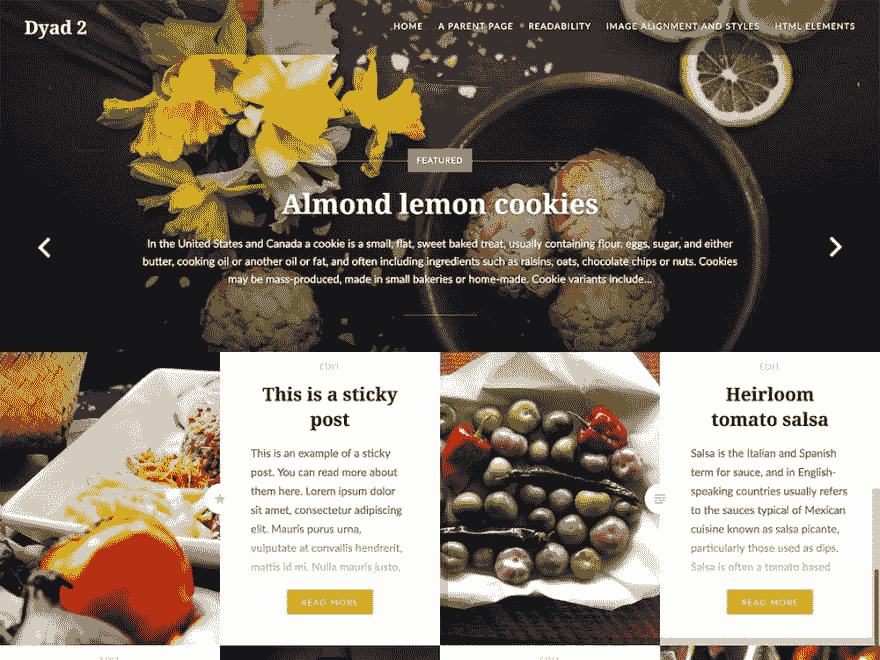
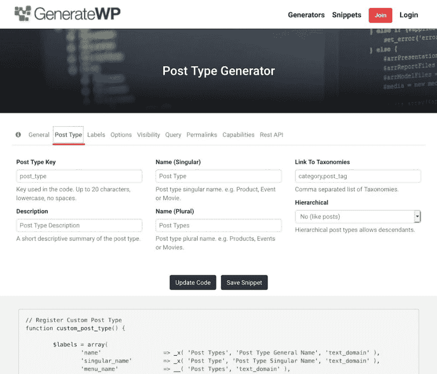
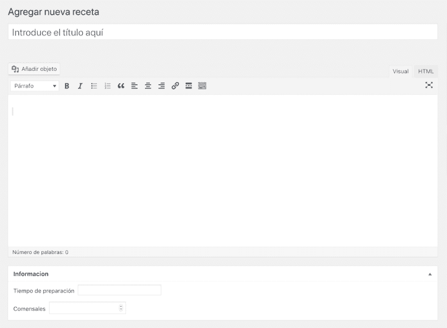

# 在 WordPress 中创建自定义类型和字段

> [https://dev . to/juananuiz/CMO-create-types--y-custom fields-in WordPress-1c](https://dev.to/juananruiz/cmo-crear-tipos--y-campos-personalizados-en-wordpress-1f5c)]

使用本教程，您将了解如何创建 WordPress 插件，以将您的 web 转换为博客以外的内容。您将创建自定义内容类型，可以是英语邮件，也可以将您的页面转换为一个厨柜，一个图书、电影或邮票收藏管理器。

您可以从代码中完成所有工作，而无需使用任何插件，因为这是了解 WordPress 如何工作以及如何使用它编写完整应用程序的最佳方法。稍后在某些专案中，您可能需要使用外挂程式来建立自订栏位，例如**【进阶自订栏位】**，但您将会知道如何在内部运作。

## 前提条件

为了应付本教程，我推荐您中级或高级 WordPress 知识和 PHP 知识。

首先，创建插件框架，使其尽可能正常工作。在更高级的教程中，您将学习如何使用稍微复杂但更标准化的骨架来创建插件。如果您已经是 WordPress 开发人员，您可能需要在一个对象中定义插件，将插件的不同部分和其他最佳实践分开，因为我认为这种方法更有教育意义。在以后的教程中，我将把所有这些问题都纳入其中。

所以找个安静的地方练习吧，有限定的时间不打扰你，系好安全带，深呼吸，在比赛开始前向对手问好。

## 开始创建插件

基本的干净安装的一部分，任何主题，但如果你想让它看起来像一个接待员，我推荐这两个免费和官方存储库之一:

*   [巴斯克维尔 2](https://wordpress.com/theme/baskerville-2) 不然就是挪威
*   [二进制 2](https://wordpress.com/theme/dyad-2) ，自动

[](https://res.cloudinary.com/practicaldev/image/fetch/s--iKiSTHTX--/c_limit%2Cf_auto%2Cfl_progressive%2Cq_auto%2Cw_880/http://kungfupress.com/wp-content/uploads/2019/01/dyad-2-theme.jpg)

使用您最喜欢的代码编辑器在路径`wp-content/plugins`内创建一个新文件夹，您可以将其命名为**或更适合您要做的事情。**

 **在此文件夹中创建一个文件并将其命名为“T1”，php ，这将是您插件的起点。正确地写这篇文章的标题是非常重要的，以便 WP 将其识别为插件。

```
\<?php
/\*
Plugin Name: Recetario
Author Name: Juanan Ruiz
Plugin URI: https://kungfupress.com/como-crear-tipos-y-campos-personalizados-en-wordpress
Description: Un plugin para aprender a programar WP practicando con un gestor de recetas.
\*/ 
```

唯一真正需要的一行是**插件名称**，其馀部分是额外的、有用的但并非必需的内部操作信息。也别忘了第一行标有 **<？PHP〖T3〗，如果忘记放入插件的内容或部分内容，就会在你的整个网络上看到(如果没有更糟糕的事情发生的话)。**

如果您现在储存档案，并从 WP 网站的「管理」面板移至外挂程式清单，您会看到您的新外挂程式正在等待并准备启用。

[](https://res.cloudinary.com/practicaldev/image/fetch/s--OPN74uTC--/c_limit%2Cf_auto%2Cfl_progressive%2Cq_auto%2Cw_880/http://kungfupress.com/wp-content/uploads/2019/01/activacion_plugin_recetario-1024x228.png)

## 创建自定义 Post 类型或自定义字段

这个可怜的插件还什么都不知道，所以你将开始设置自定义 Post Type (CPT)。为此，您可以从下面的代码中复制另一个已经完成的代码，或者从 web 中生成该代码 [GenerateWP](https://generatewp.com/post-type/) 。要执行此操作，请浏览页面上显示的选项卡:“一般信息”、“Post Type”、“Labels”等，然后填写这些字段。

[](https://res.cloudinary.com/practicaldev/image/fetch/s--woB1zWz1--/c_limit%2Cf_auto%2Cfl_progressive%2Cq_auto%2Cw_880/http://kungfupress.com/wp-content/uploads/2019/01/herramienta_generate_wp.jpg)

从**一般**标签开始，填写**功能名称**:t0

这是要用来定义 CPT 的功能名称

然后转到 **Post Type** 选项卡并填写以下字段:

*   帖子类型关键字:receta
*   名称(单数):处方
*   描述:Receta
*   名称(复数):处方
*   等级:否

在“**标签”(**labels)选项卡上，您可以设置许多标签，此时只填充这两个标签:

*   名称菜单:处方
*   管理员栏名称:处方

最后，在“选项”选项卡中，选中**自定义字段**复选框，最后点击下面的**更新代码**按钮，将生成的代码复制到您的插件中，您会看到类似这样的内容。

```
\<?php
/\*
Plugin Name: Recetario
...
\*/
​
// Register Custom Post Type
function receta\_post\_type() {
 $labels = array(
 'name' =\> \_x( 'Recetas', 'Post Type General Name', 'text\_domain' ),
 'singular\_name' =\> \_x( 'Receta', 'Post Type Singular Name', 'text\_domain' ),
 'menu\_name' =\> \_\_( 'Recetas', 'text\_domain' ),
 'name\_admin\_bar' =\> \_\_( 'Receta', 'text\_domain' ),
 'archives' =\> \_\_( 'Item Archives', 'text\_domain' ),
 'attributes' =\> \_\_( 'Item Attributes', 'text\_domain' ),
 'parent\_item\_colon' =\> \_\_( 'Parent Item:', 'text\_domain' ),
 'all\_items' =\> \_\_( 'All Items', 'text\_domain' ),
 'add\_new\_item'          =\> \_\_( 'Add New Item', 'text\_domain' ),
 'add\_new' =\> \_\_( 'Add New', 'text\_domain' ),
 'new\_item' =\> \_\_( 'New Item', 'text\_domain' ),
 'edit\_item' =\> \_\_( 'Edit Item', 'text\_domain' ),
 'update\_item' =\> \_\_( 'Update Item', 'text\_domain' ),
 'view\_item' =\> \_\_( 'View Item', 'text\_domain' ),
 'view\_items' =\> \_\_( 'View Items', 'text\_domain' ),
 'search\_items' =\> \_\_( 'Search Item', 'text\_domain' ),
 'not\_found' =\> \_\_( 'Not found', 'text\_domain' ),
 'not\_found\_in\_trash' =\> \_\_( 'Not found in Trash', 'text\_domain' ),
 'featured\_image' =\> \_\_( 'Featured Image', 'text\_domain' ),
 'set\_featured\_image'=\> \_\_( 'Set featured image', 'text\_domain' ),
 'remove\_featured\_image' =\> \_\_( 'Remove featured image', 'text\_domain' ),
 'use\_featured\_image' =\> \_\_( 'Use as featured image', 'text\_domain' ),
 'insert\_into\_item' =\> \_\_( 'Insert into item', 'text\_domain' ),
 'uploaded\_to\_this\_item' =\> \_\_( 'Uploaded to this item', 'text\_domain' ),
 'items\_list' =\> \_\_( 'Items list', 'text\_domain' ),
 'items\_list\_navigation' =\> \_\_( 'Items list navigation', 'text\_domain' ),
 'filter\_items\_list' =\> \_\_( 'Filter items list', 'text\_domain' ),
 );
 $args = array(
 'label'                 =\> \_\_( 'Receta', 'text\_domain' ),
 'description'           =\> \_\_( 'Receta', 'text\_domain' ),
 'labels'                =\> $labels,
 'supports'              =\> array( 'title', 'editor', 'thumbnail', 'comments', 'revisions', 'custom-fields' ),
 'hierarchical'          =\> false,
 'public'                =\> true,
 'show\_ui'               =\> true,
 'show\_in\_menu'          =\> true,
 'menu\_position'         =\> 5,
 'show\_in\_admin\_bar'     =\> true,
 'show\_in\_nav\_menus'     =\> true,
 'can\_export'            =\> true,
 'has\_archive'           =\> true,
 'exclude\_from\_search'   =\> false,
 'publicly\_queryable'    =\> true,
 'capability\_type'       =\> 'page',
 );
 register\_post\_type( 'receta', $args );
}
add\_action( 'init', 'receta\_post\_type', 0 ); 
```

## CPT 是否已用此代码定义？

首先创建了一个名为 **$labels** 的数组，其中包含用于命名新 CPT 的不同元素和操作的标签。

然后定义了另一个数组【args】，该数组又包含**标签，并且在第二个数组中传递了用于配置 CPT 行为的所有参数。类似于公用、是否出现在“管理”菜单中、是作为页面还是作为条目、是否将内容包括在站点搜索中等。**

 **定义第二个数组后，调用函数**【register _ post _ type】**，该函数需要两个参数，一个参数具有 CPT 关键字名称，另一个参数数组名称。

最后，在函数之外，将此定义 CPT 的函数绑定到加载插件时调用的挂接 **add_action(init)**

现在保存文件并返回到 MP 中的插件列表。搜索插件，现在可以给激活。如果在左侧的菜单中一切顺利，将出现一个名为的新项目单击 **Add New** 将会看到类似新博客条目的内容出现。

感谢你来到这里！您为 WordPress 创建了一种新的内容类型，并没有很多人这样做。

您将会看到一些未更新的菜单标题和名称，重新打开插件文件并翻译您认为必要的元素，如 **All Items** 、 **Add New** 、 **Add New Item** 等。下次可以直接通过编辑 **WordPress Type Generator** 中的**标签**来完成。

## 洛斯坎波斯个性化

我们已经到了一个临界点。

如果没有关联的自定义字段，则自定义内容类型毫无意义。在本例中，最好有一个字段用于配料，另一个字段用于说明、准备时间、食品、烹饪类型等。这就是所谓的□，可以在每种食谱内手工制作，但每次都要制作，很麻烦。

有一个很棒的插件可以做到这一点[【高级自定义字段】](https://www.advancedcustomfields.com/) (ACF)，很棒，我建议你把它放在你的工具箱里。但是本教程的想法是更深入地学习，也从代码中创建自定义字段，这是一条不太通行的道路，但是如果你想成为真正的 WordPress 战士，我建议你走这条路。

所以从这里你有两个选择，要么使用 ACF 插件的快速通道，要么继续学习编程作为一个真正的学科实践者。

和我在一起？∞天啊！这条路很艰难，但能保证你很满意。

## 添加元拳击。

**meta boxes** 是使用 WP 编辑器时通常围绕文章或页面内容的所有这些表格框。在这里，您将使用它们来放置表单元素，您将在其中收集您的自定义字段。

因为不能少于 WordPress 有功能，所以你可以创建自己的 meta boxes。蜡褫眕蔚睡濬倰腔陓洘ㄗ恅挂﹜芞砉胀ㄘ温离婓桶等笢ㄛ逊褫眕怀桶等郖懂彶摩硉﹝。

首先向插件添加一个功能，以使用一对自定义字段注册 meta box，然后可以添加更多字段。在此函数中，您将调用 WordPress 函数**【add _ meta _ box】**。

`add_meta_box($id, $title, $callback, $screen, $context, $priority, $callback_args);`

*   $id:新的 id 或□
*   $title:要在中显示的标题
*   $callback:打印内容的函数，使用 **echo** 生成输出
*   $screen 表示显示此屏幕的管理屏幕在这种情况下，你必须放□，使其与此 Post 相关联□
*   $context 和$priority:在本例中，将它们分别配置为“”。

你会看到负责加载元框(或元框，如果有多个)的函数有一个有点长的名称:**【kfp _ recipe _ register _ meta _ boxes】**。

我之所以这样做，是因为在我们构建插件时所使用的结构中，函数名称可能会与其他插件冲突。假设您安装了另一个食谱外挂程式，作者呼叫其功能，在此情况下，两个外挂程式都会停止运作。这种命名函数和变量的方法是一种标准方法，首先添加开发人员的名称或缩写(在本例中为 Kung Fu Press 的缩写)，然后添加插件的名称或别名(在本例中为)，最后添加要命名函数的其馀名称。如果您将外挂程式封装在物件中，就不需要这样做，我们将会在稍后的教学课程中看到这种工作方式。

以下是您需要添加到插件中的代码:

```
/\*\*
 \* Agrega los meta boxes para el Custom Post Type Receta
 \* https://developer.wordpress.org/reference/functions/add\_meta\_box/
 \*/
function kfp\_receta\_register\_meta\_boxes()
{
    add\_meta\_box('receta-info', 'Información', 'kfp\_receta\_output\_meta\_box', 'receta', 'normal', 'high');
}
​
/\*\*
 \* Genera el contenido que hay que mostrar dentro del meta box
 \* @param WP\_Post $post WordPress Post object
 \*/
function kfp\_receta\_output\_meta\_box($post)
{
}
​
add\_action('add\_meta\_boxes', 'kfp\_receta\_register\_meta\_boxes'); 
```

现在，您可以转到“管理”面板中的自定义 Post Type，您将看到，当您创建或编辑此类型的内容时，标题为“”的元框将出现

接下来，你必须填写那个 meta box 的内容，这样它才能有所帮助。为此，您将使用 PHP 的功能 **echo** 编写一些在函数中生成屏幕输出的东西。

```
/\*\*
 \* Genera el contenido que hay que mostrar dentro del meta box
 \* @param WP\_Post $post WordPress Post object
 \*/
function kfp\_receta\_output\_meta\_box($post)
{
 echo('\<label for="tiempo\_preparacion"\>' . \_\_('Tiempo de preparación', 'text\_domain') . '\</label\>');
    echo('\<input type="text" name="tiempo\_preparacion" id="tiempo\_preparacion" value="' . esc\_attr($tiempo\_preparacion) . '"\>');
 echo('\<p\>\<label for="comensales"\>' . \_\_('Comensales', 'text\_domain') . '\</label\>');
 echo('\<input type="date" name="comensales" id="fecha" value="' . esc\_attr($comensales) . '"\>');
} 
```

我再次鼓励您在管理面板中测试结果，以便您可以看到 meta box 中出现两个表单域。现在，如果你试图在那里记录一些信息，你会发现它没有保存，我很抱歉，这是一个步骤，但我想确保你明白这一点。

[](https://res.cloudinary.com/practicaldev/image/fetch/s--Ld9H465j--/c_limit%2Cf_auto%2Cfl_progressive%2Cq_auto%2Cw_880/http://kungfupress.com/wp-content/uploads/2019/01/meta_box_informacion_receta.png)

现在，您将添加代码，以便在数据库中记录信息，并在每次打开此记录时显示在 meta box 中。

请务必确保当前用户具有记录此信息的权限，并添加一个安全条款，以防止任何人尝试记录这些字段中的信息(如果不是来自此表单)。对于后者，您将使用功能**【WP _ nonce _ field】**，该功能会在表单中生成隐藏字段，我们将在记录信息之前检查该字段。

```
/\*\*
 \* Genera el contenido que hay que mostrar dentro del meta box
 \* @param WP\_Post $post WordPress Post object
 \*/
function kfp\_receta\_output\_meta\_box($post)
{
    // Los campos se graban en la base de datos con un subrayado bajo como prefijo
    // WP indica así por defecto que son campos metas
 $tiempo\_preparacion = get\_post\_meta($post-\>ID, '\_tiempo\_preparacion', true);
    $comensales = get\_post\_meta($post-\>ID, '\_comensales', true);

 echo('\<label for="tiempo\_preparacion"\>' . \_\_('Tiempo de preparación', 'text\_domain') . '\</label\>');
    echo('\<input type="text" name="tiempo\_preparacion" id="tiempo\_preparacion" value="' . esc\_attr($tiempo\_preparacion) . '"\>');
 echo('\<p\>\<label for="comensales"\>' . \_\_('Comensales', 'text\_domain') . '\</label\>');
 echo('\<input type="number" name="comensales" id="comensales" value="' . esc\_attr($comensales) . '"\>');
}
​
/\*\*
 \* Graba los campos del formulario del meta box
 \* @param int $post\_id Post ID
 \* @return bool|int
 \*/
function kfp\_receta\_save\_meta\_boxes($post\_id)
{
    // Comprueba que el nonce es correcto para evitar ataques CSRF
    if ( !isset($\_POST['receta\_nonce']) || ! wp\_verify\_nonce( $\_POST['receta\_nonce'], 'graba\_receta') ) {
        return $post\_id;
   }
​
    // Comprueba que el tipo de post es receta
    if ('receta' != $\_POST['post\_type']) {
        return $post\_id;
   }
​
    // Comprueba que el usuario actual tiene permiso para editar esto
    if (!current\_user\_can('edit\_post', $post\_id)) {
        return $post\_id;
   }
​
    // Ahora puedes grabar los datos con tranquilidad
    // Observa que cuando vienen del formulario los campos meta no vienen con el prefijo subrayado bajo pero cuando los grabas en el post hay que poner el prefijo, igual que cuando los leías del post
    $tiempo\_preparacion = sanitize\_text\_field($\_POST['tiempo\_preparacion']);
    update\_post\_meta($post\_id, '\_tiempo\_preparacion', $tiempo\_preparacion);
 $comensales = sanitize\_text\_field($\_POST['comensales']);
 update\_post\_meta($post\_id, '\_comensales', $comensales);
    return true;
}
​
add\_action('save\_post', 'kfp\_receta\_save\_meta\_boxes'); 
```

储存目标栏位时，请试着在您的食谱中填入自订栏位，如果没有错误，请保留您输入的值

最后，我们必须展示那些在前端付出了巨大努力的领域，以便您的访客能够看到这些领域。这是一个有点粗糙的解决方案，但我不希望通过引入模板相关概念来进一步扩展文章，您将在其他教程中进一步讨论这些概念。所以你也要用程式码和外挂程式本身来做。

每次打印任何自定义条目、页面或帖子的内容时，您都会使用调用的挂接。您要做的是将您感兴趣的自定义字段添加到文章的主要内容中。

```
function kfp\_receta\_add\_custom\_fields\_to\_content( $content ) 
{
 $custom\_fields = get\_post\_custom();
 $content .= "\<ul\>";
 if( isset( $custom\_fields['\_tiempo\_preparacion'] ) ) {
 $content .= '\<li\>Tiempo de preparación: '. $custom\_fields['\_tiempo\_preparacion'][0] . '\</li\>';
 }
 if( isset( $custom\_fields['\_comensales'] ) ) {
 $content .= '\<li\>Comensales: ' . $custom\_fields['\_comensales'][0] . '\</li\>';
 }
 $content .= '\</ul\>';
​
 return $content;
}
​
add\_filter( 'the\_content', 'kfp\_receta\_add\_custom\_fields\_to\_content' ) 
```

## 最受欢迎的客人是谁

为此，有一千种方法，我认为非常可取的一种方法是，处方显示在主页上，你会告诉插件，当 WP 为主页挑选物品时，处方也会带来。

```
_/\*\*  
 \* Agrega el tipo personalizado Receta a la página inicial de WP  
 \*/_ function get\_posts\_y\_recetas( $query ) {
 if ( is\_home() && $query-\>is\_main\_query() ) {
 $query-\>set( 'post\_type', array( 'post', 'receta' ) );
 }

 return $query;
}

add\_filter( 'pre\_get\_posts', 'get\_posts\_y\_recetas' ) 
```

现在加载您的主页，您将看到您的帖子和食谱在其中的显示方式。

## 不要留在里面

成功了吗？告诉我，我马上送你黄带。

对你不起作用吗？在评论里告诉我我会尽力帮你的。如果你看到任何失败，我也会非常感谢你告诉我。

如果你喜欢或者有用的话，我鼓励你和可能感兴趣的人分享，在社交媒体上，边洗澡边唱文章，边吹边喊，或者其他你想到的方法。

如果你想继续用 WordPress 做有趣有用的事我接受任何继续写文章的建议。

## 参考链接

*   [a adir 自定义字段 y 元框 para post de WordPress](https://cybmeta.com/custom-fields-y-meta-boxes-para-posts-de-wordpress)
*   在 WordPress 中创建一个简单的 CRM:创建一个定制的文章类型
*   [在你的主页/博客页面上显示自定义文章类型](http://justintadlock.com/archives/2010/02/02/showing-custom-post-types-on-your-home-blog-page)
*   [https://www . WP key . com/touchy-recipients](https://www.wptasty.com/tasty-recipes)—观看视频，为您的收件人收集创意****