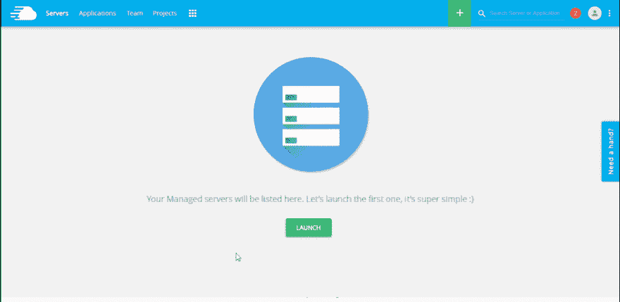
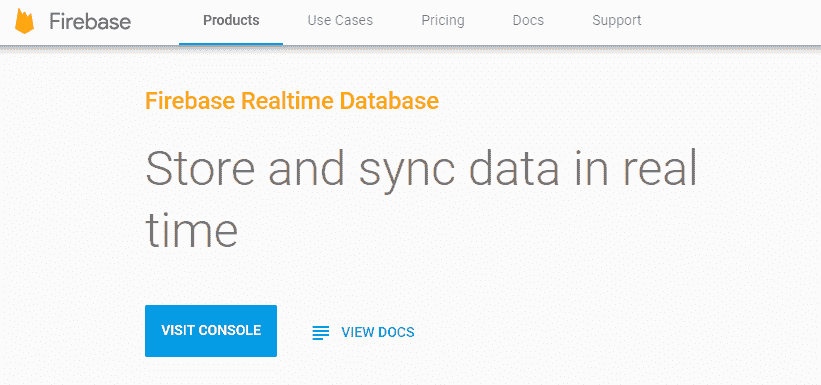
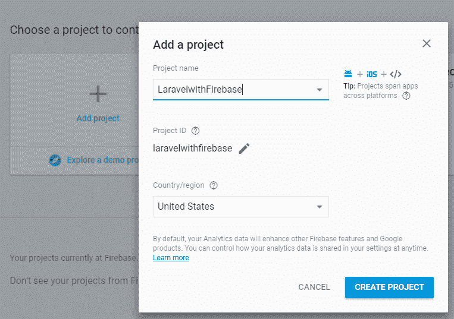
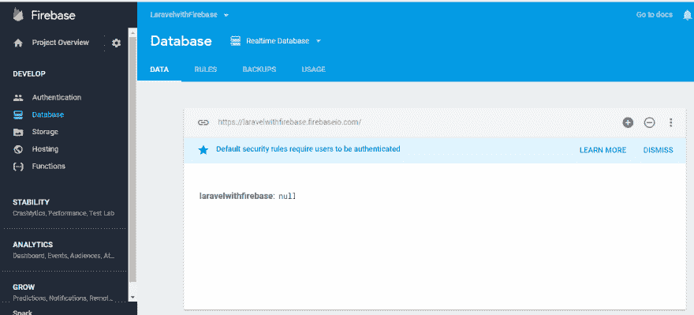
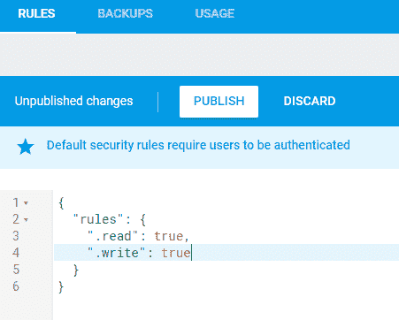
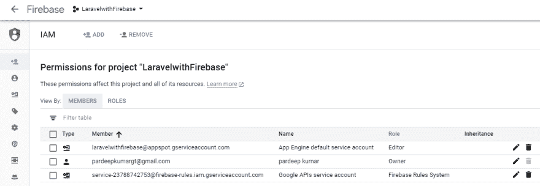
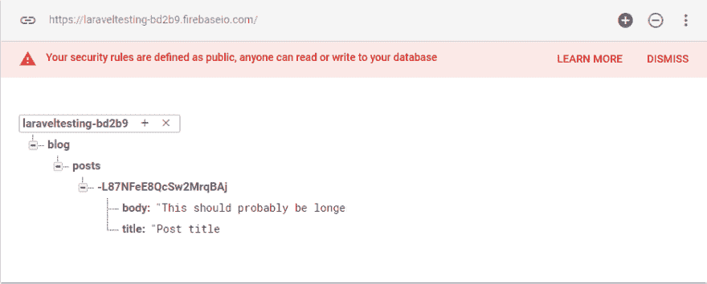

# 将 Laravel 与 Firebase 实时数据库连接

> 原文：<https://dev.to/pardip_trivedi/connect-laravel-with-firebase-real-time-database-493b>

安全高效的数据检索是优秀应用的基本要求之一。幸运的是，开发人员有许多选项(例如，框架级工具和安全 DBMS)来实现这一需求。

## 什么是 Firebase？

Firebase 成立于 2012 年，是一个用于在应用程序之间同步数据的实时架构。2014 年被谷歌收购。最初，它是实时聊天集成 API Envolve 的一部分。随着时间的推移，开发人员意识到该系统不仅仅用于短信。意识到该系统的潜力，他们提出了 Firebase 作为一个独立于 Envolve 的实体的想法。

在本文中，我将演示如何在 Laravel 5.5 中连接 Firebase 实时数据库(通过使用 Admin SDK)。

## 先决条件

出于本教程的目的，我假设您在 web 服务器上安装了一个 Laravel 应用程序。我的设置是:

laravel 5.5
PHP 7.1
Google Firebase 实时数据库

Web 服务器(测试用 Apache、NGINX 或集成 PHP web 服务器)。我已经在 Cloudways 托管服务器上安装了我的 Laravel 应用程序，因为它有一个 Laravel 优化的开发堆栈和先进的 [PHP 托管](https://www.cloudways.com/en/laravel-hosting.php)。如果您没有 Cloudways 帐户，请免费注册，并查看下面的 GIF，只需点击几下鼠标即可设置服务器和应用程序。

[](https://res.cloudinary.com/practicaldev/image/fetch/s--X3MGeGdX--/c_limit%2Cf_auto%2Cfl_progressive%2Cq_66%2Cw_880/https://thepracticaldev.s3.amazonaws.com/i/7keo603sxo7f3p0fucjb.gif)

## 如何设置 Firebase

让我们从注册一个 Gmail 账户开始。在下一个选项卡中，打开数据库设置的 Firebase 页面，然后单击“访问控制台”按钮。

[](https://res.cloudinary.com/practicaldev/image/fetch/s--iCjfz6M8--/c_limit%2Cf_auto%2Cfl_progressive%2Cq_auto%2Cw_880/https://thepracticaldev.s3.amazonaws.com/i/tiio4cz0mvfybsgrthew.png)

接下来，在下一个窗口中，创建一个数据库项目并提供包括项目名称在内的信息。完成后，单击“创建项目”按钮。

[](https://res.cloudinary.com/practicaldev/image/fetch/s--3XiyUtxY--/c_limit%2Cf_auto%2Cfl_progressive%2Cq_auto%2Cw_880/https://thepracticaldev.s3.amazonaws.com/i/0miim1j29h6kx9julrsk.png)

等待项目创建完成，然后继续。您将被自动重定向到 Firebase 仪表板。

[](https://res.cloudinary.com/practicaldev/image/fetch/s--gNraNA6f--/c_limit%2Cf_auto%2Cfl_progressive%2Cq_auto%2Cw_880/https://thepracticaldev.s3.amazonaws.com/i/ktqfab7qz9bi4t8qcthc.png)

成功创建项目后，转到 Database 选项卡，单击 Rules 将读写规则更新为 true，然后单击 Publish 按钮。

[](https://res.cloudinary.com/practicaldev/image/fetch/s--tzfAPWNC--/c_limit%2Cf_auto%2Cfl_progressive%2Cq_auto%2Cw_880/https://thepracticaldev.s3.amazonaws.com/i/x1iilnp1jhy0d843t389.png)

## 生成 API 密钥

Firebase 为您的项目生成一个 API 密匙，您可以下载并粘贴到 http/Controller 中。

单击用户和权限选项卡。

[](https://res.cloudinary.com/practicaldev/image/fetch/s--wOfS3F8D--/c_limit%2Cf_auto%2Cfl_progressive%2Cq_auto%2Cw_880/https://thepracticaldev.s3.amazonaws.com/i/4yqtk1jxcnidny4434zs.png)

[](https://res.cloudinary.com/practicaldev/image/fetch/s--mpGPI2_L--/c_limit%2Cf_auto%2Cfl_progressive%2Cq_auto%2Cw_880/https://thepracticaldev.s3.amazonaws.com/i/hs768d2zny878d7z4wv9.png)

接下来，单击支持帐户，然后单击创建密钥按钮

[](https://res.cloudinary.com/practicaldev/image/fetch/s--Bi5wwOcf--/c_limit%2Cf_auto%2Cfl_progressive%2Cq_auto%2Cw_880/https://thepracticaldev.s3.amazonaws.com/i/f1rtwgsjezklxl4m4l4b.png)

该密钥将以 JSON 格式创建并自动下载。您可以将该文件复制到 Laravel 的 http/controller 文件夹中。

## Laravel 作曲家要求

设置好 Firebase 数据库后，转到 Laravel 应用程序并安装 kreait/firebase-php ^4.0.打开 SSH 终端并转到 public_root

输入以下命令:

```
composer require kreait/firebase-php ^4.0 
```

或者，您可以将 Firebase Admin SDK 指定为项目现有 composer.json 文件中的依赖项:

```
{

"require": {

"kreait/firebase-php": "^4.0"

}

} 
```

## 创建控制器

在 Controller 文件夹中粘贴 API 密钥后，在 SSH 终端中进入并键入以下命令来创建控制器:

```
php artisan make:controller FirebaseController 
```

接下来，将以下代码粘贴到控制器文件中:

```
<?php

namespace App\Http\Controllers;

use Illuminate\Http\Request;

use Kreait\Firebase;

use Kreait\Firebase\Factory;

use Kreait\Firebase\ServiceAccount;

use Kreait\Firebase\Database;

class FirebaseController extends Controller

{

//

public function index(){

$serviceAccount = ServiceAccount::fromJsonFile(__DIR__.'/Laraveltesting-6aeda3a963f2.json');

$firebase = (new Factory)

->withServiceAccount($serviceAccount)

->withDatabaseUri('https://laraveltesting-bd2b9.firebaseio.com/')

->create();

$database = $firebase->getDatabase();

$newPost = $database

->getReference('blog/posts')

->push([

'title' => 'Post title',

'body' => 'This should probably be longer.'

]);

//$newPost->getKey(); // => -KVr5eu8gcTv7_AHb-3-

//$newPost->getUri(); // => https://my-project.firebaseio.com/blog/posts/-KVr5eu8gcTv7_AHb-3-

//$newPost->getChild('title')->set('Changed post title');

//$newPost->getValue(); // Fetches the data from the realtime database

//$newPost->remove();

echo"<pre>";

print_r($newPost->getvalue());

}

}

?> 
```

记得用自己的文件路径替换 fromJsonFile 中的文件路径。此外，用数据库的 URL 替换数据库的 URL:

[](https://res.cloudinary.com/practicaldev/image/fetch/s--dUypq72t--/c_limit%2Cf_auto%2Cfl_progressive%2Cq_auto%2Cw_880/https://thepracticaldev.s3.amazonaws.com/i/ta4y35qpuqx0b4yzzvz0.png)

## 设置路线

打开 Laravel routes/web.php 文件，更新以下代码:

```
<?php

/*

|--------------------------------------------------------------------------

| Web Routes

|--------------------------------------------------------------------------

|

| Here is where you can register web routes for your application. These

| routes are loaded by the RouteServiceProvider within a group which

| contains the "web" middleware group. Now create something great!

|

*/

Route::get('/', function () {

return view('welcome');

});

Route::get('/phpfirebase_sdk','FirebaseController@index'); 
```

保存 Laravel 应用程序中的所有更改，并运行您的应用程序以查看实际输出:

[](https://res.cloudinary.com/practicaldev/image/fetch/s--tXQYa9SF--/c_limit%2Cf_auto%2Cfl_progressive%2Cq_auto%2Cw_880/https://thepracticaldev.s3.amazonaws.com/i/0w7efd5o49hnsqrklqum.png)

## Firebase 数据库

[](https://res.cloudinary.com/practicaldev/image/fetch/s--riZFjfEt--/c_limit%2Cf_auto%2Cfl_progressive%2Cq_auto%2Cw_880/https://thepracticaldev.s3.amazonaws.com/i/lyz9z5alfncipa08rzan.png)

## 结论

我希望到目前为止，您已经对在 Laravel 项目中使用 Firebase 实时数据库有了很好的了解。要查看我的示例应用程序，只需查看演示。如果你需要帮助，请留言，我会尽快回复你