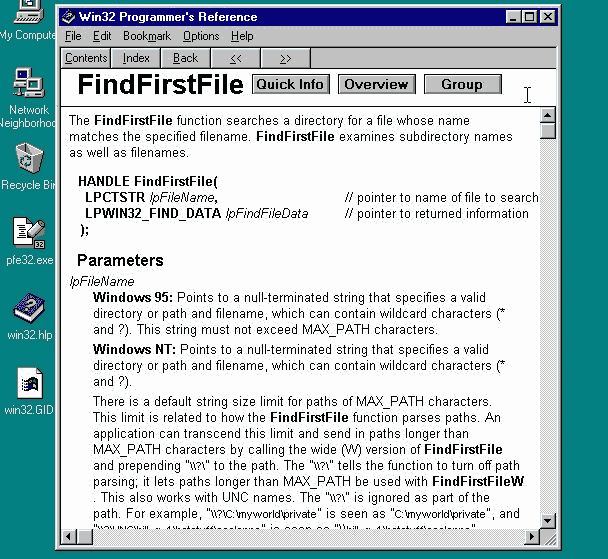

# Win95 文件感染病毒基础知识

> 原文：<https://dev.to/cpu/win95-file-infector-virus-basics-d8n>

欢迎回来！如果这是你第一次访问 VeXation，你可能想从阅读关于我正在使用的项目或开发环境的文章开始。在这篇文章中，我将描述我从 Windows 95 文件感染病毒开始的一些经历。

文件感染程序的第一个目标是将自己的代码添加到另一个文件中。在我的情况下，文件将是可执行文件。文件感染程序的第二个目标是确保除了原始的可执行代码之外，新添加的病毒代码也在运行。如果病毒代码没有运行，它就不会传播到新的可执行文件。如果最初的可执行代码没有运行，那么病毒破坏了它所感染的程序，并且可能在传播很远之前被检测到。

为了使事情易于管理，我从第一个目标开始:向另一个可执行文件添加代码。我喜欢尽可能分成小块工作，所以我选择将任务分成如下几部分:

1.  寻找新的目标可执行文件。
2.  决定一个目标是否适合感染。
3.  使用正确的大小和元数据向目标添加新的部分。
4.  将病毒代码写入目标的新部分。

当我在高层次上介绍每个主题时，我将分享一些我目前为止的汇编代码片段。最后，我将分享完整的汇编源代码和一些指针，并将分享我如何用一些方便的低级工具验证我的工作。

# 第 0 代

最初，我花了一些时间来理解病毒的“第 0 代”和下一代。我不确定是否还有其他人使用这个“一代”术语，但它对我来说是有意义的。

通常，当您作为最终用户遇到病毒时，它是由运行被病毒感染的良性程序引起的。你有没有问过自己那个程序是怎么被感染的？它很有可能被另一个被感染的良性程序感染。如果你想象追溯这些感染，最终一定会有“第 1 代”，第一个被病毒感染的良性可执行文件。

第 1 代程序是如何被感染的？这种病毒的作者一定是利用我称之为“第 0 代”的程序(一种用来引导感染过程的程序)密谋做到这一点的。与“第 n 代”不同，第 0 代没有良性功能，它的存在只是为了感染。

记住一些术语是很重要的，因为我后来发现，要根据执行的代码是第 0 代病毒还是下一代病毒来进行实际考虑。

# 寻找目标。费用

病毒开发的一个经典问题是确保你的作品不会逃离“实验室”或破坏你的开发系统。我想在虚拟化变得简单之前，这是非常棘手的。考虑到潜在的灾难，我决定从只在与第 0 代程序相同的目录中查找要感染的目标可执行文件开始。递归搜索其他目录并不困难。

这种简单的感染策略使开发变得更加容易。例如，我编写了我的 [`Makefile`的`run`目标](https://github.com/cpu/vexation/blob/63dd691b18b26f56381b53878a2f1fa29bb047a7/minijector/Makefile#L46-L49)，在运行零代程序之前，从`C:\Windows`复制一个干净的`calc.exe`到当前目录，在这个过程中覆盖任何以前被感染的版本。我知道感染不会扩散到工作目录之外，所以一切都被巧妙地控制住了。

```
run:: $(NAME).EXE
   del CALC.EXE
   copy C:\WINDOWS\CALC.EXE
   td32 $(NAME).EXE 
```

查找目标文件需要使用 Win32 API 函数。我找到了一份 Windows 95 的 [`win32.hlp`副本，我用它作为可用 Win32 APIs、它们的参数和返回值的主要参考。尤其要注意返回值！一些 API 函数(如`FindNextFileA`)因错误返回`0`。其他 API 函数(例如`FindFirstFileA`)返回非零值(对于`FindFirstFileA`，`0xFFFFFFFF`)。](https://github.com/trietptm/OllyDbg-Archive/blob/master/HLP-Files/win32.hlp)

<figure>

[](https://res.cloudinary.com/practicaldev/image/fetch/s--dst-vjsK--/c_limit%2Cf_auto%2Cfl_progressive%2Cq_auto%2Cw_880/https://binaryparadox.net/d/a3f94639-11ae-4a23-aeb5-c96c10b6f947.jpg)

<figcaption>1995's API docs aren't so bad after all</figcaption>

</figure>

为了简单起见，我将我的代码限制为 ASCII 兼容，这意味着使用一些 win32 APIs 的“A”变体(用于 ASCII)对“W”变体(用于宽字符)。在查找文档时，记得去掉“A”后缀(例如，在 win32.hlp 索引中搜索`FindFirstFile`，而不是`FindFirstFileA`)。汇编程序员必须关心“A”和“W ”,通常 Visual C++运行时用编译时魔法对程序员隐藏了这种区别。

在当前目录下查找文件需要使用 [`FindFirstFileA`](https://docs.microsoft.com/en-us/windows/desktop/api/fileapi/nf-fileapi-findfirstfilea) 和 [`FindNextFileA`](https://docs.microsoft.com/en-us/windows/desktop/api/fileapi/nf-fileapi-findnextfilea) 的组合。第一个用于开始目录遍历，第二个用于继续目录遍历。通过提供一个指向空终止字符串`"*.exe"`的指针作为`lpFileName`，我能够开始遍历所有可执行文件(如果有的话！)在当前目录中。