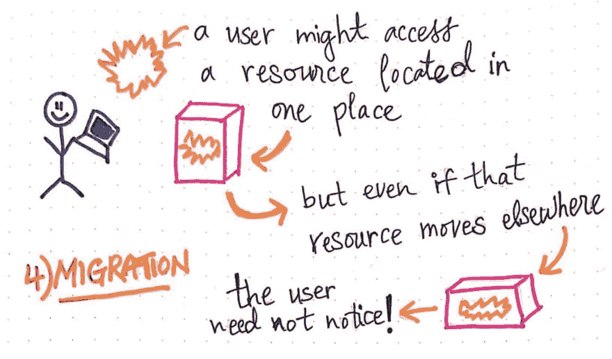
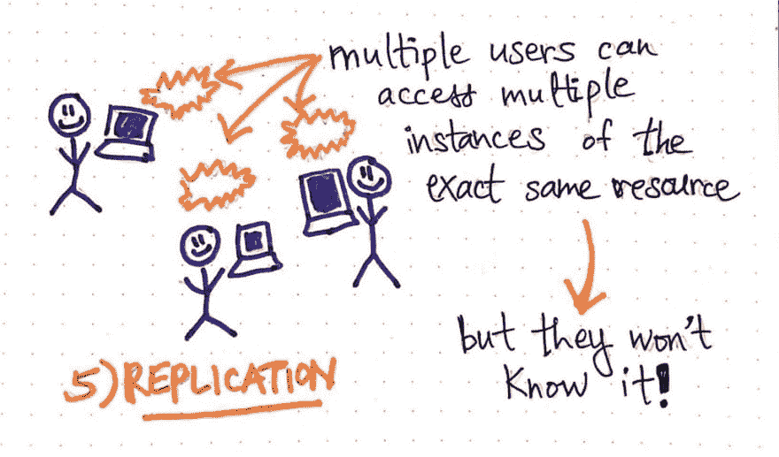
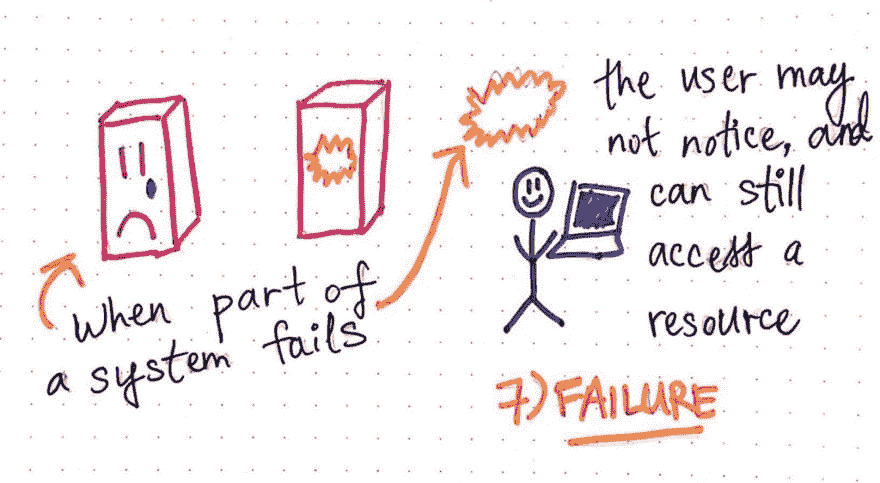
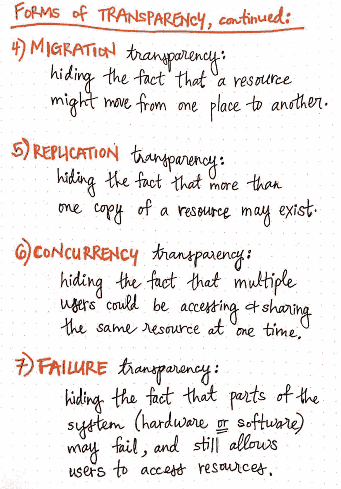

# 透明:单一系统的幻觉(下)

> 原文：<https://dev.to/vaidehijoshi/transparency-illusions-of-a-single-system-part-2-lbb>

分布式系统让人觉得是一个非常难的话题的原因之一是，它们经常试图同时做很多事情。分布式系统让最终用户感觉系统是无缝的；然而，为了实现这个目标，我们经常不得不考虑很多事情。

在本系列的第一部分中，我们开始探究分布式系统给用户带来了什么样的幻觉。简单回顾一下，*分布式* *透明性*允许分布式系统——由多个自给自足的自治节点组成——伪装成单个映像系统。分布式系统透明有许多不同的方式，我们已经探索了其中的三种(即*访问*、*位置*和*重定位*透明)。

让我们继续调查透明的形式，看看我们还能发现什么！

#### (甚至更多)透明的形式

***迁移透明度***

我们[已经了解了](https://dev.to/vaidehijoshi/transparency-illusions-of-a-single-system-part-1-17ao)一种叫做“重定位透明”的透明形式，它允许分布式系统将一些资源从节点 A 移动到节点 B，即使一些用户可能正在访问它。但是，也有可能一个用户可以访问一个资源，然后它可以移动到一个新的节点，然后由同一用户再次访问。 ***迁移透明性*** 允许资源在系统内移动，而资源的消费者(用户)不会察觉。

<figure> 

<figcaption>在分布式系统中迁移透明</figcaption>

</figure>

我们可以把迁移透明性看作是重定位透明性的一个“不太严格”的版本；其“不太”严格的原因是因为我们假设在用户使用资源*时，系统不会移动资源*，就像重定位透明中的情况一样。

当谈到迁移透明性时，资源从位置 A 移动到位置 B 的方式可能意味着各种不同的事情。资源可以改变它在系统中的物理地址，所有指向和引用它的东西都必须根据它的新位置而改变。迁移透明性确保资源可以移动到系统中的不同位置，并且用户仍然可以以相同的方式访问；这也意味着，如果资源移动位置，它也不应该改变它的名称。

***复制透明***

正如我们可能开始想象的那样，能够访问、迁移和重定位一个资源可能会变得相当危险。如果我们只有一个所有系统用户都可以访问的*单一*资源，这就变得特别棘手了！

但这正是复制透明性可以帮助我们的地方。 ***复制透明*** 允许一个资源的多个实例同时存在。有了这种形式的透明性，用户或程序就可以访问资源，而不知道他们正在使用的是资源的哪个实例，更不用说存在资源的多个副本了！

当设计一个复制透明的分布式系统时，我们通常要考虑三件事:**创建**、**维护**和**访问**复制的资源。

考虑资源将如何被复制(以及稍后被访问和使用)的这些方面是至关重要的。这是因为任何类型的透明都是关于幻觉的。

> 制作一个资源的多个副本需要一定的思考和细心。

以复制资源的创建和访问为例。为了掩盖一个资源有多个副本的事实，复制透明性必须能够确保一个资源的所有副本具有相同的名称，并且它们都可以以相同的方式被访问。为了创建资源的副本，我们需要考虑如何命名和访问该副本。我们可以想象，如果同一个资源的两个副本具有不同的名称，或者如果它们都不是以相同的方式检索的，那么最终用户将清楚地知道他们试图检索的资源的多个副本！因此，任何形式的复制透明性都必须在确保最终用户只认为他们正在与一个资源进行交互的目标下运行。

<figure> 

<figcaption>分布式系统中的复制透明</figcaption>

</figure>

复制透明性特别有趣，因为它为我们提供了许多隐藏的好处。在我们的系统中，拥有资源的多个实例为我们提供了增加的*可靠性。如果我们正在处理的资源是一种数据形式(例如，一个文件)，那么复制透明性确保我们可以在第一个文件发生问题时从同一文件的另一个副本中读取数据。*

 *类似地，如果资源是一个进程，那么这种透明性将使得另一个相同的(复制的)进程可以进入与第一个(不可用的)进程相同的状态，并继续它正在执行的任何操作。事实上，一个复制的过程是一个很好的例子，说明能够维护同一资源的不同副本的状态是多么重要！

除了增强的可靠性，复制透明性还为我们提供了增强的*性能的额外好处。在同一个服务器上拥有一些数据的多个副本意味着通过同一个服务器访问单个资源的所有用户将能够相当快地访问可靠的数据，特别是因为他们并不都试图只访问一个单一的共享资源。为胜利而复制！*

 ****并发透明***

共享资源显然是使分布式系统工作的一个重要部分。正如我们现在所知道的，复制透明性允许用户通过创建和维护资源的多个版本，在不知不觉中“共享”对资源的访问。但是，如果资源被用户修改或“写入”(而不仅仅是被用户访问或“读取”)，会发生什么呢？或者，如果某个资源发生了变化，两个用户同时共享对它的访问，该怎么办？

***并发透明*** (有时也称为 ***事务透明*** )允许分布式系统的多个用户竞争对资源的访问并在资源上并发地执行动作，而没有任何用户知道它。

> 在分布式系统中处理并发操作比在单个非分布式中央系统中要复杂得多。

在真正的单个系统中，单个资源将存在于一个位置，竞争条件(比如两个用户试图修改一个资源)可能是先到先服务(或者在这种情况下是先到先“修改”)!).真正的并发是不存在的。

<figure> 

<figcaption>分布式系统中的并发透明</figcaption>

</figure>

然而，在分布式系统中，一个资源可以有多个副本，不同的终端用户可以同时访问共享的资源。例如，想象两个用户访问一个共享文件；如果该文件在被访问时发生了变化，会发生什么情况？或者考虑 ATM 网络或电子商务商店；至少，分布式系统需要考虑所涉及的数据的不断变化的状态。最有可能的是，它需要在数据库被写入时优雅地锁定数据库，并且能够同时处理对某个共享进程的两次修改。

计算多个用户之间共享资源的状态，以及在用户访问共享资源时处理对该共享资源的更改并不是一件容易的事情。事实上，在分布式系统的世界里，并发控制算法本身就是一个完整的主题！

***失败透明***

考虑到分布式系统必须对用户隐藏的所有事情，有一个方面有时超出了任何人的控制范围:系统的某些部分出现故障。即使在单一系统中，失败也是可能的；在分布式系统中——有如此多的移动部件同时工作——失败是不可避免的。

***故障透明*** 允许分布式系统的终端用户继续使用系统和访问任何资源，而不会注意到系统的一部分已经发生故障。分布式系统中的故障也称为系统的 ***故障***

<figure> 

<figcaption>分布式系统中的失效透明</figcaption>

</figure>

由于系统故障只是一个现实，这取决于我们，分布式系统的设计者，来考虑系统的故障可能是什么，以及我们计划如何从它们中恢复。有时很难识别系统的所有故障，特别是因为它不仅包括软件故障，还包括硬件故障！

通常，确保故障透明性可能意味着在系统确定到底是什么故障、找到故障原因并以系统程序员想要的方式处理故障时，向用户显示延迟的响应。然而，对最终用户的延迟响应可能会令人困惑；例如，如果服务器出现故障，而用户没有意识到系统中的故障，他们可能会认为进程没有工作，而不是认为他们的进程只是被延迟了。在某些情况下，复制透明性可以有所帮助，因为拥有一个资源的多个副本意味着我们可以利用另一个副本，以防其中一个副本成为故障的根源。

我们可能会意识到，故障透明性更加普遍，我们每天使用的许多分布式系统都考虑到了它们系统中的一些(潜在)故障子集。例如，数据库管理系统有一些确保故障透明性的方法。处理故障透明性是设计和维护分布式系统最困难的方面之一。

#### 我们到底能有多透明？

<figure> 

<figcaption>迁移、复制、并发和失败:透明的四种形式</figcaption>

</figure>

现在[我们已经讨论了](https://dev.to/vaidehijoshi/transparency-illusions-of-a-single-system-part-1-17ao)透明的主要形式，我们可以开始看到一些形式的透明似乎比其他的更容易解释。根据系统的大小和规模，甚至可能无法实现真正的故障或真正的并发透明性！我们需要向最终用户“隐藏”的所有这些不同的东西甚至会让人感到有些不知所措；在设计一个分布式系统时，我们如何解释所有这些错觉呢？！

现实中，在单个分布式系统中，实现*完全*分布透明，并成功保证**访问**、**位置**、**重定位**、**迁移**、**复制**、**并发**、**故障**透明是不可能的。

事实上，作为分布式系统的设计者，我们真正能做的是有限的，我们真正能考虑的也是有限的！而且有时候，维持我们系统的假象实际上甚至不符合我们的最大利益(或者甚至不符合我们用户的最大利益)。透明是一个很难的问题，如果我们不能完全透明，我们也不需要自责(因为在现实中，我们甚至不能做到这一点)。然而，知道我们可以开始考虑我们可能希望对我们的用户透明的不同方式，并让他们对我们系统中一些深刻、黑暗和混乱的部分一无所知是很好的。

#### 资源

分发透明性是分布式系统领域的一个深层次话题，这篇文章只是触及了表面。如果您想了解一些更复杂的幻灯片，请查看下面的参考资料！

1.  透明胶片，乔恩·克罗夫特教授
2.  分布式系统中的透明性
3.  [分布式系统原理](http://www0.cs.ucl.ac.uk/staff/ucacwxe/lectures/ds98-99/dsee3.pdf)，埃梅里希教授
4.  [分布式系统的目标](http://web.cs.iastate.edu/~cs554/NOTES/Ch1-Intro.pdf)，鲁阮教授
5.  [分配透明度](https://www.cs.helsinki.fi/webfm_send/917)，朱哈妮·托伊沃宁教授
6.  [分布式系统简介](https://link.springer.com/content/pdf/10.1007%2Fs00607-016-0508-7.pdf)，马腾·范·斯汀&安德鲁·s·塔南鲍姆

* * ***