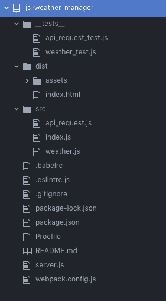

# 如何将 Web 应用程序部署到 Heroku

> 原文：<https://dev.to/ellehallal/how-to-deploy-a-web-app-to-heroku-2f4l>

<center>

### 最初发布于 [ellehallal.dev](https://ellehallal.dev) 👩🏽‍💻

</center>

* * *

[](https://res.cloudinary.com/practicaldev/image/fetch/s---Vo5jvu5--/c_limit%2Cf_auto%2Cfl_progressive%2Cq_auto%2Cw_880/https://i.imgur.com/oVoqC2t.png)

这是一篇关于我如何将我的天气管理器应用程序部署到 Heroku 的快速博客。

*   [Github 库](https://github.com/ellehallal/js-weather-manager)
*   Heroku 上的天气管理员。

* * *

由于我在生产环境中使用 dotenv-webpack 和 dotenv 时遇到的问题，部署时间比预期的要长。部署到 Heroku 时不断弹出以下错误:

```
failed to load ./.env 
```

Enter fullscreen mode Exit fullscreen mode

感谢我的一位导师，丹，帮助我弄清楚发生了什么事！由于这个问题已经解决，本博客将按照在部署时不会导致错误的顺序概述这些步骤。

作为参考，下面是我的天气管理器文件的组织方式。有隐藏文件:

[](https://res.cloudinary.com/practicaldev/image/fetch/s--nAirRoJu--/c_limit%2Cf_auto%2Cfl_progressive%2Cq_auto%2Cw_880/https://i.imgur.com/Xls1A5f.png)

*   `./dist`包含`main.js`

*   `.env`(包含我的 API 密匙)在根目录下

* * *

## 第一步:Express.js — web app 框架

*   在根目录下创建`server.js`，并添加以下代码:

```
const express = require("express");
const path = require("path");
const port = process.env.PORT || 8080;
const app = express();

app.use(express.static(__dirname + '/dist'));

app.get('*', (req, res) => {
  res.sendFile(path.resolve(__dirname, 'index.html'));
});

app.listen(port); 
```

Enter fullscreen mode Exit fullscreen mode

*   运行`npm install express`

### 要点

*   `__dirname`是`server.js`所在的目录

*   `__dirname + ‘/dist'`是运行`main.js`的当前目录

* * *

## 第二步:创建 webpack.prod.js

如果你已经安装了`dotenv-webpack`，这一步很重要。如果安装在`webpack.config.js`中，则需要`dotenv-webpack`:

```
const path = require("path");
const Dotenv = require("dotenv-webpack");

module.exports = {
  entry: "./src/index.js",
  mode: "development",
  output: {
    filename: "main.js",
    path: path.resolve(__dirname, "dist"),
  },
  node: {
    fs: "empty",
  },
  plugins: [new Dotenv()],
}; 
```

Enter fullscreen mode Exit fullscreen mode

这对于开发来说很好，但是对于生产来说似乎不太好。因此，类似的文件只在生产中需要，它不包含对`dotenv-webpack`的引用。

*   在根目录下创建一个`webpack.config.js`的副本，并将其命名为`webpack.prod.js`

*   在`webpack.prod.js`中，删除对`dotenv-webpack`的引用，并替换为以下内容:

```
const path = require("path");
const webpack = require("webpack");

module.exports = {
  entry: "./src/index.js",
  mode: "production",
  output: {
    filename: "main.js",
    path: path.resolve(__dirname, "dist"),
  },
  node: {
    fs: "empty",
  },
  plugins: [
    new webpack.DefinePlugin({
      "process.env": {},
    }),
  ],
}; 
```

Enter fullscreen mode Exit fullscreen mode

*   在`package.json`中的脚本下，添加:

```
"scripts": {
  "start": "node server.js",
  "heroku-postbuild": "webpack --config webpack.prod.js"
}, 
```

Enter fullscreen mode Exit fullscreen mode

因此，Heroku 将使用`webpack.prod.js`文件，而不是`webpack.config.js`文件。

*   通过将以下内容添加到`package.json:`来设置 npm 和 Node.js 的版本

```
"engines": {
  "node": "11.6.0",
  "npm": "6.5.0"
} 
```

Enter fullscreen mode Exit fullscreen mode

* * *

## 第三步:仅在 NODE_ENV 设置为 development 时需要 dotenv

*   假设还安装了 dotenv，在`const app = express()`下的`server.js`中添加以下内容；

```
if (process.env.NODE_ENV == 'development')
require('dotenv').config({ silent: true }); 
```

Enter fullscreen mode Exit fullscreen mode

* * *

## 第四步:将 dotenv-webpack 和 dotenv 设置为 devDependencies

*   对于仅在开发期间需要的`dotenv-webpack`和`dotenv`,运行以下命令:

```
npm install dotenv --save-dev
npm install dotenv-webpack --save-dev 
```

Enter fullscreen mode Exit fullscreen mode

* * *

## 第五步:部署到 Heroku

*   [注册 Heroku](https://signup.heroku.com/)

*   安装 Heroku CLI

*   用`heroku login`通过终端登录 Heroku

*   运行`heroku create`在 Heroku 上创建您的应用程序。将生成一个应用程序名称

*   通过运行`git init`重新初始化项目

*   通过`heroku git:remote --app [your-heroku-app-name]`设置 Heroku 远程分支

*   设置您的环境变量——或 Heroku 中提到的配置变量。下面是我如何为 openweathermap 设置 API 键:`heroku config:set API_KEY=myapikey3902e92e802e8`

*   Git 添加并提交

*   用`git push heroku master`推到 Heroku

也就这样了(希望如此)！

* * *

## 有用的资源

*   [网页包. js 文件](https://webpack.js.org/guides/production/)
*   [堆栈溢出:通过 Webpack 传递变量的最佳方式？](https://github.com/gdi2290/angular-starter/issues/386)
*   [通过 3 个简单的步骤将您的 Webpack 应用部署到 Heroku](https://codeburst.io/deploy-your-webpack-apps-to-heroku-in-3-simple-steps-4ae072af93a8)
*   [配置和配置变量| Heroku 开发中心](https://devcenter.heroku.com/articles/config-vars)