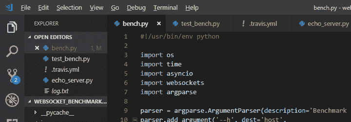
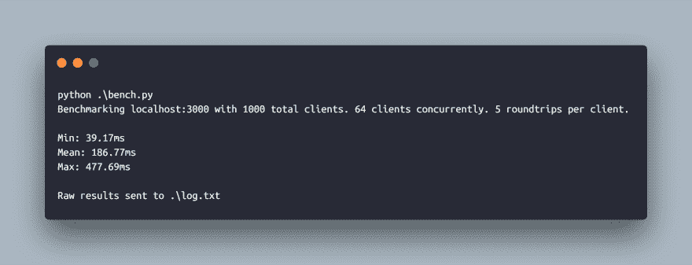

# 用 Python 测试 WebSocket 服务器！

> 原文：<https://dev.to/healeycodes/benchmarking-websocket-servers-with-python-5kc>

今天，WebSockets 运行着 web 的很大一部分。但是哪些服务器和框架是最好的呢？那要看你怎么定义最好了。如果你追求原始的性能，那么下面的帖子可能会让你感兴趣。我将回顾一下我用 Python 写的一个小型基准程序的一些设计笔记，这个程序是用 [asyncio](https://docs.python.org/3/library/asyncio.html) 和 [websockets](https://github.com/aaugustin/websockets) 编写的。

[](https://res.cloudinary.com/practicaldev/image/fetch/s--8AgPWT4q--/c_limit%2Cf_auto%2Cfl_progressive%2Cq_auto%2Cw_880/https://thepracticaldev.s3.amazonaws.com/i/8lderspof3kpfcbwru6o.png)

#### [web socket benchmark](https://github.com/healeycodes/websocket-benchmarker)

我写的硕士论文是关于 WebSockets 服务器和框架的基准测试，用 Node.js 和 [ws](https://github.com/websockets/ws) 编写了一个基准测试程序。这个项目虽然有效地实现了我的研究目标，但不适合发表。[web socket benchmark](https://github.com/healeycodes/websocket-benchmarker)的目标是学习更多关于异步 Python 的知识，并创造一些其他人可以使用的东西。这里的可用性指的是一些端到端的测试、可维护性和带有文档字符串的良好注释的代码:

```
async def client(state):
    '''A WebSocket client, which sends a message and expects an echo
    `roundtrip` number of times. This client will spawn a copy of itself afterwards,
    so that the requested concurrency-level is continuous.

    Parameters
    ----------
    state : Dictionary
        A Dictionary-like object with the key `clients` --
        the number of clients spawned thus far.

    Returns
    -------
    string
        A statement when the max number of clients have been spawned.''' 
```

> 等待表达式——暂停可等待对象上协程的执行。

这个程序允许一些人伪造连接到 echo 服务器的多个并发客户端(WebSocket 实现已经过基准测试),并发送一系列消息。在基准测试结束时，测量、记录并简要分析每条消息的往返时间。

异步设计意味着我们不需要手动轮询事情来查看它们何时完成。asyncio 不像过去那样经常传递回调，而是让我们做一些事情。这是并发的，但很容易。

> `await`与`yield from`类似，暂停`read_data`协程的执行，直到`db.fetch`a wavable 完成并返回结果数据。

“客户端”是存在于 asyncio 事件循环中的协程函数。它们等待打开连接，等待发送消息，等待接收消息，等待关闭握手。在这之后，它们会繁殖出自己的一个副本，并等待它的到来！这就是并发性的实现方式。总是有相同数量的客户端。从不多也不会少。

```
# create an amount of client coroutine functions to satisfy args.concurrency con_clients = [client] * concurrency

# pass them all a 'link' to the same state Dictionary state = dict({'clients': 0})

# run them concurrently main = asyncio.gather(*[i(state) for i in con_clients])
loop = asyncio.get_event_loop()
loop.run_until_complete(main) 
```

一旦进入异步函数，事情就像听起来一样简单:

`response = await websocket.recv()`

现在，控制流将转到其他地方，并在适当的时候返回。

在接下来的日子里，我希望使用这个软件来更新我个人对 WebSocket 服务器和框架的基准排名，并写另一篇关于结果的博文(以及寻求原始性能通常会导致的权衡)！

贡献是最受欢迎的❤️.

## [Healey codes](https://github.com/healeycodes)/[web socket-benchmark](https://github.com/healeycodes/websocket-benchmarker)

### 测试 WebSocket 服务器的消息吞吐量⌛

<article class="markdown-body entry-content container-lg" itemprop="text">

[](https://travis-ci.org/healeycodes/websocket-benchmarker)

## <g-emoji class="g-emoji" alias="radio" fallback-src="https://github.githubassets.cimg/icons/emoji/unicode/1f4fb.png">📻</g-emoji> WebSocket 基准测试员 <g-emoji class="g-emoji" alias="watch" fallback-src="https://github.githubassets.cimg/icons/emoji/unicode/231a.png">⌚</g-emoji>

*消息吞吐量*是 WebSocket 服务器解析和响应消息的速度。有些人认为这是一个框架/库/服务器性能的好参考。该工具通过模拟并发客户端来测量负载下的消息吞吐量。

[](https://github.com/healeycodes/websocket-benchmarker/blob/mastimg/header.png)

* * *

###### 2019.01.26

现在有了 100%更多的出血边缘<g-emoji class="g-emoji" alias="zap" fallback-src="https://github.githubassets.cimg/icons/emoji/unicode/26a1.png">⚡</g-emoji>T2】阿辛西奥善良。

* * *

### 装置

Python 3.6.5+。

`pip install -r requirements.txt`

### 使用

这个程序希望主机是一个 echo 服务器，并测量发送消息和从主机接收到相同消息之间的时间。它同时为多个客户端连接执行此操作，旨在产生可重复的结果。

`python bench.py`将启动基准并将统计数据打印到 stdout。如果日志文件路径指向非文件，则将创建一个，否则结果将附加到现有文件中。

原始结果为 CSV 格式，每行…

</article>

[View on GitHub](https://github.com/healeycodes/websocket-benchmarker)

* * *

加入我的关于编程和个人成长的[时事通讯](https://buttondown.email/healeycodes)的 150 多人注册！

我发关于科技的微博。