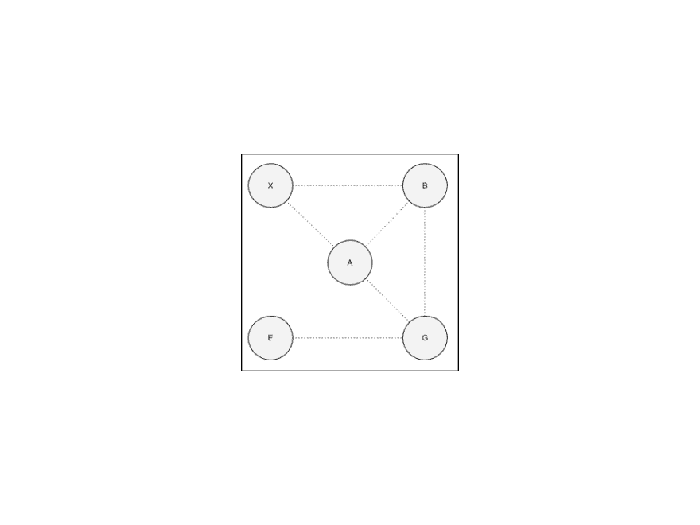
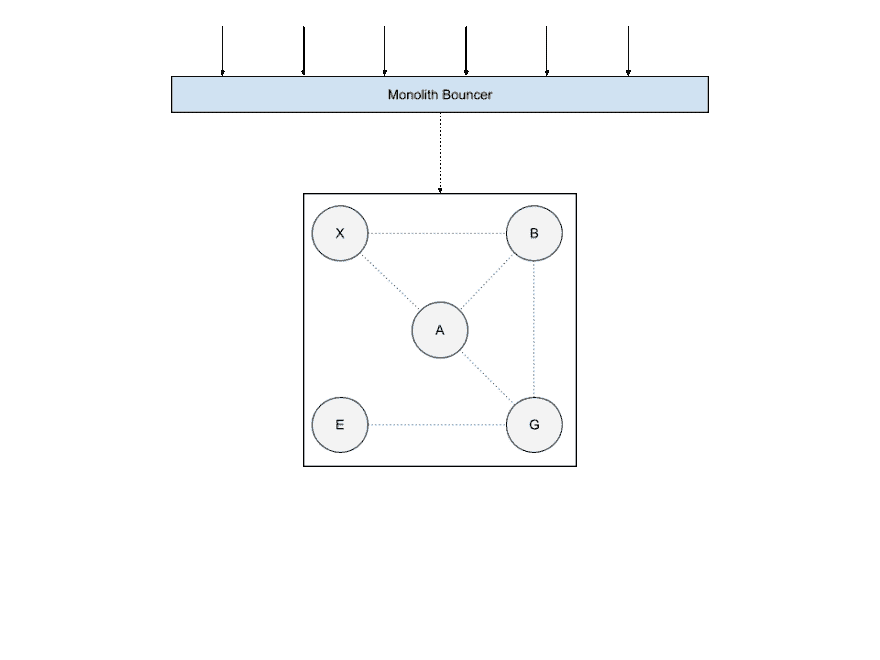
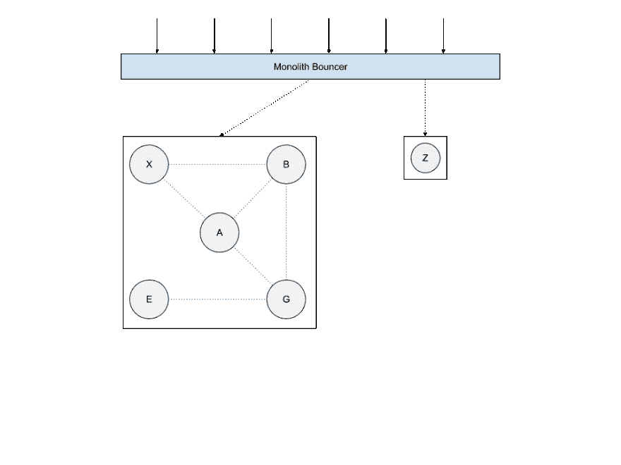
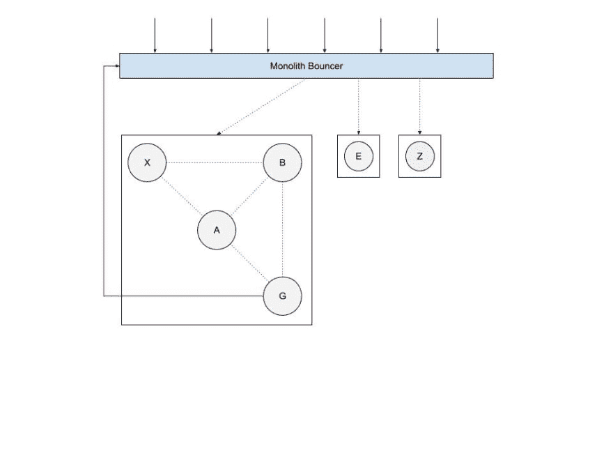

# 如何使用扼杀者模式突破旧的独石

> 原文：<https://dev.to/kylegalbraith/how-to-breakthrough-the-old-monolith-using-the-strangler-pattern-63e>

诚然，“扼杀者模式”这个术语听起来并不那么好。但它实际上是一种可以证明对各种各样的用例非常有用的模式。

*   将单一应用程序分解成更新的微服务。
*   将现有基础设施从一个平台迁移到另一个平台。
*   将本地应用迁移到云提供商。
*   将遗留应用程序转移到更现代的代码库。

扼杀模式的核心是一次一个应用程序或服务的增量迁移。这个想法很简单，我们逐渐地在旧系统的边缘建立一个新的系统或架构。我们避免向旧系统添加额外的东西来支持新系统，随着时间的推移，我们将旧系统升级到新系统中。

### 何时使用扼杀者模式

让我们想象一下，我们有一个大型的单片应用程序，目前运行在一些旧的技术上。也许是旧版本的。NET，可能是不支持的版本 Java，也可能只是一个需要分解的庞然大物代码库。

不管怎样，是时候将这种应用或服务带入 21 世纪了。

在这两种情况下，你的选择可以归结为三个选项。

1.  如果还需要的话，你可以决定从头开始重建它。这是可行的，但可能需要很长时间，而且这是一个大爆炸式的操作。意思是当它完成时，我们打开灯，交叉手指，希望我们做对了。

2.  您决定一举移动、升级或重构这个庞然大物。什么会出错呢？这可能会令人望而生畏，而且会耗费大量时间。重构业务逻辑可能会带来更多的不稳定性。如果出现问题，升级可能会导致停机。

3.  最后一个选择是逐步改善情况。无论是升级还是数据中心迁移，增量方式都比任何大爆炸式的操作更可取。为什么？因为我们可以限制任何停机时间的爆炸半径。此外，我们可以限制任何故障的影响，因为如果需要，我们可以增量回滚它们。

第三种选择在大多数情况下最有意义。这当然不是普遍现象，有时候其他两个最有意义。但是在这篇文章中，让我们关注第三个选项。

### 部署模式

扼杀者模式允许我们在旧系统的边缘建立一个新系统，并随着事情的进展逐渐将流量转移到新系统。

考虑到这一点，我们可以认为我们目前的整体生活在一个盒子里。

这个盒子包含了构成我们遗留应用或服务的所有东西。我们看到我们有一些不同的逻辑，X 服务，B 服务，等等。构成了我们现在的巨石。我们还看到一些服务相互调用，在我们开始构建新系统时，记住这一点很重要。

从扼杀者模式开始，我们将在盒子的入口处放置一个保镖。这通常被称为门面，路由器，或代理，但 bouncer 听起来更有趣，所以留在我身边。

使用扼杀者模式的第一步是在我们的 monolith 前面添加这个 bouncer。现在所有对我们巨石柱的请求都必须通过我们的门面。现在，它只是将请求直接转发回 monolith。

一旦我们有了保镖，我们就可以开始考虑如何逐步打破我们的壁垒。为了简单起见，让我们想象一下，我们的 monolith 中的每个服务都是一个可以取出的微服务。

那么，monolith 中的哪个服务应该首先移动呢？老实说，这个选择是相当随意的，但是有一些事情需要考虑。

*   移动许多其他服务依赖的服务可能是撕掉创可贴的好方法，但它也可能引入您尚未准备好的额外复杂性。
*   移动很少使用的服务可能更简单，但这也可能意味着它并没有真正被使用，所以移动它可能没有意义。

这些选择中的任何一个都是有效的，每个都有自己的权衡。当选择您要迁移的第一个服务时，我建议考虑该服务的界限有多清晰。如果他们非常明确，选择那一个。如果他们有点模糊，也许把那个往后推一点。原因是不清晰的东西通常会与整块石头纠缠在一起，这意味着你移动的复杂性会增加很多。

但是，我们也没有从现有服务开始的时间。请记住，我们说过我们希望停留在旧系统的边缘，所以我们应该避免给旧系统添加新的东西。这意味着任何新的东西都不应该进入我们的整体，而是应该进入我们的新边界。

够简单吧？对于任何新的东西，如果有意义，我们可以创建一个新的微服务或将其与现有的微服务相结合。我们使用路由器将请求定向到我们的 monolith 或新服务。

但是，现在让我们看看移动现有服务。毕竟，这种模式的目的是一点一点地侵蚀我们的巨石，以便我们最终可以摆脱它。我将从**电子服务**开始，因为它只被 monolith 内部的另一个服务 G 调用。

现在我们看到了一些有趣的东西，对吗？

我们将电子服务整合到自己的微服务中。它通过门口的门卫将流量路由给它，但是 G-service 如何与它通信呢？请注意，它没有直接调用它，而是像任何普通请求一样调用它。

G 直接调用 E 服务有问题吗？不一定，但它确实会产生您可能想要避免的耦合。通过我们的 bouncer 路由流量，我们使得 E 可以独立开发，G 不需要知道 E 的任何实现细节。

如果我们继续沿着这条路走下去，我们可以逐步将我们整体中的每个组件移动到它们自己的服务中。如果服务边界有意义的话，也许这些服务中的一些可以合并成一个服务。也许当我们迁移服务时，我们意识到我们不需要一个或两个，这完全没问题，只要确保那些当前处理的逻辑在需要时反映在其他地方。

扼杀者模式的目标是逐步将我们的旧系统转换成一个闪亮的新系统。随着时间的推移，我们将升级、替换和删除服务，直到我们达到可以一起关闭整体的程度。

这种情况会在一夜之间发生吗？这种情况会在一周内发生吗？不太可能。

好的，但是什么时候能完成？这完全取决于您现有的应用程序和架构。这就是这种模式的美妙之处，您可以决定这种增量升级的快慢。

### 结论

在这篇文章中，我们关注了扼杀者模式的核心原则，在旧系统的边缘逐步构建新系统。通过在旧服务的边界上构建我们的新服务，我们能够逐渐切断或者扼杀我们的旧系统。这是一个非常有用的模式，在你处理一些技术债务的时候，可以把它放在心里。

也许您只需要替换应用程序中不再需要的旧服务？这种模式有助于解决这个问题。或者也许你需要像我们在这里讨论的那样更换你的整块石头，是的，这也能帮上忙。

通过逐步淘汰旧系统，我们给自己时间来建立新系统。我们也避免了“大爆炸”式的发布，在这种发布中，我们将所有用户切换到我们的新系统。随着时间的推移，通过执行这些过程，我们可以在用户不知道任何不同的情况下逐步移动各个部分。

#### 几个参考文献

这里有一些来自其他人的关于扼杀者模式的帖子，你可能会觉得有帮助。

*   马丁·福勒[扼杀者应用](https://www.martinfowler.com/bliki/StranglerApplication.html)
*   米歇尔·鲁克[实践中的扼杀者模式](https://www.michielrook.nl/2016/11/strangler-pattern-practice/)
*   天蓝色的云图案[扼杀者图案](https://docs.microsoft.com/en-us/azure/architecture/patterns/strangler)

### 您是否渴望了解更多关于亚马逊网络服务的信息？

如果你想开始你的 AWS 之旅，但却不知道从哪里开始，可以考虑查看我的课程。我们专注于在 AWS 上托管、保护和部署静态网站。让我们在使用时能够了解超过 6 种不同的 AWS 服务。在你掌握了基础知识之后，我们可以进入**的两个额外章节**来讨论更高级的主题，比如基础设施代码和持续部署。