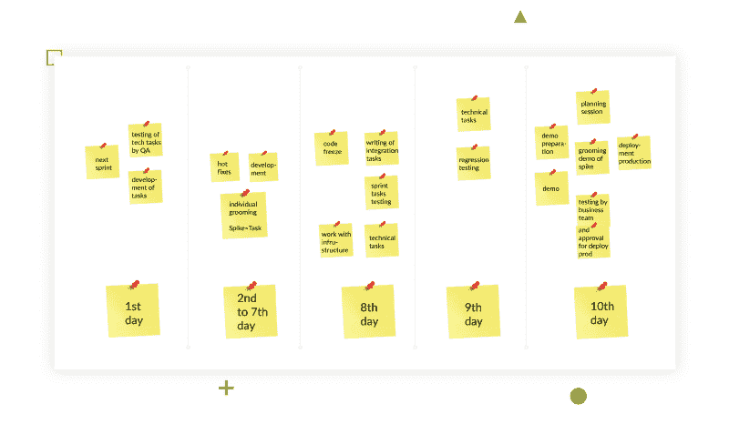
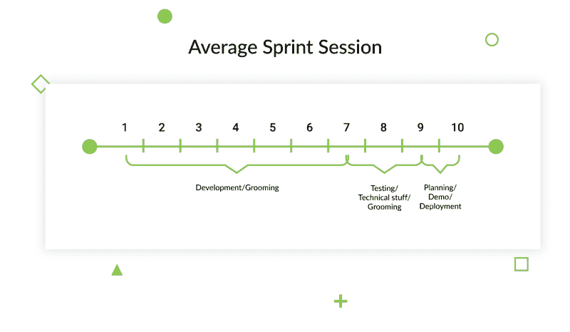
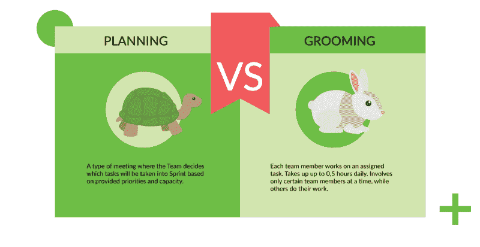
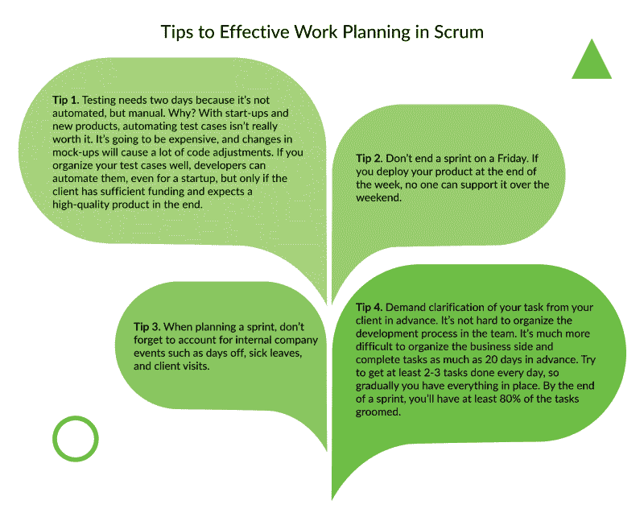

# Scrum 项目管理:有效冲刺计划的秘密

> 原文：<https://dev.to/django_stars/scrum-project-management-secrets-of-effective-sprint-planning-184m>

我们的经历造就了我们。本指南是我和开发团队在从事众多项目时获得的一系列个人发现和经验。像许多其他公司一样，我们在 Scrum 中工作。但是 Scrum 只是给了我们如何组织工作过程的规则。通过反复试验，我试图完善公式，根据业务需求和团队能力尽可能有效地组织每一次冲刺。通过使用这个公式，我们成功地创建了一个平稳和谐的过程，产品在项目结束时完成了，在冲刺阶段没有时间浪费，没有团队成员坐以待毙。例如，当团队使用不明确的方法来计划冲刺时，开发人员做他们的工作，而测试人员只是无所事事，因为他们还没有什么要测试的。我们不是这样。

# 为什么我们使用 Scrum，为什么它是吉拉最好的朋友

Scrum 有很多优点，但我最欣赏的是它和吉拉一起使用时的可预测性。吉拉允许所有活动的全面透明，并提供全面的报告—人们可以跟踪剩余的任务，了解已完成或推迟的工作，预测发布。它也很容易控制——人们可以检查工作效率，以及是否所有任务都在冲刺后完成，预定的计划会议允许所有团队成员都在同一页面上。最重要的是，Scrum 允许你将复杂的项目分解成更小的部分。每个部分都包含在一个 sprint 中。因此，**团队用冲刺来思考，因为它们是有起点和终点的基准**。这样，他们更容易跟踪工作结果，制定和执行任务。因为列一个 10 天的待办事项清单，并坚持下去，要比 100 天容易很多。

同时，我们应该提前计划好我们的活动，并对项目的连续性进行预测。为了让吉拉提供正确的报告，sprints 应该覆盖整个过程。需要明确的是，吉拉在两个不同的方向工作。其中之一涉及到逐个计算已完成的任务；另一个包括计算修正版本——小事件，比如第一个测试版本、第二个版本、产品发布等等。在它的待办事项列表中，吉拉有一个任务列表，如果每一个任务都是用故事点来估算的，吉拉可以根据我们已知的工作速度来预测这个特定项目需要多少次冲刺。因此，在项目讨论的初始阶段，我们可以为客户提供一个大致但非常精确的预算和期限。

# 无缺口:实现连续的工作流程

现在让我们看看如何建立我们的冲刺。短跑之间没有间隙似乎是一件容易的事情，但事实是，这并不容易。让我们不要忘记，每个开发团队及其工作流程严重依赖于业务提供需求和批准 sprint 结果的效率。

 
冲刺是衡量项目持续时间的时间单位。通常持续十天。为什么是十个？这是一个迭代的最佳持续时间，它足够长以交付一个工作增量，但又足够短以对每个人来说是有形的、透明的和可理解的。

**第 1-7 天**是开发发生的时间，此时后端、前端和 QA 一起工作，考虑任务优先级和阻碍因素。同时，基于变更管理原则，开发团队可以根据客户请求提供热修复和紧急变更。

然而，在实践中，在开发过程中，一些团队角色可能会被其他人阻止，这是很常见的情况(例如，在工程师完成他们的部分之前，QA 不能开始测试)。在计划过程中，有必要考虑到这些情况，并尽量减少它们发生的机会。通过这种方式，团队成员可以利用开发过程中的每一个空闲时间来进行个人培训。例如，前端开发人员只能在后端开发人员完成后才能开始工作。这就是为什么当后端开发人员还在编码时，前端开发人员可以做一些整理工作。一旦后端开发人员完成了代码，就轮到他来整理了。

之后，在每个 sprint 的最后一天，团队成员报告他们之前培训的任务。这样，团队就为每一个连续的冲刺做好了准备，他们不必浪费一整天的时间来同时准备和计划。

 
**第 8-9 天**是测试和技术任务的时间，也就是说，没有任何变化被引入到发布候选版本中。这被称为代码冻结。在第 8-9 天，开发团队:

1.  *执行由质量保证工程师支持的测试用例*；
2.  如果项目有足够的资金或处于开发的高级阶段，编写自动化测试或改进工程。自动化测试检查产品，并帮助加速检查。手动检查可能需要很长时间；自动检查不到一天。然而，这只有在清楚哪些测试应该自动化时才有意义。编写和支持测试是一个昂贵的过程，但是如果一个初创公司有足够的资金并且想要得到一个顶级的产品，建议在早期开发阶段进行合理的自动化。

如果项目到达了自动化测试阶段，测试日将被移到第 9 天。这意味着团队可以多花一天时间进行开发——从第 1 天到第 8 天。当 QA 忙于工作时，团队的其他成员可以执行技术任务。他们可以查看旧文件，清理数据，(重新)组织文件夹等。他们不改变代码，但改进了整体工作流程和结构。

我们已经到了第 10 天，在这一天，sprint 期间完成的所有工作都部署在一个 stage 服务器上。业务团队测试这些特性，修改并批准它们进行部署。在这一天，更高级阶段的演示版本被呈现给业务方。

此外，**第 10 天**是回顾、报告和下一个冲刺计划的时间。因此，在第 10 天，你可以回顾你已经完成的工作，报告它，并计划新的冲刺。

请注意，第 10 天绝不可能是星期五。部署一个产品并让它无人监管两天可能是危险的。总得有人能撑得住，以防万一。

之后，从第一天开始新的冲刺，我强烈建议从周三开始。然后，你可以在周四晚上冻结代码，在周五和周一进行测试和技术任务，在周二展示你的演示——在我看来，这是最好的组织方法。

# 心灵的落差

通常，短跑中最常见的问题是差距。如果一个团队由超过 10 个人组成，并不是所有人都能被分配到与他们能力相符的任务。结果就是混乱。然而，我的目标是创建一个连续的工作流，每个人都知道谁在什么时候做什么。我们最终创建了一个系统——如上所示——它应该可以帮助你(和我们)避免混乱和空白。

此外，对于一个按时完成冲刺的团队来说，你必须解决两个问题:

1)企业应该明确他们的需求，这样团队才不会在冲刺阶段落后。

2)团队要做好准备:每个人都必须明白产品是怎么回事。如果是一个特定的行业——比如投资或医药——他们必须在开发开始前做好充分的准备，掌握足够的知识。他们以后不会有时间去研究它。

# Scrum 事件与工作的相关性

Scrum 包括一系列众所周知的事件，为了取得成功，应该非常小心地处理这些事件。它们包括会议、计划和类似的聚会。

尽管实现项目的主要工具是工作，Scrum 事件帮助组织和计划它。这就是会议如此重要的原因—[所有团队成员都应该出席](https://djangostars.com/blog/form-successful-development-team/)，无论他们负责项目的哪个部分。它们都必须在同一页上。否则，计划是没有意义的。

# 开发过程的有效策划

我们团队工作如此高效的原因是我们都有一个主要的信念:**开发人员不仅仅是编码员或测试员，他们还是工程师。都是关于思考，关于建筑。花在思考如何让产品变得更好的时间比花在编码上的时间更重要。**

开发人员每天通常工作 8 个小时，除此之外，他们还要花 5.5 个小时在电脑前编写代码。另外 2.5 小时我们花在日常任务、培训、与客户通话、热修复或中间讨论上。

事实是，像这样的小事——修复一个小错误，更好地理解一项任务，或者与同事讨论一些事情——在计划过程中经常被忽略。无论如何它们都会发生，如果你在计划时不把它们计算在内，开发人员就会浪费时间，无法完成他们只有八个小时来完成的任务。

你如何找出更好的方法与你的团队合作？我建议你把任务类型写在小纸片上，这样每个人都可以在桌子上移动它们。这比在白板上写字要好，白板很乱，不方便，而且只对握笔的人有乐趣。

# 秘密武器:疏导 vs .规划

正如所承诺的，这是我们更详细解释修饰的部分。正如你所知道的，当项目被计划时，客户给团队一个任务列表——不一定是整个项目，但至少是一两个冲刺阶段。梳理是深入吉拉积压的任务的过程。为了更有效地利用时间，每个团队成员在冲刺前一周选择一项任务，并提前向客户提出所有正确的问题，这样他们就有更多的时间来获得答案。

之后，在 sprint 计划期间，每个人都报告他们的发现，并分享他们关于如何完成这个特定任务的想法。当然，这也让团队更容易理解它。当一个新的冲刺开始时，所有的任务都很清晰，每个人都知道该做什么。

因此，当所有团队成员聚在一起，试图为他们甚至不完全理解的未来冲刺计划任务时，培训比传统的计划会议要有效得多。当团队中的一半人试图找出额外的信息时，另一半人根本不注意，因为这超出了他们的专业领域。说白了，梳理是有效的，平等地让每个人都参与到计划中来，耗时更少，并且能够实现不间断的冲刺。

 
顺便提一下，不要忘记在计划中考虑公司内部的事件——休假、病假或客户拜访。

# 最常见的问题及解决方法

许多团队面临的一个问题是 QA 被迫赶上团队的其他成员，因为他们只能在后端和前端完成后开始深度测试。

主要的问题是，你如何帮助团队成员计划他们的工作并按时完成所有事情？并行流程是解决方案。

当 QA 测试构建的时候，开发人员在本地完成技术任务或者花时间自动化。当开发人员在第一天施展他们的魔法时，QA 可以检查部署的技术材料。到了下一个开发阶段，一切都准备好了。

我真诚地希望你能从我们的见解中学到一些有用的东西。最后，这里是我们在信息图表中最重要的提示。

我坚信分享是关爱，这就是为什么我决定分享我所知道的关于如何更好地组织开发过程的一切。和那些知道如何让自己的工作更有效率，不浪费任何人时间的伙伴一起工作总是更好。我希望这个指南能帮助你优化你的流程，并赢得一些伟大的合作者和伙伴。

这篇关于 Scrum 中有效工作计划的文章是由 Django Stars 的项目经理 Nataliia Peterheria 撰写的。最初发表于 [Django Stars 博客](https://djangostars.com/)。