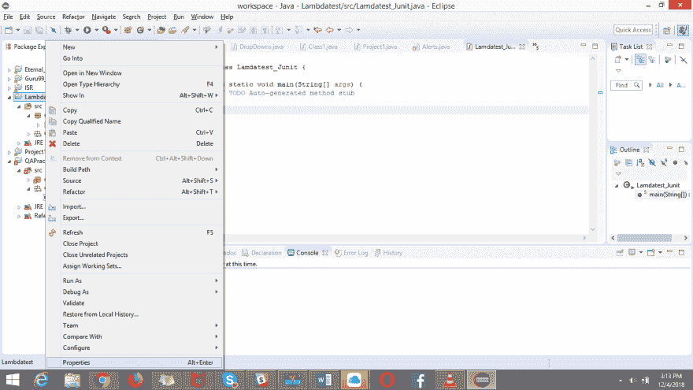
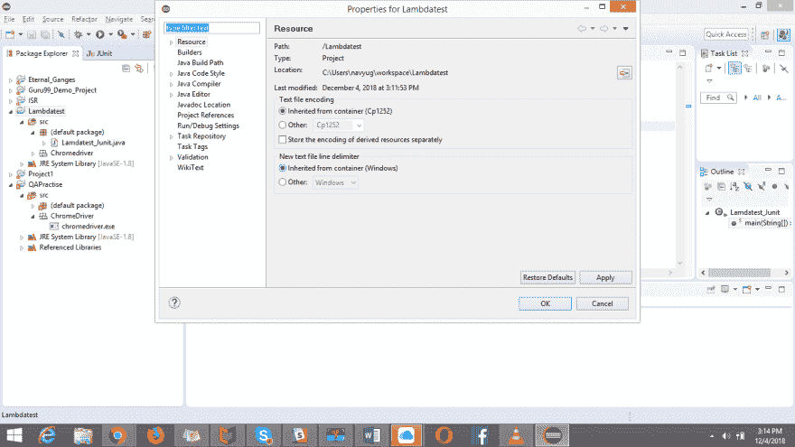

# 使用 JUnit 和 Selenium 对浏览器兼容性进行自动化测试

> 原文：<https://dev.to/lambdatest/automated-testing-with-junit-and-selenium-for-browser-compatibility-4ndn>

[跨浏览器测试](https://www.lambdatest.com/?utm_source=devto&utm_medium=organic&utm_campaign=sep07_sd&utm_term=sd&utm_content=webpage)众所周知，这是一个在不同操作系统上运行的多个浏览器&版本上测试你的网站的过程。这样做是为了在跨多种浏览器访问时实现网站或 web 应用程序的[跨浏览器兼容性](https://www.lambdatest.com/feature?utm_source=devto&utm_medium=organic&utm_campaign=sep07_sd&utm_term=sd&utm_content=webpage)。如果你的网络应用程序不能跨浏览器兼容，那么你不仅会错过潜在的潜在客户，还会影响你的客户保持率。这些浏览器差异可以是从跨浏览器布局问题到跨浏览器兼容排版的任何事情，并且这些跨浏览器差异的发生是因为每个浏览器具有唯一的渲染引擎，该引擎负责渲染 web 元素。

然而，如果手动执行，跨浏览器测试可能会非常耗时。想想从传统到现代，你需要遇到多少个浏览器版本，以及市场上有多少种浏览器。你还必须考虑由特定的移动售货公司提供的特定浏览器。有很多方法可以快速跟踪您的手动跨浏览器测试工作，自动化测试是每天节省时间和精力的首选。

本文通过一个简单的脚本引用了使用 JUnit 和 [Selenium](https://www.lambdatest.com/selenium?utm_source=devto&utm_medium=organic&utm_campaign=sep09_sd&utm_term=sd&utm_content=webpage) 对 web 应用程序进行自动化测试。

JUnit 是一个开源的单元测试工具，帮助测试代码单元。它主要用于 Java 项目的单元测试，然而，它可以和 [Selenium Webdriver](https://www.lambdatest.com/blog/selenium-webdriver-tutorial-for-cross-browser-testing/?utm_source=devto&utm_medium=organic&utm_campaign=sep07_sd&utm_term=sd&utm_content=blog) 一起使用来自动测试 Web 应用程序。因此，您甚至可以使用 JUnit 对 web 应用程序执行自动化测试。准确地说，JUnit 是一个用于 Java 的单元测试框架，它有助于以更结构化和更好的格式编写测试用例。Selenium 和 JUnit 可以彼此独立使用，但是，结合使用 JUnit 和 Selenium 进行测试有助于以更结构化的方式编写测试用例。我们将在下面的章节中介绍使用 JUnit 框架进行 [Selenium 自动化测试，以便通过在线 Selenium 网格自动执行 web 应用程序测试脚本:](https://medium.com/r?url=https%3A%2F%2Fwww.lambdatest.com%2Fselenium-automation-testing-with-junit?utm_source=devto&utm_medium=organic&utm_campaign=sep07_sd&utm_term=sd&utm_content=blog)

*   下载 JUnit Jars。

*   向 Selenium 项目添加 jar。

*   将 JUnit 注释和方法合并到您的第一个 selenium 脚本中。

*   使用 LambdaTest 对 JUnit 和 Selenium 进行云测试。

## 第一步。下载 JUnit Jars

JUnit jar 文件可以从[https://github . com/JUnit-team/JUnit 4/wiki/Download-and-Install](https://github.com/JUnit-team/JUnit4/wiki/Download-and-Install)下载。包括的主要 jar 文件有:

*   junit.jar

*   hamcrest-core.jar

下载这些文件并保存在您的系统中。

## 第二步。向 Selenium 项目添加 jar

为了将 JUnit 外部 jar 文件添加到项目中，您需要一个您喜欢的高级代码编辑器/编译器工具。我通常用 eclipse 工作，所以我会用同样的语言来叙述。您还需要下载 Selenium jar 文件。为了安装 eclipse，可以参考其官网。根据您的操作系统 windows 或 OS，您可以相应地下载。Eclipse 安装后，您可以从其官方网站下载 Selenium jar 文件。为了创建 Selenium webdriver 脚本，您需要使用特定于用户语言的驱动程序。在我们的例子中，我们使用 Java，尽管 Selenium grid 支持多种语言，如 C#、Ruby、Python、Javascript 以及 Java。下载 Selenium jar 文件，并将它们包含到您的代码编辑器/编译器工作区中，现在，为了自动化测试脚本以测试 JUnit 和 Selenium grid，我们需要包含我们下载的 JUnit Jar 文件。为此，请遵循以下步骤:

*   右键单击您创建的项目并选择 properties:

[](https://res.cloudinary.com/practicaldev/image/fetch/s--rjYblNqP--/c_limit%2Cf_auto%2Cfl_progressive%2Cq_auto%2Cw_880/https://cdn-images-1.medium.com/max/2732/0%2AXgSKnJ_zAFXZ-sQF.png)

*   从选项中单击 Java 构建路径:

[](https://res.cloudinary.com/practicaldev/image/fetch/s--IRtot4v6--/c_limit%2Cf_auto%2Cfl_progressive%2Cq_auto%2Cw_880/https://cdn-images-1.medium.com/max/2732/0%2Asdkz09pVr_CGPDus.png)

*   单击“添加外部 Jar”按钮，添加您下载的 JUnit Jar 文件，然后单击“确定”。

这会将 JUnit jar 文件添加到 Selenium 项目中。这个 JUnit Jar 文件中常用的主要类文件/源文件是:

*   断言

*   释文

*   参数化的

*   忽视

*   测试侦听器等等

有关类文件或源文件的详细列表，请参考此处的。现在，让我们将 JUnit 合并到您的 Selenium 项目中，用 JUnit 和 Selenium 进行 web 应用程序测试。

[](https://res.cloudinary.com/practicaldev/image/fetch/s--rjlPdtTk--/c_limit%2Cf_auto%2Cfl_progressive%2Cq_auto%2Cw_880/https://cdn-images-1.medium.com/max/2000/0%2A1UbOKagGeNe-61yy.png)

JUnit 认证为那些希望通过 JUnit 提升 Selenium 自动化测试职业生涯的人建立了测试标准。

以下是来自 LambdaTest 的 JUnit 认证的简要介绍:

[https://www.youtube.com/embed/fWsCwrtElAw](https://www.youtube.com/embed/fWsCwrtElAw)

***在[在线安卓模拟器上测试你的网络和移动应用](https://www.lambdatest.com/android-emulator-online?utm_source=devto&utm_medium=organic&utm_campaign=sep07_sd&utm_term=sd&utm_content=webpage)。确保您的应用程序兼容最新和传统的 Android 操作系统、设备和浏览器***

## 第三步。将 JUnit 整合到您的 Selenium 脚本中

在本文中，构建协作的第一步是在 https://www.lambdatest.com/上创建我们的第一个 JUnit Selenium 简单脚本。

参考代码:

```
import static org.junit.Assert.*;
    import java.util.concurrent.TimeUnit;
    import org.junit.AfterClass;
    import org.junit.BeforeClass;
    import org.junit.Test;
    import org.openqa.selenium.By;
    import org.openqa.selenium.WebDriver;
    import org.openqa.selenium.chrome.ChromeDriver;

    public class Lamdatest_Junit {

        static WebDriver driver;

        [@BeforeClass](http://twitter.com/BeforeClass)
        public static void BrowserOpen()
        {
            System.setProperty("webdriver.chrome.driver", "path of your chromedriver"); 
            driver= new ChromeDriver() ;
            driver.manage().timeouts().implicitlyWait(5, TimeUnit.SECONDS);
        }

        [@Test](http://twitter.com/Test)
        public void Register_User()
        {
            driver.manage().timeouts().implicitlyWait(15, TimeUnit.SECONDS);
            driver.get("[https://www.lambdatest.com/](https://www.lambdatest.com/) ");
            driver.manage().window().maximize();
            driver.findElement(By.xpath("//a[text()='Free Sign Up']")).click();
            driver.findElement(By.xpath("//input[[@name](http://twitter.com/name)='organization']")).sendKeys("LambdaTest");
            driver.findElement(By.xpath("//input[[@name](http://twitter.com/name)='first_name']")).sendKeys("Test");
            driver.findElement(By.xpath("//input[[@name](http://twitter.com/name)='last_name']")).sendKeys("User");
            driver.findElement(By.xpath("//input[[@name](http://twitter.com/name)='email']")).sendKeys("[User2@gmail.com](mailto:User2@gmail.com)");
            driver.findElement(By.xpath("//input[[@name](http://twitter.com/name)='password']")).sendKeys("TestUser123");
            driver.findElement(By.xpath("//input[[@name](http://twitter.com/name)='phone']")).sendKeys("9412262090");
            driver.findElement(By.xpath("//button[text()='SIGN UP']")).click();
            String url= driver.getCurrentUrl();
            assertEquals("fail- unable to register", url, "[https://accounts.lambdatest.com/user/email-verification](https://accounts.lambdatest.com/user/email-verification)");
        }

        [@AfterClass](http://twitter.com/AfterClass)
        public static void BrowserClose()
        {

            driver.quit();
        }

        } 
```

Enter fullscreen mode Exit fullscreen mode

## 详细信息:

上面的脚本用[https://www.lambdatest.com/](https://www.lambdatest.com/)打开浏览器，点击“免费注册”按钮注册。注册后，脚本将检查它被重定向到的 URL，以确保注册成功。我们使用了 JUnit 的两个类，一个是**注解* *类，另一个是* *断言**。

**脚本由三部分组成:**

*   **@BeforeClass —这个注释在开始类**中的任何注释之前运行这段代码。正如你所看到的，在对 chrome 浏览器执行任何操作之前，我们已经打开了它。主要动作在 [@test](https://dev.to/test) 标注标记的方法中执行。

*   **[@test](https://dev.to/test)** —该测试方法具有打开应用程序和执行注册过程的功能。为了验证结果，我们使用了断言类，其中我们使用当前 URL 的上下文来验证注册过程是否成功。**这个测试注释在@BeforeClass 和@BeforeTest 方法之后和@AfterTest 和@AfterClass 方法之前运行这段代码。**

*   **@ after class——这个注释告诉 JUnit 在所有测试执行完毕后运行这段代码**。这种注释方法通常会在执行完所有操作项后关闭浏览器。

    附上执行上述脚本的视频:

[https://www.youtube.com/embed/F4rTzAZVY6Y](https://www.youtube.com/embed/F4rTzAZVY6Y)

到目前为止，您已经看到了如何使用本地 webdriver 实例，通过 JUnit 和 Selenium 自动化您的 web 应用程序测试。然而，这也有不好的一面。您只能对安装在您机器上的浏览器调用自动跨浏览器测试。另外，每当您打算使用 JUnit 和 Selenium 为 web 应用程序运行自动化测试时，您都需要有自己的机器。这就是为什么云测试正在成为世界范围内的主流选择。LambdaTest 是一个基于云的跨浏览器测试工具，支持 Selenium grid，为您在使用本地机器执行自动化测试时面临的每个障碍提供解决方案。LambdaTest 提供了一个包含 2000 多个浏览器的 Selenium 网格，让您可以毫不费力地执行自动化测试。

让我演示一下如何使用 LambdaTest 轻松地执行[自动化测试。](https://www.lambdatest.com/blog/automation-testing-important-agile-development/?utm_source=devto&utm_medium=organic&utm_campaign=sep07_sd&utm_term=sd&utm_content=blog)

要在我们的 Selenium 网格上运行您的测试套件，您必须配置一些功能，以便您的测试可以在远程浏览器上执行。请参考我们的功能生成器工具，帮助您轻松获取所需的功能。

```
WebDriver driver = new RemoteWebDriver(new URL("https://" + username + ":" + accesskey + "@hub.lambdatest.com/wd/hub"),
    DesiredCapabilities.firefox()); 
```

Enter fullscreen mode Exit fullscreen mode

现在让我们从一个简单的 Selenium WebDriver 测试开始。下面是一个 JUnit Selenium 脚本，它将打开一个示例待办事项应用程序，该应用程序将执行以下任务:

1.  将前两个项目标记为完成。

2.  在列表中添加新项目。

3.  返回添加的项目。

    ```
     import org.junit.After;
        import org.junit.Before;
        import org.junit.Test;
        import org.junit.runner.RunWith;
        import org.openqa.selenium.JavascriptExecutor;
        import org.openqa.selenium.WebDriver;
        import org.openqa.selenium.remote.CapabilityType;
        import org.openqa.selenium.remote.DesiredCapabilities;
        import org.openqa.selenium.remote.RemoteWebDriver;
        import java.net.URL;

        public class JUnitTodo {
             public String username = "YOUR_USERNAME";
            public String authkey = "YOUR_ACCESS_KEY";
            public static RemoteWebDriver driver = null;
            public String gridURL = "[@hub](http://twitter.com/hub).lambdatest.com/wd/hub";
            boolean status = false;

            [@Before](http://twitter.com/Before)
            public void setUp() throws Exception {
               DesiredCapabilities capabilities = new DesiredCapabilities();
                capabilities.setCapability("browserName", "chrome");
                capabilities.setCapability("version", "70.0");
                capabilities.setCapability("platform", "win10"); // If this cap isn't specified, it will just get the any available one
                capabilities.setCapability("build", "LambdaTestSampleApp");
                capabilities.setCapability("name", "LambdaTestJavaSample");
                capabilities.setCapability("network", true); // To enable network logs
                capabilities.setCapability("visual", true); // To enable step by step screenshot
                capabilities.setCapability("video", true); // To enable video recording
                capabilities.setCapability("console", true); // To capture console logs
                try {
                    driver = new RemoteWebDriver(new URL("https://" + username + ":" + accesskey + gridURL), capabilities);
                } catch (MalformedURLException e) {
                    System.out.println("Invalid grid URL");
                } catch (Exception e) {
                    System.out.println(e.getMessage());
                }
            }

            [@Test](http://twitter.com/Test)
            public void testSimple() throws Exception {
               try {
                      //Change it to production page
                    driver.get("[https://4dvanceboy.github.io/lambdatest/lambdasampleapp.html](https://4dvanceboy.github.io/lambdatest/lambdasampleapp.html)");

                      //Let's mark done first two items in the list.
                      driver.findElement(By.name("li1")).click();
                    driver.findElement(By.name("li2")).click();

                     // Let's add an item in the list.
                      driver.findElement(By.id("sampletodotext")).sendKeys("Yey, Let's add it to list");
                    driver.findElement(By.id("addbutton")).click();

                      // Let's check that the item we added is added in the list.
                    String enteredText = driver.findElementByXPath("/html/body/div/div/div/ul/li[6]/span").getText();
                    if (enteredText.equals("Yey, Let's add it to list")) {
                        status = true;
                    }
                } catch (Exception e) {
                    System.out.println(e.getMessage());
                }
            }

            [@After](http://twitter.com/After)
            public void tearDown() throws Exception {
               if (driver != null) {
                    ((JavascriptExecutor) driver).executeScript("lambda-status=" + status); // relay whether the test has passed or failed as marked by the user
                    driver.quit();
                }
            }
        } 
    ```

您还可以通过 LambdaTest Selenium grid 测试本地文件，用 JUnit 和 Selenium 对 web 应用程序执行自动化测试。您可以借助 LambdaTest 功能生成器提供的高级功能来做到这一点。这些高级功能将帮助您:

*   对本地托管的网页进行测试。

*   为测试中执行的每个步骤生成浏览器控制台日志。

*   为执行测试配置自定义时区。

*   通过测试执行生成网络日志。

如果我们想要激活上述所有高级功能，那么您需要添加以下所需功能:

```
 DesiredCapabilities capabilities = new DesiredCapabilities();
        capabilities.setCapability("tunnel",true); // allows you to run tests for your locally hosted web pages.
        capabilities.setCapability("console",true); // generates console logs
        capabilities.setCapability("network",true); // generates network logs
        capabilities.setCapability("timezone","UTC+12");  //considering you want your test to run on the time zone UTC+12. 
```

Enter fullscreen mode Exit fullscreen mode

***在[在线模拟器 Android](https://www.lambdatest.com/android-emulator-online?utm_source=devto&utm_medium=organic&utm_campaign=sep07_sd&utm_term=sd&utm_content=webpage) 上测试你的网络和移动应用。确保您的应用程序兼容最新和传统的 Android 操作系统、设备和浏览器***

## 平行测试

LambdaTest 还提供了执行并行测试的能力。使用 LambdaTest 并行测试，您可以在多个浏览器上同时运行类似的测试。这有助于显著减少测试构建活动所花费的时间。下面是一个并行测试的例子，它使用 LambdaTest 通过 JUnit 和 Selenium 自动执行 web 应用程序测试。

要同时在不同的浏览器上运行测试，您需要创建一个助手类，它扩展参数化类(org . JUnit . runners . parametered)并实现 RunnerScheduler 类

(org . junit . runners . model . runnerscheduler)来并行支持 JUnit 测试。请参见下面的示例:

```
import java.util.concurrent.ExecutorService;
    import java.util.concurrent.Executors;
    import java.util.concurrent.TimeUnit;

    import org.junit.runners.Parameterized;
    import org.junit.runners.model.RunnerScheduler;

    public class Parallelized extends Parameterized {

        private static class ThreadPoolScheduler implements RunnerScheduler {
            private ExecutorService executor;

            public ThreadPoolScheduler() {
                String threads = System.getProperty("junit.parallel.threads", "15");
                int numThreads = Integer.parseInt(threads);
                executor = Executors.newFixedThreadPool(numThreads);
            }

            [@Override](http://twitter.com/Override)
            public void finished() {
                executor.shutdown();
                try {
                    executor.awaitTermination(10, TimeUnit.MINUTES);
                } catch (InterruptedException exc) {
                    throw new RuntimeException(exc);
                }
            }

            [@Override](http://twitter.com/Override)
            public void schedule(Runnable childStatement) {
                executor.submit(childStatement);
            }
        }

        public Parallelized(Class<?> klass) throws Throwable {
            super(klass);
            setScheduler(new ThreadPoolScheduler());
        }
    } 
```

Enter fullscreen mode Exit fullscreen mode

这是一个 JUnit 测试的例子，它代表了上面用于执行并行测试的助手类。

```
import org.openqa.selenium.By;
    import org.openqa.selenium.Platform;
    import org.openqa.selenium.WebDriver;
    import org.openqa.selenium.remote.DesiredCapabilities;
    import org.openqa.selenium.remote.RemoteWebDriver;
    import org.junit.After;
    import org.junit.Before;
    import org.junit.Test;
    import org.junit.runner.RunWith;
    import org.junit.runners.Parameterized;
    import java.net.MalformedURLException;
    import java.net.URL;
    import java.util.LinkedList;

    [@RunWith](http://twitter.com/RunWith)(Parallelized.class)
    public class JUnitConcurrentTodo {
         public String username = "YOUR_USERNAME";
        public String accesskey = "YOUR_ACCESS_KEY";
        public String gridURL = "[@hub](http://twitter.com/hub).lambdatest.com/wd/hub";

         public String platform;
         public String browserName;
         public String browserVersion;

        public RemoteWebDriver driver = null;

         boolean status = false;

            [@Parameterized](http://twitter.com/Parameterized).Parameters
         public static LinkedList<String[]> getEnvironments() throws Exception {
            LinkedList<String[]> env = new LinkedList<String[]>();
            env.add(new String[]{"WIN10", "chrome", "70.0"});
            env.add(new String[]{"macos 10.12","firefox","62.0"});
            env.add(new String[]{"WIN8","internet explorer","11"});
            return env;
        }

       public JUnitConcurrentTodo(String platform, String browserName, String browserVersion) {
            this.platform = platform;
            this.browserName = browserName;
            this.browserVersion = browserVersion;
         }

        [@Before](http://twitter.com/Before)
        public void setUp() throws Exception {
           DesiredCapabilities capabilities = new DesiredCapabilities();
            capabilities.setCapability("browserName", browser);
            capabilities.setCapability("version", browserVersion);
            capabilities.setCapability("platform", platform); // If this cap isn't specified, it will just get the any available one
            capabilities.setCapability("build", "JUnitParallelSample");
            capabilities.setCapability("name", "JUnitParallelSampleTest");
            capabilities.setCapability("network", true); // To enable network logs
            capabilities.setCapability("visual", true); // To enable step by step screenshot
            capabilities.setCapability("video", true); // To enable video recording
            capabilities.setCapability("console", true); // To capture console logs
            try {
                driver = new RemoteWebDriver(new URL("https://" + username + ":" + accesskey + gridURL), capabilities);
            } catch (MalformedURLException e) {
                System.out.println("Invalid grid URL");
            } catch (Exception e) {
                System.out.println(e.getMessage());
            }
        }

        [@Test](http://twitter.com/Test)
        public void testParallel() throws Exception {
           try {
                  //Change it to production page
                driver.get("[https://4dvanceboy.github.io/lambdatest/lambdasampleapp.html](https://4dvanceboy.github.io/lambdatest/lambdasampleapp.html)");

                  //Let's mark done first two items in the list.
                  driver.findElement(By.name("li1")).click();
                driver.findElement(By.name("li2")).click();

                 // Let's add an item in the list.
                  driver.findElement(By.id("sampletodotext")).sendKeys("Yey, Let's add it to list");
                driver.findElement(By.id("addbutton")).click();

                  // Let's check that the item we added is added in the list.
                String enteredText = driver.findElementByXPath("/html/body/div/div/div/ul/li[6]/span").getText();
                if (enteredText.equals("Yey, Let's add it to list")) {
                    status = true;
                }
            } catch (Exception e) {
                System.out.println(e.getMessage());
            }
        }

        [@After](http://twitter.com/After)
        public void tearDown() throws Exception {
           if (driver != null) {
                ((JavascriptExecutor) driver).executeScript("lambda-status=" + status);
                driver.quit();
            }
        }
    } 
```

Enter fullscreen mode Exit fullscreen mode

***看看这个，如何使用[Safari 开发工具](https://www.lambdatest.com/blog/debug-websites-using-safari-developer-tools/?utm_source=devto&utm_medium=organic&utm_campaign=sep07_sd&utm_term=sd&utm_content=blog)*** 调试网站

## 必须在云上使用 JUnit 和 Selenium 进行 Web 应用程序测试

云测试意味着测试托管在云上的基于云的应用程序。**使用 Selenium 和 JUnit 来测试 web 应用的云服务成为最明显的选择，因为它能够在多种浏览器和平台上运行脚本，并支持任何语言支持**。这使得 JUnit 和 Selenium 的结合成为执行跨浏览器测试的有利选择。与不使用任何类似 JUnit 的框架相比，使用 JUnit 提供了一种更加结构化的方式来编写测试，从而带来更好的维护、质量和有效性。LambdaTest 作为一个跨浏览器测试工具，可以帮助您大大减少使用 JUnit 和 Selenium 执行自动化测试的时间和精力。LambdaTest 提供了一个包含 2000 多个浏览器的 Selenium 网格，并且支持多种编程语言，如 Javascript、Python、Ruby、C#和 PHP。**将 Maven 和 Jenkins 与 Selenium 和 JUnit 结合使用，有助于为基于云的应用提供更强大、更流畅的端到端自动化体验，从而为整个流程提供健壮性**。我们将在接下来的文章中演示这一点，敬请期待，祝测试愉快！