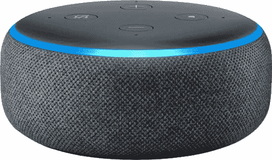

# 关于测试版 Alexa 技能建设者认证的思考

> 原文：<https://dev.to/juliensimon/thoughts-on-the-beta-alexa-skill-builder-certification-534c>

本月早些时候，我们[宣布](https://aws.amazon.com/about-aws/whats-new/2019/01/announcing-aws-certified-alexa-skill-builder-beta-exam/)一项新的关于 [Alexa 技能发展](https://aws.amazon.com/certification/beta-exam/)的 AWS 认证。按照惯例，考试首先是发布一个测试版考试，你只能参加到 2 月 1 日。嗯，我今天确实参加了(因为为什么不),虽然我不会进入具体的细节，这里有一些评论可能会帮助你准备。

> 先来点背景知识。我对我在 re:Invent 参加的测试版机器学习认证感到非常满意，因为不管我的机器学习技能值多少钱，我确实花了大部分时间在这上面。这里的情况有所不同:我的 Alexa 体验主要局限于我的[约翰尼·皮](https://medium.com/@julsimon/johnny-pi-i-am-your-father-part-7-son-we-need-to-talk-5a910aa642d1)项目，没有足够的尝试来跟上新的东西(屏幕！屏幕！)也没有真正努力去准备这次考试(因为…一天只有 24 小时？).这对于理解下面一些令人困惑的评论可能很重要。这也是我很可能考试不及格的最好借口。至少现在我知道我不知道什么，你也可以感谢我降低了:D 的门槛

 

<figcaption>不错的回音，哦耶！我们喜欢它。nasssty Alexa 精灵为什么要加屏幕？脱下来，脱下来！</figcaption>

考试 85 题，持续 3 小时(我是 90 分钟左右做完的)。以下是考试指南中列出的题目( [PDF](https://d1.awsstatic.com/training-and-certification/docs-alexa-skill-builder-specialty/AWS_Certified_Alexa_Skill_Builder_Specialty_Exam_Guide_v1.0_FINAL.pdf) )。

**领域 1:语音优先的设计实践和能力(14%)**

1.1 描述用户如何与技能交互

1.2 将特性和能力映射到用例

**观点** *:* 够搞笑的，我不记得弄了很多这些(？).我想，应该归咎于随机化。

**领域 2:技能设计(24%)**

2.1 设计和开发交互模型

2.2 设计多轮对话

2.3 使用内置意图和槽

2.4 处理意外的对话请求或响应

2.5 使用一个或多个服务接口(例如，音频、视频和小工具)设计多模态技能

**观点**:很明显，对交互模型有很多疑问。意图、插槽(内置和自定义)、同义词等。不出所料，这是最大的领域，你会受到冲击:**在交互模型上不遗余力**。我有几个关于如何处理被误解的意图的问题——这是建立高效技能的关键方面之一——所以你肯定想对 [*后退意图*](https://developer.amazon.com/blogs/alexa/post/f6bb7c54-de0d-4abe-98c3-cf3fc75c32f8/how-to-add-fallbackintent-handling-to-your-alexa-skill) 感到舒服。此外，**确保你有使用基于屏幕的设备的经验，比如 Echo Spot** :我有很多关于设计支持 GUI 的技能(卡片等)的问题。).在花了大部分时间研究 Echo 和 Echo Dots 之后，我真的在这里度过了一段艰难的时光(而且从永远开始，GUI 编程就是我停下来的地方)。说到这里，我没有得到任何关于 Alexa 演示语言的问题，这可能是太新了，无法进行功能介绍。如果你好奇的话，这里有一个不错的[回复:发明视频](https://www.youtube.com/watch?v=tzJ_SHObBMk)。

**领域 3:技能架构(14%)**

3.1 确定用于扩展 Alexa 技能功能的 AWS 服务(亚马逊 CloudFront、亚马逊 S3、亚马逊 CloudWatch 和亚马逊 DynamoDB)

3.2 使用 AWS Lambda 构建 Alexa 技能

3.3 遵循 AWS 和 Alexa 安全和隐私最佳实践

**观点** *:* 这是关于将你的技能与 AWS 服务联系起来，所以我回到了已知的领域！我确实收到了关于上面提到的所有服务和 IAM 的问题，但是**没有什么令人讨厌的**:AWS 的新来者对他们做什么以及为什么他们在 Alexa 环境中很重要有基本的了解，他们会做得很好。出于显而易见的原因，人们更加关注 Lambda，我建议在服务本身(超时、日志等)上多花一点时间。).

**领域 4:技能开发(20%)**

4.1 实现技能内购买和亚马逊支付 Alexa 技能

4.2 使用语音合成标记语言进行表达和 MP3 音频

4.3 实现状态管理

4.4 实现 Alexa 服务接口(音频播放器、视频播放器和屏幕)

4.5 解析 Alexa JSON 请求并提供响应

**观点** *:* 这次没有 Amazon Pay，但是我得到了几个关于[**in-skill purchasing**](https://developer.amazon.com/fr/alexa-skills-kit/make-money/in-skill-purchasing)(一次性和订阅)的问题。 **SSML** 也弹出来了，我用[亚马逊 Polly](https://docs.aws.amazon.com/polly/latest/dg/ssml.html) 的经验绝对有用:玩这个东西，知道主要特征(韵律等。).当然，当您想要构建精细的技能(管理会话、将数据持久化到 AWS 后端)时，**状态管理**很重要。是的，我得到了**代码级 GUI 问题**(卡片等)。)我讨厌其中的每一个问题，尽管通过合理的判断，有些问题肯定是可以解决的。

**领域 5:测试、验证和故障排除(18%)**

5.1 使用亚马逊 CloudWatch 或其他工具进行调试和故障排除

5.2 使用 Alexa 开发者测试工具

5.3 执行 beta 测试

5.4 排除交互模型中的错误

**观点** : Lambda，到处都是 Lambda！许多关于故障排除功能(超时、日志、权限等)的问题。)，所以再一次自己花时间研究一下服务。一些关于使用怪异/有缺陷的 JSON 的交互模型的问题，但是如果你花时间写技巧，你可能已经写得更差了(我知道我曾经写过)。

**域 6:发布、运营和生命周期管理(10%)**

6.1 描述技能发布流程

6.2 在开发人员控制台中添加和删除用户

6.3 在开发人员控制台中执行技能分析

6.4 区分技能的状态/版本(例如，开发中、认证中以及实时)

**观点**:许多关于**技能生命周期**的问题，除非你真的将技能推向生产，否则你不会完全体验到这些问题(回顾过程，更新实时技能等)。):你应该反复检查几次，否则你会漏掉一些信息。关于**分析**的几个问题，所以再次确认你有几个现场技能，或者至少花一些时间详细研究控制台的那个部分(关于意图、发生等的统计)。).

考试指南中完全没有提到的几个盲点(调皮，调皮):其中的 [**ASK CLI**](https://developer.amazon.com/docs/smapi/quick-start-alexa-skills-kit-command-line-interface.html) (没什么不好的，只是用它玩了一下)和 [**个性化**](https://developer.amazon.com/docs/custom-skills/request-customer-contact-information-for-use-in-your-skill.html) (访问客户信息，账户链接等。).这对于测试版认证来说并不罕见，我希望一旦认证最终完成，考试指南会更加准确…这些主题非常重要，所以请务必也学习一下。

总的来说，我认为 beta 考试确实达到了目标(可能比 ML 考试更好，ML 考试感觉有点不太完美)。我在屏幕/GUI 问题上经历了一段痛苦的时间，但这只是我的问题:有适当技能的开发人员应该做得很好，只要他们也花一点时间在后端工作上。

> 撇开 Trolling 不谈，语音助手为什么要有屏幕？真的吗？现在我有了一个不支持这种趋势的正当理由；)

你也参加考试了吗？请在这里分享您的评论，但不要分享详细信息，因为我必须删除它。

一如既往，感谢阅读。