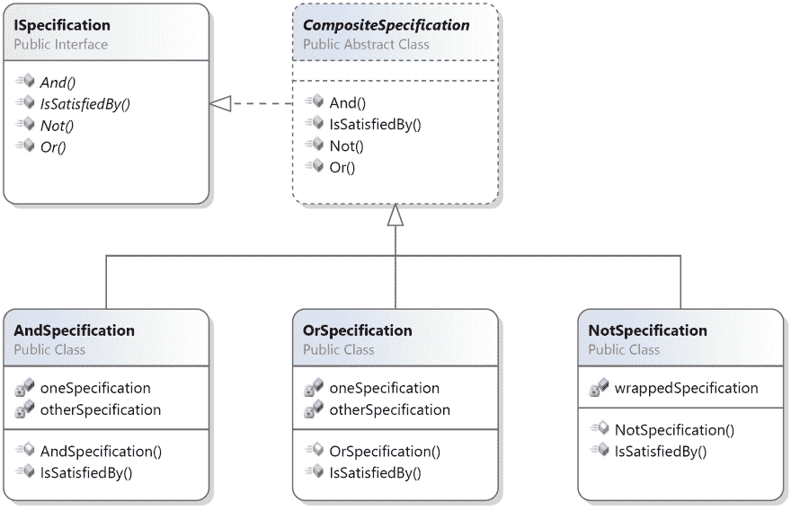

# 在实体框架核心中实现查询规范模式

> 原文：<https://dev.to/gpeipman/implementing-query-specification-pattern-in-entity-framework-core-404h>

我之前的博客文章[不需要使用实体框架核心的存储库和工作单元](https://gunnarpeipman.com/ef-core-repository-unit-of-work/)展示了存储库和工作单元模式是如何在实体框架代码(和 NHibernate)中实现的，以及我们如何使用 IDataContext 泛化在相同的接口后获得 ORM-s。由于我仍然试图找出在不暴露 IQueryable 的情况下隔离查询的最佳位置，所以我开始尝试查询规范模式。

### 规范和查询规范模式

查询规范模式的根在[规范和复合规范模式](https://en.wikipedia.org/wiki/Specification_pattern)中。查询规范是领域驱动设计(DDD)中流行的模式。当搜索规格模式时，这是我们能看到的最流行的图。

[](https://res.cloudinary.com/practicaldev/image/fetch/s--JIW2Uviu--/c_limit%2Cf_auto%2Cfl_progressive%2Cq_auto%2Cw_880/https://static.gunnarpeipman.com/wp-content/uploads/2019/11/specification-pattern.png)

它说明了一个表示规范模式的规范接口和遵循复合规范模式的复合规范。我们可以构建广泛的规范集，如果我们用流畅的方法来增加它的趣味性，那么我们可能很快就会发现我们正在构建自己的 LINQ 实现。

如果我们阅读 DDD 关于规范的文章——看看 Vladimir Khorikov 的博客文章[Specification pattern:C # implementation](https://enterprisecraftsmanship.com/posts/specification-pattern-c-implementation/)——我们可以看到文章在介绍之后很快就进入了数据主题。要查看一些代码，请看我之前提到的博客帖子。

正如您将很快看到的那样，查询规范模式与实体框架核心配合得非常好。

### 测试类

我从一个我用来教学生的项目中选取了一些样本课程。我们有 Invoice、Customer 和 InvoiceLine 类——很简单，但足以演示事情是如何工作的。

```
public class Invoice
{
    [Key]
    public int Id { get; set; }
    public DateTime Date { get; set; }
    public DateTime DueDate { get; set; }
 public bool IsPaid { get; set; }

    [Required]
    public Customer Customer { get; set; }

    [Required]
    [StringLength(12)]
    public string InvoiceNo { get; set; }

    public IList<InvoiceLine> Lines { get; set; }

    public Invoice()
    {
        Lines = new List<InvoiceLine>();
    }
}

public class Customer
{
    [Key]
    public int Id { get; set; }
    public string Name { get; set; }
}

public class InvoiceLine
{
    [Key]
    public int Id { get; set; }
    public string LineItem { get; set; }
    public double Price { get; set; }
    public string Unit { get; set; }
    public double Amount { get; set; }
    public double Sum { get; set; }

    [Required]
    public Invoice Invoice { get; set; }
} 
```

在这篇博文中，我也会用到这些类。以下是我的 IDataContext 接口的数据库上下文。

```
public interface IDataContext
{
    DbSet<Invoice> Invoices { get; set; }
    DbSet<InvoiceLine> InvoiceLines { get; set; }

    void BeginTransaction();
    void Commit();
    void Rollback();
}

public class LasteDbContext : DbContext, IDataContext
{
    public LasteDbContext(DbContextOptions<LasteDbContext> options)
        : base(options)
    {
    }

    public DbSet<Customer> Customers { get; set; }
    public DbSet<Invoice> Invoices { get; set; }
    public DbSet<InvoiceLine> InvoiceLines { get; set; }

    private IDbContextTransaction _transaction;

    public void BeginTransaction()
    { 
        _transaction = Database.BeginTransaction();
    }

    public void Commit()
    {
        try
        {
            SaveChanges();

            _transaction.Commit();
        }
        finally
        {
            _transaction.Dispose();
        }        
    }

    public void Rollback()
    { 
        _transaction.Rollback();
        _transaction.Dispose();
    }
} 
```

那些想尝试这里显示的代码的人可以使用我的数据库上下文和实体进行实验。

### 实现查询规范

我发现了查询规范的不同实现。其中一些是小而简单的，而另一些是真正的怪物。我从实体框架核心文档的[实现具有实体框架核心的基础设施持久层](https://docs.microsoft.com/en-us/dotnet/architecture/microservices/microservice-ddd-cqrs-patterns/infrastructure-persistence-layer-implemenation-entity-framework-core)一章中给出的实现开始。我对 BaseSpeficiation 做了一点修改，让它用起来更舒服。

```
public interface ISpecification<T>
{
    Expression<Func<T, bool>> Criteria { get; }
    List<Expression<Func<T, object>>> Includes { get; }
    List<string> IncludeStrings { get; }
}

public abstract class BaseSpecification<T> : ISpecification<T>
{
    public Expression<Func<T, bool>> Criteria { get; set; }
    public List<Expression<Func<T, object>>> Includes { get; } = new List<Expression<Func<T, object>>>();
    public List<string> IncludeStrings { get; } = new List<string>();

    protected virtual void AddInclude(Expression<Func<T, object>> includeExpression)
    {
        Includes.Add(includeExpression);
    }

    protected virtual void AddInclude(string includeString)
    {
        IncludeStrings.Add(includeString);
    }
} 
```

使用 BaseSpecification，我们可以编写查询类或规范，并在数据库上下文中使用它们来从数据库中获取数据。

我不会在这里使用存储库类，因为我仍然不确定我们应该如何调用承载查询方法的类。相反，我将使用扩展方法将查询规范应用于我的数据库上下文的 DbSet-s。

```
public static class QuerySpecificationExtensions
{
    public static IQueryable<T> Specify<T>(this IQueryable<T> query, ISpecification<T> spec) where T : class
    {
        // fetch a Queryable that includes all expression-based includes
        var queryableResultWithIncludes = spec.Includes
            .Aggregate(query,
                (current, include) => current.Include(include));

        // modify the IQueryable to include any string-based include statements
        var secondaryResult = spec.IncludeStrings
            .Aggregate(queryableResultWithIncludes,
                (current, include) => current.Include(include));

        // return the result of the query using the specification's criteria expression
        return secondaryResult.Where(spec.Criteria);
    }
} 
```

使用 Specify()方法，我们可以将查询规范应用于数据库上下文中定义的所有 IQueryables。

### 建筑查询规范

现在让我们编写一些查询规范来试验事情是如何工作的。第一个实现是关于获取到期日在过去的未付发票。

```
public class DueInvoicesSpecification : BaseSpecification<Invoice>
{
    public DueInvoicesSpecification()
    {
        Criteria = i => i.DueDate < DateTime.Now.Date &&
                        i.IsPaid == false;

        Includes.Add(i => i.Customer);
    }
} 
```

由于此规范将由列出有问题发票的控制器操作直接调用或通过应用服务层调用，因此我们只需要包括客户。列表视图中不需要发票行，这就是我们不包括它们的原因。为了简单起见，我在控制器动作中直接使用规范。

```
public IActionResult Index()
{
    var invoices = _dataContext.Invoices.Specify(new DueInvoicesSpecification())
                                        .ToList();

    return View(invoices);
} 
```

下面是 Entity Framework Core 为 SQLite 数据库生成的查询。

```
SELECT 
    "i"."Id", 
    "i"."CustomerId", 
    "i"."Date", 
    "i"."DueDate", 
    "i"."InvoiceNo", 
    "i"."IsPaid", 
    "i.Customer"."Id", 
    "i.Customer"."Name"
FROM 
    "Invoices" AS "i"
    LEFT JOIN "Customers" AS "i.Customer" 
        ON "i"."CustomerId" = "i.Customer"."Id"
WHERE 
    ("i"."DueDate" < rtrim(rtrim(strftime('%Y-%m-%d %H:%M:%f', rtrim(rtrim(strftime('%Y-%m-%d %H:%M:%f', 'now', 'localtime'), '0'), '.'), 'start of day'), '0'), '.')) 
    AND ("i"."IsPaid" = 0) 
```

我们可以清楚地看到，客户数据包括在内，我们的未付发票情况也存在(虽然它看起来非常丑陋)。

### 配线查询规范

现在让我们试试一个技巧。我将添加另一个规范，将过滤出给定客户的未付发票。然后让我们看看连接多个规格是否可行。

```
public class CustomerInvoicesSpecification : BaseSpecification<Invoice>
{
    public CustomerInvoicesSpecification(int customerId)
    {
        Criteria = i => i.Customer.Id == customerId;
    }
} 
```

如果我们显示一些东西的列表，那么我们可能也需要排序。因此，让我们将新的规范和订单连接到发票查询。

```
public IActionResult Index()
{
    var invoices = _dataContext.Invoices.Specify(new DueInvoicesSpecification())
                                        .Specify(new CustomerInvoicesSpecification(100))
                                        .OrderBy(i => i.Customer.Name)
                                        .ToList();

    return View(invoices);
} 
```

规格和@_customerId_0 参数的客户 ID 值为 100。这是实体框架核心生成的查询。

```
SELECT 
    "i"."Id", 
    "i"."CustomerId", 
    "i"."Date", 
    "i"."DueDate", 
    "i"."InvoiceNo", 
    "i"."IsPaid", 
    "i.Customer"."Id", 
    "i.Customer"."Name"
FROM 
    "Invoices" AS "i"
    LEFT JOIN "Customers" AS "i.Customer" 
        ON "i"."CustomerId" = "i.Customer"."Id"
    WHERE 
        (("i"."DueDate" < rtrim(rtrim(strftime('%Y-%m-%d %H:%M:%f', rtrim(rtrim(strftime('%Y-%m-%d %H:%M:%f', 'now', 'localtime'), '0'), '.'), 'start of day'), '0'), '.')) 
        AND ("i"."IsPaid" = 0)) 
        AND ("i"."CustomerId" = @\_customerId\_0)
ORDER BY 
    "i.Customer"."Name" 
```

只要我们的规范足够简单，并且没有用太复杂的东西弄乱 LINQ 表达式树，我们也可以一个接一个地连接查询规范。

### 包装完毕

实体框架核心的数据库提供者使用 LINQ 来查询数据库。尽管我们可以对存储库或某些查询存储类隐藏查询，但也可以使用查询规范模式让其他层的开发人员像使用乐高积木一样构建他们的查询。是好是坏——这取决于开发者的技能。对我来说，仍然连接查询规范似乎很酷。当构建一些大的解决方案时，在其他方法变得更有效之前，考虑查询规范可以走多远是一个好主意。

在实体框架核心中实现查询规范模式的帖子[最早出现在](https://gunnarpeipman.com/ef-core-query-specification/) [Gunnar Peipman - Programming 博客](https://gunnarpeipman.com)上。