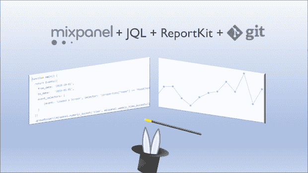
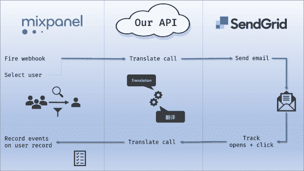

# Mixpanel 和 Google Analytics 高级用户的 3 项高级技术

> 原文：<https://dev.to/tdwright/3-advanced-techniques-for-the-mixpanel-and-google-analytics-power-user-4pe7>

当你觉得已经达到 Mixpanel 和/或 Google Analytics 所能提供的极限时，你会怎么做？作为这个博客的读者，我可以假设你不是那种会放弃的人。在我关于使用行为事件数据的系列文章的第四部分中，我探索了 Mixpanel 的一些半隐藏的特性，讨论了 Google Data Studio，并根据您选择的 ESP 对 Mixpanel 进行了科学拼接。这将是一次疯狂的旅行——系好安全带！

## keen data explorer 的后续步骤

好了，你已经掌握了基本知识。你在追踪正确的事情，你已经完善了你所有的报告。不幸的是，如果你和我一样，你会很快发现让你恼火的事情。

如果你准备好离开滑雪道，下面是我正在探索的一些技巧。这篇文章中的三个主题都是非常不成熟的，但这是重点的一部分——让我们推测一下我们可以用这些工具做什么。

警告:在以下任何一个方面，我都不是专家。继续进行，后果自负！

## 1) JQL 和自定义报表

JQL 是 Mixpanel 的 Javascript 查询语言，它允许你针对你的数据编写定制的查询。它隐藏在 Mixpanel 的主要功能之外，我想这就是为什么我花了这么长时间才找到它。我希望我能早点找到它，因为它给我询问数据的能力充了电。

语法需要一点时间来适应，但它真的很强大。从一个或多个查询开始，您可以随心所欲地`filter()`、`group()`、`map()`、`reduce()`和`flatten()`您的数据。

这些 JQL 脚本的输出是 JSON，可选地显示在一个表格中。您还可以导出返回的 JSON，以便在其他地方进一步处理它。

然而，它真正有用的地方是在[自定义报告](https://mixpanel.com/help/platform#building-your-first-report)中。我们刚刚开始使用这个功能，但是我们的想法是你可以使用你自己的 JQL 和 Mixpanel 的 UI 组件来编写报告。其中很酷的一点是，您可以在本地开发这些报告，并使用 Git 部署它们。很漂亮，对吧？

 

<figcaption>完全访问你的数据，具有 Mixpanel 的所有功能，带源码控制。神奇！</figcaption>

为了让您了解这两个特性有多有用，让我描述一个真实的用例。在我们的应用程序中，我们邀请用户每周完成几次活动。由于这些事件有助于我们对每个用户的数据分析，每个用户在任何给定的一周内完成此事件的次数是一个重要的指标。事实上，我们的 KPI 是在任何给定的一周内至少完成三次该活动的活跃用户的比例。

试图在一个普通的 Mixpanel 报告中表达这一点是非常棘手的。我们有一份报告显示了每个活跃用户每周完成此活动的平均次数。我们有一份报告，告诉我们在任何给定的一周内至少签到一次的活跃用户的比例。但是，除了编写我们自己的 JQL，我们没有办法准确地表达这个 KPI。

在 JQL，这很简单:

1.  查询此事件。
2.  按用户 ID 和日历周分组(这里有一个很好的内置)，记录每个用户每周的事件数。
3.  筛选出计数小于 3 的用户/周组。
4.  再次分组，这次只是按周分组，记录每周的用户数。
5.  查询我们用来表示“活跃用户”的事件。
6.  按周分组，保留每周的活动用户总数。
7.  根据每周的时间戳连接这两个数据集。
8.  将第一组中的用户数除以第二组中的用户数。

好的，所以它需要八步，但是它不是超级复杂的。现在，我们有了一个数据集，可以输入到自定义报告中，查看这一关键指标随着时间的推移是如何变化的，如果我们要有效地改进它，这是至关重要的。

令人失望的是，目前定制报告不能显示在仪表板上。这大大降低了它们的可发现性，并可能意味着您会发现自己在报告和仪表板之间来回切换。虽然不是世界末日。

*PS 要想很好的解释为什么 JQL API 有点臭，请看* [*吉尔伯特·瓦特的解释*](https://medium.com/@gilbertwat/reducer-in-mixpanel-api-is-weird-but-genius-5968ac9996d7) *。剧透:这和平行有关。*

## 2) GA 定制报告与 Google Data Studio

直到前几天谷歌分析中弹出一条消息，我才听说过谷歌数据工作室。我的调查正在进行中，但我想我应该分享一些初步的观察。

我的兴趣被激起了，因为我假设 Data Studio 将允许我们进行某种数据操作或整形。这不是它的目的。相反，Data Studio 是一个从现有数据源生成定制报告的工具。的文档很少，但是有一些第三方指南。[这次演练](https://www.distilled.net/google-data-studio-tutorial/)涵盖了许多基础知识。

由于 Data Studio 实际上没有太多转换数据的功能，我发现自己将一些事件映射到 GA 中的目标。一旦我做到了这一点，我发现我能够在 GA 中比在 Data Studio 中更容易地创建定制报告。因此，这里是我的最高提示:在查看 Data Studio 之前，在 GA 中用尽您的选项。

抛开轻率不谈，对于那些已经掌握了谷歌分析并希望让他们的数据更容易访问和互动的人来说，谷歌数据工作室似乎是一个有用的下一步。

对于像我一样还没有充分利用普通 Google Analytics 的特性和功能的人来说，这真的值得深入研究。我发现一些有用的东西是目标和序列过滤片段。

另外，我真的很担心谷歌可能不会给 Data Studio 它真正需要的发展时间。谷歌有淘汰被认为表现不佳的产品的方式，而像这样的事情需要很多年才能让足够多的人掌握陡峭的学习曲线。像谷歌数据工作室这样的慢热者能在运行谷歌的反复无常的委员会中生存下来吗？

## 3)将 Mixpanel 挂接到第三方 ESP

我在上面提到过，当用户触发某些事件时，可以使用 Mixpanel 来触发与用户的通信。我们开始将它用于干预性电子邮件，但只部署了我们计划的 20%。

事实是 Mixpanel 的电子邮件功能相当糟糕。我不希望这篇文章变成一场咆哮，所以我只列出我的三个主要烦恼:

*   活动中的标准系统不如用户浏览器中的同等系统功能全面。这意味着你可以在 Mixpanel 的其他地方找到一个目标群体，但是却不能在一次战役中精确地锁定他们。我不知道为什么这个功能会被实现两次，更不用说细微的差别了。
*   跟踪 Mixpanel 的电子邮件，开箱即用，仅限于发送和打开。如果您想要跟踪点击，您必须为每个链接手动实现这一点。如果你想跟踪其他信息，比如正在使用的电子邮件客户端的类型，那么…你就不走运了。
*   最后，Mixpanel 的邮件编辑器真的很糟糕。我们说的是一个用于编辑 HTML 邮件的基本文本框。哦，你的更改不会被可靠地持久化，除非你浏览接下来的两页选项(与邮件内容无关)并在最后一个屏幕上点击“更新”。真气人！

幸运的是，可以通过将 Mixpanel 连接到专门的 ESP(如 SendGrid 或 Mandrill)来缓解第 2 点和第 3 点。你看，当用户合格时，Mixpanel 允许发生三种类型动作。电子邮件是其中之一。推送通知是另一种方式。第三个是 web hooks——我们的救星！

我们正处于探索这一点的早期阶段，但看起来有可能:

1.  在专门的 ESP 中设计你的电子邮件。
2.  让 Mixpanel 在用户符合条件时触发 webhook 调用。
3.  使用 webhook 触发 ESP 向用户发送电子邮件。
4.  轨道打开、点击等。使用 ESP。
5.  使用集成将这些数据发送回 Mixpanel。

这个列表中的第三和第五步是魔法需要发生的地方。从 Mixpanel 到 ESP 的调用以及从 ESP 返回到 Mixpanel 的调用需要通过一个可以做一些翻译的中介来路由。有很多中间件供应商提供这种服务。坦率地说，虽然，又一个服务的想法让我头晕，所以我想我们还是自己开发吧。

 

<figcaption>从 Mixpanel 循环到 SendGrid(在本例中)以获得更好的电子邮件体验。</figcaption>

唷！这比只使用一个系统要复杂一些，但是看起来(至少对我们来说)是值得的。如果一切如我们所愿，我们将拥有 Mixpanel 活动的所有事件驱动的优点，而不必在编辑器或跟踪上妥协。祝我们好运！

## 结论

所以你有它。我的准漫谈一些先进的技术，我在探索的早期阶段。我以前从来没有发布过这么投机的东西，但我觉得这可能值得一做。

我描述的两种 Mixpanel 技术显示了平台的深度。你可以成功地使用它很多年，而不需要使用(甚至注意不到)JQL、自定义报告或 webhooks。但是当你真的发现它们时，某一类人会“啊哈！”瞬间。

相比之下，我对 Google Data Studio 的简短讨论表明了 Google 产品的广度。我肯定有些人会从 Data Studio 中获得很多价值(我自己没有排除这种可能性)，但很难看出它如何与其他一切相适应，或者一年后它是否还会存在。到目前为止，它在我的工作中的主要好处是指出/提醒我谷歌分析中的功能。虽然对我有用，但我不确定这是 Data Studio 产品团队的意图！

也许我讨论的具体技术对某些人有用，但真正的希望是有人受到启发，带着这些想法去某个疯狂的地方。也许这三个概念中的一个会让人们停下来，重新审视他们正在使用的工具。

最重要的是，我真的很想知道其他人在使用什么先进的技术？你正在做我上面描述的事情吗？你在做更有异国情调的事情吗？我很想听听，所以请在评论中告诉我。