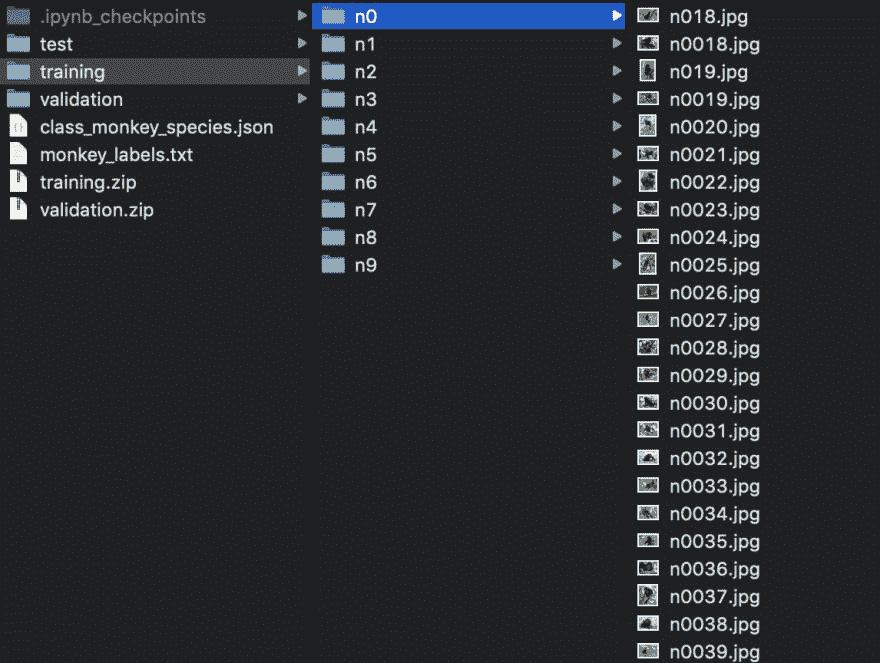

# 基于张量流 Keras 的猴子识别

> 原文：<https://dev.to/imronlearning/monkey-recognition-with-tensorflow-keras-4bcp>

令人惊讶的是，机器学习变得如此简单。如果你没有任何数学背景知识或任何关于机器学习的学术背景，这不再是一个障碍。我当然属于这一类。

我使用机器学习的一个目标是当识别一些东西的时候。我想建立一个可以进行面部识别、识别动物种类、事物名称等的模型。对于一个数学知识很少的人来说，学习这种数学是非常可怕和困难的。我几乎放弃了这个看似不可实现的目标，直到我发现了**“预训模特”**。

**预训练模型**基本上都是*(根据我的理解)*，在不同的数据集上训练过的解决类似问题的模型。有不同种类的预训练模型，每一种都有其特定的目的，用于解决不同的问题。

今天，我将向大家展示我是如何使用预先训练好的模型 **ResNet50** 构建一个猴子识别模型的。 **ResNet50** 对于指定物种*(根据我所见)*来说很棒。我见过这也用于狗。所以让我们和猴子一起去吧🙈

# 设置

我在一个笔记本上做这个项目。如果你还没有为机器学习设置你的机器，你可以查看我的[设置](https://dev.to/benprax/setup-for-machine-learning-part-3-1c02)帖子。我用的是 Kaggle 的 [10 种猴子](https://www.kaggle.com/slothkong/10-monkey-species)。

我们还必须有一个 JSON 文件，其中包含该物种的所有索引。你可以在这个 [Github gist](https://gist.github.com/bennyprax/65818b886ee7ad14230f96c727bce07b) 里下载。这对以后很重要。

最后，下载 ResNet50 的预训练模型。这里有一个来自 Kaggle 的[链接](https://www.kaggle.com/keras/resnet50)。

# 构建我们的数据目录

我的目录文件夹如下所示:

[](https://res.cloudinary.com/practicaldev/image/fetch/s--nVSF_5zI--/c_limit%2Cf_auto%2Cfl_progressive%2Cq_auto%2Cw_880/https://thepracticaldev.s3.amazonaws.com/i/lt8n06nkp3f1i16jdt2r.png)

我们有用于训练和验证的图像。*记住数据分割
在训练/验证文件夹中，我们有每个物种及其图像的目录。

# 变换图像

第一个障碍是获取图像并将其转换成我们的机器学习模型可以理解的东西。

```
 from tensorflow.python.keras.preprocessing.image import ImageDataGenerator
from tensorflow.python.keras.applications.resnet50 import preprocess_input

image_size = 224
data_generator_with_aug = ImageDataGenerator(preprocessing_function=preprocess_input, 
                                             horizontal_flip=True,
                                             width_shift_range=0.2,
                                             height_shift_range=0.2)
train_path='10-monkey-species/training'
train_generator = data_generator_with_aug.flow_from_directory(train_path, 
                                                     target_size=(image_size, image_size), 
                                                     batch_size=24,
                                                     class_mode='categorical')

data_generator_with_no_aug = ImageDataGenerator(preprocessing_function=preprocess_input)

validation_path='10-monkey-species/validation'
validation_generator = data_generator_with_no_aug.flow_from_directory(validation_path,
                                                          target_size=(image_size, image_size),
                                                          batch_size=24,
                                                          class_mode='categorical') 
```

Enter fullscreen mode Exit fullscreen mode

我们来分析一下。`ImageDataGenerator`是一个函数，它获取图像并对图像进行预处理，然后输出模型可以理解的数据。`preprocessing_function`参数接受另一个函数，在本例中是来自 ResNet50 的`preprocess_input`,它翻译 RestNet50 可以理解的图像。其他参数允许数据扩充。

数据扩充基本上允许你扩充你的数据。这意味着它允许您增加数据样本，而实际上并不增加您拥有的数据数量。在这个例子中，翻转图像或稍微改变图像的宽度和高度允许我们有更多的图像样本，而不实际使用相同的精确图像。

`flow_from_directory`接收您放在目录中的所有图像。

# 建立我们的模型

现在，让我们建立我们的模型！！

```
 from tensorflow.python.keras.applications import ResNet50
from tensorflow.python.keras.models import Sequential
from tensorflow.python.keras.layers import Dense, Flatten, Conv2D, Dropout

resnet_weights_path = 'resnet50_weights_tf_dim_ordering_tf_kernels_notop.h5'
model = Sequential()
model.add(ResNet50(include_top=False, pooling='avg', weights=resnet_weights_path))

num_classes = 10
model.add(Dense(num_classes, activation='softmax'))

# Say not to train first layer (ResNet) model. It is already trained model.layers[0].trainable = False

model.compile(optimizer='sgd', loss='categorical_crossentropy', metrics=['accuracy'])

model.fit_generator(train_generator, 
steps_per_epoch=3, 
epochs=20, 
validation_data=validation_generator, 
validation_steps=1) 
```

Enter fullscreen mode Exit fullscreen mode

分解:

*   所以我们用了一个顺序卷积网络。然后，我们添加了一个带有预训练权重的 ResNet50 层。
*   然后我们添加了一个密集层，我们的类的数量是 10。类别的数量意味着我们试图识别的物种的数量*(在本例中)*。
*   我们还说过，对于模型的第一层，我们不想重新训练它。
*   然后我们编译了我们用`model.compile()`做的所有东西，最后把所有东西都放进了`model.fit_generator()`

还记得我们改变形象时制造的发电机吗？我们把它们都放在这里。

*   Epochs 基本上是模型在图像中循环的次数。
*   `steps_per_epoch`是我们在每个时期拍摄的图像数量。

# 测试我们的模型

```
import numpy as np
from os.path import join
from tensorflow.python.keras.preprocessing.image import load_img, img_to_array

image_dir = '10-monkey-species/validation'
img_paths = [join(image_dir, filename) for filename in 
               ['n0/n000.jpg',
                'n5/n502.jpg',
                'n9/n9031.jpg',
                'n2/n2014.jpg']]

image_size = 224
def read_prep_images(img_paths, img_height=image_size, img_width=image_size):
    imgs = [load_img(img_path, target_size=(img_height, img_width)) for img_path in img_paths]
    img_array = np.array([img_to_array(img) for img in imgs])
    output = preprocess_input(img_array)

    return output

test_data = read_prep_images(img_paths) 
```

Enter fullscreen mode Exit fullscreen mode

这里，我们从我们的验证数据集中获取几个测试图像，并使用`read_prep`函数将它们更改为`np.array`。

然后我们用我们的模型预测它们。

```
preds = model.predict(test_data)
print(preds) 
```

Enter fullscreen mode Exit fullscreen mode

# 翻译我们的预测

我们需要将我们的预测转化为指数，以便:

1.  我们可以在 JSON 文件中使用这个索引
2.  返回该索引的适当数据

我从 Kaggle 那里复制了这个，稍微做了些调整。

```
import json
from IPython.display import Image, display

def decode_predictions(preds, top=5, class_list_path=None):
  if len(preds.shape) != 2 or preds.shape[1] != 10:
    raise ValueError('`decode_predictions` expects '
                     'a batch of predictions '
                     '(i.e. a 2D array of shape (samples, 1000)). '
                     'Found array with shape: ' + str(preds.shape))
  index_list = json.load(open(class_list_path))
  results = []
  for pred in preds:
    top_indices = pred.argsort()[-top:][::-1]
    result = [tuple(index_list[str(i)]) + (pred[i],) for i in top_indices]
    result.sort(key=lambda x: x[2], reverse=True)
    results.append(result)
  return results

most_likely_labels = decode_predictions(preds, top=5, class_list_path='10-monkey-species/class_monkey_species.json')

for i, img_path in enumerate(img_paths):
    display(Image(img_path))
    print(most_likely_labels[i]) 
```

Enter fullscreen mode Exit fullscreen mode

因此,`decode_predictions`进程接收一个 2D 数组`preds`,并从 json 文件中索引相应的对象。例如，如果 preds 是[0，1，8]，那么它将从 json 对其进行索引，并返回[['index_0 '，' folder_name']，['index_1 '，' folder_name']，['index_8 '，' folder_name']]。

for 循环主要接收图像，并显示解码后的预测。

而这就是结果:
[](https://res.cloudinary.com/practicaldev/image/fetch/s--Itek1KHg--/c_limit%2Cf_auto%2Cfl_progressive%2Cq_auto%2Cw_880/https://thepracticaldev.s3.amazonaws.com/i/hwhmekqp6w7i0ieu4c2z.png)

# 结论

机器学习变得异常简单。令人瞠目结舌。这里的某些术语，如“softmax”和“relu ”,都是数学术语，你不需要深究它们的机制，但如果你对它们的功能和用途有个大概的了解，这些术语会很有用。在我迄今为止的机器学习之旅中，你只需要对它有一个大致的理解和概念就可以真正开始了。

希望你能从中学到一些东西！希望听到您的反馈😄
在 twitter 和 instagram @heyimprax 上查看更多来自我的信息。

感谢阅读！你成功了🎉喝杯咖啡休息一下吧，☕️