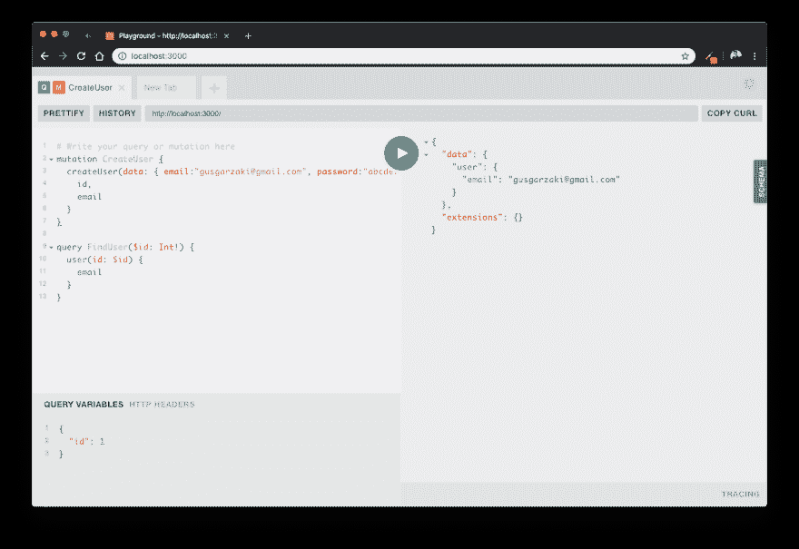

# 用 GraphQL 和 Apollo 创建 api 第一部分

> [https://dev . to/gugadev/create-un-form-con-graph QL-y-angular---part-I-1m 9k](https://dev.to/gugadev/creando-un-formulario-con-graphql-y-angular---parte-i-1m9k)

> **注:**本教程由于其复杂性，将分为两部分。第一个是本文，将与 TypeGraphQL 一起使用 GraphQL 和 Apollo 专用于后端。第二个，前端使用最新版本的 Angular。

[源代码](https://github.com/gugadev/graphql-ng-signup)

在上一个教程中，我们学习了 GraphQL 的基本概念。我们看到了变量，欲望，突变等等。因为坚持理论是不够的，所以让我们着手实践所学到的东西吧。

## 项目准备

首先，请记住使用最新版本的 node lt。同样，你可以使用 NPM 和 yar。

我们需要安装的软件包列表为:

*   `@types/bcryptjs`
*   `@types/graphql`
*   `@types/lokijs`
*   `@types/pino`
*   `apollo-server`
*   `bcryptjs`
*   `class-validator`
*   `graphql`
*   `lokijs`
*   `pino`
*   `pino-pretty`
*   `reflect-metadata`
*   `type-graphql`
*   `typedi`

发展单位如下:

*   `@types/node`
*   `nodemon`
*   `ts-node`
*   `tslint`
*   `typescript`

最后，添加脚本`start`以运行 nodemon 运行 ts-node 并运行我们的应用程序:

```
{  "scripts":  {  "start":  "nodemon --exec ts-node src/main.ts --watch src/ --ignore src/database/data.json"  }  } 
```

Enter fullscreen mode Exit fullscreen mode

## 创建模型

> 为了专注于 GraphQL，我们将使用内存中的数据库。

第一步将是创建模型，在我们的例子中，我们只有一个我们称之为`User` :

```
// user.type.ts
import {
  ObjectType,
  Field,
  Int
} from 'type-graphql'

@ObjectType()
export default class User {
  @Field(type => Int)
  id: number
  @Field()
  email: string
  @Field()
  password: string
} 
```

Enter fullscreen mode Exit fullscreen mode

此类型仅包含三个字段:

*   id:代表 PK。
*   电子邮件
*   密码

请注意，`type-graphql`在 JavaScript 类型不足时为我们提供了可选类型，如`Int`。例如，缺省情况下，`number`映射到`Float`图 QL。为此，通过参数`type`，我们告诉他是`INT`型。

反过来，同一类将成为我们的数据库引擎将使用的模型(始终考虑重用)

## 创建服务

我们现在开始创建“`User`”的服务。它看起来是这样的:

```
// user.service.ts
import { Service } from 'typedi'
import { hash, genSalt } from 'bcryptjs'
import db from '../database/client'
import User from './user.type'
import UserInput from './user.input'

@Service()
export default class UserService {
  private datasource = db.getCollection('users')

  findByEmail(email: strng): User {
    return this.datasource.findOne({ email })
  }
  async create(data: UserInput): Promise<User> {
    const body = {
      ...data,
      id: this.datsource.count() + 1,
      password: await hash(data.password, await genSalt(10))
    }
    const { id } = this.datasource.insert(body)
    return this.find(id)
  }
} 
```

Enter fullscreen mode Exit fullscreen mode

首先要注意的是，服务是与装饰者`Service`一起标注的。这台装饰机让我们把一个班级注册为 DI 容器中的一项服务，以后再把它注入*其他地方。*

 *剩下的真的很简单。作为财产，我们有`datasource`，其中包含着我们从数据库中检索到的`users`集合。

最后我们有两种方法，即`email`通过用户的`email`和`create`来查找用户，该用户接收类型为`UserInput`的参数，散列其平面密码，将其插入集合中，最后返回创建的文档。

听起来不错，但是，∞会不会是`UserInput`？🤔

## 个性化参数

您会发现在上一个教程中，我们谈到了“`input`”这类类型，这些类型包括要作为一个集合传递到查询中的单个参数的字段。基于这一概念，我们开始创造我们自己的输入。

```
import { IsEmail } from 'class-validator'
import {
  InputType,
  Field
} from 'type-graphql'

@InputType()
export default class UserInput {
  @Field()
  @IsEmail()
  email: string
  @Field()
  password: string
} 
```

Enter fullscreen mode Exit fullscreen mode

你会意识到它很像`User`，∞吗？唯一的区别是装饰`InputType`，通过这种方式，我们表示这门课是结构`input`。此外，由于我们非常小心，我们通过装饰`isMail`验证了字段`email`，验证包属性`class-validator`，这将是自动的，同样，如果为字段提供了错误的值，也会通过 GraphQL 返回错误。

## 创建解析器

好了，到目前为止，我们已经有了类型，现在我们开始创建查询和突变与其各自的解析器。为此，我们创建了一个类并用`Resolver`进行注释，如下所示:

```
import {
  Resolver,
  Arg,
  Query,
  Mutation,
  Int
} from 'type-graphql'
import User from './user.type'

@Resolver(of => User)
export default class UserResolver {

} 
```

Enter fullscreen mode Exit fullscreen mode

通过装饰`Resolver`我们表示这个班级将包含一个或多个解析器，此外，通过论证`of`我们表示它将属于谁；在这种情况下，a `User`。我们现在将`User`服务纳入查询数据库，并从查询和突变中返回。

```
// imports anteriores
import { Inject } from 'typedi'

@Resolver(of => User)
export default class UserResolver {
  @Inject() private service: UserService
} 
```

Enter fullscreen mode Exit fullscreen mode

准备好了。但是，这里发生过吗？🤔

装饰`@Inject`将依赖(一个实例)注入变量或参数中，这种依赖必须与变量的类型相同。当我们使用`@Inject`时，我们所做的是对容器说:

> 哎，∞如果你有一个叫
> `UserService`的班级的话，在你的登记册上查询一下好吗？如果你有，我需要你给我一个实例，并把它保存在变量`service`。

你明白吗？太好了。一旦我们已经包括了对`UserService`的依赖，我们就已经准备好使用它的方法了。现在，我们定义一下我们的`Query`。它将通过其`id` :
负责查找用户

```
// imports anteriores
import {
  ...
  Arg, // agregamos
  Query, // agregamos
  Int // agregamos
} from 'type-graphql'

@Resolver(of => User)
export default class UserResolver {
  ...
  @Query(returns => User, { nullable: true })
  user(@Arg('email') email: string) {
    return this.userService.findByEmail(email)
  }
} 
```

Enter fullscreen mode Exit fullscreen mode

通过装饰商`Query`我们表示，这种方法代表查询。此装饰接受两个参数:返回类型和可选的选项数组。通过那个阵列我们告诉你这个查询**可以返回 null** ，因为当一个用户不在的时候，返回的将是`null`。否则，我们返回`null`时会得到错误。

在`id`的论点中，我们提供了`Arg`式的装饰器，我们给它取了个名字。最后，当该方法运行时，将在数据库中搜索该`email`，并返回相关用户。

以上定义翻译成以下图 QL 方案:

```
type Query {
  user(email: String!): User
} 
```

Enter fullscreen mode Exit fullscreen mode

简单吗？。我们现在继续我们的突变，它将负责在数据库中创建一个用户。方法的定义相当类似查询:

```
// imports anteriores
import {
  ...
  Mutation // agregamos
} from 'type-graphql'
import UserInput from './user.input'

@Resolver(of => User)
export default class UserResolver {
  ...
  @Mutation(returns => User)
  user(@Arg('data') data: UserInput) {
    return this.userService.create(data)
  }
} 
```

Enter fullscreen mode Exit fullscreen mode

注意方法的论证，我们不再通过装饰符`Arg`上的`type`，因为我们已经通过 Typescript 这样做了。你会做的是*【type-graph QL】*是用反射来看参数的类型，做正确的映射。太棒了！

以上内容将翻译为:

```
type Mutation {
  createUser(data: UserInput!): User
} 
```

Enter fullscreen mode Exit fullscreen mode

## 迪·基·德 datos y 阿波罗

我们已经得到了几乎所有我们需要的，我们只差几步了。第一是配置我们的依存关系注入容器。为此，我们作如下安排:

```
import { Container } from 'typedi'
import { useContainer } from 'type-graphql'

export default () => {
  useContainer(Container)
} 
```

Enter fullscreen mode Exit fullscreen mode

我们从`typedi`进口容器，并传给`type-graphql`为我们设置。这就是我们所需要做的，以便使它能够运作，并提供和注入各种依赖。

接下来是创建我们的数据库。正如我们在教程开头所说，它将成为记忆中的数据库，因此，可以假设，设置将非常简单:

```
// database/bootstrap.ts
import * as Loki from 'lokijs'

const db: Loki = new Loki('data.json')
db.addCollection('users')

export default db 
```

Enter fullscreen mode Exit fullscreen mode

请注意，当我们实例化数据库时，我们创建了一个名为“`users`”的集合，该集合将存储我们要创建的用户。

最后，我们需要用阿波罗创建我们的 GraphQL 服务器。让我们看看灯光:

```
// server/index.ts
import { ApolloServer } from 'apollo-server'
import { buildSchema } from 'type-graphql'
import formatError from '../errors/argument.format'
import UserResolver from '../users/user.resolver'

/**
 * Creates a Apollo server using an
 * executable schema generated by
 * TypeGraphQL.
 * We provide a custom Apollo error
 * format to returns a non-bloated
 * response to the client.
 */
export default async () => {
  const schema = await buildSchema({
    resolvers: [
      UserResolver
    ]
  })
  return new ApolloServer({
    schema
  })
} 
```

Enter fullscreen mode Exit fullscreen mode

我们所做的第一件事是导入解析器，然后以数组的形式传递到“`buildSchema`”以便生成阿波罗可以理解的有效的`schema`图 QL。二是实例化`ApolloServer`，并与其他可选属性一起传递`schema`。你可以在这里看到属性清单。完成后，我们就有一台服务器可以运行了。

## 进入点

最后，我们创建了阿波罗服务器运行的主文件。为此，我们只导入服务器创建的功能，运行功能`listen`，它将会监听服务器。

```
// main.ts
import 'reflect-metadata'
import enableDI from './container/bootstrap'
import createServer from './server'
import log from './logger'

const run = async () => {
  enableDI()
  try {
    const server = await createServer()
    const { url } = await server.listen({ port: 3000 })
    log.info(`🚀  Server ready at ${url}`)
  } catch (e) {
    log.error(e)
  }
}

run() 
```

Enter fullscreen mode Exit fullscreen mode

## 操作选项

### 错误格式化程序

默认情况下，当出现运行时错误时，GraphQL 返回一个包含许多详细信息的大对象，如发生错误的行、堆栈跟踪等。为了避免过于详细的安全和简单，我们可以创建一个拦截错误并随意修改错误的格式化程序。让我们看看一个例子:

```
// errors/argument.format.ts
import { GraphQLError } from 'graphql'
import { ArgumentValidationError } from 'type-graphql'
import { ValidationError } from 'class-validator'

/**
 * Describes a custom GraphQL error format.
 * @param { err } Original GraphQL Error
 * @returns formatted error
 */
export default (err: GraphQLError): any => {
  const formattedError: { [key: string]: any } = {
    message: err.message
  }

  if (err.originalError instanceof ArgumentValidationError) {
    formattedError.validationErrors = err.originalError.validationErrors.map((ve: ValidationError) => {
      const constraints = { ...ve.constraints }
      return {
        property: ve.property,
        value: ve.value,
        constraints
      }
    })
  }
  return formattedError
} 
```

Enter fullscreen mode Exit fullscreen mode

错误格式化程序收到类型为“`GraphQL`”的错误。此错误包含诸如`message`、`paths`、`location`、`extensions`等属性。但是，我们只能提取我们需要的东西。在这种情况下，我们只需要不太详细的消息和验证错误:只需要发生错误的属性、其值和未发生的约束。这样我们就有了定制错误。

为了启用它，我们只将它传递给`ApolloServer` :
构造函数的`formatError`选项

```
return new ApolloServer({
    schema,
    formatError
  })
} 
```

Enter fullscreen mode Exit fullscreen mode

## 快跑，福雷斯，快跑！

真相的时刻到了。此时没有回头路:要么跑，要么开枪打死他□跑服务器运行经典□□□□□□□□□□。

如果我们去 [localhost:3000](http://localhost:3000) 我们将看到操场开始比赛。图片中显示的查询和突变查看结果！

[](https://res.cloudinary.com/practicaldev/image/fetch/s--vo2CONAI--/c_limit%2Cf_auto%2Cfl_progressive%2Cq_auto%2Cw_880/https://i.imgur.com/Nkaw21b.png)

在此之前，阿波罗公司的客户为其提供了一系列的服务。一点也不。🤘*