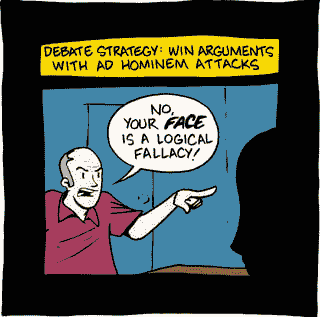

# 程序员惯例、实践和文化中的谬误:领域研究

> 原文：<https://dev.to/arturmartsinkovskyi/fallacies-in-programmers-routine-practice-and-culture-domain-study-1ddn>

人脑是一台复杂的机器，进化了几千年。它以最奇特的方式工作，让我们在感知、敏捷和脑力劳动方面都表现出色。它的一些功能有点粗糙。为了更有效率和花费更少的精力来完成任务，我们的头脑中有很多刻板印象和捷径。虽然它在大多数时候是有帮助的，但有时是绝对错误的，所以它会让你倾向于错误的决定，构建一个不正确的现实地图。你的感知镜头可能有缺陷，你收集信息的机制可能出现故障，你的映射可能非常不正确。

这种错误有一个名称。这个名字叫‘谬误’。谬误是被评价为逻辑上不正确的推理，它破坏了论证的逻辑有效性，并允许其被认为是不合理的。

像其他脑力劳动者一样，软件工程师需要大量的思考、分析和现实映射来完成他们的工作。在做这些过程时，我们的大脑有时会选择更短的路线来到达目的地，导致错误的决定或糟糕的计划。为了避免这种情况，最好了解自己的缺点。

思维过程是复杂的，多语境的，人们在思考的过程中可能陷入的谬误也是如此。虽然，有一些我认为对软件工程师来说很有趣。他们在这里:

*   涅槃谬误(完美解决方案谬误)——问题的解决方案因为不完美而被拒绝。这是有经验的开发人员常见的问题。他们知道事情应该如何发展，以及当前问题的最佳选择是什么，尽管从局外人的角度来看，这可能很耗时，也更难理解。整体解决方案是美丽和优雅的，但现实世界的截止日期和现实情况另有规定。引导完美主义者倾向于项目架构一致性、启动时间、环境、日志输出和其他正在进行的度量，比关注某一段特定的代码要好。尽管有人在建造大教堂，但我们大多数人都在福特的装配线上工作，在那里，适当的流程、同构和干净的工作场所赢得了胜利。

*   诉诸权威(来自权威的论点，argumentum ad verecundiam)——由于断言者的立场或权威，断言被认为是真实的。当解释软件开发、项目管理、运营等主题的实践或观点时，人们倾向于使用他人的说法、博客帖子、会议讨论或其他主张作为证明自己决策的基础。尽管它可能并不总是谬误的，但大多数情况下，添加更多适用于特定解决方案或项目的上下文论据比诉诸权威更好。

*   历史学家的谬误——假设过去的决策者从相同的角度看待事件，并拥有与后来分析决策的人相同的信息。当程序员处理遗留代码时，这种谬误经常出现。重要的是要记住，过去的决定不是由想做错事的人做的。最有可能的是，他们糟糕的编码标准、混乱的代码结构或混乱的库选择有一些合理的背景，或者与难以结构化的开发过程、不断变化的需求或不适当的期限有关。然而，显然也有一些非常糟糕的工程师。

*   误导性生动性——涉及生动详细地描述一个事件，即使它是一个例外事件，以使某人相信这是一个问题；这也依赖于诉诸情感的谬误。一些工程师可能会利用这种谬误，暴露他们工作中的所有技术细节来掩盖无能，并为未能及时推出功能辩护。最好根据实际情况和可能的结果来判断，而不仅仅是根据同事的解释。

*   生存偏差——在完全忽略大量失败的同时，积极宣传给定流程的少量成功。这一点对于那些有商业思维的人来说尤其重要，他们想开一家新公司或企业。他们倾向于学习著名公司的成功故事，这可能是一个例外，而不是一个规则。每年有成千上万的创业公司失败，只有少数存活下来并获得成功。