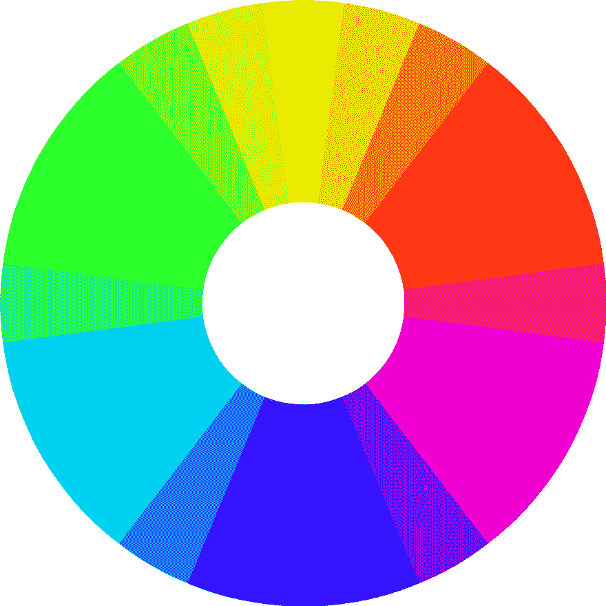
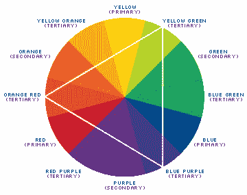
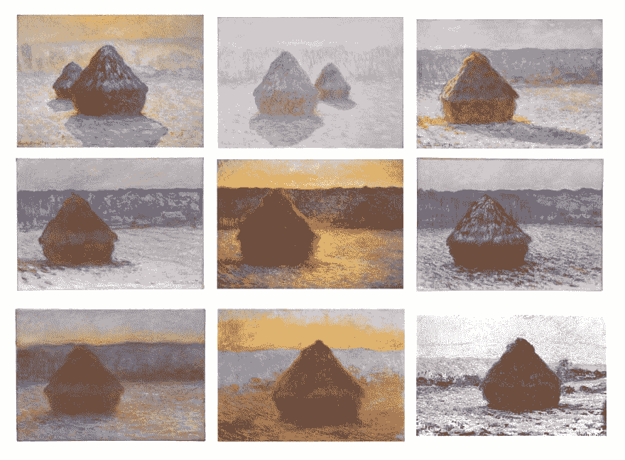
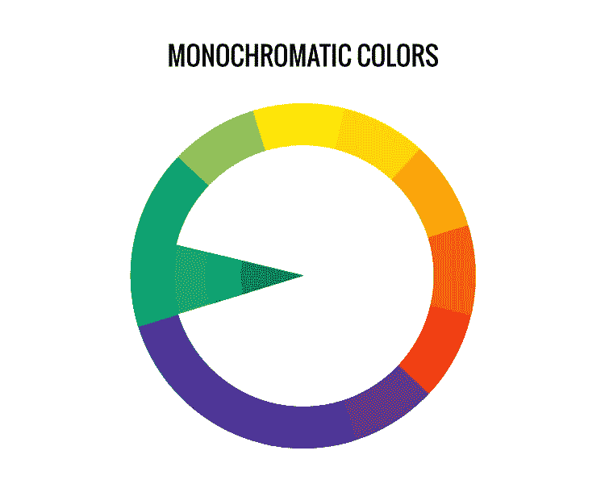
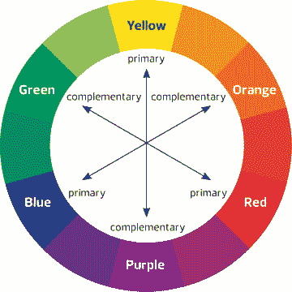

# 网页开发人员的基本色彩理论

> 原文：<https://dev.to/nikacodes/basic-color-theory-for-web-developers-15a0>

你很难找到一门墙上没有色轮的艺术课。如果你曾经上过艺术课，你可能已经通过自己创作一种颜料来接触颜料和混合颜料。

你会学到原色和二次色。如果你在小学毕业后继续学习艺术，甚至可能是三原色。

但是，除非你在高中或更高的水平上学习过艺术，否则你可能没有意识到色轮是展示颜色理论、混合颜色的实践和特定颜色组合的最简单的方法。

## 但是什么是色彩理论呢？

简要历史:当爱杜尔·马奈、埃德加·德加和克洛德·莫内(你可能听说过他们)等印象派画家开始尝试捕捉光线而不是完美的相似时，色彩理论出现了。

<figure>

<figcaption>Monet's Haystacks</figcaption>

</figure>

**简答**:归结到人眼如何将光波转化为颜色。匹配的颜色有相似或互补的波。

颜色理论可以进入光波科学，以及为什么颜色看起来是这样的。然而，出于本文的目的，我们将重点关注以下问题:

*   为什么某些颜色会搭配？
*   我如何挑选“正确”的颜色？

配色似乎是一种“要么有，要么没有”的事情。或者说，设计网页或应用程序最漫长、最痛苦的部分是决定使用哪种确切的绿色作为背景。

无论你有什么与颜色相关的苦恼，这里有一个小备忘单可以看看:

## 一级:单色

**单色**简单来说就是一种颜色的一种或多种深浅。

> **在 WebDev** 中:这是选择一个单独的[十六进制代码](https://www.w3schools.com/colors/colors_picker.asp)并在不影响色调的情况下使其变亮或变暗。

这是给网页上色最简单的方法。像脸书和 T2 推特这样的网站使用了(大部分)单色配色方案。黑色、白色和天蓝色，这种调色板是这些社交媒体应用程序易于使用的一部分。

唯一与众不同的颜色来自用户的头像、链接和照片，这些颜色可以被经常使用的用户识别，从而很容易通过他们喜欢的帐户找到帖子。

如果 Twitter 的网页上有更多的颜色，就很难区分不同的帖子和谁发布了什么。

一般来说，即使你想要多种颜色，最好有一种主色——可以作为背景色，也可以作为标题的主色。

> 提示:如果你的网页是单色的，确保每一种色调都很容易区分开来。否则，如果他们不能阅读文本或分离网页的元素，您的网页可能不是用户友好的。

## 二级:互补色

但是如果你想要的不仅仅是不同深浅的橙色呢？如果你想让你的链接突出，但又不与导航条或背景色冲突，该怎么办？

如果我们遵循基本的颜色理论，选择一种颜色作为直接强调的最好方法之一就是寻找一种互补的颜色。

在色轮的正对面可以找到与另一种颜色互补的颜色。

每种**原色**与一种**次色**相匹配作为它们的互补色。记住要匹配哪些颜色的一个简单方法是，**副**色与它不使用的**原色**相匹配。比如:红色的互补色是绿色，是由蓝色和黄色拼成的。

> **专业提示**:一次添加一种颜色，保持简单。不要为了一个完整的彩虹而牺牲一个干净、可用的布局。否则你可能会不小心转到经典的 90 年代网站，如[和](https://spacejam.com/)。

## 向上调平

当你对你的新兴设计技巧越来越熟悉的时候，你就可以挑战极限了。色彩不应该是可怕的工作。永远留意那些熟练运用色彩的开发者和设计师。问你喜欢它什么，不喜欢它什么，为什么。这就是你如何建立自己的品味和品牌。

## 网络开发黑客

用手头的十六进制代码/RBG 数字创建颜色组合/调色板。或者，如果你是 SASS 的粉丝，将它们存储在文件中，以便导入到更大的项目中。特别是如果你的工作是创建结构，而不是外观(外观是由其他人、客户或经理决定的)，那么就把这些颜色看作是占位符，使网站易于浏览。

只是要确保:

*   一切都可读。
*   链接，标题，任何你想强调的东西都明显不同于纯文本。
*   用户可以很容易地辨别网页的不同部分(例如，导航条、主要内容、分隔文章等。).

## 在线工具

*   [Palleton.com](http://paletton.com/)
*   [Coolors.co](https://coolors.co/)

大声呼叫 [Doug R. Thomas 先生](https://dev.to/ferkungamaboobo)获取以下链接:

*   [Color.Adobe.com](https://color.adobe.com/)
*   WebAIM -颜色对比检查器 -确保文本在背景下是可读的。
*   [科布利斯——色盲模拟器](https://www.color-blindness.com/coblis-color-blindness-simulator/)——用色盲过滤器测试布局截图，以确保你的内容对所有观众都可读。

## 继续阅读

希望读完这篇文章后，为你的网站、页面或应用程序选择颜色或调色板不再那么令人生畏。如果你对这个话题感兴趣，我强烈推荐[阅读更多关于这个话题的](https://www.colormatters.com/color-and-design/basic-color-theory)。我们只是真正触及了表面，但你可以进入[色调和阴影和更多的](https://99designs.com/blog/tips/the-7-step-guide-to-understanding-color-theory/)。

最终，当谈到颜色时，没有“错误”的答案，特别是如果你是为自己做一个项目。许多人认为品味是与生俱来的，但实际上它是看着成功的设计并从中获得灵感，尝试不同的组合，并找到最适合你和你的品牌的东西。祝你好运，去创造吧！