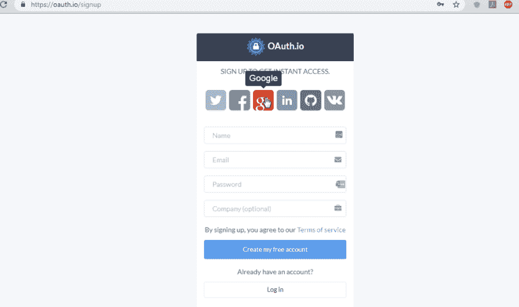
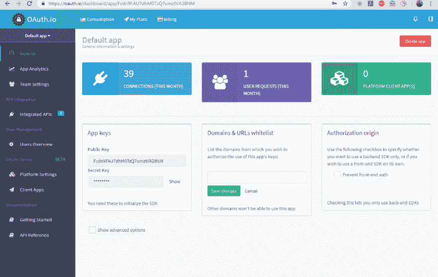
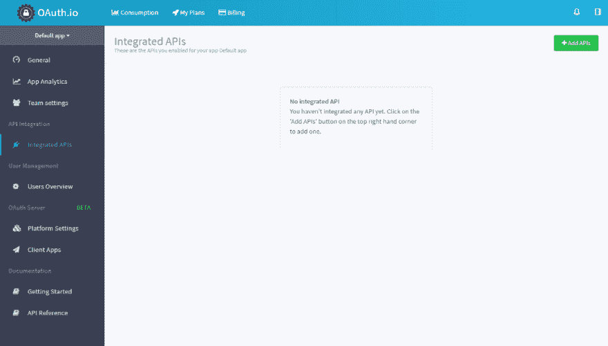
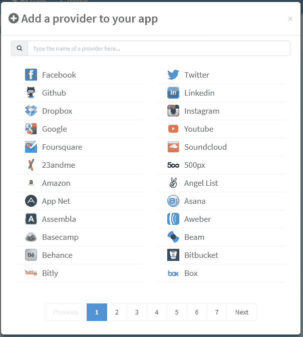
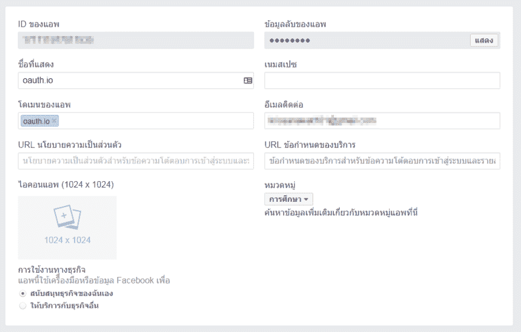
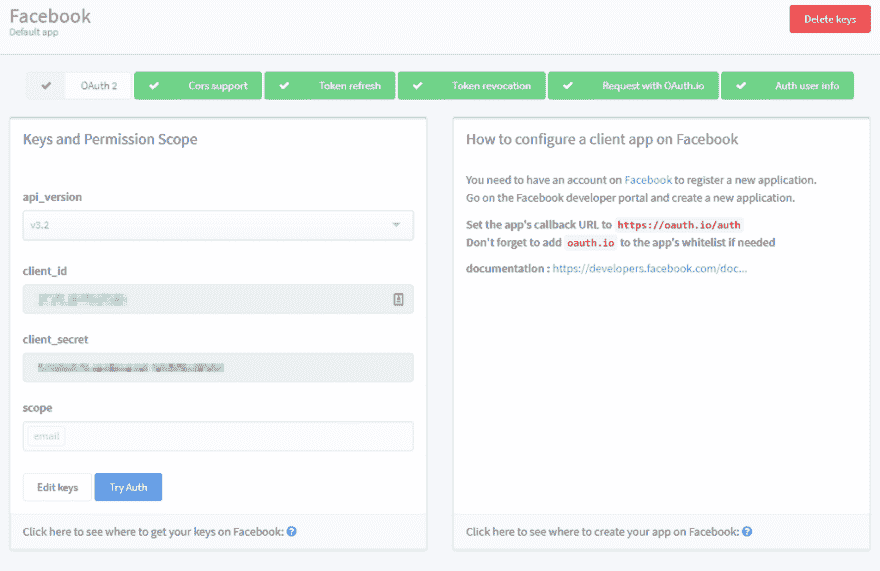
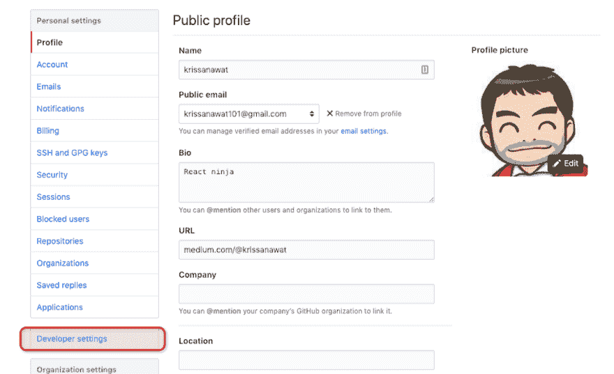
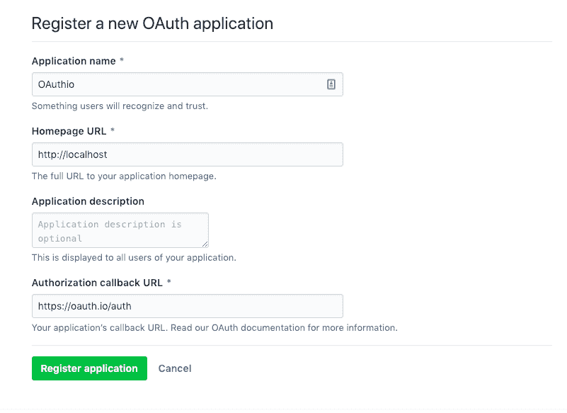
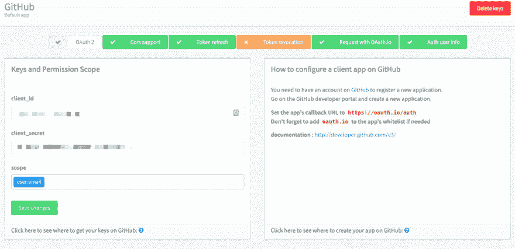
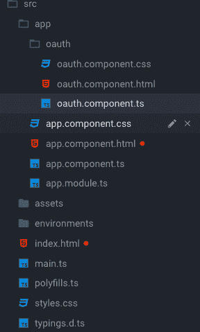

# 如何用 Oauth.io 创建一个简单的 OAuth 角度组件

> 原文：<https://dev.to/kris/how-to-create-a-simple-oauth-angular-component-with-oauthio-1e5h>

[](https://res.cloudinary.com/practicaldev/image/fetch/s--2H1vBAyu--/c_limit%2Cf_auto%2Cfl_progressive%2Cq_auto%2Cw_880/https://cdn-images-1.medium.com/max/1024/1%2AhqbjDPmFXcm-uXjR6GgXfw.png)

谁不想专注于创建产品而不是处理代码中的 OAuth 逻辑呢？将代码中的 OAuth 占用减少到一个请求！

在这篇文章中，我们将在 Angular 中用 [OAuth.io](https://oauth.io?utm_source=medium&utm_medium=post&utm_content=krissanawat&utm_campaign=oauthio-angularjs) 创建一个简单的 OAuth 组件。更容易使用 5 线

[](https://res.cloudinary.com/practicaldev/image/fetch/s--ISL5wVGj--/c_limit%2Cf_auto%2Cfl_progressive%2Cq_auto%2Cw_880/https://cdn-images-1.medium.com/max/1024/1%2AR3h8Mx4qcMOA7M79Nf9j7g.png)

#### 设置 OAuth.io 用户

在 Oauth.io 注册，免费！

[](https://res.cloudinary.com/practicaldev/image/fetch/s--vzlMnn-T--/c_limit%2Cf_auto%2Cfl_progressive%2Cq_auto%2Cw_880/https://cdn-images-1.medium.com/max/1024/1%2ArTy_GtdeT73XwMbve0yfwg.png)

登录后，您将进入如下所示的仪表板。

[](https://res.cloudinary.com/practicaldev/image/fetch/s--FU9TjWd7--/c_limit%2Cf_auto%2Cfl_progressive%2Cq_auto%2Cw_880/https://cdn-images-1.medium.com/max/1024/1%2AgnKQjLS0NnZ-3hIEaL8X1A.png)

您可以尝试任何集成，但首先要设置集成的 API。

### 添加 API

点击添加 API。

[](https://res.cloudinary.com/practicaldev/image/fetch/s--h8q1xqhM--/c_limit%2Cf_auto%2Cfl_progressive%2Cq_auto%2Cw_880/https://cdn-images-1.medium.com/max/1024/1%2AJilVHXNjaxNppV5W8ZSEVA.png)

选择脸书作为应用程序的提供商。

[](https://res.cloudinary.com/practicaldev/image/fetch/s--mGk47msD--/c_limit%2Cf_auto%2Cfl_progressive%2Cq_auto%2Cw_880/https://cdn-images-1.medium.com/max/605/1%2A9VX-OCgYs1x1ODen8VukFw.png)

现在，您需要 client_id 和 client_secret。因此，创建一个脸书应用程序来获取这些凭证。

[](https://res.cloudinary.com/practicaldev/image/fetch/s--FyzA9XXw--/c_limit%2Cf_auto%2Cfl_progressive%2Cq_auto%2Cw_880/https://cdn-images-1.medium.com/max/1024/1%2AQq2UeIwpy0hdKyfs-bVacg.png)

转到[https://developers.facebook.com](https://developers.facebook.com)创建一个应用程序，并插入 oauth.io 作为应用程序的域。

[](https://res.cloudinary.com/practicaldev/image/fetch/s--c5Dmrp2B--/c_limit%2Cf_auto%2Cfl_progressive%2Cq_auto%2Cw_880/https://cdn-images-1.medium.com/max/983/1%2AAr4YNmOvpaJ8jegUxgHDVg.png)

将回拨 URI 添加为 oauth.io/auth

[](https://res.cloudinary.com/practicaldev/image/fetch/s--nVu1UEzq--/c_limit%2Cf_auto%2Cfl_progressive%2Cq_auto%2Cw_880/https://cdn-images-1.medium.com/max/971/1%2Aqt_lmdY4h9dXDf6r963Bsw.png)

将 id 和秘密放入 OAuth.io 的表单中。

[](https://res.cloudinary.com/practicaldev/image/fetch/s--R2njWmqc--/c_limit%2Cf_auto%2Cfl_progressive%2Cq_auto%2Cw_880/https://cdn-images-1.medium.com/max/1024/1%2ADPGZKxFh3eGG7BlakFFk9A.png)

点击保存，你也可以添加更多的 API。让我们先利用脸书 API。

[](https://res.cloudinary.com/practicaldev/image/fetch/s--S6725acZ--/c_limit%2Cf_auto%2Cfl_progressive%2Cq_auto%2Cw_880/https://cdn-images-1.medium.com/max/1024/1%2AwAfILm_KlKIXdJpYIOymow.png)

Github 的第二个服务是

转到[开发者设置](https://github.com/settings/developers)

[](https://res.cloudinary.com/practicaldev/image/fetch/s--lF0pe9mv--/c_limit%2Cf_auto%2Cfl_progressive%2Cq_auto%2Cw_880/https://cdn-images-1.medium.com/max/1024/1%2AAh0JPt1AagAaYNfrYBiRuw.png)

创建新应用程序

[](https://res.cloudinary.com/practicaldev/image/fetch/s--RKhRugCz--/c_limit%2Cf_auto%2Cfl_progressive%2Cq_auto%2Cw_880/https://cdn-images-1.medium.com/max/1024/1%2AqHHjSFngsbwG8akJ5gBA1A.png)

填写应用信息

[](https://res.cloudinary.com/practicaldev/image/fetch/s--wnedEvL1--/c_limit%2Cf_auto%2Cfl_progressive%2Cq_auto%2Cw_880/https://cdn-images-1.medium.com/max/801/1%2AAsWSpMCmCSxh63ITB67jHQ.png)

复制应用程序 id 和应用程序密码

[](https://res.cloudinary.com/practicaldev/image/fetch/s--StGk3gXh--/c_limit%2Cf_auto%2Cfl_progressive%2Cq_auto%2Cw_880/https://cdn-images-1.medium.com/max/1024/1%2ATJgKHTdopOddyA00lS0Gyw.png)

我们得到两种服务

[](https://res.cloudinary.com/practicaldev/image/fetch/s--WI_jcbqQ--/c_limit%2Cf_auto%2Cfl_progressive%2Cq_auto%2Cw_880/https://cdn-images-1.medium.com/max/1024/1%2AChSRAQ0fVsF4pBgAh87HVw.png)

### 创建一个角度组件

创建角度组件以使用 Oauth.io SDK。oauth.io 的文档位于 [http://docs.oauth.io](http://docs.oauth.io/)

为了快速演示，我将使用 Codesandbox 准备一个小组件。

[](https://res.cloudinary.com/practicaldev/image/fetch/s--Nertx7tX--/c_limit%2Cf_auto%2Cfl_progressive%2Cq_auto%2Cw_880/https://cdn-images-1.medium.com/max/288/1%2A3eLL_rJjo-LGBkGYWKb9Jw.png)

1.  打开 oauth.component.css 并导入必要的 css

```
@import "https://cdnjs.cloudflare.com/ajax/libs/twitter-bootstrap/3.4.0/css/bootstrap.css";
@import "https://cdnjs.cloudflare.com/ajax/libs/bootstrap-social/5.1.1/bootstrap-social.min.css";
@import "https://stackpath.bootstrapcdn.com/font-awesome/4.7.0/css/font-awesome.min.css"; 
```

1.  打开 oauth.component.ts 并导入必要的类

```
import { Component, Input } from "@angular/core";

import { OAuth } from "oauthio-web"; 
```

1.  用名称选择器构造组件并包含一个模板文件

```
@Component({
  selector: "oauth",
  templateUrl: "./oauth.component.html",
  styleUrls: ["./oauth.component.css"]

}) 
```

1.  创建类和属性来存储与属性一起传递的服务名

```
**export**  **class** OauthComponent {
  @Input() provider: string;
} 
```

1.  从 OAuth.io 仪表板初始化 OAuth-io SDK 并添加 API-key

```
**constructor** () {
    OAuth.initialize("Fcdn9FAU7dhM0TzQ7umztVA28NM");
  } 
```

1.  创建 OAuth 处理程序方法

```
Auth() {
    OAuth.popup( **this**.provider)
      .done(res => {
        console.log(res.access\_token);
      })
      .fail(err => {
_//todo when the OAuth flow failed_
      });
  } 
```

1.  添加一个登录按钮和类，事件句柄到 oauth.component.html，并连接属性和类

```
<a (click)="Auth();" class="btn btn-block btn-social btn-{{provider}}">
<span class="fa fa-{{provider}}"></span> Sign in with {{ provider }}
</a> 
```

1.  在 app.module.ts 中导入并注册此组件

```
import { BrowserModule } from "@angular/platform-browser";
import { NgModule } from "@angular/core";

import { AppComponent } from "./app.component";
**import { OauthComponent } from "./oauth/oauth.component";**
@NgModule({
  declarations: [AppComponent, **OauthComponent**],
  imports: [BrowserModule],
  providers: [],
  bootstrap: [AppComponent]
})
export class AppModule {} 
```

1.  最后，通过放置在 app.component.html 来激活组件

```
<div class="container">
<div class="row">
<h1>Social login with OAuth.io</h1>
<div class="row">
<div class="col-sm-4 col-md-offset-4">
<oauth provider='facebook'></oauth>
<hr>
<oauth provider='github'></oauth>
</div>
</div>
</div> 
```

在 Codesandbox 上查看实时结果

[https://medium . com/media/aed 8 af cfe 1 ebfc 128984 f 57c 40319748/href](https://medium.com/media/aed8afcfe1ebfc128984f57c40319748/href)

### 包装完毕

本教程到此为止！

我们创建了一个有角度的 OAuth 组件，使用 [OAuth.io](https://oauth.io?utm_source=medium&utm_medium=post&utm_content=krissanawat&utm_campaign=oauthio-angularjs) 呈现一个简单的脸书和 Github 登录选项

希望你玩得开心，随时评论和询问任何事情。鼓掌表示支持！

[](https://medium.com/swlh)

#### 这篇故事发表在 [The Startup](https://medium.com/swlh) ，Medium 最大的创业刊物，拥有+415678 人关注。

#### 订阅接收[我们这里的头条](http://growthsupply.com/the-startup-newsletter/)。

[](https://medium.com/swlh)

* * *