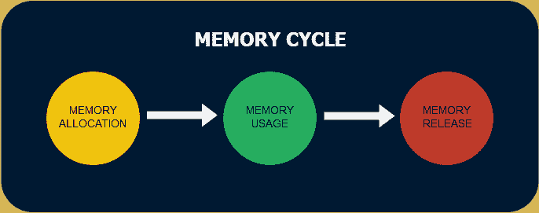
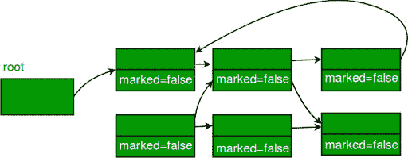
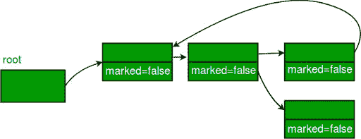
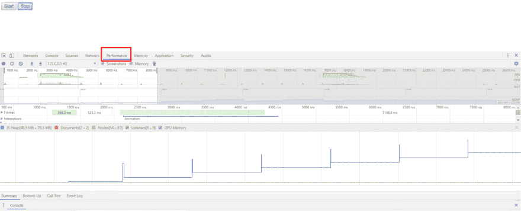
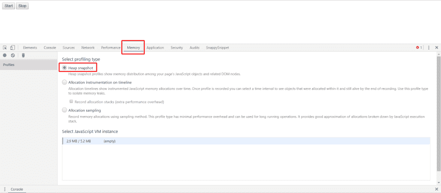
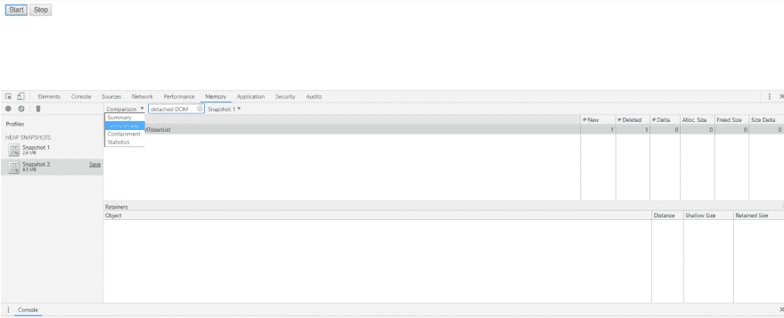

# 根除 JavaScript 中的内存泄漏

> 原文：<https://dev.to/lambdatest/eradicating-memory-leaks-in-javascript-1af9>

如果您想知道为什么您的 JavaScript 应用程序可能会遭受严重的速度变慢、性能下降、高延迟或频繁崩溃，并且您所有解决问题的努力都没有效果，那么您的代码很有可能受到“内存泄漏”的困扰。内存泄漏是相当常见的，因为在现代高级编程语言如 JavaScript 中，由于对自动内存分配和释放的误解，内存管理经常被开发人员忽视。未能处理 JavaScript 内存泄漏会对应用程序的性能造成严重破坏，并使其无法使用。互联网上充斥着永无止境的复杂行话，你通常很难理解。因此，在本文中，我们将采取全面的方法来理解什么是 JavaScript 内存泄漏，其原因以及如何使用 chrome 开发工具轻松发现和诊断它们。

### 什么是 JavaScript 内存泄漏？

内存泄漏可以定义为应用程序不再使用或需要的一块内存，但由于某种原因没有归还给操作系统，并且仍然被不必要的占用。在代码中创建对象和变量会消耗内存。JavaScript 足够聪明，可以判断出何时不再需要该变量，并会清除它以节省内存。当您可能不再需要某个对象，但 JS 运行时仍然认为您需要时，就会发生 JavaScript 内存泄漏。另外，记住 JavaScript 内存泄漏不是由无效代码引起的，而是代码中的逻辑缺陷。它通过减少可用于执行任务的内存量来降低应用程序的性能，并最终导致崩溃或冻结。

在深入研究内存泄漏之前，对内存周期、内存管理系统和垃圾收集器算法有一个良好的理解是至关重要的。

### 什么是记忆周期？

“存储器”由一系列触发器组成，这是一个由 4 到 6 个晶体管组成的双态(0 & 1)电路。一旦触发器存储了一个位，它将继续保留它，直到用相反的位重写它。因此，记忆只不过是一组可重新编程的位。程序中使用的每一条数据都存储在内存中。

存储器周期是一个存储器单元从空闲/自由状态经过使用(读或写)阶段并回到空闲状态的完整事件序列。记忆周期可以大致分为 3 个主要步骤:
[](https://res.cloudinary.com/practicaldev/image/fetch/s--0gNl_aqO--/c_limit%2Cf_auto%2Cfl_progressive%2Cq_auto%2Cw_880/https://www.lambdatest.com/blog/wp-content/uploads/2018/12/1.png)

1.  内存分配:在程序执行期间，操作系统根据需要将内存分配给程序。在像 C 和 C++这样的低级语言中，这一步是由程序员处理的，但是在像 JavaScript 这样的高级语言中，这是由自动内存管理系统自己完成的。JavaScript 中内存分配的一些例子

    ```
    var n = 5; // allocates memory for a number
       var s = 'Hello World'; // allocates memory for a string
       var obj = { // allocates memory for an object
           a: 100,
           b: "some string",
           c: null,
       };
       var arr = [100, "some string", null]; // allocates memory for the array
       function foo(x, y) { // allocates memory for a function
           return x * y;
       }
    ```

2.  内存使用:程序在分配的内存上执行读写功能。这可以是读取或写入变量、对象的值，甚至是向函数传递参数。

3.  内存释放:当任务完成并且不再需要分配的内存时，它将被释放并用于新的分配。

记忆循环的第三步是复杂之处。这里最困难的挑战是确定什么时候“不再需要分配的内存，应该释放它”。这就是内存管理系统和它们的垃圾收集器算法的用处。

### 内存管理系统—[手动 vs 自动](https://www.lambdatest.com/blog/difference-between-manual-and-automation-testing/)

内存管理是在执行过程中根据程序的请求将内存块分配给各种程序，并在不再需要时释放内存块进行重新分配的过程。不同的编程语言根据其复杂性使用不同的方法来处理内存管理。

*   Pascal、C 和 C++等低级语言具有手动内存管理系统，程序员必须在需要时手动/显式分配内存，然后在程序使用完内存后释放内存。例如，C 使用 malloc()和 calloc()来保留内存，使用 realloc()将保留的内存块移动到另一个分配，使用 free()将内存释放回系统。
*   JavaScript 和 VB 等高级编程语言有一个自动化系统，每当您创建一个实体(如对象、数组、字符串或 DOM 元素)时，它都会分配内存，并在不再使用时通过一个称为垃圾收集的过程自动释放内存。当程序仍在消耗内存时，就会发生内存泄漏，理想情况下，应该在给定任务完成后释放内存。由于某种原因，垃圾收集器无法达到它的目的，程序拒绝释放内存，内存继续被消耗，而不需要它发生。

### 垃圾收集者

垃圾收集器执行查找程序不再使用的内存并将其释放回操作系统以备将来重新分配的过程。为了找到不再使用的内存，垃圾收集器依靠算法。尽管垃圾收集方法非常有效，但 JavaScript 内存泄漏仍然有可能发生。这种泄漏的主要原因通常是“不需要的参考”。其主要原因是垃圾收集过程是基于估计或推测的，因为是否需要释放一些内存的复杂问题无法由算法在每个实例中正确确定。

在继续之前，让我们看一下两个最广泛使用的 GC 算法

正如我们前面讨论的，任何垃圾收集算法都必须执行两个基本功能。它必须能够检测所有不再使用的内存，其次，它必须释放/解除分配垃圾对象所使用的空间，并在将来需要时使其再次可供重新分配。

两种最流行的算法是:

1.  引用计数
2.  标记和扫描

### 引用计数算法

这个算法依赖于“引用”的概念。它基于计算一个对象被其他对象引用的次数。每次创建对象或分配对该对象的引用时，其引用计数都会增加。在 JavaScript 中，每个对象都有一个对其原型的隐式引用和对其属性值的显式引用。

引用计数算法是最基本的垃圾收集器算法，它将“不再需要一个对象”的定义简化为“一个对象没有其他对象引用它”。一个对象被认为是垃圾可收集的，如果没有指向它的引用，它就不再被使用。

```
<script>
       var o = { // 2 objects are created. One is referenced by the other as one of its properties.
           a: { // The other is referenced by virtue of being assigned to the 'o' variable.
               b: 2; // Obviously, none can be garbage-collected
           }
       };

       var o2 = o; // the 'o2' variable is the second thing that has a reference to the object
       o = 1; // now, the object that was originally in 'o' has a unique reference embodied by the 'o2' variable
       var oa = o2.a; // reference to 'a' property of the object.This object now has 2 references: one as a property,
       // the other as the 'oa' variable
       o2 = 'yo'; // The object that was originally in 'o' has now zero references to it. It can be garbage-collected.
       // However its 'a' property is still referenced by the 'oa' variable, so it cannot be freed
       oa = null; // The 'a' property of the object originally in o has zero references to it. It can be garbage collected.
       };
</script>
```

**参考计数算法的缺点**
然而，在循环的情况下，参考计数算法有很大的局限性。循环是两个对象通过相互引用而创建的实例。由于这两个对象的引用计数至少为 1(彼此至少引用一次)，因此垃圾收集器算法不会收集它们，即使它们不再被使用。

```
<script>
       function foo() {
           var obj1 = {};
           var obj2 = {};
           obj1.x = obj2; // obj1 references obj2
           obj2.x = obj1; // obj2 references obj1

           return true;
       }
       foo();
</script>
```

### 标记-清除算法

与引用计数算法不同，标记-清除将“不再需要某个对象”的定义简化为“某个对象不可达”，而不是“不被引用”。在 JavaScript 中，全局对象被称为“根”。

垃圾收集器将首先找到所有根对象，并将所有引用映射到这些全局对象并引用这些对象，依此类推。使用这种算法，垃圾收集器识别所有可到达的对象，垃圾收集器收集所有不可到达的对象。

**标记和清除算法分两个阶段工作:**

1.  **标记阶段**每次创建对象时，其标记位被设置为 0(假)。在标记阶段，每个“可到达”对象的标记位被改变并设置为 1(真)
2.  **扫描阶段**所有那些在标记阶段后标记位仍设置为 0(假)的对象都是不可到达的对象，因此它们被算法垃圾收集并从内存中释放。

所有对象最初将其标记位设置为 0(假)
[](https://res.cloudinary.com/practicaldev/image/fetch/s--63GnNUsl--/c_limit%2Cf_auto%2Cfl_progressive%2Cq_auto%2Cw_880/https://www.lambdatest.com/blog/wp-content/uploads/2018/12/unnamed.jpg) 
所有可达对象将其标记位更改为 1(真)
[](https://res.cloudinary.com/practicaldev/image/fetch/s--eJ7LU_1E--/c_limit%2Cf_auto%2Cfl_progressive%2Cq_auto%2Cw_880/https://www.lambdatest.com/blog/wp-content/uploads/2018/12/5.jpg) 
不可达对象从内存中清除。
[](https://res.cloudinary.com/practicaldev/image/fetch/s--QExK1cVa--/c_limit%2Cf_auto%2Cfl_progressive%2Cq_auto%2Cw_880/https://www.lambdatest.com/blog/wp-content/uploads/2018/12/7.jpg)

**标记-清除算法的优点**
与引用计数算法不同，标记-清除算法处理循环。循环中的两个对象没有被任何可从根到达的对象引用。它们被垃圾收集器认为是不可到达的，并被清除掉。

**标记-清除算法的缺点**
这种方法的主要缺点是当垃圾收集器算法运行时程序执行被挂起。

### JavaScript 内存泄漏的原因

防止 JavaScript 内存泄漏的最大关键在于理解不需要的引用是如何创建的。根据这些无用引用的性质，我们可以将内存资源分为 7 种类型:

1.  **未声明/意外的全局变量** JavaScript 有两种作用域——局部作用域和全局作用域。作用域决定了运行时变量、函数和对象的可见性。
2.  局部作用域的变量只能在它们的局部作用域(定义它们的地方)内访问和可见。局部变量被称为具有“函数作用域”:它们只能从函数内部被访问。

    ```
    <script>
       // Outside myFunction() variable ‘a’ cannot be accessed
       function myFunction() {
           var a = "This is a local scope variable";
           // variable ‘a’ is accessible only inside myFunction()
       }
    </script>
    ```

*   另一方面，JavaScript 文档中的所有脚本和函数都可以访问全局变量。当您开始在文档中编写 JavaScript 时，您已经在全局范围内了。与局部作用域不同，整个 JavaScript 文档中只有一个全局作用域。所有全局变量都属于窗口对象。如果你给一个以前没有声明的变量赋值，它将自动成为一个“全局变量”。

    ```
    <script>
       // variable ‘a’ can be accessed globally
       var a = "This is a global variable";

       function myFunction() {
           // the variable a is accessible here inside the myFunction() as well
       }
    </script>
    ```

###### 意外全局变量案例:

如果在没有事先声明的情况下给变量赋值，将会创建一个“自动”或“意外”全局变量。这个例子将声明一个全局变量 a，即使它在函数中被赋值。

```
<script>
       // variable ‘a’ has global scope
       function myFunction() {
           a = "this is an accidental global variable";
           // variable ‘a’ is global as it has been assigned a value without prior declaration
       }
</script>
```

解决方案:根据定义，全局变量不会被垃圾收集器清除。这就是为什么作为 JavaScript 程序员的最佳实践，谨慎使用全局变量总是至关重要的，并且永远不要忘记在使用全局变量后将其置空或重新赋值。在上面的例子中，在函数调用后将全局变量 a 设置为 null。另一种方法是使用“严格”模式来解析 JS 代码。这将防止创建未声明的意外全局变量。另一种方法是用' let '代替' var '进行变量声明。Let 有一个块作用域。它的范围限于一个块、一条语句或一个表达式。这与 var 关键字不同，后者全局定义变量。

1.  **关闭**

闭包是函数和声明该函数的词法环境的组合。闭包是内部(封闭的)函数，它可以访问外部(封闭的)函数的变量(作用域)。此外，内部函数将继续访问外部函数的范围，即使在外部函数执行之后。

如果在外部函数中声明了一个变量，而该变量对嵌套的内部函数自动可用，并且即使嵌套函数中没有使用/引用该变量，该变量也会继续驻留在内存中，那么在闭包中就会发生内存泄漏。

```
<script>
   var newElem;

   function outer() {
       var someText = new Array(1000000);
       var elem = newElem;

       function inner() {
           if (elem) return someText;
       }

       return function () {};
   }

   setInterval(function () {
       newElem = outer();
   }, 5);
</script>
```

在上面的例子中，函数 inner 从来没有被调用过，但是保留了对 elem 的引用。但是由于闭包中的所有内部函数共享相同的上下文，inner(第 7 行)与由 outer function 返回的 function(){}(第 12 行)共享相同的上下文。现在，每隔 5 毫秒，我们对 outer 进行一次函数调用，并将其新值(在每次调用后)赋给全局变量 newElem。只要引用指向这个函数(){}，共享的作用域/上下文就会被保留，someText 也会被保留，因为它是内部函数的一部分，即使内部函数从未被调用。每次我们调用 outer 时，我们都将以前的函数(){}保存在新函数的 elem 中。因此，必须再次保持先前的共享范围/上下文。所以在 outer 函数的第 n 次调用中，outer 的第(n-1)次调用的某些文本不能被垃圾收集。这个过程会一直持续下去，直到您的系统最终耗尽内存。

解决方案:这种情况下出现问题是因为对函数(){}的引用保持活动状态。实际调用外层函数不会出现 JavaScript 内存泄漏(像 newElem = outer()()那样调用第 15 行的外层函数；).由闭包导致的一个小的孤立的 JavaScript 内存泄漏可能不需要任何注意。然而，随着每次迭代而重复和增长的周期性泄漏会严重损害代码的性能。

1.  **Detached DOM/Out of DOM reference**Detached DOM 或 Out of DOM reference 表示已经从 DOM 中移除但仍通过 JavaScript 保留在内存中的节点。这意味着只要还有对某个变量或对象的引用，该对象即使从 DOM 中移除也不会被垃圾收集。

DOM 是一个双向链接的树，引用树中的任何节点都会阻止整个树进行垃圾收集。让我们举一个例子，在 JavaScript 中创建一个 DOM 元素，然后在某个时候删除这个元素(或者它的父元素),但是忘记删除保存它的变量。这导致了一个分离的 DOM，它不仅包含对 DOM 元素的引用，还包含对整个树的引用。

```
<script>
       var demo = document.createElement("p");
       demo.id = "myText";
       document.body.appendChild(demo);
       var lib = {
           text: document.getElementById('myText')
       };

       function createFunction() {
           lib.text.innerHTML = "hello World";
       }
       createFunction();

       function deleteFunction() {
           document.body.removeChild(document.getElementById('myText'));
       }
       deleteFunction();
</script>
```

即使从 DOM 中删除了#myText，我们在全局 lib 对象中仍然有一个对#myText 的引用。这就是为什么它不能被垃圾收集器释放，并将继续消耗内存。这是必须通过调整代码来避免的另一种内存泄漏情况。

解决方案:作为 JavaScript 的最佳实践，一种常见的方法是将 var demo 放在侦听器中，这使它成为一个局部变量。删除演示时，对象的路径会被切断。垃圾收集器可以释放这个内存。

1.  定时器 JavaScript 中有两个定时事件，即 setTimeout 和 setInterval。“setTimeout()”在等待指定的毫秒数后执行函数，而“setInterval()”执行一些操作，但不断重复执行函数。setTimeout()和 setInterval()都是 HTML DOM Window 对象的方法。JavaScript 计时器是内存泄漏最常见的原因，因为它们的使用非常普遍。

考虑下面的 JavaScript 代码，它涉及计时器，会造成内存泄漏。

```
<script>
       for (var i = 0; i < 100000; i++) {
           var buggyObject = {
               callAgain: function() {
                   var ref = this;
                   var val = setTimeout(function() {
                       ref.callAgain();
                   }, 1000000);
               }
           }
           buggyObject.callAgain();
           buggyObject = null;
       }
</script>
```

计时器回调及其绑定对象，buggyObject 将不会被释放，直到超时发生。在这种情况下，timer 会重置自己并永远运行，因此它的内存空间将永远不会被回收，即使没有对原始对象的引用..

解决方案:为了避免这种情况，坚持 JavaScript 最佳实践，在 setTimeout/setInterval 调用中提供引用，例如函数需要在被垃圾收集之前执行和完成。一旦你不再需要它们，就明确地要求删除它们。除了像 Internet Explorers 这样的老浏览器，大多数现代浏览器如 chrome 和 firefox 都不会面临这个问题。像 jQuery 这样的库也在内部处理它，以确保不会产生 JavaScript 内存泄漏。

1.  旧浏览器和错误的扩展
    旧浏览器尤其是 IE6-7 因制造内存泄漏而臭名昭著，因为它们的垃圾收集器算法不能处理 DOM 对象和 JavaScript 对象之间的循环引用。有时有缺陷的浏览器扩展也可能是泄漏的原因。比如 firefox 中的 FlashGot 扩展就曾经造成过内存泄漏。

2.  addEventListener()方法将一个事件处理程序附加到一个特定的元素上。您可以向单个元素添加多个事件处理程序。有时，如果一个 DOM 元素和它对应的事件侦听器没有相同的生命周期，这可能会导致内存泄漏。

3.  被重复使用的大型表、数组和列表中的对象被存储在缓存中。大小无限增长的缓存会导致高内存消耗，因为它不能被垃圾收集。为了避免这种情况，请确保为其大小指定一个上限。

### 使用 Chrome DevTools 寻找 JavaScript 内存泄漏

在这一节中，我们将学习如何使用 Chrome DevTools 来识别代码中的 JavaScript 内存泄漏，方法是利用以下三种开发工具:

1.  时间轴视图
2.  堆内存分析器
3.  分配时间线(或分配分析器)

首先打开你选择的代码编辑器，用下面的代码创建一个 HTML 文档，然后在 chrome 浏览器中打开它。

```
<html>
<head>
   <!------ JQuery 3.3.1 ------>
   <script src="https://code.jquery.com/jquery-3.3.1.min.js" integrity="sha256-FgpCb/KJQlLNfOu91ta32o/NMZxltwRo8QtmkMRdAu8=" crossorigin="anonymous"></script>
</head>

<body>

   <button id="leak-button">Start</button>
   <button id="stop-button">Stop</button>

   <script>
       var foo = [];
       function grow() {
           foo.push(new Array(1000000).join('foo'));
           if (running)
               setTimeout(grow, 2000);
       }
       var running = false;

       $('#leak-button').click(function () {
           running = true;
           grow();
       });

       $('#stop-button').click(function () {
           running = false;
       });
   </script>

</body>
</html>
```

当单击“开始”按钮时，它将调用 grow()函数，该函数将追加一个 1000000 字符长的字符串。变量 foo 是一个全局变量，它不会被垃圾收集，因为 grow()函数每秒都会递归调用它。单击“停止”按钮会将运行标志更改为 false，以停止递归函数调用。每次函数调用结束时，垃圾收集器都会释放内存，但不会收集变量 foo，从而导致内存泄漏。

1.  **时间线视图**我们将用于识别内存泄漏的第一个 Chrome 开发工具叫做“时间线”。时间线是你的代码活动的集中概述，它帮助你分析在加载、脚本、渲染等方面花费的时间。您可以使用 timeline recording 选项可视化您的内存泄漏，并比较垃圾收集前后的内存使用数据。

*   第一步:在 Chrome 浏览器中打开我们的 HTML 文档，按 Ctrl+Shift+I 打开开发者工具。
*   第二步:点击 performance 选项卡，打开 timeline overview 窗口。单击 Ctrl+E 或单击“录制”按钮开始时间轴录制。打开你的网页，点击“开始按钮”。
*   第三步:等待 15 秒钟，然后点击网页上的“停止按钮”。等待 10 秒钟，然后单击右侧的垃圾图标，手动触发垃圾收集器并停止记录。

[](https://res.cloudinary.com/practicaldev/image/fetch/s--o5Yphxii--/c_limit%2Cf_auto%2Cfl_progressive%2Cq_auto%2Cw_880/https://www.lambdatest.com/blog/wp-content/uploads/2018/12/dev-tools-1.png)

正如你在上面的截图中看到的，内存使用随着时间的推移而增加。每一个尖峰都表明了 grow 函数何时被调用。但是在函数执行结束后，垃圾收集器会清除除全局 foo 变量之外的大部分垃圾。它不断增加更多的内存，甚至在程序结束后，内存使用量最终没有下降到初始状态。

1.  堆内存分析器“堆内存分析器”显示 JavaScript 对象和相关 DOM 节点的内存分布。使用它来拍摄堆快照、分析内存图、比较快照数据和查找内存泄漏。

*   第一步:按 Ctrl+Shift+I 打开 Chrome Dev Tools，点击内存面板。
*   第 2 步:选择“堆快照”选项，然后单击开始。

[](https://res.cloudinary.com/practicaldev/image/fetch/s--oL4780jL--/c_limit%2Cf_auto%2Cfl_progressive%2Cq_auto%2Cw_880/https://www.lambdatest.com/blog/wp-content/uploads/2018/12/dev-tools-3.png)

*   第三步:点击你的网页上的开始按钮，并选择左上方的内存面板下的记录堆快照按钮。等待 10-15 秒，然后点击网页上的关闭按钮。继续拍摄第二个堆快照。

[](https://res.cloudinary.com/practicaldev/image/fetch/s--AXoQoD0V--/c_limit%2Cf_auto%2Cfl_progressive%2Cq_auto%2Cw_880/https://www.lambdatest.com/blog/wp-content/uploads/2018/12/dev-tools-2.png)

*   步骤 4:从下拉列表中选择“比较”选项，而不是“摘要”，并搜索分离的 DOM 元素。这将有助于识别 DOM 之外的引用。在我们的示例中没有(我们示例中的内存泄漏是由于全局变量造成的)。

1.  **分配时间线/分析器**分配分析器将堆内存分析器的快照信息与时间线面板的增量跟踪相结合。该工具在整个记录过程中定期拍摄堆快照(频率高达每 50 毫秒！)和在记录结束时的一个最终快照。研究生成的图形，找出可疑的内存分配。

在新版 chrome 中，“个人资料”标签已经被移除。现在，您可以在“内存”面板而不是“配置文件”面板中找到分配分析器工具。

*   第一步:按 Ctrl+Shift+I 打开 Chrome Dev Tools，点击内存面板。
*   步骤 2:选择“时间线上的分配工具”选项，然后单击“开始”。
*   步骤 3:单击并记录，然后等待分配分析器定期自动拍摄快照。分析生成的图形，找出可疑的内存分配。

### 通过修改代码来消除内存泄漏

既然我们已经成功地使用 chrome 开发人员工具来识别代码中的内存泄漏，我们需要调整代码来消除这种泄漏。

正如前面在“内存泄漏的原因”一节中所讨论的，我们看到了垃圾收集器如何从不处理全局变量，尤其是当它们被函数递归调用时。我们有三种方法可以修改代码:

1.  不再需要全局变量 foo 后，将其设置为 null。
2.  对变量 foo 声明使用“let”而不是“var”。与 var 不同，Let 有一个块范围。它将被垃圾收集。
3.  将 foo 变量和 grow()函数声明放在 click 事件处理程序中。

    ```
    <script>
       var running = false;

       $('#leak-button').click(function () {
           /* Variable foo and grow function are now decalred inside the click event handler. They no longer have global scope. They now have local scope and therefore will not lead to memory leak*/
           var foo = [];

           function grow() {
               foo.push(new Array(1000000).join('foo'));
               if (running)
                   setTimeout(grow, 2000);
           }
           running = true;
           grow();
       });

       $('#stop-button').click(function () {
           running = false;
       });
    </script>
    ```

### 结论

完全避免 JavaScript 内存泄漏几乎是不可能的，尤其是在大型应用程序中。微小的泄漏不会以任何显著的方式影响应用程序的性能。此外，Chrome 和 Firefox 等配备了高级垃圾收集器算法的现代浏览器在自动消除内存泄漏方面做得非常好。这并不意味着开发人员必须忘记高效的内存管理。良好的编码实践对从开发阶段就抑制任何泄漏的机会，以避免以后的复杂化大有帮助。使用 Chrome 开发工具尽可能多地识别 JavaScript 内存泄漏，以提供令人惊叹的用户体验，避免任何冻结或崩溃。

原文来源: [LambdaTest 博客](https://www.lambdatest.com/blog/eradicating-memory-leaks-in-JavaScript/)