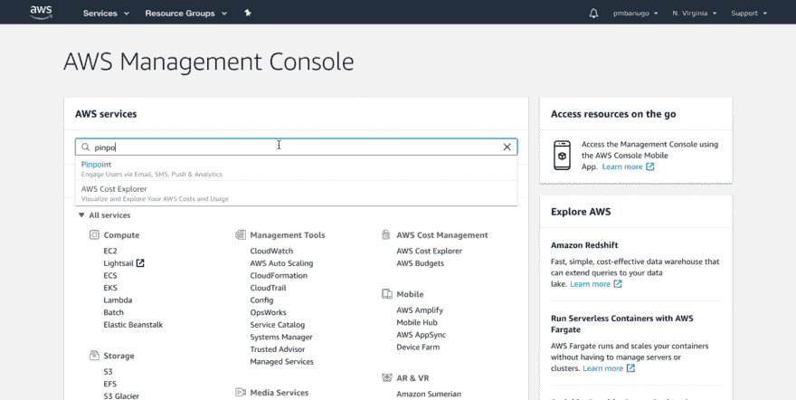

# 使用 React 和 AWS Amplify 实现无服务器第 3 部分:跟踪应用程序使用

> 原文：<https://dev.to/pmbanugo/going-serverless-with-react-and-aws-amplify-part-3-tracking-app-usage-5f3e>

无服务器是一种云计算执行模型，其中云提供商负责通过在需要时动态分配资源来运行代码，从而执行一段代码。有了它，我们可以减少运营成本和开发时间。它允许我们专注于我们的代码，为用户提供商业价值，而不用担心构建和维护服务器。配置这些服务并将其与我们的代码集成需要几个步骤，AWS Amplify 的构建是为了使在 AWS 上构建无服务器应用程序变得更加容易。它提供了用几个命令创建和配置服务的工具，以及从我们的代码中轻松与这些服务交互的库组件。

本文是我向您展示如何在 React 和 AWS Amplify 中构建无服务器应用程序的系列文章的一部分。在[第一篇文章](https://dev.to/pmbanugo/going-serverless-with-react-and-aws-amplify-development-environment-set-up-43hj)中，我们建立了我们的开发环境、一个 Amplify 项目和一个 React 项目。在[的第二篇文章](https://dev.to/pmbanugo/going-serverless-with-react-and-aws-amplify-part-2-creating-and-using-serverless-services-340e)中，我们创建了运行在不同 AWS 服务上的后端服务，并构建了一个 React 应用来执行 CRUD 操作，从而与创建的后端服务进行交互。在这篇文章中，我们将在之前文章中构建的应用程序中添加分析和使用跟踪功能。

## 设置分析后端

在许多应用程序中，it 需要捕获应用程序使用数据，以便企业能够深入了解客户如何与应用程序交互。我们将使用 Amazon Pinpoint 来跟踪 React 应用程序的使用情况。Amazon Pinpoint 有以下类型的事件:

1.  货币化事件。此事件类型用于报告应用程序产生的收入以及用户购买的商品数量。
2.  会话事件。它们会跟踪使用情况，并指示用户打开和关闭应用程序的时间和频率。
3.  认证事件。这显示了用户使用您的应用程序进行身份验证的频率。登录、注册和身份验证失败在此类别中被跟踪。
4.  自定义事件。这种类型的事件表示您通过分配自定义事件类型定义的非标准事件。您可以向自定义事件添加自定义属性和指标。

要将 Pinpoint 添加到我们的项目中，请打开 React 项目根目录下的命令，并按照下面的说明进行操作。

1.  运行命令`amplify add analytics`。
2.  系统将提示您输入此服务的资源名称。输入`todosPinpoint`并按下回车键。
3.  您应该得到一个提示，询问您是否希望允许未经身份验证的用户发送分析事件。输入`n`并按回车键。

[](https://res.cloudinary.com/practicaldev/image/fetch/s--bxp2sP9_--/c_limit%2Cf_auto%2Cfl_progressive%2Cq_auto%2Cw_880/https://cdn.filestackcontent.com/4R5L37MARG3lomQvWIDz)

我们运行的命令创建了分析资源，并在本地更新了身份验证资源。我们需要在云中配置它们。运行命令`amplify push`在云中创建服务。一旦完成，它将获取服务信息并更新 **src/aws-exports.js** 。如果你打开它，你会发现我们有属性`aws_mobile_analytics_app_id`和`aws_mobile_analytics_app_region`。该信息将用于配置放大库。

## 向应用程序添加分析

有了云中创建的 Pinpoint 服务，我们现在需要添加代码来向它发送使用数据。在 **src/App.js** 中，第 7 行写着`Amplify.configure(aws_exports);`将用来自 **aws-export.js** 的数据建立库。由于 **aws-export.js** 包含`aws_mobile_analytics_app_id`，它将配置分析以及其他包含其信息的服务。默认情况下，Amplify 库将跟踪用户会话和认证事件。不需要添加额外的代码。如果你启动应用程序，登录或注册用户，你会将这些事件数据发送到云。我们还可以记录自定义事件。让我们记录一个自定义事件，当一个项目被删除时。打开 **src/App.js** 并更新第 4 行以导入分析模块

```
import Amplify, { API, Analytics } from "aws-amplify"; 
```

Enter fullscreen mode Exit fullscreen mode

更新`delete()`函数以包含以下代码语句。

```
Analytics.record({ name: "delete", attributes: { id } }); 
```

Enter fullscreen mode Exit fullscreen mode

这将在每次调用该函数时发送一个`delete`事件。它可以用来跟踪项目被删除的频率。我们还可以通过在每次进入 Details 视图时记录一个事件来跟踪哪些项目被查看得最多。将以下代码添加到`loadDetailsPage()`函数中:

```
Analytics.record({
  name: "detailsView",
  attributes: { title: response.title }
}); 
```

Enter fullscreen mode Exit fullscreen mode

在浏览器中打开应用程序，选择不同的项目，在不同项目的详细信息视图中移动。现在，登录 AWS 管理控制台，转到 Pinpoint 仪表板，查看应用程序的分析报告。

[](https://res.cloudinary.com/practicaldev/image/fetch/s--c4z4wHW2--/c_limit%2Cf_auto%2Cfl_progressive%2Cq_auto%2Cw_880/https://cdn.filestackcontent.com/pwdt2j31TZiLflkaxbrz)

## 这就结束了

您可以将 Amazon Pinpoint 集成到您的 web 应用程序中，以获取使用数据，从而让您了解客户如何与您的应用程序交互。企业可以利用这些数据来分析客户行为，包括他们的参与度、人口统计数据和购买活动。我向您展示了如何使用 Amplify CLI 创建 Pinpoint 服务，然后将其集成到 React 应用程序中，以便向 Pinpoint 服务发送自定义事件。我们可以利用 Amplify JavaScript 库中的分析模块做更多的事情，比如自动记录页面视图和事件。有关分析 API 的更多信息，请参见[文档](https://aws-amplify.github.io/docs/js/analytics)。

## 进一步阅读

1.  [第 1 部分:开发环境设置](https://dev.to/pmbanugo/going-serverless-with-react-and-aws-amplify-development-environment-set-up-43hj)
2.  [第 2 部分:创建和使用无服务器服务](https://dev.to/pmbanugo/going-serverless-with-react-and-aws-amplify-part-2-creating-and-using-serverless-services-340e)

> 也发表在我的[博客](https://www.pmbanugo.me/)上