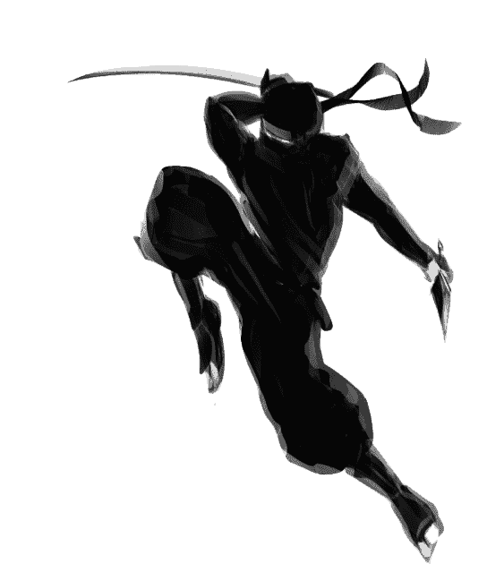

# 加速一个简单的静态站点(在 Cloudinary 的帮助下！)

> 原文：<https://dev.to/amcaplan/speeding-up-a-simple-static-site-with-help-from-cloudinary-f48>

### 诊断病人

在过去的两年里，我经营了 [Dev 同理心读书俱乐部](https://devempathybook.club)，这个网站没有太大的变化。我试图保持低工作量，这样我就可以专注于社区和我们正在制作的内容。这样做的一个缺点是，这个网站虽然简单，但性能不是很好。(谷歌的
[PageSpeed Insights](https://developers.google.com/speed/pagespeed) 在移动端给它打了一个很低的分数，30/100。)

我最近开始在 [Cloudinary](https://cloudinary.com) 工作，我意识到这很尴尬，作为一家公司的员工，我的产品就是优化网络媒体，而我的个人网站却做得很糟糕。

最后一点鼓励来自 Cloudinary 的同事 Eric Portis，他在 T2 发表了一篇关于 T4 网站速度测试的文章。当我在 Dev Empathy 图书俱乐部网站上运行它时，我看到用户必须下载 1.5MB，这可以优化到 370kB，即大约是他们体重的 1/4。我还知道这些图片是直接从 GitHub 页面提供的，没有任何 CDN，所以在移动设备上页面加载相当慢。

最重要的是，有大量渲染阻塞的 JS 和 CSS 在没有 CDN 的情况下被下载。

所有这些都意味着更慢的加载时间，以及搜索结果中更低的分数。没有什么好的理由，除了我不知道如何改进事情，或者没有时间去学习如何去做。

### 进入 Cloudinary

Cloudinary 是一个强大但易于使用的服务，用于上传、转换和提供图像和视频。免费层包含的内容比简单静态网站所需的要多得多，因此它是一个很好的选择，例如，对于包含一些您想要有效提供的图片的个人网站。

Cloudinary 的一个令人敬畏的特性是自动获取图像的能力。

例如，考虑这个 URL:

```
https://res.cloudinary.com/caplan/image/fetch/https://amcaplan.ninimg/ninja-cropped.png 
```

该网址由
组成

```
https://res.cloudinary.com/caplan/image/fetch/ 
```

它告诉 Cloudinary 您想要为`caplan`云获取一个图像(当您注册 Cloudinary 时，您创建了一个具有唯一标识符的云)，其余的是可以找到图像的 URL:

```
https://amcaplan.ninimg/ninja-cropped.png 
```

当你点击这个网址时，Cloudinary 将在后台获取图像，并开始通过 CDN 提供服务。

理论上，我们可以把网站上的所有图片都拿来，然后用获取咒语开始，但是还有更好的方法。Cloudinary 还有另一个叫做 Auto Upload 的特性，它可以让你创建代表网站位置的文件夹。因此，如果我们创建一个映射到`https://amcaplan.ninimg/`的`ninja_images`目录，URL 看起来像这样:

```
https://res.cloudinary.com/caplan/image/upload/ninja-images/ninja-cropped.png 
```

好多了！结果如下:

[](https://res.cloudinary.com/practicaldev/image/fetch/s--RT4LsQQf--/c_limit%2Cf_auto%2Cfl_progressive%2Cq_auto%2Cw_880/https://res.cloudinary.com/caplan/image/upload/ninja-images/ninja-cropped.png)

现在有趣的部分来了。

Cloudinary 允许您通过在 URL 中添加转换来编辑图像。例如，通过在图像位置前添加`/w_100`，我们创建了同一图像的 100 像素宽版本:

```
https://res.cloudinary.com/caplan/image/upload/w_100/ninja-images/ninja-cropped.png 
```

[](https://res.cloudinary.com/practicaldev/image/fetch/s--gJgk2e59--/c_limit%2Cf_auto%2Cfl_progressive%2Cq_auto%2Cw_880/https://res.cloudinary.com/caplan/image/upload/w_100/ninja-images/ninja-cropped.png)

你可以裁剪、设置重力(聚焦在图像的一个区域或人脸上)、缩放、添加文本层或图像叠加，以及做一大堆更棒的事情，只需添加到 URL。

这为通过 CSS 驱动的各种断点创建多个版本提供了机会。所以如果你把一个大的版本作为原件，你可以告诉 Cloudinary 按照你认为合适的方式裁剪/缩放图像，不需要 Photoshop 技能！

作为一个具体的例子，这里有一个大屏幕的大图像:

```
https://res.cloudinary.com/dev-empathy-book-club/image/upload/f_auto,q_auto/site/slider-bg.jpg 
```

[](https://res.cloudinary.com/practicaldev/image/fetch/s--ZohOx3jw--/c_limit%2Cf_auto%2Cfl_progressive%2Cq_auto%2Cw_880/https://res.cloudinary.com/dev-empathy-book-club/image/upload/f_auto%2Cq_auto/site/slider-bg.jpg)

您会注意到这里的一些转换:`f_auto`，它为用户的浏览器选择带宽优化程度最高的图像格式，以及`q_auto`，它通过降低图像质量来减小图像大小，而不会被人眼察觉。这两次转换已经将图像大小从 874kB 减小到 385kB，对用户来说没有任何明显的区别！

但我们可以在手机上做得更好，在手机上这么多像素仍然没有帮助任何人。这里有一个缩小版的手机版:

```
https://res.cloudinary.com/dev-empathy-book-club/image/upload/f_auto,q_auto,w_480,h_800,c_lfill,g_auto/site/slider-bg.jpg 
```

[](https://res.cloudinary.com/practicaldev/image/fetch/s--ptC8c-Lj--/c_limit%2Cf_auto%2Cfl_progressive%2Cq_auto%2Cw_880/https://res.cloudinary.com/dev-empathy-book-club/image/upload/f_auto%2Cq_auto%2Cw_480%2Ch_800%2Cc_lfill%2Cg_auto/site/slider-bg.jpg)

在这种情况下，我们创建一个宽度为 480px 的高图像，以 Cloudinary 确定的图像中最有趣的部分为中心，并使用`fill`方法进行裁剪(表示为`c_lfill`，以确保我们覆盖了 480x800 的整个要求尺寸。

有许多参数，甚至更多的参数选项，但是[文档](https://cloudinary.com/documentation/image_transformations)非常全面，系统非常强大。

要查看真实的例子，请查看 GitHub 上的 CSS for Dev Empathy 图书俱乐部网站。

### 格拉瓦塔尔挑战

起初我以为网站上的[Gravatar](https://www.gravatar.com)(我们展示了一些)会以同样的方式工作，但是我很快意识到 Gravatar 有一个很大的问题。一张图片的网址看起来像这样:

```
http://secure.gravatar.com/avatar/7b5a451ee25044b9c869e3e98b79425d.jpg?s=200 
```

有了这个结果:

[](https://res.cloudinary.com/practicaldev/image/fetch/s--RTak9Axa--/c_limit%2Cf_auto%2Cfl_progressive%2Cq_auto%2Cw_880/http://secure.gravatar.com/avatar/7b5a451ee25044b9c869e3e98b79425d.jpg%3Fs%3D200)

如果我想要一个更大的版本，我只需改变`s`查询参数。所以对于一个 400 像素的正方形，我会使用这个网址:

```
http://secure.gravatar.com/avatar/7b5a451ee25044b9c869e3e98b79425d.jpg?s=400 
```

[](https://res.cloudinary.com/practicaldev/image/fetch/s--hi_aiBZi--/c_limit%2Cf_auto%2Cfl_progressive%2Cq_auto%2Cw_880/http://secure.gravatar.com/avatar/7b5a451ee25044b9c869e3e98b79425d.jpg%3Fs%3D400)

缺少`s`参数，Gravatar 默认为 80px 的正方形:

```
http://secure.gravatar.com/avatar/7b5a451ee25044b9c869e3e98b79425d.jpg 
```

[](https://res.cloudinary.com/practicaldev/image/fetch/s--AuzUOGjo--/c_limit%2Cf_auto%2Cfl_progressive%2Cq_auto%2Cw_880/http://secure.gravatar.com/avatar/7b5a451ee25044b9c869e3e98b79425d.jpg)

如果你尝试用 Cloudinary 获取一个大的 Gravatar 头像，结果如下:

```
https://res.cloudinary.com/caplan/image/fetch/https://secure.gravatar.com/avatar/7b5a451ee25044b9c869e3e98b79425d.jpg?s=400 
```

[](https://res.cloudinary.com/practicaldev/image/fetch/s--NF4p7CX---/c_limit%2Cf_auto%2Cfl_progressive%2Cq_auto%2Cw_880/https://res.cloudinary.com/caplan/image/fetch/https://secure.gravatar.com/avatar/7b5a451ee25044b9c869e3e98b79425d.jpg%3Fs%3D400)

发生了什么事？Cloudinary 将`?s=400`视为传递给 Cloudinary 的无意义参数，不会转发给 Gravatar。

不过，这可以通过将`?`字符 URL 编码为`%3F`来解决，比如:

```
https://res.cloudinary.com/caplan/image/fetch/https://secure.gravatar.com/avatar/7b5a451ee25044b9c869e3e98b79425d.jpg%3Fs=400 
```

[](https://res.cloudinary.com/practicaldev/image/fetch/s--NF4p7CX---/c_limit%2Cf_auto%2Cfl_progressive%2Cq_auto%2Cw_880/https://res.cloudinary.com/caplan/image/fetch/https://secure.gravatar.com/avatar/7b5a451ee25044b9c869e3e98b79425d.jpg%253Fs%3D400)

这种技术应该适用于您可能需要包含在获取 URL 中的任何字符。

然而，这并不是故事的结尾。当有人更新他们的 Gravatar 图片时会发生什么？理想情况下，它也会在我们的网站上更新。但是在免费计划中，获取的图像永远不会改变。(它们可以配置为根据付费计划进行更新。)

原来 Cloudinary 有人想到了这一点，因此将 [Gravatar 支持](https://cloudinary.com/blog/placeholder_images_and_gravatar_integration_with_cloudinary)直接内置到平台中。与我们目前看到的`fetch`和`upload`图像类型不同，还有一种`gravatar`图像类型，它知道如何从 Gravatar 获取高质量的图像，并在有人改变他们的头像时自动更新，有一点延迟！(其他社交网络也有类似的系统[和](https://cloudinary.com/documentation/image_delivery_options)，包括脸书、Google+、Instagram 和 Twitter。)

如果您以这种方式通过 Gravatar 获取图像，您可以使用普通的`h_`和`w_`参数轻松放大或缩小。这是你真实的 400 像素图像，通过 Cloudinary 获取:

```
https://res.cloudinary.com/caplan/image/gravatar/w_400/7b5a451ee25044b9c869e3e98b79425d.jpg 
```

[](https://res.cloudinary.com/practicaldev/image/fetch/s--McBU7RO0--/c_limit%2Cf_auto%2Cfl_progressive%2Cq_auto%2Cw_880/https://res.cloudinary.com/caplan/image/gravatar/w_400/7b5a451ee25044b9c869e3e98b79425d.jpg)

当然，一旦你做到了这一点，你可以使用`f_auto`和`q_auto`来进一步优化图像，减少带宽的使用。整洁！

### 不仅仅是为了图像！

关于 Cloudinary 的一个鲜为人知的事实是:他们可以通过 CDN 提供任何东西，而不仅仅是图像和视频！因此，如果你有 JS 或 CSS 文件，你可以通过 Cloudinary 的 CDN 提供它们，就像上面提到的图片一样:建立一个自动上传文件夹，引用这些 URL，而不是它们在你的网站上的托管位置。所以举个例子，代替:

```
https://devempathybook.club/css/bootstrap.min.css 
```

我们参考:

```
https://res.cloudinary.com/dev-empathy-book-club/raw/upload/css/bootstrap.min.css 
```

(其中`css/`是映射到`https://devempathybook.club/css/`的文件夹)。注意，我们写下`raw`而不是之前的`image`，以表明这应该被认为是一种未知的文件类型，Cloudinary 不应该尝试对它进行任何图像处理。

如果你使用 CDN，通常你会想为你的 JS 和 CSS 资产使用一个[版本控制策略](https://css-tricks.com/strategies-for-cache-busting-css/#article-header-id-2)，但是这里的目标是在一个静态的 Jekyll 站点上偷懒。由于没有太多的自定义 CSS 和 JS，我只是留下了一些直接从 GitHub 页面加载的文件，但不会经常(或永远不会)改变的内容通过 Cloudinary 的 CDN 提供。你可以在这里看到代码。

### 削废

如果您查看上一节中的代码，您可能会注意到有许多行被注释掉了。事实证明，我使用的 Jekyll 模板捆绑了许多我实际上没有使用的 JS/CSS 框架和插件。移除它们减少了总的页面加载大小，并使页面运行得更快，因为 CPU 需要担心的事情更少了。就像他们说的，没有代码比没有代码更快！

### 胜负

我现在不会称该网站为闪电般的速度，但它的 PageSpeed 移动评分在几个简单的步骤中共花了几个小时就从 30 上升到 50。还有更多的东西需要优化，但是这些快速的技巧已经大大降低了页面加载时间。重要的是，首次在手机上绘画的时间减少了约 50%。这对移动用户来说是一个更好的体验。

所以，走出去，尝试这些建议，并在评论中让我知道你做得如何！

提醒一下，我在 Cloudinary 工作，所以如果您确实发现这里有什么难以实现的地方，我可以将您的担忧转达给合适的人...😉

另外，如果你使用 Jekyll 或其他博客框架，并且你的网站上有很多图片，那么使用插件来进一步自动化可能是值得的。例如， [jekyll-cloudinary](https://nhoizey.github.io/jekyll-cloudinary/) 让您定义过渡预设，并为各种屏幕尺寸的图像生成 URL。相当神奇。当然，如果它是一个动态网站，Cloudinary 有[大量的 SDK](https://cloudinary.com/documentation)，可以做这里讨论的所有事情，甚至更多！

*注:Cloudinary 没有要求我写这个。这篇文章中的任何内容都不应被视为代表除我之外的任何人。*

***更新于 2019-01-29:增加了在获取 URL 中包含 URL 编码字符的选项。*T3】**