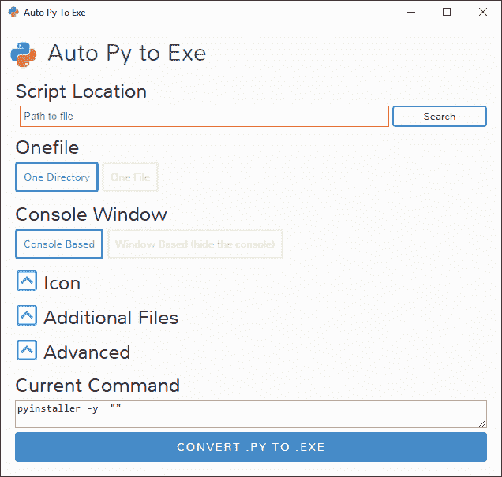
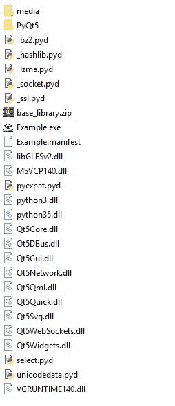
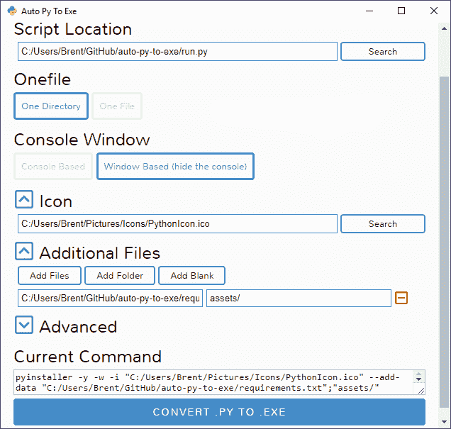
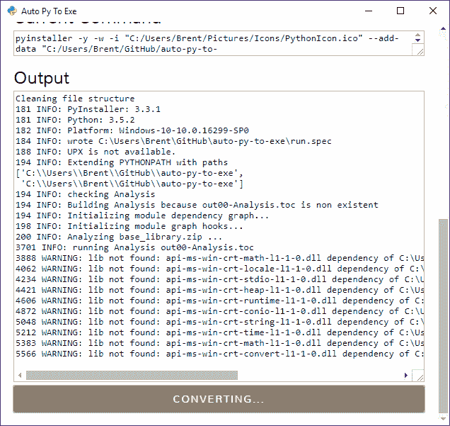

# Python 到。exe 如何转换。py to。exe？逐步指南。

> 原文：<https://dev.to/eshleron/how-to-convert-py-to-exe-step-by-step-guide-3cfi>

# 自动复制到 EXE

我们将要使用的唯一工具是 **Auto PY to EXE** ！

**Auto PY to EXE** 是一款令人惊叹的制作应用。exe 文件从您的项目中移除。py 文件或任何数量的文件。
该应用程序有一个漂亮的图形用户界面，如下所示:

[](https://res.cloudinary.com/practicaldev/image/fetch/s--XL_zkuQ9--/c_limit%2Cf_auto%2Cfl_progressive%2Cq_auto%2Cw_880/https://warehouse-camo.cmh1.psfhosted.org/4fc81b16448c94eda8a266110b56284ca9883185/68747470733a2f2f692e696d6775722e636f6d2f6464304c43326e2e706e67)

## 如何开始

## 第一步。装置

使用 PyPI 安装:

要安装应用程序，请在 **cmd** 中运行此行:

`pip install auto-py-to-exe`

要打开应用程序，请在 **cmd** 中运行此行:

`auto-py-to-exe`

注意:如果你用这种方式安装有任何问题，或者你想从 GitHub 安装，请进入[主页](https://pypi.org/project/auto-py-to-exe)或者观看“自动复制到 EXE”[开发者自己制作的教学视频](https://github.com/brentvollebregt)。

[https://www.youtube.com/embed/OZSZHmWSOeM](https://www.youtube.com/embed/OZSZHmWSOeM)

### 如需更多信息，请使用此

#### [“使用 auto-py-to-exe 时的问题”](https://nitratine.net/blog/post/issues-when-using-auto-py-to-exe)

## 第二步。转变

您需要选择几个主要选项:

1.  选择你的。py 文件
2.  选择“一个目录”或“一个文件”选项
3.  挑选附加文件

## 1。选择你的。py 文件

如果你有多个文件，选择一个启动程序。

## 2.1。“一个目录”选项

[](https://res.cloudinary.com/practicaldev/image/fetch/s--NYBmfLM5--/c_limit%2Cf_auto%2Cfl_progressive%2Cq_auto%2Cw_880/https://thepracticaldev.s3.amazonaws.com/i/9mrf0i0cm0shdgoizjdz.JPG)

很简单。当选择“一个目录”选项时，“自动复制到 EXE”会将所有依赖关系放在一个文件夹中。您可以在“高级”菜单中选择输出目录。如果您有图标和背景等媒体文件，在中使用它们应该没有任何问题。如果您将媒体文件/文件夹放在输出目录中，请使用。
类似这样的东西:

[](https://res.cloudinary.com/practicaldev/image/fetch/s--c_j8iXKB--/c_limit%2Cf_auto%2Cfl_progressive%2Cq_auto%2Cw_880/https://thepracticaldev.s3.amazonaws.com/i/1a8b99f7f5gggq7fe7cv.JPG)

## 2.2。“一个文件”选项

[](https://res.cloudinary.com/practicaldev/image/fetch/s--yfJE8zQp--/c_limit%2Cf_auto%2Cfl_progressive%2Cq_auto%2Cw_880/https://thepracticaldev.s3.amazonaws.com/i/cuq5tm4xsjnngoi6uqmc.JPG)

当选择“一个文件”选项时，“自动复制到 EXE”将创建**一个。exe 文件**包含所有依赖关系，但**不是媒体文件**。如果你的程序只有**默认的 Windows gui** ，没有图标、背景、媒体文件，或者你可以把媒体文件夹放在附近。请随意跳过下面的解释。对于那些想把媒体文件打包成。exe 文件本身读取第 3 段。

## 3。挑选附加文件

“自动复制到 EXE”中有一个名为“附加文件”的菜单，可以让你添加你选择的文件。不过有一个问题。“Auto PY to EXE”使用 **pyinstaller** 将数据解压到一个临时文件夹中，并将该目录路径存储在 _MEIPASS 环境变量中。您的项目将找不到必要的文件，因为路径已更改，它也不会看到新的路径。换句话说，如果选择选项“一个文件”，在“附加文件”菜单中选择的文件**不会被添加到**中。exe 文件。要解决这个问题，你应该使用由 Auto PY to EXE 的开发者提供的代码[这里](https://nitratine.net/blog/post/issues-when-using-auto-py-to-exe/#debugging)

```
def resource_path(relative_path):
    """ Get absolute path to resource, works for dev and for PyInstaller """
try:
    # PyInstaller creates a temp folder and stores path in _MEIPASS
    base_path = sys._MEIPASS
except Exception:
    base_path = os.path.abspath(".")

return os.path.join(base_path, relative_path) 
```

Enter fullscreen mode Exit fullscreen mode

要在您的项目中使用此代码，请替换您已有的媒体文件的链接*现在*
例如:

```
setWindowIcon(QIcon('media\icons\logo.png')) 
```

Enter fullscreen mode Exit fullscreen mode

*同*

```
setWindowIcon(QIcon(resource_path('logo.png')) 
```

Enter fullscreen mode Exit fullscreen mode

现在，链接将被正确引用，选择的文件将被成功打包到。exe 文件。

比较:
之前可能的联系

```
"C:\Users\User\PycharmProjects\media\icons\logo.png" 
```

Enter fullscreen mode Exit fullscreen mode

之后可能的链接

```
"C:\Users\User\AppData\Local\Temp\\_MEI34121\logo.png" 
```

Enter fullscreen mode Exit fullscreen mode

按下**转换。PY TO。EXE**

[](https://res.cloudinary.com/practicaldev/image/fetch/s--RabCSh76--/c_limit%2Cf_auto%2Cfl_progressive%2Cq_auto%2Cw_880/https://warehouse-camo.cmh1.psfhosted.org/d2f89e7dfcbbd3635e0f098b43dbc9df7c74b7a4/68747470733a2f2f692e696d6775722e636f6d2f663354456e5a492e706e67)

等待

[](https://res.cloudinary.com/practicaldev/image/fetch/s--3ShvFwAr--/c_limit%2Cf_auto%2Cfl_progressive%2Cq_auto%2Cw_880/https://warehouse-camo.cmh1.psfhosted.org/a71bb45213b2285ac68eedc2994709c478deb12d/68747470733a2f2f692e696d6775722e636f6d2f4d6a644f4e63432e706e67)

## 第三步。运行你的程序！

现在一切都完成了！

运行它。测试一下。看看发生了什么。

确保一切正常。

#### 你做了一个目录

你需要的每个文件都应该在**单个目录**中。

#### 你做了一个文件

这样你应该已经**单身了。exe 文件**。如果你有需要并且做得正确。exe 文件将与其中的所有媒体打包在一起。**您将不再需要随附的任何媒体文件/文件夹。exe 文件**来正确显示它们。

* * *

### P.S

如果您对应该添加哪些重要信息有任何反馈或建议，请随时告诉我！本指南并不描述以各种可能的方式完成的每一个可能的选项。
我希望这些信息对您有用！
祝你的项目好运！