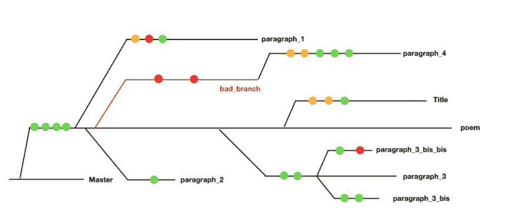
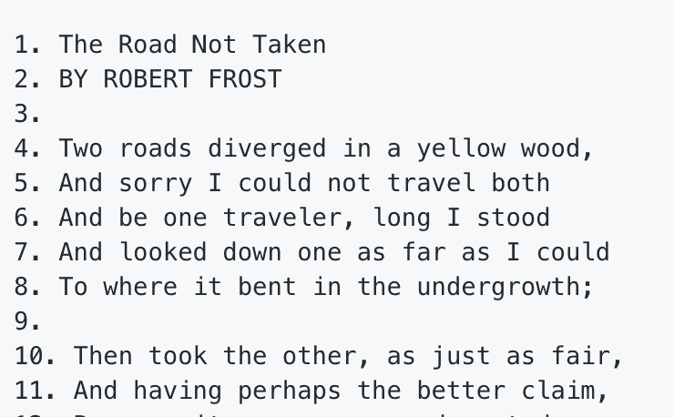

# 揭秘 git rebase:研讨会

> 原文：<https://dev.to/appaloosastore/demystifying-git-rebase-a-workshop-3b21>

用一首诗学习 git rebase 命令的实用指南。

 ](https://res.cloudinary.com/practicaldev/image/fetch/s--ZxlaveVZ--/c_limit%2Cf_auto%2Cfl_progressive%2Cq_auto%2Cw_880/https://cdn-images-1.medium.com/max/2000/1%2Agg5mhWR_VUm_sJVwztB-Uw.png) *图片来源:**professortocat_v2 来自 [**GitHub Octodex](https://octodex.github.com/)* 

> git rebase 是在另一个基础技巧之上重新应用提交的过程。

### 一个想法的诞生

git rebase 命令非常复杂，在团队会议期间经过几次讨论后，我们发现有些人不知道如何正确使用它。出于恐惧，我们经常避免使用 git rebase 命令，因为如果使用不当，这个命令会导致各种各样的麻烦。

一些团队成员正在使用 git GUI 客户端，例如 [SourceTree](https://www.sourcetreeapp.com/) 或 [GitKraken](https://www.gitkraken.com/) ，来处理他们的存储库的可视化表示。有些人不知道一些命令的高级用法。

因此，我们决定组织一个研讨会来共同学习这一点是个好主意，因为我们大多数人在这个类似的主题上存在知识差距。

我真的希望这个少一些学者味，多一些乐趣，所以我主动为团队创建了一个实践工作室。

我想过用一首诗。罗伯特·弗罗斯特的《未选择的路》。

黄色的树林里分出两条路，
很抱歉我不能同时去
和做一个旅行者，我站了很久
，尽我所能向下看
一条路，直到它在矮树丛中弯曲；

*然后拿走了另一个，公平的，
也许有更好的说法，
因为它长满了草，需要穿；
虽然经过那里
已经穿得差不多了，*

那天早上，两个人都躺在树叶中，没有一步踩黑。
哦，我把第一个留到了下一天！
然而，知道了这条路通向那条路，
我怀疑自己是否还会回来。

*我将叹口气讲述这个故事
很久很久以后的某个地方:
树林里分叉出两条路，而我——
我选择了人迹较少的那一条，
，这一切都变得不同了。*

### 准备

我模拟了一个团队为同一首诗所做的工作，就像这样:

每个树枝对应一首诗的一个段落或一小部分。

不同的分支包含错误的提交(红色)和重新排列的提交(黄色)。

研讨会的目标是使用 git rebase 命令一个分支接一个分支地重新编写完整的诗歌。像 [git cherry-pick](https://git-scm.com/docs/git-cherry-pick) 命令这样的命令是被禁止的。

当创建 workshop 时，一个提交只对应于一行诗。

“P1/L3”是这首诗第一段第三行中的一行:“做一个旅行者，我站了很久”。

目的是使解决冲突更加容易。当对文件的同一行进行更改时，通常会出现这种情况。

为了解决合并冲突，我们通常必须选择合并哪些变化，所以我为诗的每一行标明了行号(见下文)。

这首诗是使用 git rebase 命令的借口。讲习班的重点不是解决冲突。

### 车间

开发团队的每个成员都建立了他们的环境，克隆了存储库:

> [https://github . com/correico/workshop-git-over](https://github.com/coralieco/workshop-git-rebase)

本研讨会是使用 git rebase 进行复杂命令训练的实用指南。每个人都被允许阅读文档或现场求助。这不是竞赛，但研讨会必须在一小时或更短时间内完成:)

我们一起开始了研讨会，将第一段作为第一个例子。这是为了确保每个人都理解规则和方法，以配合研讨会的其余部分。

然后，每个人都必须完成研讨会。使用 git rebase 命令，尤其是——interactive 选项。

来自[文档](https://git-scm.com/book/en/v2/Git-Tools-Rewriting-History):

> 使用交互式 rebase 工具，您可以在每次提交后停下来修改和更改消息、添加文件或做任何您想做的事情。您可以通过向 git rebase 添加-i 选项来交互式地运行 rebase。您必须通过告诉命令要重新基于哪个提交来指明要重写多远的提交。

有一个选项我特别喜欢，所以我向团队建议用它来将这首诗重新归入第 4 段，而不将其归入父段(见下图):git rebase -onto

[)](img/48761333edc7d44ce00aa5eceb17dfcb.png) ](https://res.cloudinary.com/practicaldev/image/fetch/s--10qF35-W--/c_limit%2Cf_auto%2Cfl_progressive%2Cq_auto%2Cw_880/https://cdn-images-1.medium.com/max/2740/0%2Ai9JwwphI6bCxTR9R) * [ git rebase 文档](https://git-scm.com/docs/git-rebase) )*

由于团队中有不同程度的进展，我大约每 10-15 分钟修改一段，这样每个人都能跟上。

最后，我发送了一份我用来重组这首诗的命令的详细的[更正](https://github.com/coralieco/workshop-git-rebase#corrections)。一些开发团队成员觉得有必要在家里重做研讨会，以便从这个练习中真正受益。

### 结论

*   Git rebase interactive 为我们提供了修改单个提交的机会。

*   Git rebase 对于维护一个线性的项目历史是很棒的，干净且有意义，我们一定不要害怕使用它:)

*   实践工作坊对于学习一门新学科来说是非常成功的:我们不会害怕在 Appaloosa 项目中使用它。

总的来说，我们对这种形式都很满意。我们都喜欢一起度过这段时间，我们希望在未来继续组织类似的研讨会。

感谢阿帕卢萨团队！
这篇文章是由[阿帕卢萨](https://www.appaloosa-store.com/)开发团队的[科拉莉·克里农](https://twitter.com/cco_app)撰写的。