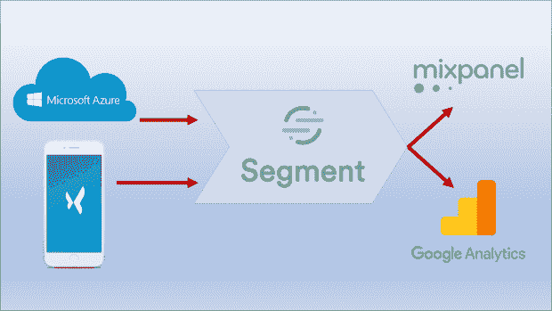

# 使用 Segment、Mixpanel 和 Google Analytics 收集行为数据

> 原文：<https://dev.to/tdwright/collecting-behavioural-data-with-segment-mixpanel-and-google-analytics-3ajh>

收集和分析行为事件数据的逻辑可能难以把握。有很多服务可以提供帮助，但是现在你有两个问题，对吗？在我的行为数据系列的第二部分中，我解释了我使用的工具和原因。

在我关于这个主题的第一篇文章中，我试图保持对技术和平台的不可知论。在这篇文章中，我将开始深入一些细节，用我的工作经验作为案例研究。

作为背景，我在 [HeadUp Labs](https://www.headuplabs.com/) 工作。我们开发了一款连接可穿戴设备的移动应用，帮助用户理解他们的健康数据。它被证明是一个受欢迎的应用程序(去看看吧！)，所以我觉得我们有机会检验我们使用的工具。

## 我们的行为数据工具链

我们的应用程序是一个与. NET(核心)后端对话的 React 本地项目。大多数行为数据通过前端进入，但由于我们的用户连接在后台同步的可穿戴设备，我们也从后端触发行为事件。

为了整理和分发来自应用程序两个部分的数据，我们使用了[段](https://segment.com/)。这就是数据段所做的一切——从一个或多个“源”接收数据，并将其发送到一个或多个“目的地”。极其简单！

在我们的例子中，有两个来源:

1.  我们的前端使用为 React Native 编写的 npm 包。外面有几个，但是我们用了这个。(注意:我想如果我们要从头开始实现它，我们可能会选择使用官方库。)
2.  我们的后端(特别是我们的一些 Azure 函数，用。网芯)用的是[官方。NET SDK](https://segment.com/docs/sources/server/net/) 。

我们目前有两个目的地:

1.  就在我们发布应用程序之前，我们一直在使用 Mixpanel
2.  [谷歌分析](https://analytics.google.com/)，这是我们最近增加的

使用 Segment 作为中介意味着我们不必担心针对 Mixpanel 的 SDK 或 Google Analytics 的 API 进行编码。我们只需要担心一项服务。重要的是，对于单点故障，分段 API[非常可靠](https://status.segment.com/uptime)。另外，Segment web 应用程序允许您轻松地实时查看您的事件流，并调试单个事件，这在您试图找出某些东西不工作的原因时非常有用。

理论上，通过 Segment 运行一切也意味着我们的源和目的地是完全解耦的。由于所有配置都发生在 Segment 的 web 应用程序中，因此添加目的地服务应该不需要任何代码更改。(正如我们将在本系列后面的一篇文章中看到的，实际的现实并不完全符合理论上的承诺，但它确实很接近。)

 

<figcaption>我们使用 Segment 从应用的前端和后端收集数据，并将其分发到 Mixpanel 和 Google Analytics。</figcaption>

我们使用 Mixpanel 和 Google Analytics 来实现稍微不同的东西。有些问题在这两种情况下更容易回答，而 Mixpanel 也有一些功能可以介入其中(例如触发电子邮件)。让我们依次看一下它们。

### Mixpanel

Mixpanel 最大的优势是它的易用性和灵活性(尽管我们最初并没有完全意识到这一点)。在设置好一切后，我们很快就发现了人们与我们的应用程序交互方式的一些有趣趋势。

我们在 Mixpanel 中使用最多的功能是“漏斗”和“洞察”，它们都是报告工具。顾名思义，漏斗可以让你追踪有多少比例的用户按预定的事件顺序进行。Insights 是更通用的报告，它允许您以表格或图表的形式绘制指标。

为了让你知道在 Mixpanel 中你能做什么，我们…

*   监控每周和每月的活跃用户指标，使用事件集合的唯一实例数作为我们的衡量标准。
*   为我们的用户入职流程建立一个漏斗，帮助我们识别“摩擦”的来源，即我们失去新用户的地方。
*   跟踪用户连接其可穿戴设备的成功和失败尝试，以便我们可以确定这些过程是否需要工作。

如果你读了我上一篇关于这个话题的文章，你就会知道当我决定是否跟踪事件时，我喜欢考虑事件是否属于四个类别之一。使用这些标准，我们可以说第一个例子使用了“脉冲”事件，第二个例子使用了一系列“KPI”事件，第三个例子使用了“砂砾”事件。这不值得挂在心上——这只是我在思考事件时发现有用的东西。

Mixpanel 的一个显著特点是能够根据输入的数据触发干预。这可能是一封电子邮件，推送通知，或者任何可以通过调用 webhook 来触发的东西。我们使用了一点，但是(原因我将在后面的文章中讨论)没有我们想象的那么多

### 谷歌分析

我确信古老的谷歌分析不需要如此彻底的介绍。如果你曾经运营过一个网站，毫无疑问你会在某个时候把它连接到 GA。对于那些没有使用过 GA 的人，我会尽力解释。

注意:正如我将在后面的文章中解释的，我们没有使用谷歌推荐的移动应用程序的方法。官方的做法可能会导致一系列不同的特性，所以不要全信！

GA 主要面向网站，特别是那些做广告和/或卖东西的网站。“页面视图”和“事件”之间的区别在这里比在 Mixpanel 中更重要。此外，所有用户都是严格匿名的，而是由他们在几个预定义的细分中的成员身份来表示。正是因为这些差异，我们在一些问题上使用谷歌分析。

GA 了解地理，可以在地图上标出我们的用户群，这其实是一件很有用的事情。这在 Mixpanel 中是很难做到的。同样，页面浏览量和事件之间的严格区分意味着 GA 能够计算出“流量”。这些地图显示了用户的来源和去向。Mixpanel 的漏斗是相似的，但是只能显示一个序列，这使得它们对于探索性的工作不太有用。

GA 做得非常好的另一件事是实时视图。实时查看有多少用户是活跃的，他们在做什么是催眠和上瘾的。众所周知，当我们每天邀请用户完成心情检查时，我们会聚集在一起，看着用户数量飙升。感觉太棒了！

### 总结

正如我所说，我们同时使用 Mixpanel 和 Google Analytics，因为它们各有优缺点。事情的核心是，Mixpanel 强调灵活性，却牺牲了令人惊叹的预建报告。谷歌分析对你的应用和它将产生的数据做了更多的假设，这意味着他们能够做出一些精彩的报告(例如，在地图上绘制的用户位置)，但也有一些不太适合。

幸运的是，使用 Segment 作为收集和分发我们行为事件数据的中间点，可以很容易地添加像 Google Analytics 这样的服务，而不会影响现有的服务。

如果你不确定使用什么来进行分析，你可能会比浏览[细分市场](https://segment.com/docs/destinations/)支持的目的地列表更糟糕。首先，我认为，一个服务出现在这个列表上就相当于一群非常有经验的开发人员(即细分团队)投下的信任票。

Segment 支持服务作为目的地的另一个原因是(请原谅这种赘述),这意味着您可以将它与 Segment 一起使用。显而易见，是的，但值得重申，因为段绝对值得你考虑。它只有一个目的地，但真正的价值在于当需要更改设置时，它可以为您提供灵活性。

本系列接下来的几篇文章更深入地探讨了技术领域，并且特别针对 Segment、Mixpanel 和 Google Analytics。在下一篇文章中，我将分享一些我在使用这些工具时获得的技巧和观察。在之后的文章中，我将介绍他们提供的一些更先进的技术，以及他们生态系统中的其他相关工具。

如果你对这些工具不是特别在意，请继续关注未来的帖子，这些帖子将回归技术不可知论，并将涵盖你可以用行为数据进行的各种分析。

不管你决定使用什么工具，我希望今天的帖子有用。游戏的目的是收集正确的数据，这样我们就可以回答正确的问题，做出正确的决定，让你的项目尽可能做到最好。这是一个令人兴奋的旅程，我希望下次能见到你。

你使用分段吗？请在评论中分享你的经历。