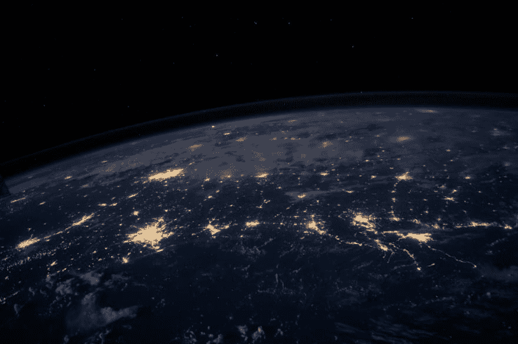

# 使用 Node.js、Express 和 Multer 将图像和视频流式传输到 Google 云存储

> 原文：<https://dev.to/nickparsons/streaming-images-videos-to-google-cloud-storage-with-node-js-express-and-multer-113d>

### **问题**😒

我的任务是转换代码，主要是上传高分辨率图像和大型视频文件。它必须高度可靠，更重要的是，不再依赖 AWS S3。我不会详细讨论 S3 与其他存储提供商的对比，但我会说，当我选择使用云存储时，谷歌的基础设施非常适合我——漂亮的用户界面、令人惊叹的文件浏览器和几十个选项，与 S3 相比，它们实际上是有意义的(对我来说)。

有一个问题……谷歌几乎没有上传图片到云存储的例子。而且，如果他们真的有，对我来说他们似乎已经过时了。在令人头疼的问题和数小时研究 StackOverflow、查看 SDKs 源代码等之后。现在，我可以说我已经完成了任务……我终于可以*用 Express.js 和 Multer 上传图片了，我很高兴分享让这一切工作的代码。*

### 要求📜

1.  上传**任何**媒体文件(音频、视频、图像等。)
2.  习俗 **UUID** 为名
3.  将适当的**扩展名**添加到末尾
4.  获取 **MIME** 类型以传递给 Google 云存储
5.  将对象 ACL 设置为" **public"** ，以便我们可以在浏览器中查看

### **解**🚨

[Express](http://expressjs.com/) ， [Multer](https://www.npmjs.com/package/multer) ，Node.js 的 [Google 云存储](https://www.npmjs.com/package/@google-cloud/storage)包，代码示例如下:

#### 1。路由文件🚓