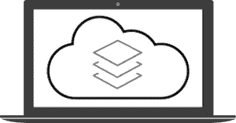
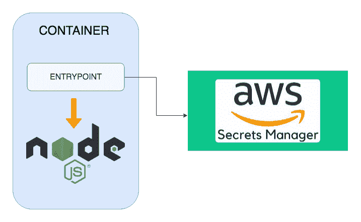

# 使用 localstack 测试具有依赖关系的容器

> 原文：<https://dev.to/sirech/testing-containers-with-dependencies-with-localstack-3f7k>

[](///static/bd8f606798f32990e9c6c77dcf2c514a/5a46d/localstack.png)

我最近在一次会议上谈到了使用 [ServerSpec](https://serverspec.org) 的容器的 [TDD。](https://github.com/sirech/talks/blob/master/2019-01-tw-tdd_containers.pdf)

在那里，我展示了一个基于我当前项目的例子。我们有一些容器化的应用程序从 AWS 秘密管理器获取秘密。测试很棘手，因为它依赖于 *ASM* 。多亏了 [localstack](https://github.com/localstack/localstack) ，你可以通过模仿那些依赖关系来编写有意义的测试。如果你只是想要代码，可以在这里找到。如果你能给我几分钟时间，我会更详细地看一遍。

## 初始图像

假设您有一个正在打包的现有 *Node.js* 应用程序。遵循 *TDD* 方法，您可以得到这样的测试:

```
require_relative 'spec_helper'

describe 'Application Container' do
  describe file('/etc/alpine-release') do
    its(:content) { is_expected.to match(/3.8.2/) }
  end

  describe 'node' do
    describe command('node --version') do
      its(:stdout) { is_expected.to match(/11.6/) }
    end

    describe process('node') do
      it { is_expected.to be_running }
      its(:args) { is_expected.to contain('app.js') }
      its(:user) { is_expected.to eq('runner') }
    end

    describe 'listens to correct port' do
      it { wait_for(port(3000)).to be_listening.with('tcp') }
    end
  end

  describe file('app.js') do
    it { is_expected.to be_file }
  end
end 
```

Enter fullscreen mode Exit fullscreen mode

这通过下面的`Dockerfile` :
来实现

```
FROM node:11.6-alpine

WORKDIR /app

# hadolint ignore=DL3018,DL3013
RUN apk update --no-cache && \
  apk add --no-cache bash jq && \
  rm -rf /var/cache/apk/*

COPY package.json .
RUN yarn

COPY app.js .

RUN adduser -D runner

USER runner
SHELL ["/bin/bash", "-o", "pipefail", "-c"]
CMD ["node", "app.js"] 
```

Enter fullscreen mode Exit fullscreen mode

如果我们有额外的要求呢？我们的应用程序将利用一些秘密。即:

*   将有一个名为`SECRET`的值为`localstack_secret`的秘密
*   我们的`GET /secret`路由将输出`The super secret value is ${SECRET}`(这个 app 有点太信任它的调用者了！)

这改变了一切！我们的应用程序需要一些依赖，这也会影响测试。让我们看看怎么做。

## 将秘密注入容器

我们将在运行时注入秘密。你可以在[许多其他文章](https://medium.com/@mccode/dont-embed-configuration-or-secrets-in-docker-images-7b2e0f916fdd)中找到在构建时编写它们的陷阱，所以让我们👋那个。

第二个要求是，我们希望让秘密处理对我们现有的应用程序透明。该应用程序将获得作为环境变量注入的秘密。我们将通过向我们的图像添加一个`ENTRYPOINT`来实现这一点，它负责获取秘密。

我们将把我们的秘密储存在 *ASM* 中。这是建筑的样子:

[](///static/27b33952d390a2795b796b39321bde6a/0ad97/arch.png)

### 扩展 app

假设我们完全符合 TDD，让我们定义证明我们的应用程序成功返回秘密的测试:

```
describe 'fetches a secret from ASM' do
  it { wait_for(secret).to match(/localstack_secret/) }
end

private

def secret
  command('curl localhost:3000/secret').stdout
end 
```

Enter fullscreen mode Exit fullscreen mode

这是路线在 app 中的实现方式:

```
app.get('/secret', (req, res) => res.send(`The super secret value is ${process.env.SECRET}`)) 
```

Enter fullscreen mode Exit fullscreen mode

这个测试将会失败，因为我们实际上没有向应用程序提供秘密。但是我们会的！

### 提供秘密

正如我所说的，这里会有一个入口点。我们从测试开始:

```
describe file('/usr/sbin/entrypoint.sh') do
  it { is_expected.to be_file }
end 
```

Enter fullscreen mode Exit fullscreen mode

*入口点*本身将使用 [awscli](https://aws.amazon.com/cli/) 来获取秘密。看起来是这样的:

```
#!/usr/bin/env bash

set -e

secret=$(aws --endpoint-url=http://localstack:4584 --region "${AWS_REGION}" secretsmanager get-secret-value --secret-id "${SECRET_KEY}" | jq -r .SecretString)
export SECRET="$secret"

exec "$@" 
```

Enter fullscreen mode Exit fullscreen mode

注意，对于生产映像，使用类似于 [pstore](https://github.com/glassechidna/pstore) 的东西可能会更好。

不管怎样，我们需要修改我们的`Dockerfile`位来整合它。有些事情要做。我们需要添加`awscli`作为依赖项，我们需要添加我们的*入口点*，并确保它运行:

```
# hadolint ignore=DL3018,DL3013
RUN apk update --no-cache && \
  apk add --no-cache bash jq python py-pip curl && \
  pip --no-cache-dir install --upgrade pip awscli && \
  apk -v --purge del py-pip && \
  rm -rf /var/cache/apk/*

COPY entrypoint.sh /usr/sbin/entrypoint.sh

ENTRYPOINT ["/usr/sbin/entrypoint.sh"] 
```

Enter fullscreen mode Exit fullscreen mode

所以一切都要准备好！现在，我们可以运行测试，并看到…他们都失败了。包括以前完全是绿色的旧的。

## 引入依赖关系

我们的容器不再工作，因为它试图在运行时访问 *ASM* 并失败。可怕的依赖再次破坏了我们的测试。像登录 *AWS* 并获取真正的秘密这样的解决方案感觉并不令人满意。还能做什么？

输入*本地堆栈*。

多亏了这个[令人敬畏的项目](https://www.thoughtworks.com/radar/tools/localstack),我们可以模仿 *AWS* 依赖，并保持我们的测试(几乎)透明地运行。首先，我们需要协调我们的应用程序，以便:

*   *localstack* 启动并在 4584 端口提供一个 *ASM* 的副本
*   执行一个 init 容器，将一个秘密注入到 *ASM* 中
*   我们的应用程序启动时将 *localstack* 作为一个依赖项，因此获取机密是可行的

我们通过使用 [Docker Compose](https://docs.docker.com/compose/) 来实现这一点。完整的包括三个元素，优雅地配合在一起:

```
version: '3'
services:
  localstack:
    container_name: localstack
    image: localstack/localstack

    ports:
      - "4584:4584"

    environment:
      - DEFAULT_REGION=eu-central-1
      - SERVICES=secretsmanager

  init:
    container_name: init
    build: ./init

    env_file: .env

    depends_on:
      - localstack

    links:
      - localstack

  app:
    container_name: app
    build: ./app

    ports:
      - "3000:3000"

    env_file: .env

    depends_on:
      - init

    links:
      - localstack 
```

Enter fullscreen mode Exit fullscreen mode

`init`容器只是 ruby alpine 执行这个脚本:

```
asm = Aws::SecretsManager::Client.new(region: ENV['AWS_REGION'], endpoint: 'http://localstack:4584')
asm.create_secret(name: ENV['SECRET_KEY'], secret_string: 'localstack_secret') 
```

Enter fullscreen mode Exit fullscreen mode

从一开始的*入口点*就需要考虑 url，所以我们把它改为`aws --endpoint-url=http://localstack:4584`。对于完整的示例，我们可以根据环境选择 URL。

这样我们就差不多完成了。我们只需要告诉`ServerSpec`使用`docker-compose`来启动我们的容器设置，这可以在`rails_helper.rb` :
中完成

```
require 'serverspec'
require 'docker'
require 'docker/compose'
require 'rspec/wait'

set :backend, :docker
set :docker_container, 'app'

RSpec.configure do |config|
  config.wait_timeout = 15 # seconds

  compose = Docker::Compose.new

  config.before(:all) do
    compose.up(detached: true, build: true)
  end

  config.after(:all) do
    compose.kill
    compose.rm(force: true)
  end
end 
```

Enter fullscreen mode Exit fullscreen mode

基本上就是这样！现在我们的测试运行得非常好。我们有与秘密存储交互的容器，它有一个很好的测试套件来确保一切正常运行。它没有得到更多的时间。

## 接下来是什么？

有但是(不是一直都有吗？).到今天为止， *localstack* 在它的实现中只能存储一个秘密，所以如果你的容器依赖于获取多个秘密，它将不能找到所有的秘密。这是最近在 [moto](https://github.com/spulec/moto/pull/1898) 中修补的，下面的库，它只是在等待 *localstack* 的下一个版本。在那之后，任何秘密都不会免于被嘲笑。