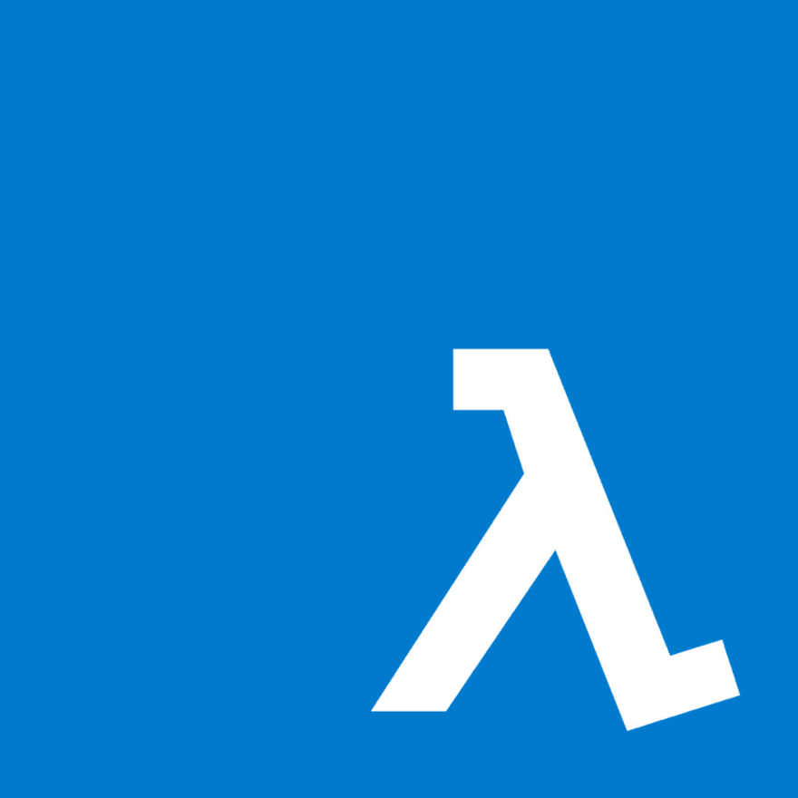
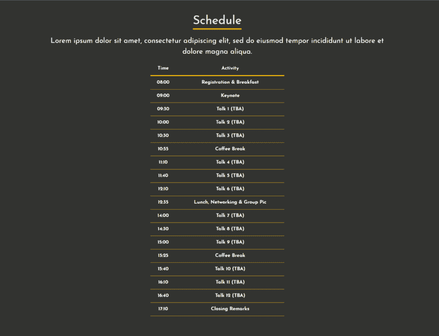

# 数据取入反应了由类型脚本、io-ts 和 fp-ts 支持的函数方式

> 原文：<https://dev.to/remojansen/data-fetching-in-react-the-functional-way-powered-by-typescript-io-ts--fp-ts-ojf>

[](https://res.cloudinary.com/practicaldev/image/fetch/s--uoTXLawZ--/c_limit%2Cf_auto%2Cfl_progressive%2Cq_auto%2Cw_880/https://thepracticaldev.s3.amazonaws.com/i/wi21bxgi8149ukwcsngu.png)

在过去的几天里，我一直在开发一个 React 应用程序。这是一个简单的应用程序，甚至不需要数据库。然而，我不想将所有内容都嵌入到应用程序的 JSX 中，因为其中一些内容会频繁更新。所以我决定使用几个简单的 JSON 文件来存储内容。

该应用程序是一个会议的网站，我想建立一个如下所示的页面:

[](https://res.cloudinary.com/practicaldev/image/fetch/s--7syv8A33--/c_limit%2Cf_auto%2Cfl_progressive%2Cq_auto%2Cw_880/https://thepracticaldev.s3.amazonaws.com/i/g84x1rm643k0pbt4juxd.png)

为了生成一个类似上图的页面，我将数据存储在下面的 JSON 文件中:

```
[
    { "startTime": "08:00", "title": "Registration & Breakfast", "minuteCount": 60 },
    { "startTime": "09:00", "title": "Keynote", "minuteCount": 25 },
    { "startTime": "09:30", "title": "Talk 1 (TBA)", "minuteCount": 25 },
    { "startTime": "10:00", "title": "Talk 2 (TBA)", "minuteCount": 25 },
    { "startTime": "10:30", "title": "Talk 3 (TBA)", "minuteCount": 25 },
    { "startTime": "10:55", "title": "Coffee Break", "minuteCount": 15 },
    { "startTime": "11:10", "title": "Talk 4 (TBA)", "minuteCount": 25 },
    { "startTime": "11:40", "title": "Talk 5 (TBA)", "minuteCount": 25 },
    { "startTime": "12:10", "title": "Talk 6 (TBA)", "minuteCount": 25 },
    { "startTime": "12:35", "title": "Lunch, Networking & Group Pic", "minuteCount": 80 },
    { "startTime": "14:00", "title": "Talk 7 (TBA)", "minuteCount": 25 },
    { "startTime": "14:30", "title": "Talk 8 (TBA)", "minuteCount": 25 },
    { "startTime": "15:00", "title": "Talk 9 (TBA)", "minuteCount": 25 },
    { "startTime": "15:25", "title": "Coffee Break", "minuteCount": 15 },
    { "startTime": "15:40", "title": "Talk 10 (TBA)", "minuteCount": 25 },
    { "startTime": "16:10", "title": "Talk 11 (TBA)", "minuteCount": 25 },
    { "startTime": "16:40", "title": "Talk 12 (TBA)", "minuteCount": 25 },
    { "startTime": "17:10", "title": "Closing Remarks", "minuteCount": 25 }
] 
```

Enter fullscreen mode Exit fullscreen mode

## 问题

虽然使用 JSON 文件使我的生活变得更容易，但在 React 中获取数据是一项非常重复和乏味的任务。如果这还不够糟糕的话，HTTP 响应中包含的数据可能与我们预期的完全不同。

fetch 调用的类型不安全特性对于 TypeScript 用户来说尤其危险，因为它损害了 TypeScript 的许多好处。所以我决定做一点点实验，尝试想出一个不错的自动化解决方案。

在过去的几个月里，我学到了很多关于函数式编程和范畴理论的知识，因为我一直在用 TypeScript 写一本名为 [***的实用函数式编程的书。***](http://www.functionaltypescript.com/)

在这篇博文中，我不打算过多地讨论范畴理论。但是，我需要解释一下基本情况。范畴理论定义了一些在处理副作用时特别有用的类型。

范畴理论类型允许我们使用类型系统来表达潜在的问题，这是有益的，因为它们迫使我们的代码在编译时正确地处理副作用。例如，`Either`类型可以用来表示一个类型可以是一个类型`Left`或者另一个类型`Right`。当我们想要表达某事可能出错时,`Either`类型会很有用。例如，`fetch`调用可以返回一个错误(左)或一些数据(右)。

### A)确保错误得到处理

我想确保我的`fetch`调用的返回是一个`Either`实例，以确保我们不会在没有首先保证响应不是错误的情况下试图访问数据。

我很幸运，因为我不必实现`Either`类型。相反，我可以简单地使用包含在 [fp-ts](https://github.com/gcanti/fp-ts) 开源模块中的实现。`Either`类型由 fp-ts 定义如下:

```
declare type Either<L, A> = Left<L, A> | Right<L, A>; 
```

Enter fullscreen mode Exit fullscreen mode

### B)确保数据经过验证

我想解决的第二个问题是，即使请求返回一些数据，其格式也可能不是应用程序所期望的。我需要一些运行时验证机制来验证响应的模式。我再次感到幸运，因为我可以使用另一个开源库: [io-ts](https://github.com/gcanti/io-ts) ，而不是从头开始实现运行时验证机制。

## 解

> TL；DR 本节介绍了解决方案的实施细节。如果您只对最终的消费者 API 感兴趣，请随意跳过这一部分，直接进入“结果”部分。

io-ts 模块允许我们声明一个模式，用于在运行时执行验证。我们还可以使用 io-ts 从给定的模式中生成类型。下面的代码片段展示了这两个特性:

```
import * as io from "io-ts";

export const ActivityValidator = io.type({
    startTime: io.string,
    title: io.string,
    minuteCount: io.number
});

export const ActivityArrayValidator = io.array(ActivityValidator);

export type IActivity = io.TypeOf<typeof ActivityValidator>;
export type IActivityArray = io.TypeOf<typeof ActivityArrayValidator>; 
```

Enter fullscreen mode Exit fullscreen mode

我们可以使用`decode`方法来验证一些数据是否符合模式。`decode`返回的验证结果是一个`Either`实例，这意味着我们要么得到一个验证错误(左)，要么得到一些有效数据(右)。

我的第一步是包装`fetch` API，因此它使用 fp-ts 和 io-ts 来确保响应是表示错误(左)或一些有效数据(右)的`Either`。通过这样做，`fetch`返回的承诺永远不会被拒绝。相反，它总是被解析为一个`Either`实例:

```
import { Either, Left, Right } from "fp-ts/lib/Either";
import { Type, Errors} from "io-ts";
import { reporter } from "io-ts-reporters";

export async function fetchJson<T, O, I>(
    url: string,
    validator: Type<T, O, I>,
    init?: RequestInit
): Promise<Either<Error, T>> {
    try {
        const response = await fetch(url, init);
        const json: I = await response.json();
        const result = validator.decode(json);
        return result.fold<Either<Error, T>>(
            (errors: Errors) => {
                const messages = reporter(result);
                return new Left<Error, T>(new Error(messages.join("\n")));
            },
            (value: T) => {
                return new Right<Error, T>(value);
            }
        );
    } catch (err) {
        return Promise.resolve(new Left<Error, T>(err));
    }
} 
```

Enter fullscreen mode Exit fullscreen mode

然后我创建了一个名为`Remote`的 React 组件，它将一个`Either`实例作为其属性之一，并带有一些渲染功能。数据可以是`null | Error`或`T`类型的某个值。

当数据为`null`时调用`loading`函数，当数据为`Error`时调用`error`，当数据为`T` :
类型的值时调用`success`函数

```
import React from "react";
import { Either } from "fp-ts/lib/either";

interface RemoteProps<T> {
  data: Either<Error | null, T>;
  loading: () => JSX.Element,
  error: (error: Error) => JSX.Element,
  success: (data: T) => JSX.Element
}

interface RemoteState {}

export class Remote<T> extends React.Component<RemoteProps<T>, RemoteState> {

  public render() {
    return (
      <React.Fragment>
      {
        this.props.data.bimap(
          l => {
            if (l === null) {
              return this.props.loading();
            } else {
              return this.props.error(l);
            }
          },
          r => {
            return this.props.success(r);
          }
        ).value
      }
      </React.Fragment>
    );
  }

}

export default Remote; 
```

Enter fullscreen mode Exit fullscreen mode

上面的组件用于呈现一个`Either`实例，但是它不执行任何数据获取操作。相反，我实现了第二个名为`Fetchable`的组件，它包含一个`url`和一个`validator`以及一些可选的`RequestInit`配置和一些渲染功能。该组件使用`fetch`包装器和`validator`来获取一些数据并对其进行验证。然后，它将得到的`Either`实例传递给`Remote`组件:

```
import { Type } from "io-ts";
import React from "react";
import { Either, Left } from "fp-ts/lib/Either";
import { fetchJson } from "./client";
import { Remote } from "./remote";

interface FetchableProps<T, O, I> {
    url: string;
    init?: RequestInit,
    validator: Type<T, O, I>
    loading: () => JSX.Element,
    error: (error: Error) => JSX.Element,
    success: (data: T) => JSX.Element
}

interface FetchableState<T> {
    data: Either<Error | null, T>;
}

export class Fetchable<T, O, I> extends React.Component<FetchableProps<T, O, I>, FetchableState<T>> {

    public constructor(props: FetchableProps<T, O, I>) {
        super(props);
        this.state = {
            data: new Left<null, T>(null)
        }
    }

    public componentDidMount() {
        (async () => {
            const result = await fetchJson(
                this.props.url,
                this.props.validator,
                this.props.init
            );
            this.setState({
                data: result
            });
        })();
    }

    public render() {
        return (
            <Remote<T>
                loading={this.props.loading}
                error={this.props.error}
                data={this.state.data}
                success={this.props.success}
            />
        );
    }

} 
```

Enter fullscreen mode Exit fullscreen mode

## 结果

我已经发布了前面所有的源代码，作为一个名为 [react-fetchable](https://github.com/remojansen/react-fetchable) 的模块。您可以使用以下命令安装该模块:

```
npm install io-ts fp-ts react-fetchable 
```

Enter fullscreen mode Exit fullscreen mode

然后，您可以导入`Fetchable`组件，如下所示:

```
import { Fetchable } from "react-fetchable"; 
```

Enter fullscreen mode Exit fullscreen mode

此时，我可以实现我在开始时描述的页面:

```
import React from "react";
import Container from "../../components/container/container";
import Section from "../../components/section/section";
import Table from "../../components/table/table";
import { IActivityArray, ActivityArrayValidator } from "../../lib/domain/types";
import { Fetchable } from "react-fetchable";

interface ScheduleProps {}

interface ScheduleState {}

class Schedule extends React.Component<ScheduleProps, ScheduleState> {
  public render() {
    return (
      <Container>
        <Section title="Schedule">
          <p>
            Lorem ipsum dolor sit amet, consectetur adipiscing elit,
            sed do eiusmod tempor incididunt ut labore et dolore magna aliqua.
          </p>
          <Fetchable
            url="/data/schedule.json"
            validator={ActivityArrayValidator}
            loading={() => <div>Loading...</div>}
            error={(e: Error) => <div>Error: {e.message}</div>}
            success={(data: IActivityArray) => {
              return (
                <Table
                  headers={["Time", "Activity"]}
                  rows={data.map(a => [`${a.startTime}`, a.title])}
                />
              );
            }}
          />
        </Section>
      </Container>
    );
  }
}

export default Schedule; 
```

Enter fullscreen mode Exit fullscreen mode

我可以将 URL `/data/schedule.json`和验证器`ActivityArrayValidator`一起传递给`Fetchable`组件。然后，该组件将:

1.  渲染`Loading...`
2.  获取数据
3.  如果数据有效，则呈现表格
4.  呈现错误是数据无法加载不符合验证器

我对这个解决方案很满意，因为它是类型安全的、声明式的，只需要几秒钟就可以启动并运行。我希望你对这篇文章感兴趣，并尝试一下 [`react-fetchable`](https://github.com/remojansen/react-fetchable) 。

还有，如果你对函数式编程或者打字稿感兴趣，请查阅我即将出版的书籍 [***带打字稿的动手函数式编程***](http://www.functionaltypescript.com/) 。

[](http://www.functionaltypescript.com/)