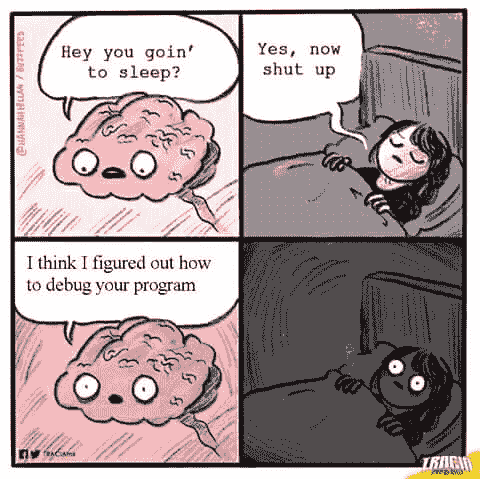
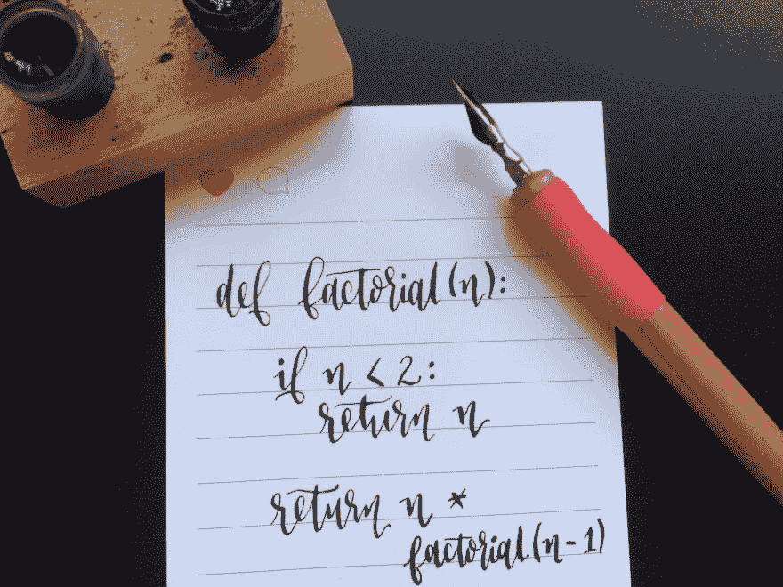
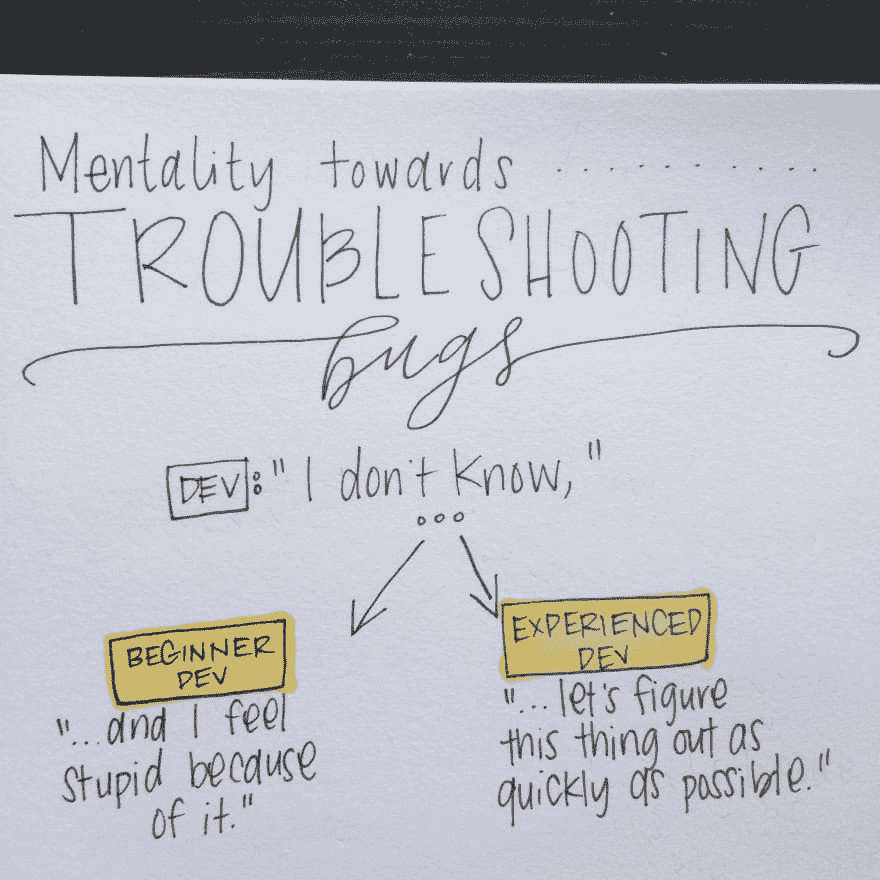

# 在我第一份软件工程工作两年后

> 原文：<https://dev.to/wordswithchung/two-years-into-my-first-software-engineering-job-3dhc>

 
*照片由 [Sonny Ravesteijn 在 Unsplash 上](https://unsplash.com/photos/xyxjKdpUg4I?utm_source=unsplash&utm_medium=referral&utm_content=creditCopyText)*

一眨眼的功夫，我就到了我第一份工程工作的两周年纪念日。我认为这是一个坐下来整理思绪的好机会(因为我从来没有做过一周年纪念的报道)。

### 高层背景信息:

我今年 37 岁，在硅谷工作，拥有英语学士学位，在去 Hackbright Academy(旧金山的一个女子编码训练营；[关于经历的博文](https://medium.com/@wordswithchung/what-i-learned-through-my-three-month-coding-bootcamp-ab5124a91d96))然后成为一名软件工程师。

本着 scrum 龙回顾的精神，让我们列出过去两年中进展顺利、进展不顺利以及可以改进的地方。从负面开始到正面。

### 不顺利:

*   我一直有冒充者综合症。时不时地，我会做一个大的、高度可见的专题，然后想，“天哪，他们为什么要给我这个项目？难道他们不知道我总共才做了不到两年的代码吗！？！！！！！？！？我仍然不知道如何在白板上遍历一个图形。”当这种情况发生时，我让这种想法来来去去，并提醒自己，“钟，这不是你工作的第一个高度可见的功能。你做的最后一个项目，你按时按规格交付了。你很可能也会在这个项目上做同样的事情。”
*   我还在制造虫子。(阅读:神圣的废话，我毕竟是人！)我称之为“工作保障”,以减轻情绪，但它们确实发生了，而且是如此令人羞愧....我正在学习接受这个事实(同时也在努力减少错误)。

### 嗯:

*   我学到了太多。当我刚开始工作时，我在后端团队，不得不学习 Java。(我们在 Hackbright 学的 Python。)六个月后，我结束了后端轮岗，转到了前端团队，不得不学习 Angular，并完全接受了我对 Javascript 的爱恨情仇。我已经:更新了 DB 模式，检查了大量现在存在于产品中的代码(甚至在我们产品的主仪表板中也有很多)，优化了性能代码，创建了 API 端点，在我们的代码库中实现了 Apollo client 以使用 GraphQL。这个清单还在继续。这绝对是我喜欢软件工程的地方，我期待做得更多。
*   我的代码库知识+我的高度组织化倾向([证据](https://dev.to/wordswithchung/managing-your-personal-sprints-wtrello-3adg) ) =荒谬的生产力。我回想起我刚开始的时候，我为每件事都与*做了那么多的挣扎。(*唉 CSS* 。 *Ugh 安装节点*。)现在，我能够在一周的时间内重新构建我们解析大量实体并生成全新页面/组件的方式。一直以来，帮助审查代码、回答问题*和推进项目。万岁，生产力！*
    *   *继续回答问题:记得我说过我在面对客户的岗位上工作了 12 年多吗？原来回答技术问题其实并不需要很多具体的技术知识，而是 1。敏锐的眼光(谢谢，英文 BA)和 2。一船的耐心。当人们过来问我问题时，我会耐心地听(尽管我不知道实际的答案是什么),并且有一半的时间，当他们告诉我的时候，他们会想出答案。或者当他们走过的时候，我会发现一个打字错误或者一个错误的空格，然后嘣！问题解决了。
*   我的努力工作得到了回报，从加薪、升职到[赢得公司层面的“行动价值”奖](https://twitter.com/vinayspai/status/1063159437421043713)。我的贡献得到认可和赞赏真的很好。
*   在决定辞掉舒适的工作，去训练营，开始我不太了解的职业生涯之前(35 岁！)，我有理由担心我会不喜欢它。两年后，我很高兴地告诉大家:我喜欢它！面对电脑的工作非常适合我内向的心(阅读:不面对客户，不要开太多会议)。对于像我这样的人来说，细致的技术性工作本身就具有挑战性，而且非常容易上瘾。

### 改进之处:

*   我觉得我的学习最近停滞不前，这是自然的，但我不应该让这种惰性建立起来。我还有很多想学的东西，我需要分清轻重缓急。
*   我肯定没有尽可能多地手写微不足道的代码:

 
*见上[推特](https://twitter.com/wordswithchung/status/811320080185233408)*

 
*见上 [Instagram](https://www.instagram.com/p/Bo45P0BgIf3/)*

是的，差不多就是这样了。一晃两年过去了。如果我在 Ken Mazaika 的文章中画的这张图仍然成立，我就正式成为一名“有经验的开发者”。呜哇！

 
*见上[推特](https://twitter.com/wordswithchung/status/811320080185233408)*