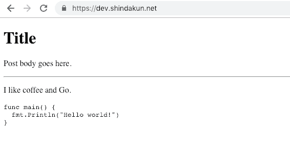

# 尝试学习 Go - Building 开发日志第 2 部分

> 原文：<https://dev.to/shindakun/attempting-to-learn-go---building-dev-log-part-02-179c>

# 创建开发博客

上次我们见面时，我们刚刚读入了一个降价文件并解析了它的内容。不太令人兴奋，但这是建立一个静态站点生成器的必要的第一步。这一次，我们将继续朝着这个目标努力！首先，我们将稍微调整一下我们的结构，引入一个新的函数来对加载的 markdown 进行一些基本测试，然后输出一些真实的 HTML。像往常一样，如果你还没有阅读我推荐的前一篇文章，我们将在这里加入新的代码。

* * *

## 从顶端

我们将从扩大进口开始。我们正在添加`html/template`、`BlackFriday`和`BlueMonday`。如果你读过关于发送电子邮件的[上一篇文章](https://dev.to/shindakun/attempting-to-learn-go---rest-api-and-a-bit-on-templates-4kca)，你应该熟悉`text/template`，`html/template`基本上是同样的东西，只是增加了处理 HTML 的功能。

```
package  main  import  (  "bytes"  "fmt"  "html/template"  "io/ioutil"  "os"  "strings"  "github.com/microcosm-cc/bluemonday"  "github.com/russross/blackfriday"  yaml  "gopkg.in/yaml.v2"  )  const  delim  =  "---" 
```

## 结构变化

我们需要导出结构中的项，这样模板就可以使用输入的数据。请注意，我们还将我们的`PostBody`设置为一种类型的`template.HTML`。我们一会儿会谈到这一点。

```
type  post  struct  {  Title  string  Published  bool  Description  string  Tags  []string  CoverImage  string  Series  string  PostBody  template.HTML  } 
```

## HTML 模板

因为我们正在慢慢地进行，这个版本将只使用一个内置的模板。这离最终结果还很远，但足以表明我们想在这篇文章中完成什么。我们将在代码的几次迭代中从文件中加载模板。

```
var  templ  =  `<!DOCTYPE html>
<html lang="en">
  <head>
    {{.Title}}
    <meta charset="utf-8">
    <meta http-equiv="X-UA-Compatible" content="IE=edge">
    <meta name="HandheldFriendly" content="True">
    <meta name="viewport" content="width=device-width, initial-scale=1.0">
    <meta name="referrer" content="no-referrer-when-downgrade" />
    <meta name="description" content="{{.Description}}" />
  </head>
  <body>
    <div class="post">
      <h1>{{.Title}}</h1>
      {{.PostBody}}
    </div>
  </body>
</html>` 
```

## 如果是零则慌

到目前为止，`loadFile()`函数没有任何变化，所以我们将跳过它到`isNil()`。如果你读了以前的帖子，你可能会想起，正如它所写的那样，如果前面的事情没有设置好，就太容易引发`panic`。`isNil()`是一个更大的努力的开始，以确保我们的传入数据是固定的。我们将扩展它，以返回一些适当的错误，而不只是轰炸和停止执行。目前，我们只在`main()`使用它，但是，并不是真的，因为它现在被注释掉了。(*咳嗽*)

```
func  loadFile(s  string)  (b  []byte,  err  error)  {  f,  err  :=  ioutil.ReadFile(s)  if  err  !=  nil  {  return  nil,  err  }  return  f,  nil  }  func  isNil(i  interface{})  bool  {  if  i  !=  nil  {  return  false  }  return  true  }  func  main()  {  f,  err  :=  loadFile("test.md")  if  err  !=  nil  {  panic(err)  }  b  :=  bytes.Split(f,  []byte(delim))  if  len(b)  <  3  ||  len(b[0])  !=  0  {  panic(fmt.Errorf("Front matter is damaged"))  }  m  :=  make(map[string]interface{})  err  =  yaml.Unmarshal([]byte(b[1]),  &m)  if  err  !=  nil  {  msg  :=  fmt.Sprintf("error: %v\ninput:\n%s",  err,  b[1])  panic(msg)  }  p  :=  &post{} 
```

## 为零未使用

在这里你可以看到我们使用`isNil()`代码的开始。我对它不是很满意，但是我时间不够，所以它还在工作中。我认为现在没问题，因为我们仍然在使用一个“已知良好”的测试文件。我很快就要仔细看看这部分了。

```
 // if isNil(m["title"]) {  // in final we wouldn't actually panic just reject the file and continue on  //   panic(err)  // } else {  p.Title  =  m["title"].(string)  p.Published  =  m["published"].(bool)  p.Description  =  m["description"].(string)  // TODO: Strip space after comma prior to parse?  tmp  :=  m["tags"].(string)  p.Tags  =  strings.Split(tmp,  ", ")  p.CoverImage  =  m["cover_image"].(string)  p.Series  =  m["series"].(string) 
```

## 帖子正文

上一次，我提出了如何继续使用我们已经加载的文件来获取 post 主体的问题。嗯，这是一种方法！我们在`f`中有文件数据，它是一个`[]byte`，所以我们可以取我们的 YAML 头`b[1]`的长度，并把它加到两倍于前面的物质定界符(`---`)的长度。我们以此为起点，直到`f`结束，这给了我们所需要的`f[x:]`。对于“生产”来说，这段代码可能太脆弱了，但现在我们将生活在危险之中，分割检查和 YAML 需要正确解析的事实至少应该给我们一些覆盖面——我认为我们需要在未来重新审视这一点。

```
 pBody  :=  f[len(b[1])+(len(delim)*2):] 
```

现在我们需要将它传递给`blackfriday`。现在，我们只是让`blackfriday`的默认 markdown 解析器完成它的工作，并返回给我们一个`[]byte`，我们将它返回并传递给`bluemonday`。我几乎完全按照 [`blackfriday`自述文件](https://github.com/russross/blackfriday)中的建议来做这件事，确保使用策略来保留受保护的代码块。 [`bluemonday`](https://github.com/microcosm-cc/bluemonday) 用于 HTML 清理。使用这个应该有助于确保我们帖子中任何无意的恶意内容被清除。最后，我们把所有东西放在一起，转储到标准输出。所以现在，如果我们碰巧在服务器上，我们可以运行`go run main.go > /var/www/dev.shindakun.net/index.html`并拥有至少一个单页的静态网站。不太令人兴奋，但我们正在稳步前进。

```
 out  :=  blackfriday.Run(pBody)  bm  :=  bluemonday.UGCPolicy()  bm.AllowAttrs("class").Matching(regexp.MustCompile("^language-[a-zA-Z0-9]+$")).OnElements("code")  p.PostBody  =  template.HTML(bm.SanitizeBytes(out))  t  :=  template.Must(template.New("msg").Parse(templ))  err  =  t.Execute(os.Stdout,  p)  if  err  !=  nil  {  panic(err)  }  } 
```

* * *

## 输出

[](https://res.cloudinary.com/practicaldev/image/fetch/s--0I0_sQ02--/c_limit%2Cf_auto%2Cfl_progressive%2Cq_auto%2Cw_880/https://thepracticaldev.s3.amazonaws.com/i/5mq3bs93wno7j0j934ea.png)

没错！我们的劳动成果目前(写这篇文章的时候)正在 dev.shindakun.net 直播。

* * *

## 下次

我们已经做了很多基础工作，但是我们还有很长的路要走。下一次，我希望能够实现多个文件的加载和输出。这应该让我们能够后退一步，进行更多的错误处理。我可能也应该开始考虑增加测试了。

* * *

你可以在 GitHub 上的 repo 中找到这个和大多数其他试图学习围棋的帖子的代码。

##  [【新达昆】](https://github.com/shindakun) / [ atlg](https://github.com/shindakun/atlg)

### 我在 dev.to 上发布的“尝试学习围棋”帖子的来源报告

<article class="markdown-body entry-content p-5" itemprop="text">

# 尝试学习围棋

在这里你可以找到我为尝试学习围棋而写的代码，这些代码是我在 [Dev.to](https://dev.to/shindakun) 上写的。

## 帖子索引

| 邮政 | 密码 |
| --- | --- |
| [制作下载器第 01 部分](https://dev.to/shindakun/attempting-to-learn-go---building-a-downloader-part-01-44gl) | - |
| [制作下载器第 02 部分](https://dev.to/shindakun/attempting-to-learn-go---building-a-downloader-part-02-2k7i) | - |
| [制作下载器第 03 部分](https://dev.to/shindakun/attempting-to-learn-go---building-a-downloader-part-03-2214) | - |
| [制作下载器第 4 部分](https://dev.to/shindakun/attempting-to-learn-go---building-a-downloader-part-04-3ln9) | - |
| [制作下载器第 05 部分](https://dev.to/shindakun/attempting-to-learn-go---building-a-downloader-part-05-44o) | - |
| [使用 REST API](https://dev.to/shindakun/attempting-to-learn-go---consuming-a-rest-api-5c7g) | [src](https://raw.githubusercontent.com/shindakun/atlg/master//go-api-01/main.go) |
| [继续休息冒险](https://dev.to/shindakun/attempting-to-learn-go---continuing-rest-adventures-2l4l) | [src](https://raw.githubusercontent.com/shindakun/atlg/master//go-api-02/main.go) |
| [现在发送休息请求](https://dev.to/shindakun/attempting-to-learn-go---now-sending-rest-requests-akp) | [src](https://raw.githubusercontent.com/shindakun/atlg/master//go-api-03/main.go) |
| [REST API 和模板上的位](https://dev.to/shindakun/attempting-to-learn-go---rest-api-and-a-bit-on-templates-4kca) | [src](https://raw.githubusercontent.com/shindakun/atlg/master//go-api-04/main.go) |
| [再次通过 API 发送电子邮件](https://dev.to/shindakun/attempting-to-learn-go---sending-email-via-api-again-2e4e) | [src](https://raw.githubusercontent.com/shindakun/atlg/master//go-api-05/main.go) |
| [让我们模块化吧！](https://dev.to/shindakun/attempting-to-learn-go---lets-get-modular-390i) | [src](https://github.com/shindakun/mailgunner) |
| [让我们再一次模块化！](https://dev.to/shindakun/attempting-to-learn-go---lets-get-modular---again-10cd) | [src](https://github.com/shindakun/mailgunner) |
| [构建开发日志第 1 部分](https://dev.to/shindakun/attempting-to-learn-go---building-dev-log-part-01-1c3m) | [src](https://raw.githubusercontent.com/shindakun/atlg/master//go-devsite-01/main.go) |
| [构建开发日志第 2 部分](https://dev.to/shindakun/attempting-to-learn-go---building-dev-log-part-02-179c) | [src](https://raw.githubusercontent.com/shindakun/atlg/master//go-devsite-02/main.go) |
| [构建开发日志第 3 部分](https://dev.to/shindakun/attempting-to-learn-go---building-dev-log-part-03-7lk) | [src](https://raw.githubusercontent.com/shindakun/atlg/master//go-devsite-03/main.go) |
| [构建开发日志第 4 部分](https://dev.to/shindakun/attempting-to-learn-go---building-dev-log-part-04-2bok) | [src](https://raw.githubusercontent.com/shindakun/atlg/master//go-devsite-04/main.go) |
| [构建开发日志第 5 部分](https://dev.to/shindakun/attempting-to-learn-go---building-dev-log-part-05-4mo1) | [src](https://raw.githubusercontent.com/shindakun/atlg/master//go-devsite-05/main.go) |
| [按扩展名 01 列出文件](https://dev.to/shindakun/attempting-to-learn-go---listing-files-by-extension-1n10) | [src](https://raw.githubusercontent.com/shindakun/atlg/master//go-sort-01/main.go) |
| [按扩展名 02 列出文件](https://dev.to/shindakun/attempting-to-learn-go---sorting-and-moving-files-by-extension-227j) | [src](https://raw.githubusercontent.com/shindakun/atlg/master//go-sort-01/main.go) |
| [开发至 API 01](https://dev.to/shindakun/interacting-with-the-devto-article-api-4g34) | [src](https://raw.githubusercontent.com/shindakun/atlg/master//go-devtoapi-01/main.go) |
| [开发至 API 02](https://dev.to/shindakun/interacting-with-the-devto-article-api---again-sort-of-2o8g) | 参见上面的代码 |

</article>

[View on GitHub](https://github.com/shindakun/atlg)

* * *

| 喜欢这篇文章吗？ |
| --- |
| 给我买杯咖啡怎么样？ |

* * *