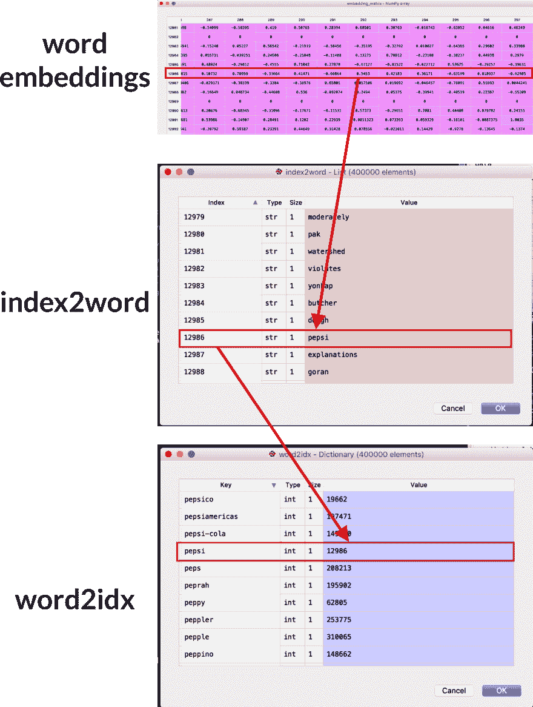
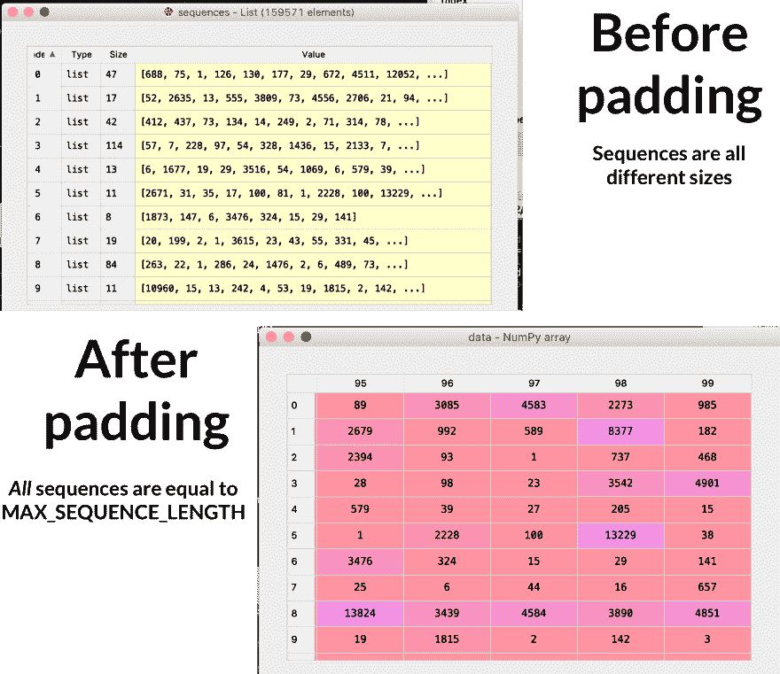

# 训练有毒评论检测器

> 原文：<https://dev.to/ladvien/training-a-toxic-comment-detector-1lim>

我正在写学习笔记，学习使用卷积神经网络(CNN)实现“有毒评论”检测器。这是一个跨互联网的常见项目，然而，我看到的关于这个问题的文章遗漏了一些。所以，我试图增加公共知识，而不是写一个全面的教程。

一个常见的遗漏是数据经过预处理时的样子。我将尝试展示数据在落入神经网络黑洞之前的样子。然而，在回顾 CNN 的设置之前，我会停下来，因为这在其他地方会解释得更清楚。不过，我已经把所有的原始代码、相关的项目链接、教程链接和其他资源放在了底部。

## 代码

#### 代码:进口

```
from __future__ import print_function

import numpy as np
from keras.preprocessing.text import Tokenizer
from keras.preprocessing.sequence import pad_sequences
from keras.layers import Dense, Input, GlobalMaxPooling1D, Conv1D, Embedding, MaxPooling1D
from keras.models import Model
from keras.initializers import Constant
import gensim.downloader as api
import pandas as pd
import matplotlib.pyplot as plt
from sklearn.metrics import roc_auc_score 
```

Enter fullscreen mode Exit fullscreen mode

上面的代码包括几个需要下载的包。最简单的方法是使用 [pip](https://www.w3schools.com/python/python_pip.asp) 。

```
pip install keras
pip install gensim
pip install pandas 
```

Enter fullscreen mode Exit fullscreen mode

#### 代码:变量

```
BASE_DIR = 'your project directory'
TRAIN_TEXT_DATA_DIR = BASE_DIR + 'train.csv'
MAX_SEQUENCE_LENGTH = 100
MAX_NUM_WORDS = 20000
EMBEDDING_DIM = 300
VALIDATION_SPLIT = 0.2 
```

Enter fullscreen mode Exit fullscreen mode

上述变量定义了预处理动作和神经网络。

#### 火车 _ 文本 _ 数据 _ 目录

包含数据文件`train.csv`的目录

#### 最大序列长度

toxic_comment 数据集包含从维基百科收集的评论。MAX_SEQUENCE_LENGTH 在预处理阶段用于截断过长的注释。也就是大于`MAX_SEQUENCE_LENGTH`。例如，类似于
的评论

```
You neeed to @#$ you mother!$@#$&... 
```

Enter fullscreen mode Exit fullscreen mode

可能不需要太多的网络来辨别这是一个有毒的评论。此外，如果我们围绕最长的评论创建网络，它将变得不必要的庞大和缓慢。就像人类的大脑一样，我们需要提供尽可能少的信息来做出一个好的决定。

#### 最大字数

这个变量是包含的最大单词数，或者说是词汇量。

就像截断序列长度一样，最大词汇表不应该包含太多。数字`20,000`来自一项“研究”,称一个普通人只用 2 万个单词。当然，我还没有找到一个主要来源来说明这一点——不是说它不存在，而是我还没有找到。(半心半意的搜索结果在附录。)

无论如何，这似乎有助于我们证明保持神经网络的灵活性。

#### 嵌入 _DIM

在我的代码中，我使用了 [gensim](https://radimrehurek.com/gensim/) 来下载预先训练好的单词嵌入。但是要注意，不是所有预先训练的嵌入都有相同的维数。该变量定义了所用嵌入的大小。**请注意，如果您使用除了`glove-wiki-gigaword-300`之外的嵌入，您将需要改变这个变量来匹配。**

#### 验证 _ 拆分

Keras 中的一个助手函数会将我们的数据分成一个`test`和`validation`。该百分比表示保留多少数据进行验证。

#### 代码:加载嵌入

```
print('Loading word vectors.')
# Load embeddings info = api.info()
embedding_model = api.load("glove-wiki-gigaword-300") 
```

Enter fullscreen mode Exit fullscreen mode

`info`对象是可用的 [gensim](https://radimrehurek.com/gensim/) 嵌入列表。您可以使用格式为`api.load('name-of-desired-embedding')`的任何列出的嵌入。gensim 的`api.load`的一个很好的特性是，它会自动从互联网上下载嵌入内容，并将它们加载到 Python 中。当然，一旦下载完毕， [gensim](https://radimrehurek.com/gensim/) 就会加载本地副本。这使得试验不同的嵌入层变得容易。

#### 代码:流程嵌入

```
index2word = embedding_model.index2word
vocab_size = len(embedding_model.vocab)
word2idx = {}
for index in range(vocab_size):
    word2idx[index2word[index]] = index 
```

Enter fullscreen mode Exit fullscreen mode

两个字典`index2word`和`word2idx`是嵌入的关键。

`word2idx`是一个字典，其中的键是嵌入中包含的单词，值是它们表示的整数。

```
word2idx = {
    "the": 0,
    ",": 1,
    ".": 2,
    "of": 3,
    "to": 4,
    "and": 5,
    ....
    "blah": 12984,
    ...
} 
```

Enter fullscreen mode Exit fullscreen mode

`index2word`是一个列表，其中的值是单词，单词在字符串中的位置代表它在`word2idx`中的索引。

```
index2word = ["the", ",", ".", "of", "to", "and", ...] 
```

Enter fullscreen mode Exit fullscreen mode

这些将被用来把我们的注释字符串转换成整数向量。

在这段代码之后，我们应该有三个对象。

1.  `embedding_model` -预先训练好的词与词之间的关系，这是一个 300 x 400，000 的矩阵。
2.  `index2word` -包含`key-value`对的字典，关键字是字符串形式的单词，值是表示单词的整数。注意，这些整数对应于`embedding_model`中的索引。
3.  包含所有单词的列表。索引对应于单词在单词嵌入中的位置。本质上是`index2word`的反转。

#### 代码:获取有毒评论标签

```
print('Loading Toxic Comments data.')
with open(TRAIN_TEXT_DATA_DIR) as f:
    toxic_comments = pd.read_csv(TRAIN_TEXT_DATA_DIR)

print('Getting Comment Labels.')
prediction_labels = ["toxic", "severe_toxic", "obscene", "threat", "insult", "identity_hate"]
labels = toxic_comments[prediction_labels].values 
```

Enter fullscreen mode Exit fullscreen mode

这将把`toxic_comment.csv`加载为一个名为`toxic_comments`的熊猫数据帧。然后，我们使用它们的列名获取所有的注释标签。这就变成了第二个叫做`labels`的数字矩阵。

我们将使用`toxic_comments`数据框中的文本来预测`labels`矩阵中的数据。也就是说，`toxic_comments`将是我们的`x_train`，而`labels`将是我们的`y_train`。

您可能会注意到，标签也包含在我们的`toxic_comments`中。但是它们将不会被使用，因为我们只是将`comment_text`列作为我们的`sequences`。

#### `toxic_comments`数据帧

|  | 身份证明（identification） | 评论 _ 文本 | 有毒的 | 严重 _ 有毒 | 猥亵的 | 威胁 | 侮辱 | 身份 _ 仇恨 |
| --- | --- | --- | --- | --- | --- | --- | --- | --- |
| five | 00025465d4725e87 | 我也祝贺你，好好使用工具。讨论 | Zero | Zero | Zero | Zero | Zero | Zero |
| six | 0002bcb3da6cb337 | 在你破坏我的工作之前，混蛋 | one | one | one | Zero | one | Zero |
| seven | 00031b1e95af7921 | 你对马特·希尔文顿文章的恶意破坏已经被撤销了。请不要再做了，否则你将被禁止。 | Zero | Zero | Zero | Zero | Zero | Zero |

#### `labels` ( `y_train` ) numpy 矩阵

| Zero | one | Two | three | four | five |
| --- | --- | --- | --- | --- | --- |
| Zero | Zero | Zero | Zero | Zero | Zero |
| one | one | one | Zero | one | Zero |
| Zero | Zero | Zero | Zero | Zero | Zero |
| Zero | Zero | Zero | Zero | Zero | Zero |

#### 代码:将注释转换为序列

```
print('Tokenizing and sequencing text.')

tokenizer = Tokenizer(num_words=MAX_NUM_WORDS)
tokenizer.fit_on_texts(toxic_comments['comment_text'].fillna("<DT>").values)
sequences = tokenizer.texts_to_sequences(toxic_comments['comment_text'].fillna("<DT>").values)
word_index = tokenizer.word_index

print('Found %s sequences.' % len(sequences)) 
```

Enter fullscreen mode Exit fullscreen mode

`Tokenizer`对象来自于`Keras` API。它获取大量文本，清洗它们，然后将它们转换成唯一的整数值。

*   [keras . preprocessing . text . tokenizer](https://faroit.github.io/keras-docs/1.2.2/preprocessing/text/)

`num_words`参数告诉记号赋予器只保留高于这个阈值的词频。这使得有必要在使用标记器之前对目标文本运行`fit()`。fit 函数将确定每个单词在所有提供的文本中出现的次数，然后按频率排序。这个频率等级可以在`tokenizer.word_index`属性中找到。

例如，查看下面的字典，如果`num_words` = 7，则“I”之后的所有单词都将被排除。

```
{
    "the": 1,
    "to": 2,
    "of": 3,
    "and": 4,
    "a": 5,
    "you": 6,
    "i": 7,
    "is": 8,
    ...
    "hanumakonda": 210334,
    "956ce": 210335,
    "automakers": 210336,
    "ciu": 210337
} 
```

Enter fullscreen mode Exit fullscreen mode

此外，当我们加载数据时，我们用一个伪令牌(即

"). This probably isn't the *best* way to handle missing values, however, given the amount of data, it's probably best to try and train the network using this method. Then, come back and handle `na` values more strategically. Diminishing returns and all that.

#### 代码:填充

```
data = pad_sequences(sequences, maxlen=MAX_SEQUENCE_LENGTH) 
```

这是一个简单的问题。它填充了我们的序列，所以它们都是相同的长度。 [pad_sequences](https://keras.io/preprocessing/sequence/) 函数是 Keras 库的一部分。一些重要的参数有默认值:`padding`和`truncating`。

以下是 Keras docs 的解释:

> 填充:字符串，“前”或“后”:在每个序列之前或之后填充。
> 
> 截断:String，“pre”或“post”:从大于 maxlen 的序列中移除值，无论是在序列的开头还是结尾。

两个参数都默认为`pre`。

最后，`maxlen`参数控制填充和截断发生的位置。我们用我们的`MAX_SEQUENCE_LENGTH`变量来设置它。

[](https://res.cloudinary.com/practicaldev/image/fetch/s--6P1GTm5o--/c_limit%2Cf_auto%2Cfl_progressive%2Cq_auto%2Cw_880/https://ladvien.cimg/embeddings_3.png)

#### 代码:应用嵌入

```
num_words = min(MAX_NUM_WORDS, len(word_index)) + 1
embedding_matrix = np.zeros((num_words, EMBEDDING_DIM))
for word, i in word_index.items():
    try:
        embedding_vector = embedding_model.get_vector(word)
        if embedding_vector is not None:
            embedding_matrix[i] = embedding_vector
    except:
        continue 
```

这就是事情变好的地方。上面的代码将从我们的`tokenizer`中取出所有单词，查找每个单词的单词嵌入(向量)，然后将其添加到`embedding matrix`。这个`embedding_matrix`将被转换成一个`keras.layer.Embeddings`物体。

*   [嵌入](https://keras.io/layers/embeddings/)

我认为`Embedding`层是位于我们神经网络顶端的转换工具。它接受表示单词的整数，并输出单词嵌入向量。然后，它将向量传递给神经网络。简单！

也许最好是直观地了解一下正在发生的事情。不过先说一下`for-loop`之前的代码。

```
num_words = min(MAX_NUM_WORDS, len(word_index)) + 1 
```

这将得到嵌入层中要添加的最大单词数。如果它小于我们的“普通英语使用者的词汇量”——20，000——我们将使用我们的分词器中找到的所有单词。否则，`for-loop`将在`num_words`满足后停止。请记住，`tokenizer`已经按照单词出现的频率对它们进行了排序——因此，丢失的单词并不重要。

```
embedding_matrix = np.zeros((num_words, EMBEDDING_DIM)) 
```

这初始化了我们的 embedding_matrix，它是一个所有值都设置为零的`numpy`对象。注意，如果`EMBEDDING_DIM`的大小与加载的单词嵌入的大小不匹配，代码将会执行，但是您将会得到一个错误的嵌入矩阵。此外，你可能不会注意到，直到你的网络没有训练。我的意思是，这并没有发生在*我*身上——我只是猜测这可能发生在*某人*身上。

```
for word, i in word_index.items():
    try:
        embedding_vector = embedding_model.get_vector(word)
        if embedding_vector is not None:
            embedding_matrix[i] = embedding_vector
    except:
        continue 
```

神奇的事情就发生在这里。`for-loop`遍历`tokenizer`对象`word_index`中的单词。它试图在单词嵌入中找到这个单词，如果找到了，它就把这个向量添加到嵌入矩阵中与它在`word_index`对象中的索引相对应的一行上。

迷茫？我也是。让我们想象一下。

让我们在代码中记住一个词:“of”。

```
for word, i in word_index.items(): 
```

到现在为止,`for-loop`是两个单词。已经添加了“The”和“to”这两个词。因此，对于这个迭代，`word`=‘of’和`i` = 2。

```
embedding_vector = embedding_model.get_vector(word) 
```

单词“of”的单词嵌入是

```
-0.076947, -0.021211, 0.21271, -0.72232, -0.13988, -0.12234, ... 
```

该列表包含在一个`numpy.array`对象中。

```
embedding_matrix[i] = embedding_vector 
```

最后，表示“of”的单词嵌入向量被添加到嵌入矩阵的第三行(矩阵索引从 0 开始)。

添加“of”一词后，嵌入矩阵应该是这样的。(第一列是为了可读性而添加的。)

| 单词 | one | Two | three | four | ... |
| --- | --- | --- | --- | --- | --- |
| 这 | Zero | Zero | 0 | Zero | ... |
| 到 | 0.04656 | 0.21318 | -0.0074364 | -0.45854 | ... |
| 关于 | -0.25756 | -0.057132 | -0.6719 | -0.38082 | ... |
| ... | ... | ... | ... | ... | ... |

此外，为了深入观察，请查看上面的图片。标有“单词嵌入”的图片是*实际上是*我们`embedding_matrix`的输出。最大的不同？在我们的语料库(包含在 toxic_comments 列中的所有文本)中找不到的`gensim` embedding_model 中的单词向量已经被替换为全零。

[](https://res.cloudinary.com/practicaldev/image/fetch/s--6yPluDsQ--/c_limit%2Cf_auto%2Cfl_progressive%2Cq_auto%2Cw_880/https://ladvien.cimg/embeddings_2.png)

#### 代码:创建嵌入层

```
embedding_layer = Embedding(len(word2idx),
                            EMBEDDING_DIM,
                            embeddings_initializer=Constant(embedding_matrix),
                            input_length=MAX_SEQUENCE_LENGTH,
                            trainable=False) 
```

这里我们正在创建神经网络的第一层。传递给 Keras `Embedding`类的主要参数是我们在上面创建的`embedding_matrix`。然而，我们必须定义`embedding_layer`的其他几个属性。请记住，我们的`embedding_layer`将一个表示单词的整数作为输入，并输出一个向量，这就是单词嵌入。

首先，`embedding_layers`需要知道输入尺寸。输入维度是我们在本次培训课程中考虑的字数。这可以通过我们的`word2idx`对象的长度来找到。所以，`len(word2idx)`返回要考虑的总字数。

关于层的输入，有两个`keras.layers.Embedding`类初始化器的“输入”参数，这可能会引起混淆。他们是`input`和`input_length`。`input`是提供给该层的可能值的数量。`input_length`是一个序列中要传递多少个值。

以下是 Keras 文档中的描述:

`input`

> int > 0。词汇的大小，即最大整数索引+ 1。

`input_length`

> 输入序列的长度，当它是常数时。如果要连接上游的展平然后密集图层，则此参数是必需的(没有此参数，将无法计算密集输出的形状)。

在我们的例子中，`input`是词汇量，`input_length`是一个序列中的单词数，应该是`MAX_SEQUENCE_LENGTH`。这也是我们填充短于`MAX_SEQUENCE_LENGTH`的注释的原因，因为嵌入层期望一致的大小。

接下来，`embedding_layers`需要知道输出的尺寸。输出将是一个单词嵌入向量，其*应该*与从 [gensim](https://radimrehurek.com/gensim/) 库中加载的单词嵌入大小相同。

我们用`EMBEDDING_DIM`变量定义了这个尺寸。

最后，`training`选项被设置为`False`,所以当我们训练我们的`toxic_comment`检测器时，单词嵌入关系不会更新。你可以把它设置为`True`，但是说实话，我们会比谷歌做得更好吗？

#### 代码:拆分数据

```
nb_validation_samples = int(VALIDATION_SPLIT * data.shape[0])
x_train = data[:-nb_validation_samples]
y_train = labels[:-nb_validation_samples]
x_val = data[-nb_validation_samples:]
y_val = labels[-nb_validation_samples:] 
```

在这里，我们将数据作为输入。我们将`data`转换成`x_train`和`x_val`。`labels`数据帧变为`y_train`和`y_val`。这里标志着**预处理的结束。**

但是！在您点击离开之前，让我们回顾一下:

1.  加载单词嵌入。这些都是预先训练好的单词关系。它是一个 300 x 400，000 的矩阵。
2.  创建两个查找对象:`index2word`和`word2idx`
3.  获取我们的`toxic_comment`和`labels`数据。
4.  将`toxic_comments`数据框中的`comments`列转换成`sequences`列表。
5.  创建一个`tokenizer`对象，并使其适合`sequences`文本
6.  填充所有序列，使它们大小相同。
7.  在`sequences`中查找每个唯一单词的单词嵌入向量。将单词嵌入向量存储在 th `embedding_matrix`中。如果在嵌入中找不到这个单词，那么让索引全为零。此外，将嵌入矩阵限制为 20，000 个最常用的单词。
8.  从`embedding_matrix`创建一个 Keras `Embedding`层
9.  拆分数据用于培训和验证。

仅此而已。准备好的`embedding_layer`将成为网络中的第一层。

#### 代码:培训

正如我在开始时所说的，我不打算回顾训练网络，因为有许多更好的解释-我将在附录中链接它们。然而，对于那些感兴趣的人，这里是代码的其余部分。

```
input_ = Input(shape=(MAX_SEQUENCE_LENGTH,))
x = embedding_layer(input_)
x = Conv1D(128, 5, activation='relu')(x)
x = MaxPooling1D(5)(x)
x = Conv1D(128, 5, activation='relu')(x)
x = MaxPooling1D(5)(x)
x = Conv1D(128, 3, activation='relu')(x)
x = GlobalMaxPooling1D()(x)
x = Dense(128, activation='relu')(x)
output = Dense(len(prediction_labels), activation='sigmoid')(x)
model = Model(input_, output)
model.compile(loss='binary_crossentropy',
              optimizer='rmsprop',
              metrics=['acc'])

print('Training model.')
# happy learning! history = model.fit(x_train, y_train, epochs=2, batch_size=512, validation_data=(x_val, y_val)) 
```

哦！还有一点我想回顾一下，这是大多数其他文章都没有提到的。预测。

#### 代码:预测

我的意思是，训练 CNN 很有趣，但是如何使用它呢？本质上，它归结为重复上述步骤，但用更少的数据。

```
def create_prediction(model, sequence, tokenizer, max_length, prediction_labels):
    # Convert the sequence to tokens and pad it.
    sequence = tokenizer.texts_to_sequences(sequence)
    sequence = pad_sequences(sequence, maxlen=max_length)

    # Make a prediction
    sequence_prediction = model.predict(sequence, verbose=1)

    # Take only the first of the batch of predictions
    sequence_prediction = pd.DataFrame(sequence_prediction).round(0)

    # Label the predictions
    sequence_prediction.columns = prediction_labels
    return sequence_prediction

# Create a test sequence sequence = ["""
            Put your test sentence here.
            """]
prediction = create_prediction(model, sequence, tokenizer, MAX_SEQUENCE_LENGTH, prediction_labels) 
```

上面的函数需要以下参数:

*   预先训练好的`model`。这是我们刚刚训练的 Keras 模型。
*   你想确定它是否“有毒”。
*   `tokenizer`，用于以与训练序列相同的方式对预测序列进行编码。
*   `max_length`必须与训练序列的最大长度相同
*   `prediction_labels`是包含预测标签的人类可读标签的字符串列表(例如“有毒”、“严重有毒”、“侮辱”等)。)

实际上，该函数提取了我们预处理的所有重要部分，并在预测序列中重用它们。

您可以调整的一个功能是`.round(0)`。我把这个放在这里，把预测转换成二进制。也就是说，如果对一个序列的预测是`.78`，它将被向上舍入到`1`。这就是预测的二进制本质。一个评论要么有毒，要么没有。不是`0`就是`1`。

嗯，这就是我得到的。谢谢你坚持到底。如果你有任何问题让我知道。

### 附录

#### 全码

*   [toxic_comment.py](https://github.com/Ladvien/nn_learning_cnn_toxic_comment)

#### 教程

*   [用于有毒评论分类的卷积神经网络(学术)](https://arxiv.org/pdf/1802.09957.pdf)
*   [Kaggle 项目使用 CNN 和毒性数据](https://www.kaggle.com/c/jigsaw-toxic-comment-classification-challenge/kernels?sortBy=relevance&group=everyone&search=cnn&page=1&pageSize=20&competitionId=8076)
*   [使用词向量的教程](https://www.depends-on-the-definition.com/guide-to-word-vectors-with-gensim-and-keras/)
*   [Keras 关于使用预训练单词嵌入的教程](https://blog.keras.io/using-pre-trained-word-embeddings-in-a-keras-model.html)

如果您想了解更多关于 [gensim](https://radimrehurek.com/gensim/) 以及如何与 Keras 配合使用。

*   [取决于定义](https://www.depends-on-the-definition.com/guide-to-word-vectors-with-gensim-and-keras/)

#### 数据

数据由 Kaggle 托管。

*   [维基百科的“有毒评论”数据](https://www.kaggle.com/c/jigsaw-toxic-comment-classification-challenge/data)

请注意，您必须注册一个 Kaggle 帐户。

#### 一般人的词汇量

词汇量的主要来源:

*   我们知道多少单词？词汇量的实际估计取决于单词定义、语言输入程度和参与者的年龄
*   接受性词汇可以有多大？
*   [对词汇量进行有意义的定义](https://journals.sagepub.com/doi/abs/10.1080/10862969109547729)
*   [重新审视词汇量:词汇量和学习成绩之间的联系](http://centaur.reading.ac.uk/29879/)
*   我们知道多少单词？词汇量的实际估计取决于单词定义、语言输入程度和参与者的年龄