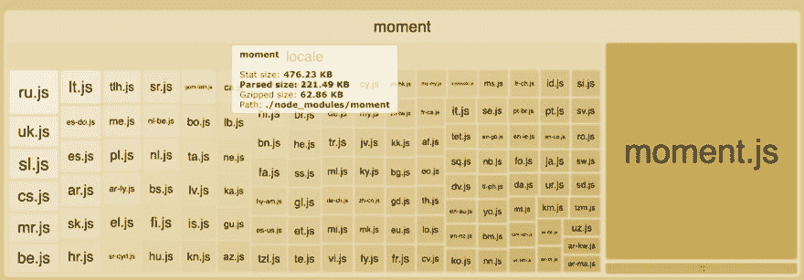
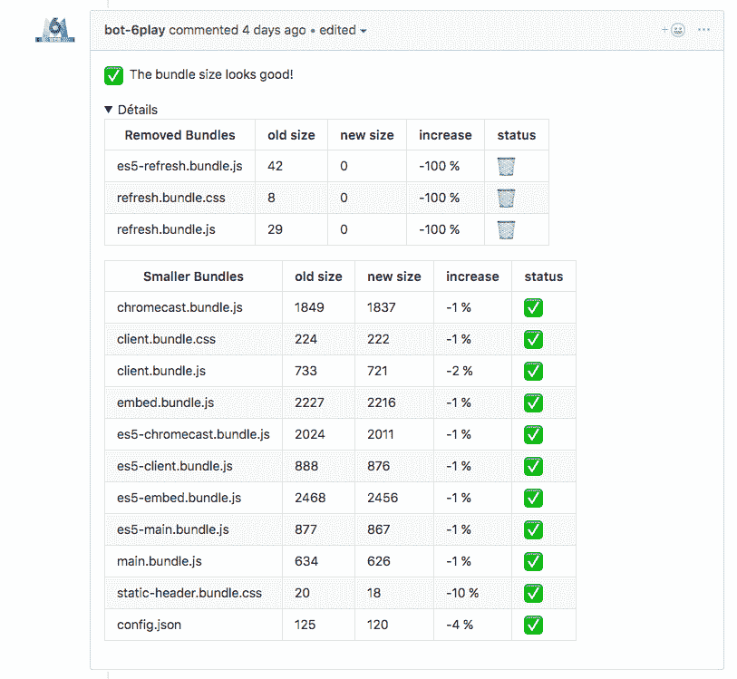
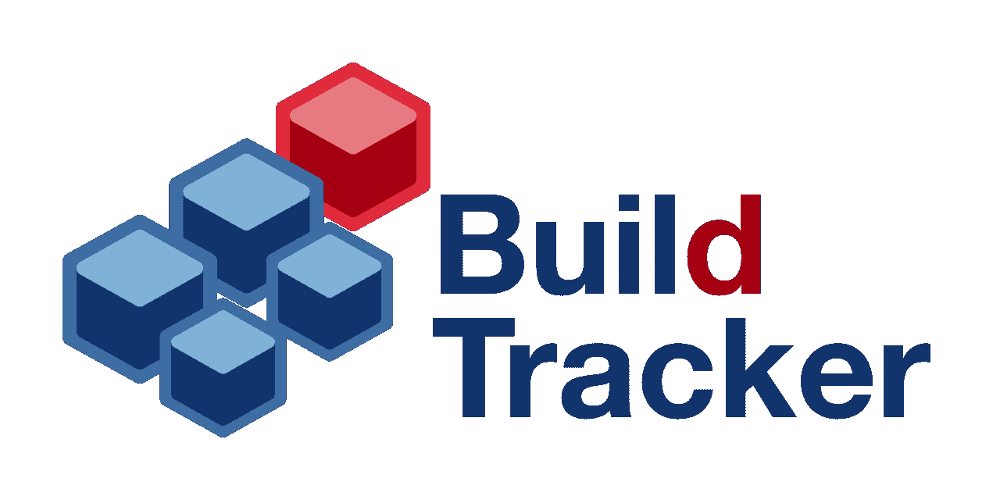
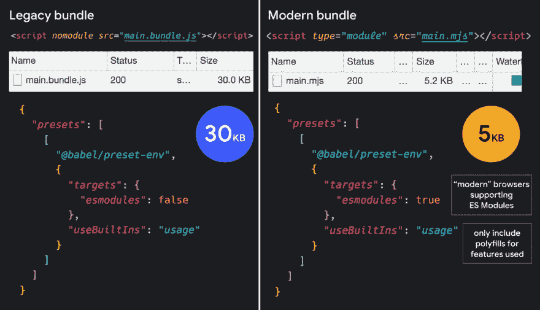

# 网络背包:意想不到的旅程

> 原文：<https://dev.to/slashgear_/webpack-an-unexpected-journey-3e5n>

### 网络背包:意想不到的旅程

一个前端开发人员在一片空地上工作。不是一个讨厌或肮脏的应用程序制造商。他做 HTML、CSS 和 JS 已经很多年了。他经历过黑暗时代，那时所有这些词都意味着危险和麻烦。在 One day One JS webapp 框架的黄金时代过去多年后，他不知道一个新的启蒙任务正在向他走来:Web 应用程序性能。

<figure>[](https://res.cloudinary.com/practicaldev/image/fetch/s--zW6-BLuf--/c_limit%2Cf_auto%2Cfl_progressive%2Cq_66%2Cw_880/https://cdn-images-1.medium.com/max/500/1%2A3pY1--bJtBS-yK413-HqRQ.gif) 

<figcaption>在地下的一个洞里住着一个哈比人</figcaption>

</figure>

### 什么是 Webpack？

> “它的主要目的是捆绑 JS 文件，以便在浏览器应用程序中使用”——Burke Holland(与 [Sean T. Larkin](https://medium.com/u/393110b0b9e4) 讨论**关于 webpack** 的五件事)

Webpack 通过从一个或多个条目中解析 JS 模块依赖关系来构建一个或多个 JS 输出。条目可以是负责引导你最喜欢的 JS UI 库的文件。输出主要是被称为 bundles 的 JS 文件，它们收集了 Webpack 在创建依赖树时加载的所有模块。由于有了*加载器*，它还可以处理其他文件类型，如资产(图像/html/…)。

如果你对加载器、插件、模块等核心概念不够熟悉，我鼓励你观看这个短片，在这个短片中，Sean T. Larkin 用几句话解释了这些词背后隐藏的秘密。

[https://www.youtube.com/embed/WI6OTVXT6k8](https://www.youtube.com/embed/WI6OTVXT6k8)

### 为什么在项目中经常被认为是负担？

#### 不可及的最佳实践

得益于庞大的社区和开放的 API，Webpack 显然是 NPM 的一个热门项目。自 2012 年首次发布以来，Webpack 发生了很多变化。

像任何新概念一样，Webpack 需要时间来成熟:它的使用已经发生了变化。为了做几乎相同的事情，有时会有 3 个加载器/插件。当每篇文章或每个例子都向我们展示不同的做事方式时，很难理解如何正确地使用它。

<figure>[](https://res.cloudinary.com/practicaldev/image/fetch/s--XgxV3osM--/c_limit%2Cf_auto%2Cfl_progressive%2Cq_66%2Cw_880/https://cdn-images-1.medium.com/max/500/1%2A-9VBNLgoY5udC3vCa3XqpQ.gif) 

<figcaption>一个 webpack 配置统治一切……</figcaption>

</figure>

此外，我们必须保持客观，Webpack 从来不是历史上最好的记录工具。我们仍然可以注意到，在过去的几年里已经付出了很多努力。

此外，迁移到 Webpack 的新版本仍然很痛苦。你总是会有一个不支持最新版本的插件或加载程序。

就个人而言，我能够参与的版本迁移经常是我们应用程序倒退的根源(性能损失、内存泄漏等等)

#### 多重环境陷阱

我们的现代用途促使我们在用户之前创建测试应用程序的环境。

我们通常有非常不同的环境:

*   避免了代码的缩小/简化。
*   我们在浏览器中替换我们的模块(HMR)。

[](https://res.cloudinary.com/practicaldev/image/fetch/s--RcUlPAa_--/c_limit%2Cf_auto%2Cfl_progressive%2Cq_66%2Cw_880/https://cdn-images-1.medium.com/max/500/1%2AU2SurQQHbfOwAYKi9ghT8A.gif)

为了避免配置重复，我们倾向于根据从环境传递到构建的变量来设置条件。

由于害怕重复我们的代码，我们经常将我们的配置分割在许多文件中。

然后，我们发现自己处于一种经常难以阅读和整体难以理解的状态。

#### _ http://lotr.wikia.com/wiki/E%C3%A4rendil 之光*[_ 埃伦迪尔*()

[](https://res.cloudinary.com/practicaldev/image/fetch/s--ys2RwV20--/c_limit%2Cf_auto%2Cfl_progressive%2Cq_66%2Cw_880/https://cdn-images-1.medium.com/max/245/1%2AwqYulXSt9SwjSxdWM1JcdQ.gif)

避免这个陷阱的一个好方法是使用一个类似于 [webpack-merge](https://github.com/survivejs/webpack-merge) 的工具来构建一个基本的配置，如果需要的话可以扩展(添加一个插件，改变一个加载器的配置，等等)。)

functionnal 爱好者的另一个解决方案是使用 [webpack-chain](https://github.com/neutrinojs/webpack-chain) 。

> Webpack 的核心配置是基于创建和修改一个潜在的笨拙的 JavaScript 对象。虽然这对于单个项目的配置来说是可以的，但是试图跨项目共享这些对象并进行后续修改会变得很麻烦，因为您需要对底层对象结构有深入的理解才能进行这些修改。
> 
> webpack-chain 试图通过提供一个可链接的或流畅的 API 来创建和修改 webpack 配置，从而改进这一过程。API 的关键部分可以由用户指定的名称引用，这有助于标准化如何跨项目修改配置。
> 
> **— Webpack-chain 自我描述**

如果你觉得你的 webpack 配置太复杂，我只能建议你测试这两个工具。许多工具今年都大幅缩水。我要特别提到的是 Vue-cli 3，它基于一种临时动态 Webpack 配置。我建议你参考尤雨溪和 T2 关于这个问题的文章。

### 为什么 Webpack 是让您的 web 应用程序发挥性能的绝佳工具？

这个库允许我们以不同的方式优化我们的应用程序，我不会在这里列出完整的清单。然而，我们可以概括地说，Webpack 可以通过减少代码量来提高 web 应用程序的性能。

#### 代码拆分

Webpack 不仅通过解决依赖关系将模块合并成一个大文件。它还可以将您的应用程序分成多个批处理。这些较小的批处理可以帮助您避免在应用程序的主页上加载较少的代码，并减少其交互时间。

您可以通过多种方式实现这一点:

[**入口点:**](https://webpack.js.org/guides/code-splitting/#entry-points) 你可以定义所有不同的入口来生成许多输出。通过直接在条目定义中查看生成的包来精确控制它是非常好的。

[**动态导入修饰:**](https://webpack.js.org/guides/code-splitting/#dynamic-imports) 在 ES 代码中导入代码是相当简单的，但是它要求你所有的代码都已经加载好了。TC39 提案引入了一种在 Javascript 中导入代码的动态方法。

```
async function getComponent() {
  var element = document.createElement('div');
  const { default: _ } = await import(/* webpackChunkName: "lodash" */ 'lodash');

  element.innerHTML = _.join(['Hello', 'webpack'], '  ');

  return element;
}

getComponent().then(component => {
  document.body.appendChild(component);
}); 
```

Enter fullscreen mode Exit fullscreen mode

通过这个简单的技巧，您可以生成第二个包，其中包含第二次请求的 *lodash* 。

注意，您可以告诉 Webpack，这个异步模块应该在浏览器空闲时被预取。

对于像 React 这样的基于组件的框架，第二种方法是您应该考虑的。在单页应用中，在路由器配置中使用*动态导入*将大幅减少加载的代码量。

代码分割的棘手部分主要是:

*   处理一些模块在许多包中是必需的情况。
*   为用户所在的页面提供所需的代码。

#### 树摇晃

好了，现在你知道如何避免在你的第一页加载所有的代码了。但是你仍然可以加载你并不真正需要的部分模块。也就是所谓的，*死码*。

```
export function square(x) {
  return x * x;
}

export function cube(x) {
  return x * x * x;
} 
```

Enter fullscreen mode Exit fullscreen mode

如果你在你的应用中只为 square 函数加载这个模块，默认情况下，Webpack 仍然会加载 *cube* 函数，并把它放在 bundle 中。

[](https://res.cloudinary.com/practicaldev/image/fetch/s--8mITtUPT--/c_limit%2Cf_auto%2Cfl_progressive%2Cq_66%2Cw_880/https://cdn-images-1.medium.com/max/387/1%2Atxg-1nwa67QWwZz3xEcUfQ.gif)

现在考虑一下您正在应用程序中加载的所有*死代码*。为了避免这种情况，你必须通过遵循[这个文档](https://webpack.js.org/guides/tree-shaking/#mark-the-file-as-side-effect-free)来告诉 Webpack 你的模块没有副作用。

让我们再举一个例子，我很确定你已经在你的一个应用中使用了 *lodash* 。然而，你可能从未使用超过 30%的时间。这里,*副作用*的把戏不起作用:lodash 不使用导出，而是在一个大文件中定义他的所有函数。

为了避免你的应用程序中巨大的 *lodash* ，你应该考虑使用这个 [babel-plugin-lodash](https://github.com/lodash/babel-plugin-lodash) 或者每次导入模块时只导出你需要的函数:

```
import \_merge from 'lodash/merge' 
```

Enter fullscreen mode Exit fullscreen mode

### 案例分析:6 打一个白标 VOD 平台

[](https://res.cloudinary.com/practicaldev/image/fetch/s---2eKqewn--/c_limit%2Cf_auto%2Cfl_progressive%2Cq_auto%2Cw_880/https://cdn-images-1.medium.com/max/1024/1%2AwEtHIhJST7z5MeVk9e6-OQ.png)

从 2017 年 6 月开始，我在 6play 平台上与里昂(法国)的 M6web 团队合作。如果你不知道的话，6play 是一个法国视频点播服务，是为 M6 集团内容重播而创建的。基于 SSR 模式的 React，由于一个令人惊叹的团队，这个应用程序多年来仍在不断发展。你可以在[Tech M6 网络博客](https://tech.m6web.fr/)上找到更多我们正在做的事情。

**你会告诉我，这里跟 Webpack 有什么关系？**

6play 迅速使用 Webpack 高效打包代码。从一个版本到另一个版本(有时是血泪),我们试图配置我们的构建以确保快速加载应用程序。

2018 年，6play 经历了一场大革命，它成为了其他客户的白色标志平台。

[6 play 平台走向国际](https://tech.m6web.fr/6play/6play-goes-international/)

对于前端应用程序来说，最大的挑战不仅是创建翻译部分，还包括不复制代码库。更准确地说，我们只有一个针对所有客户的存储库(我们对特定客户端应用程序的名称)。这种选择的风险是将客户代码混合到 6play 代码中。

平台在视觉上看起来非常相似，但隐藏着许多差异(广告引擎、用户跟踪等等)。试想一下资产数量的差异！

我们显然想避免:

1.  在捆绑包中混合客户代码(JS 和资产)
2.  复制代码

这就是 Webpack 真正有用的地方。

#### 【客户覆盖】

在 white mark 应用程序中，您经常会发现覆盖组件或资产的模式，以处理您想要引入的设计差异。对于我们想要覆盖的每个模块，这种重载已经愚蠢地以这种方式实现了。

```
...somewhere in our directory structure
/customer/ 
 a/ 
 MyComponent.js 
 b/ 
 MyComponent.js 
 c/ 
 MyComponent.js 
RootMyComponent.js 
```

Enter fullscreen mode Exit fullscreen mode

```
const Component = require(`./customer/${process.env.CUSTOMER_CODE}/MyComponent.js`);

export default Component; 
```

Enter fullscreen mode Exit fullscreen mode

这个代码很适合客户覆盖部分，但是它有一些主要的问题。这些问题不仅是由于我们的代码结构中的噪音，也是由于这种繁重的目录结构。

#### 动态要求陷阱

为了理解这个大问题，我们必须关注这个特定的部分。

```
require(`./customer/${process.env.CUSTOMER_CODE}/MyComponent.js`); 
```

Enter fullscreen mode Exit fullscreen mode

我之前说过，Wepack 正在根据它正在构建的依赖图打包我们的模块。这里，依赖性是动态的。所以它不知道他必须加载哪个模块。为了避免忘记一个，它将在他的 ***上下文*** 中加载所有匹配下面模式的模块。

```
/^\.\/customer\/.\*\/MyComponent\.js 
```

Enter fullscreen mode Exit fullscreen mode

这意味着所有不同的变体都将出现在最终的包中。这正是我们想要避免的。

<figure>[](https://res.cloudinary.com/practicaldev/image/fetch/s--dqK_lkE---/c_limit%2Cf_auto%2Cfl_progressive%2Cq_66%2Cw_880/https://cdn-images-1.medium.com/max/427/1%2AjJ-vYXXeAHWkTkGqKlbu7Q.gif) 

<figcaption>Woups！</figcaption>

</figure>

#### contxtreplaceplugin trick

你可能已经听说过 Webpack *上下文*。在这个著名的时刻，你想摆脱所有你不需要的[时刻](https://momentjs.com/)地点。

如果你不知道的话，MomentJS(最常用的 JS lib)默认情况下会加载所有的局部变量，就像你刚才看到的那样。

<figure>[](https://res.cloudinary.com/practicaldev/image/fetch/s--GzzxUpzv--/c_limit%2Cf_auto%2Cfl_progressive%2Cq_auto%2Cw_880/https://cdn-images-1.medium.com/max/1024/1%2AJbdAfF8wavgfS8bgeeuqPw.png) 

<figcaption>挺重的是不是？(用 webpack-bundle-analyser 生成)</figcaption>

</figure>

你将在 Github issue/StackOverflow 中看到的常见解决方案将是这样的:

```
const webpackConfig = {
 plugins: [
     new webpack.ContextReplacementPlugin(/moment[/\\]locale$/, /fr/),
  ]
} 
```

Enter fullscreen mode Exit fullscreen mode

这个简单的技巧对于理解将要发生的事情至关重要。这里，我们使用了一个核心 Webpack 插件，它神奇地减小了我们的包的大小。但是它在做什么呢？

ContextReplacementPlugin 将像在 Webpack 无法解析上下文中所有文件的模块后触发的挂钩一样工作。它将在包中保存所有匹配第一个正则表达式和第二个正则表达式的上下文文件。

```
/moment/locale/fr.js // will stay

/moment/locale/en.js // will be removed 
```

Enter fullscreen mode Exit fullscreen mode

如果你好奇这个[插件的代码](https://github.com/webpack/webpack/blob/master/lib/ContextReplacementPlugin.js)非常简单。

[](https://res.cloudinary.com/practicaldev/image/fetch/s--rhHS-kkW--/c_limit%2Cf_auto%2Cfl_progressive%2Cq_66%2Cw_880/https://cdn-images-1.medium.com/max/427/1%2A0u9QTUju_1R4qz-A4AHcqg.gif)

很好，现在我们只需要使用这个插件，只选择与当前客户代码匹配的文件！！

…遗憾的是，这仍然不够好。

我们忽略的部分是，我们必须每次为每个客户定义相同的组件。太啰嗦了不是吗？

当然是啦！

<figure>[](https://res.cloudinary.com/practicaldev/image/fetch/s--VJYLejB0--/c_limit%2Cf_auto%2Cfl_progressive%2Cq_66%2Cw_880/https://cdn-images-1.medium.com/max/245/1%2At5auib5KI_2ErpdY_UhcQg.gif) 

<figcaption>旅程真的变成了冒险</figcaption>

</figure>

**我们手工制作的 CustomerReplacementPlugin**

在很多情况下，我们只想为一个客户覆盖应用程序的一部分。所以避免重复的目标结构看起来更像这样。

```
...somewhere in our directory structure
/customer/ 
 default/ 
 MyComponent.js 
 b/ 
 MyComponent.js 
RootMyComponent.js 
```

Enter fullscreen mode Exit fullscreen mode

```
import Component from './customer/default/MyComponent.js';

export default Component; 
```

Enter fullscreen mode Exit fullscreen mode

好了，现在已经没有重复了，但是 ContextReplacementPlugin 在这里似乎没有完成这项工作。幸运的是另一个插件成功了: **NormalReplacementPlugin。**

在上面的目标结构中，没有剩下`require`。客户覆盖不会加载到上下文中。很高兴 **NormalReplacementPlugin** 将成为我们的救世主。

它看起来真的很像另一个插件，但是这次这个插件可以影响通常被 Webpack 解析的模块，并在打包之前改变它们的路径。

因此，基于 NormalReplacementPlugin 实现，我构建了一个 CustomerReplacementPlugin 来完成这个任务(现在用一个非常愚蠢的实现)

```
const fs = require('fs');

class CustomerReplacementPlugin {

  // To pass the current customer
  constructor(customerName) {
    this.customerName = customerName;
  }

  apply(compiler) {
    compiler.hooks.normalModuleFactory.tap('CustomerReplacementPlugin', nmf => {
      // just before thos normal modules have be resolved
      nmf.hooks.afterResolve.tap('CustomerReplacementPlugin', result => {
        if (!result) return;

        // if the variant exists for the current customer
        if (/customer\/default/.test(result.resource)) {
          const customerResource = result.resource.replace(/\/default\//, `/${this.customerName}/`);
          if (fs.existsSync(customerResource)) {
            // I replace the resolved path by the customer path
            result.resource = customerResource;
          }
        }

        return result;
      });
    });
  }
}

module.exports.CustomerReplacementPlugin = CustomerReplacementPlugin; 
```

Enter fullscreen mode Exit fullscreen mode

我希望这个解决方案至少能帮助你理解这些插件，甚至帮助你提高应用程序的性能。

### 使用 Webpack 时，我发现了一些有用的提示

这篇长文还没写完。我仍然有一些关于 Webpack 的提示给你。近年来，我收集了一些好的实践来保证您的应用程序在使用 Webpack 时的性能。下面是一个不完整的列表。

#### 知道自己的弱点

[](https://res.cloudinary.com/practicaldev/image/fetch/s--S7NQR0BX--/c_limit%2Cf_auto%2Cfl_progressive%2Cq_auto%2Cw_880/https://cdn-images-1.medium.com/max/568/1%2A19C2CI8wfOVVRCs9GJS0zg.jpeg)

您必须定期检查您的包大小，如果可能的话，甚至在您的构建链中。在@M6web，我们开发了自己的工具来检查每个新开发的内容。

*   如果你的包裹突然变得太胖，它会发出警告
*   当你使一捆变薄时，它称赞你

结合 [Webpack Bundle Analyser](https://www.npmjs.com/package/webpack-bundle-analyzer) ，您应该能够大幅减少您的捆绑包，从而提高您的应用程序性能。

[](https://res.cloudinary.com/practicaldev/image/fetch/s--GWY2AoVg--/c_limit%2Cf_auto%2Cfl_progressive%2Cq_auto%2Cw_880/https://cdn-images-1.medium.com/max/813/1%2ARz6cjz3k2DE6Xc-d6OsK1g.png)

不幸的是，这个工具还不能开源。但是，也有类似这样的工具。

##  [保罗·阿姆斯特朗](https://github.com/paularmstrong) / [建造追踪](https://github.com/paularmstrong/build-tracker)

### 一组工具，用于跟踪构建工件的大小。

<article class="markdown-body entry-content container-lg" itemprop="text">

# 建造跟踪器 [](https://github.com/paularmstrong/build-tracker/actions)

[](https://camo.githubusercontent.com/72c056d767b17aceba1d87e55043934ff42615d811fa8b62da1bdaf620419078/68747470733a2f2f6275696c64747261636b65722e6465762f696d672f6f67496d6167652e706e67)

## 证明文件

所有文档都可以在 [buildtracker.dev](https://buildtracker.dev) 中找到。

## 贡献的

### [行为准则](https://github.com/paularmstrong/build-tracker/blob/main/CODE_OF_CONDUCT.md)

所有项目参与者都应该遵守存储库的行为准则。请阅读[全文](https://github.com/paularmstrong/build-tracker/blob/main/CODE_OF_CONDUCT.md)让你明白什么行为会被容忍，什么行为不会被容忍。

### [投稿指南](https://buildtracker.dev/docs/guides/contributing)

阅读投稿指南，了解开发过程，如何提出修复和改进，以及如何构建和测试您的更改。

## 许可证

建造跟踪是麻省理工学院许可的。

</article>

[View on GitHub](https://github.com/paularmstrong/build-tracker)

#### ES2015+捆绑

你一定知道我们的一些浏览器现在可以使用更新的 Javascript。那么为什么我们应该只针对 ES5 呢？

这就是为什么在过去的几个月里，我们在 6play 上用两种不同的*巴别塔*目标生成了两个版本的捆绑包。

你也应该这样做，而不是我来反驳我。

> Addy Osmani[【addyosmani](https://dev.to/addyosmani)JavaScript 提示:将较小的 ES2015+捆绑到现代浏览器&用 [@babeljs](https://twitter.com/babeljs) 和 preset-env:
> 
> [bit.ly/serve-modern-c…](https://t.co/5FN7h23gow)
> [bit.ly/differential-s…](https://t.co/wEq9xAFf3G)

### 用 Webpack 压缩您的包

几个月前，我在@LyonJS 给[做了一个关于 web](https://docs.google.com/presentation/d/17w__X9JKrdlqZdSgIXfvlP2-TitxVCuYnkNBAZztSPk/edit?usp=sharing) 压缩的演讲。我不会解释为什么你的文件需要压缩，但是你必须知道 Webpack 可以用 Gzip 完成这项工作。

## [webpack-IB](https://github.com/webpack-contrib)/[压缩 web pack 插件](https://github.com/webpack-contrib/compression-webpack-plugin)

### 准备资产的压缩版本，通过内容编码为它们服务

<article class="markdown-body entry-content container-lg" itemprop="text">[](https://github.com/webpack/webpack) 

[](https://npmjs.com/package/compression-webpack-plugin)[](https://nodejs.org)[](https://david-dm.org/webpack-contrib/compression-webpack-plugin)[](https://github.com/webpack-contrib/compression-webpack-plugin/actions)[](https://codecov.io/gh/webpack-contrib/compression-webpack-plugin)[](https://gitter.im/webpack/webpack)[](https://packagephobia.now.sh/result?p=compression-webpack-plugin)

# 压缩 web 包插件

准备资产的压缩版本，通过内容编码为它们服务。

## 入门指南

首先，您需要安装`compression-webpack-plugin`:

```
$ npm install compression-webpack-plugin --save-dev
```

Enter fullscreen mode Exit fullscreen mode

然后将插件添加到您的`webpack`配置中。例如:

**网页包. config.js**

```
const CompressionPlugin = require("compression-webpack-plugin");
module.exports = {
  plugins: [new CompressionPlugin()],
};
```

Enter fullscreen mode Exit fullscreen mode

并通过您喜欢的方法运行`webpack`。

## 选择

| 名字 | 类型 | 默认 | 描述 |
| :-: | :-: | :-: | :-- |
| **[`test`](https://raw.githubusercontent.com/webpack-contrib/compression-webpack-plugin/master/#test)T4】** | `{String&#124;RegExp&#124;Array<String&#124;RegExp>}` | `undefined` | 包括所有通过测试断言的资产 |
| **[`include`](https://raw.githubusercontent.com/webpack-contrib/compression-webpack-plugin/master/#include)T4】** | `{String&#124;RegExp&#124;Array<String&#124;RegExp>}` | `undefined` | 包括符合任何这些条件的所有资产 |
| **[`exclude`](https://raw.githubusercontent.com/webpack-contrib/compression-webpack-plugin/master/#exclude)T4】** | `{String&#124;RegExp&#124;Array<String&#124;RegExp>}` | `undefined` | 排除符合任何这些条件的所有资产 |
| **[`algorithm`](https://raw.githubusercontent.com/webpack-contrib/compression-webpack-plugin/master/#algorithm)T4】** | `{String&#124;Function}` | `gzip` | 压缩算法/功能 |
| **[`compressionOptions`](https://raw.githubusercontent.com/webpack-contrib/compression-webpack-plugin/master/#compressionoptions)T4】** | `{Object}` | gzip 的最大可用压缩级别:`{ level: 9 }` | `algorithm`的压缩选项 |
| **[`threshold`](https://raw.githubusercontent.com/webpack-contrib/compression-webpack-plugin/master/#threshold)T4】** | `{Number}` | `0` | 仅处理大于此大小的资产(以字节为单位) |
| **[`minRatio`](https://raw.githubusercontent.com/webpack-contrib/compression-webpack-plugin/master/#minratio)T4】** | `{Number}` | `0.8` | 只有比这压缩得更好的资产 |

…</article>

[View on GitHub](https://github.com/webpack-contrib/compression-webpack-plugin)

而且很快就有了 [Brotli](https://github.com/google/brotli) ，多亏了这个拉请求。

[zlib:通过 addaleax Pull Request # 24938 nodejs/node](https://github.com/nodejs/node/pull/24938)添加 Brotli 支持

### 更进一步

*   [Webpack 5 来了！](https://github.com/webpack/webpack/issues/8537)
*   [Webpack 官方指南](https://webpack.js.org/guides/)
*   [服务器端 Webpack](https://jlongster.com/Backend-Apps-with-Webpack--Part-I)
*   [使用 Webpack 开发服务器](https://webpack.js.org/guides/hot-module-replacement/)
*   在推特上关注托拜厄斯·科珀斯、[肖恩·t·拉金](https://medium.com/u/393110b0b9e4)和[艾迪·奥斯马尼](https://medium.com/u/2508e4c7a8ec))

[](https://res.cloudinary.com/practicaldev/image/fetch/s--q1oAKj5o--/c_limit%2Cf_auto%2Cfl_progressive%2Cq_66%2Cw_880/https://cdn-images-1.medium.com/max/480/1%2AMFRoW7QCEE-z_PwNy-WRiA.gif)

感谢阅读！

如果我没有说清楚，可以在这里提问↓

* * *