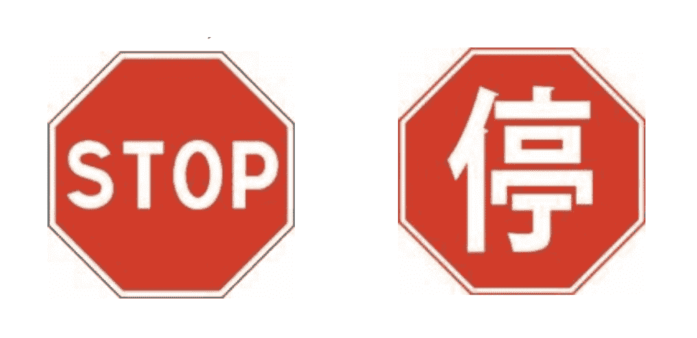
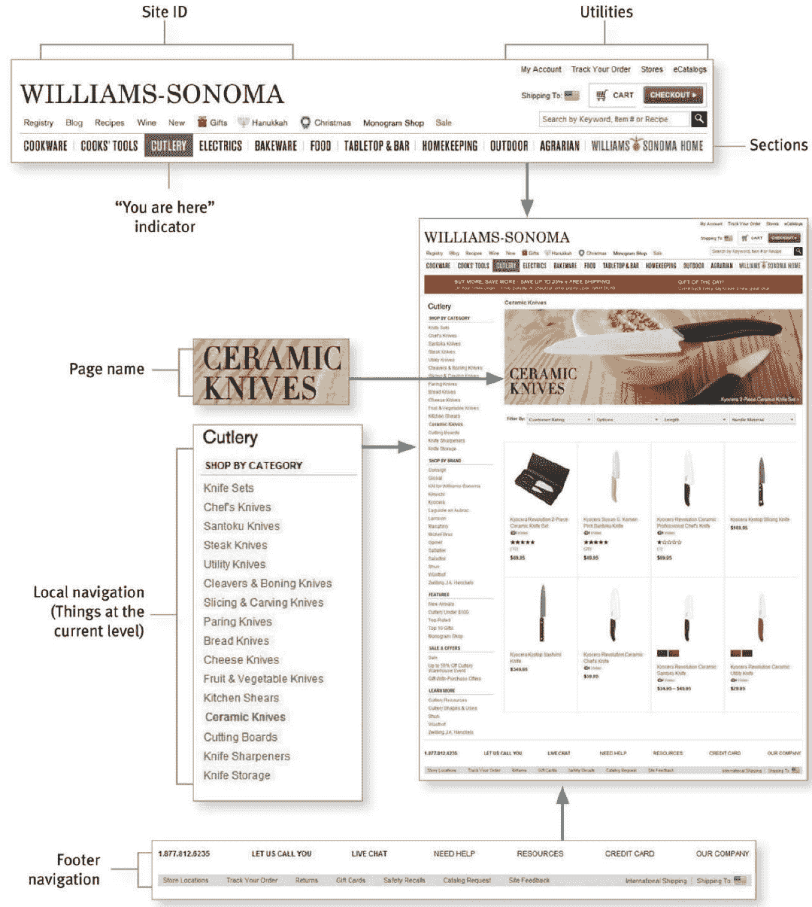
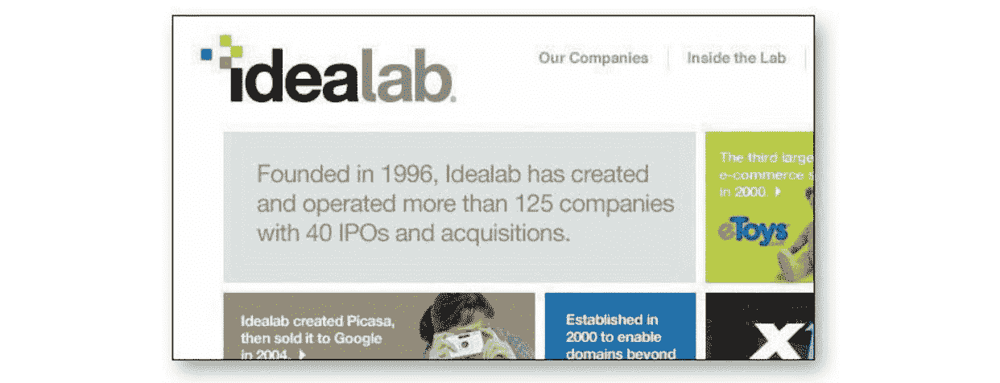
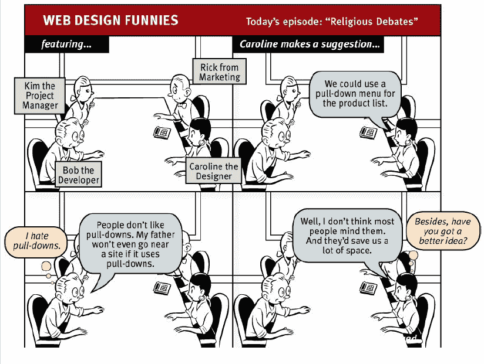
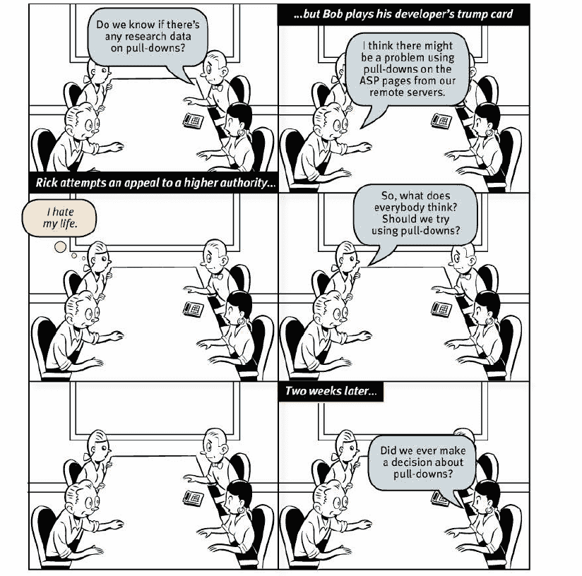
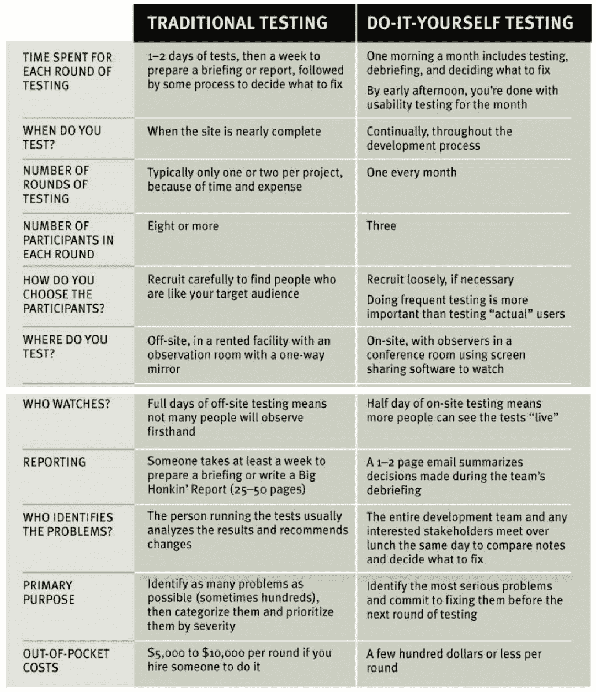

# 《不要让我思考》笔记。网站可用性的常识方法。

> 原文：<https://dev.to/wxyyxc1992/notes-of-dont-make-me-think-a-common-sense-approach-to-web-usability-25ld>

看完[不要让我思考](https://github.com/wxyyxc1992/Awesome-CS-Books-Warehouse)，我学到了很多，也重新思考了我个人网站的设计，我的回购等等。这是摘要和读书笔记，其中大部分是从原著中摘抄的。

* * *

这里有一些你在这本书里找不到的东西:

*   硬性可用性规则
*   对技术和网络未来的预测
*   唱衰设计糟糕的网站和应用。

你会发现可用性有很多不同的定义，通常分为如下属性:

*   有用:它做了人们需要做的事情吗？
*   可学:人们能想出如何使用它吗？
*   难忘:他们每次使用时都要重新学习吗
*   有效:它能完成工作吗？
*   高效:它是否花费了合理的时间和精力？
*   可取:人们想要吗？
*   令人愉快:使用它是令人愉快的，甚至是有趣的吗？

能力和经验一般(甚至低于一般水平)的人可以想出如何使用这个东西[也就是说，它是可以学习的]来完成一些[有效的]事情，而不会带来比它的价值[有效]更多的麻烦。

### 第一章。不要让我思考

如果我想确保我的网站或应用程序易于使用，我应该做的最重要的事情是什么？它不是“任何重要的东西都不应该在两次点击之外”或者“说用户的语言”或者“保持一致”。“这不该让我思考。

一个网页上的各种东西都能让我们停下来进行不必要的思考。你的目标应该是每个页面或屏幕都是不言而喻的，这样普通用户只要看一眼。规则是这样的:如果你不能让事情不言自明，你至少需要让它不言自明。

在一个不言自明的页面上，需要一点点思考才能得到它，但只是一点点。事物的外观(如大小、颜色和布局)、它们精心选择的名称和少量精心制作的文本应该一起工作，创造一种几乎毫不费力就能理解的感觉。

### 第二章。我们如何真正使用网络

当我们创建网站时，我们表现得好像人们会仔细阅读每一页，阅读我们所有精心制作的文本，弄清楚我们是如何组织的，并在决定点击哪个链接之前权衡他们的选项。

他们实际上大部分时间做的事情(如果幸运的话)是浏览每一个新页面，浏览一些文本，然后点击第一个引起他们兴趣或与他们正在寻找的东西有点相似的链接。

*   事实#1: **我们不阅读书页。我们扫描它们**
*   事实 2: **我们不会做出最佳选择。我们很满意。**
*   事实 3:我们不知道事物是如何运作的。我们蒙混过关。

### 第三章。广告牌设计 101

**设计用于扫描，而不是读取**

### 利用惯例

就像停车标志一样，考虑到在各种天气和照明条件下，司机一眼就能从远处看到并认出它们是多么重要，所有停车标志看起来都一样真的是一件好事。

### 创建有效的视觉层级

*   越重要的东西，越突出。
*   逻辑上相关的事物在视觉上是相关的。
*   事物是“可视化嵌套的，以显示什么是什么的一部分

### 将页面分成清晰界定的区域

网页扫描表明，用户在最初的浏览中很快就决定了网页的哪些部分可能有有用的信息，然后很少看其他部分。

横幅失明——用户完全忽略他们认为会包含广告的区域的能力——只是一个极端的例子。

### 让可点击的东西显而易见

当我们浏览一个页面时，我们会寻找各种各样的视觉线索来识别哪些东西是可点击的？在触摸屏上)-像形状(按钮、标签等)这样的东西。)、位置(例如，在菜单栏中)和格式(颜色和下划线)。

### 排除杂念/噪音

易于理解的页面的最大敌人之一是视觉噪音。实际上有三种不同的噪音:

*   大喊:自动化的幻灯片、动画、弹出窗口和永无止境的吸引眼球的新广告形式！大喊大叫通常是因为未能做出艰难的决定，决定哪些元素是真正最重要的，然后创建一个视觉层次结构，引导用户首先找到它们。
*   混乱:这是一个明确的信号，表明设计者不理解使用网格来对齐页面元素的重要性。
*   杂乱:很难找到并专注于你真正关心的信息。

一个好主意是从假设一切都是视觉噪音开始(“假定有罪，直到证明无辜”的方法)，并去除任何没有真正贡献的东西。

### 格式内容支持扫描

*   使用大量的标题。
*   保持段落简短。
*   使用项目符号列表。
*   突出关键术语。

### 第四章。动物、植物还是矿物？为什么用户喜欢无意识的选择

我要点击多少次不重要，只要每一次点击都是无脑的，不含糊的。但随着时间的推移，我开始认为真正重要的不是点击次数，而是每次点击有多难——需要多少思考，以及我是否做出正确选择的不确定性。

### 可能需要一些帮助

这种指导在以下情况下最有效

*   简要:对我有帮助的最少量的信息
*   适时的:放置在我需要的时候
*   不可避免:以一种确保我会注意到它的方式格式化

### 第五章。省略不必要的词语

去掉每页一半的单词，然后去掉剩下的一半。

*   快乐的谈话必须消失:它是介绍性的文本，应该欢迎我们访问网站，告诉我们网站有多棒，或者告诉我们在我们刚刚进入的部分我们将会看到什么。快乐的谈话就像闲聊——没有内容，基本上只是一种社交的方式。但是大多数网络用户没有时间闲聊；他们想直奔主题。你可以——也应该——尽可能消除愉快的谈话。
*   指令必须消亡:你的目标应该是通过让一切都不言自明，或者尽可能地接近它，来完全消除指令。

### 第六章。街道标志和面包屑

### 网页导航 101

在许多方面，当你进入一个网站时，你都要经历同样的过程。

*   你通常是想找点什么。
*   你决定是先问还是先浏览。不同之处在于，在网站上，没有人站在旁边告诉你东西在哪里。网络上的问路相当于搜索——在搜索框中输入你要找的东西的描述，然后得到一个地点的链接列表。

一些人(Jakob Nielsen 称他们为“搜索主导型”用户)几乎总是在进入一个网站时寻找搜索框。其他人(尼尔森的“链接主导型”用户)几乎总是首先浏览，只有当他们用尽了可能点击的链接或者当他们对网站感到足够失望时才进行搜索。

网络体验失去了许多我们一生中用来协商空间的线索。想想网络空间的这些奇怪之处:

*   没有尺度感。
*   没有方向感。
*   没有位置感。

这种身体上的缺失既是好的也是坏的。从好的方面来说，失重感会令人兴奋，这也部分解释了为什么在网上很容易忘记时间——就像我们在一本好书中“迷失”一样。消极的一面是，如果你在字典中查找导航，它是关于做两件事:从一个地方到另一个地方，并找出你在哪里。

导航的两个目的很明显:帮助我们找到我们要找的东西，告诉我们我们在哪里。

### 持久导航

只要让导航以一致的外观出现在每个页面的相同位置，就能让你立即确认你仍然在同一个站点。

持久导航应该包括你最需要随时掌握的四个要素:

在需要填写表单的页面上，持续的导航有时会成为不必要的干扰。

导航可以抵消网络固有的“迷失在空间中”的感觉的方法之一是向我展示我在事物结构中的位置。

### 页面

关于页面名称，您需要知道四件事:

*   每一页都需要一个名字。就像每个角落都应该有路牌一样，每一页都应该有名字。
*   名称需要在正确的位置。在页面的视觉层次结构中，页面名称应该显示出该页面特有的内容

*   名字需要突出。
*   该名称需要与我点击的内容相匹配。

### 面包屑

像“你在这里”指示器一样，面包屑显示你在哪里。它们被称为面包屑，因为它们让人想起汉瑟丢在树林里的面包屑，这样他和葛丽特就能找到回家的路。

面包屑向您显示从主页到您所在位置的路径，并使您可以轻松地返回到站点层次结构中的更高级别。

*   把它们放在最上面。
*   在级别之间使用>。
*   粗体显示最后一项。

### 选项卡

选项卡是在用户界面中使用物理隐喻的极少数情况之一。以下是我喜欢它们的原因:

*   它们是不言自明的。
*   他们很难被忽略。
*   他们很狡猾。

如果网页设计得很好，当你的视野清晰时，你应该能够毫不犹豫地回答这些问题:

*   这是什么网站？(站点 ID)
*   我在哪一页？(页面名称)
*   这个网站的主要部分是什么？(部分)
*   在这个层次上我有什么选择？(本地导航)
*   我在事情的计划中处于什么位置？(“你在这里”指示器)
*   我该如何搜索？

以下是执行主干测试的方法:

*   第一步:在网站的任何地方随机选择一个页面，并打印出来。
*   第二步:把它保持在一臂的距离或者眯着眼睛，这样你就不能仔细研究它了。
*   第三步:尽可能快地找到并圈出以下每一项:
*   站点 ID
*   页面名称
*   部分(主要导航)
*   本地导航
*   “您在这里”指示器
*   搜索

### 第七章。网页设计的大爆炸理论

让人们有个好的开始的重要性。

当我第一次进入一个新网站时，主页需要尽可能快而清楚地回答我头脑中的四个问题:

这就是我所说的网页设计大爆炸理论。就像生活大爆炸理论一样，它基于这样一个理念:你在一个新网站或网页上的最初几秒钟是至关重要的。

主页上的所有内容都有助于我们理解这个网站。但是在页面上有三个重要的地方，我们期望找到关于这个网站的明确陈述。

*   标语

房地产最有价值的部分之一是紧挨着站点 ID 的空间。当我们看到一个与 ID 有视觉联系的短语时，我们知道它是一个标语，所以我们把它作为整个网站的描述来阅读。我们将在下一节详细讨论标语。

*   欢迎广告。

欢迎简介是对网站的简要描述，显示在主页的
显著位置，通常在内容空间的左上角或中间，所以它是最先吸引你眼球的东西。

*   “了解更多”

创新的产品和商业模式往往需要大量的解释，通常超出了大多数人的耐心。但人们已经习惯于在电脑和移动设备上观看短视频。因此，人们现在开始期待在大多数网站上有一个简短的解释视频，并且经常愿意观看。

### 第八章。“农夫和牛仔应该成为朋友”论内部协作

如果任由他们自己的设备摆布，Web 团队在可用性问题上的决策并不是出了名的成功。大多数团队最终会花费大量宝贵的时间一遍又一遍地重复同样的问题。

关键是，问类似“大多数人喜欢下拉菜单吗？”这样的问题是没有成效的正确的问题应该是“这个下拉菜单，在这个页面的这个上下文中的这些项目和这个措辞，是否为大多数可能使用这个网站的人创造了良好的体验？”

回答这种问题只有一种方法:测试。你必须利用团队的集体技能、经验、创造力和常识来构建事物的某个版本(甚至是一个粗糙的版本)，然后仔细观察一些人试图弄清楚它是什么以及如何使用它。

### 第九章。每天 10 美分的可用性测试

可用性测试已经存在很长时间了，其基本思想非常简单:如果你想知道某样东西是否足够容易使用，观察一些人尝试使用它的时候，注意他们在哪里遇到了问题。测试一个用户比不测试要好 100%。在项目的早期测试一个用户比在接近尾声时测试 50 个用户要好。

### 跟我说:焦点小组不是可用性测试

简而言之，区别如下:

*   在焦点小组中，一小群人(通常是 5 到 10 人)围坐在一张桌子旁谈论事情，比如他们对产品的看法，他们过去的使用体验，或者他们对新概念的反应。焦点小组有利于快速获得用户对事物的感受和观点的样本。
*   可用性测试是指一次观察一个人尝试使用一些东西(无论是网站、原型还是新设计的草图)来完成典型的任务，这样你就可以发现并修复那些让他们困惑或沮丧的东西。

主要的区别在于，在可用性测试中，你观察人们实际使用的东西，而不仅仅是听他们谈论。

### 自己动手进行可用性测试

这种测试的目的不是为了证明什么。你不需要找到所有的问题。事实上，你永远不会在你测试的任何东西中找到所有的问题。即使你做了也无济于事，因为事实是:你在半天内发现的问题比你在一个月内解决的还要多。

一个典型的一个小时的测试将被分解成这样:

*   欢迎(4 分钟)。你首先解释测试将如何进行，这样参与者就知道会发生什么。
*   问题(2 分钟)。接下来，你问参与者几个关于他们自己的问题。这有助于让他们放松，并让你了解他们对电脑和网络的了解程度。
*   主页游览(3 分钟)。然后你打开你正在测试的网站的主页，让参与者四处看看，告诉你他们对它的看法。这会让你知道理解你的主页有多容易，以及参与者对你的领域了解多少。
*   任务(35 分钟)。这是测试的核心:观察参与者尝试执行一系列任务(或者在某些情况下，只是一个长任务)。同样，你的工作是确保参与者专注于任务，并保持大声思考。如果参与者停止说出他们在想什么，提醒他们说——等等——“你在想什么？”(为了多样化，你也可以说“你在看什么？”以及“你现在在做什么？”)在测试的这一部分，关键是你要让他们独立工作，不要做或说任何事来影响他们。不要问他们引导性的问题，也不要给他们任何线索或帮助，除非他们陷入绝望或极度沮丧。如果他们寻求帮助，就说“如果我不在这里，你会怎么做？”
*   探查(5 分钟)。任务结束后，你可以问参与者测试中发生的任何事情，以及观察室的人希望你问的任何问题。
*   正在总结(5 分钟)。最后，你感谢他们的帮助，付钱，送他们出门。

### 述职:决定修复什么

以下是您最常遇到的一些问题:

*   用户不清楚这个概念。
*   他们要找的词不在那里。
*   事情太多了。

首先集中精力解决最严重的问题

### 第十章。莫比尔:它不再仅仅是阿拉巴马州的一个城市了

那么，当你为移动设备设计时，可用性有什么不同呢？从某种意义上说，答案是:不多。基本原理还是一样的。如果说有什么不同的话，那就是人们在小屏幕上移动得更快，阅读得更少。创建良好的移动可用性的大部分挑战归结为做出良好的权衡。

你漏掉了哪些部分？一种方法是移动优先。不是先设计一个功能齐全(也许有些臃肿)的网站版本，然后再进行删减以创建移动版本，而是先根据对用户来说最重要的功能和内容来设计移动版本。然后你添加更多的功能和内容来创建桌面/完整版

### 繁殖变色龙

关于可扩展设计，我可以告诉你两件事(也叫动态布局、流体设计、适应性设计和响应性设计)，它们是:

*   这往往需要大量的工作。
*   做好这件事很难。

同时，这里有三点建议:

*   允许缩放。
*   不要让我站在前门。你点击电子邮件或社交媒体网站上的链接，它不是把你带到有问题的文章，而是把你带到手机主页，让你自己去寻找。
*   总是提供一个“完整”网站的链接。

注意，你的响应式设计解决方案不会加载超过用户屏幕所需的大量代码和图像。

### 不要隐藏你的启示

启示是对象设计中的视觉线索，提示我们如何使用它。

这并不是说所有启示都需要打你的脸。他们只需要足够显眼，让人们能够注意到他们完成任务所需要的东西。

平面设计有一种趋势，不仅仅是潜在的分散注意力的装饰，还有更多纹理元素所传达的有用信息。

### 讨人喜欢&可学

令人愉快的应用程序通常来自于结合人们真正喜欢做的事情的想法，但不要想象这是可能的，以及如何使用一些新技术来实现它的好主意。

应用程序最大的一个问题是，如果它们有太多的功能，它们可能不太容易学习。

这并不是说现实世界中没有人学习如何使用它。它得到了很好的评价，并且一直是畅销书。但我不得不怀疑有多少买了它的人从未掌握过
它，或者如果它更容易学的话，他们能多卖出多少。

还有一个重要的属性:可记忆性。一旦你知道了如何使用一个应用程序，
你下次尝试时会记得如何使用它吗？还是你必须从头再来一遍？

### 移动设备上的可用性测试

这里有一些你必须处理的问题:

*   你需要让参与者使用他们自己的设备吗？
*   他们需要自然地拿着设备，还是可以放在桌子上或支撑在支架上？
*   观察者需要看到什么(例如，只看到屏幕，或者同时看到屏幕和参与者的手指，这样他们就可以看到他们的手势)？又是如何在观察室展示的呢？
*   你如何创造一个记录？

在更好的基于技术的解决方案出现之前，我倾向于以下建议:

*   使用对着屏幕的摄像机，而不是镜子。
*   将相机连接到设备上，以便用户可以自然地握住它。
*   不要让摄像机对准参与者。

### 第十一章。可用性作为普通礼貌(绅士)

这里有一些事情会让用户觉得发布网站的人没有把他们的最佳利益放在心上(避免做以下的事):

*   隐藏我想要的信息。最常隐藏的是客户支持电话号码、运费和价格。
*   因为我没有按你的方式做事而惩罚我。我永远不必考虑格式化数据:是否在我的社会保险号中加破折号，在我的信用卡号中加空格，或者在我的电话号码中加括号。
*   问我你并不真正需要的信息。
*   嘲笑我。我们总是在寻找虚假的真诚，不真诚地试图让我相信你关心我会特别令人讨厌。
*   给我添麻烦了。不得不费力地阅读充斥着自我感觉良好的营销照片的页面，这表明你不理解——或者说不在乎——我在赶时间。
*   你的网站看起来很业余。如果你的网站看起来邋遢、混乱或者不专业，就像没有努力让它看起来像样，你可能会失去好感。

好消息是，即使你犯了错误，也有可能通过做让我相信你确实把我的利益放在心上的事情来恢复我的好感。其中大多数只是另一个列表的反面:

*   了解人们想在你的网站上做的主要事情，并使它们变得明显和容易
*   告诉我我想知道的。
*   尽可能给我留些台阶。