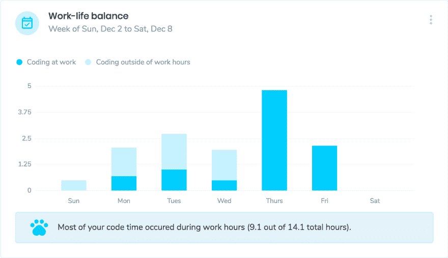
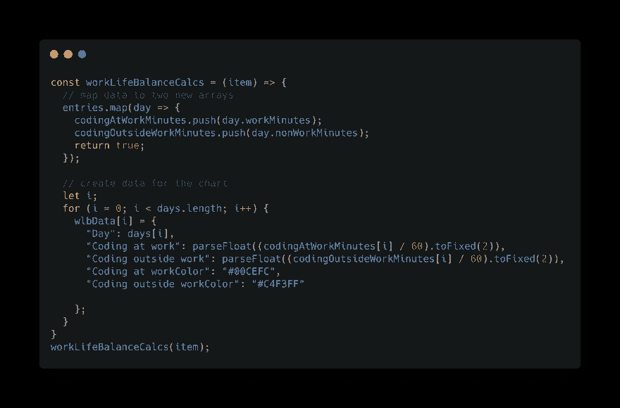
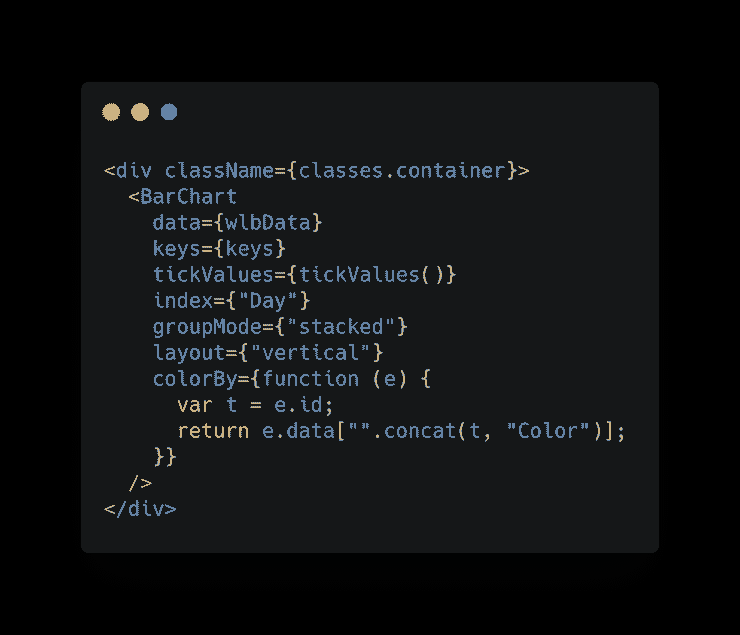

# 用 React 构建简单的数据可视化

> 原文：<https://dev.to/brettmstevens7/building-simple-data-visualizations-with-react-9em>

如果你正在寻找使用 D3 构建自己的自定义图表的替代方法，有很多很棒的 React 图表库(比如强大实验室的 [Victory](https://formidable.com/open-source/victory/) 、优步的 [Recharts](http://recharts.org/en-US/) 和 [React Vis](https://uber.github.io/react-vis/) 等等)。

我个人喜欢 Nivo，因为它有一个交互式文档网站。您可以使用 UI 中的切换来调整图表属性，以快速可视化和迭代您的设计。

还有许多例子(或“食谱”)和一个活跃的话语社区。图表是响应性的，有些有 API，如果您想在服务器端呈现图表，这可能会很有用。更不用说，Nivo 库是免费的，开源的，并且是主动维护的。

这里有一个我用 Nivo 制作的图表的实例，它显示了我在 12 月的一周中，在正常工作时间之内和之外编码了多少小时。

如果您对在自己的项目中使用 Nivo 感兴趣，这里有一个我如何构建这个图表的简要概述。

首先，我选择在 StackBlitz 上构建我的项目。我喜欢使用 StackBlitz 快速构建我的数据可视化原型，并查看它们在实际数据中的样子。我也喜欢 CodePen、CodeSandbox 和 JSFiddle，但我最喜欢 StackBlitz 的一点是它由 Visual Studio 代码提供支持，这是我选择的代码编辑器。

[https://stackblitz.com/edit/work-life-balance?embed=1&&](https://stackblitz.com/edit/work-life-balance?embed=1&&)

接下来，我导入了我的依赖项。对于这个图表，我导入了`@nivo/bar`和 Material，因为我也使用了一些 Material UI 组件。

我的数据来自我的用于 VS 代码的[Software.com](https://www.software.com/)插件(我在*软件*的团队中)——来看看我们吧！).我将它作为一个常量存储在它自己的文件(`item.js`)中，并导入到我的主文件(`workLifeBalance.js`)中。

由于我的数据不是 Nivo 条形图所要求的精确格式，我做了一些光阵列操作来将我的数据映射到 Nivo 结构(参见`data.json`了解该结构)，这也清楚地记录在 Nivo 网站上。

<figure>

<figcaption>Mapping data from our an API response to Nivo’s structure. Snippet using Carbon.</figcaption>

</figure>

最后一步是将我的数据作为属性传递到我使用 Nivo 创建的自定义条形图组件(`BarChart.js`)中。如果您想要重复使用 Nivo 图表，但使用不同的样式元素，您也可以自定义这些属性。例如，我制作了另一个图表，它使用“分组”而不是“堆叠”条形图，所以我把它作为一个变量。

<figure>

<figcaption>Bar chart component. Snippet made using Carbon.</figcaption>

</figure>

您可以通过自定义 Nivo 主题来添加一些适合和完成。如果你比我更想定制主题，可以在 Nivo GitHub 仓库中查看这个文件。

就是这样！如果您对构建自己的 Nivo 图表感兴趣，您可以分叉此图表并插入您的数据。如果你想看看你的工作生活平衡和你的其他编码数据是什么样的，看看 Software.com 吧！

React 你最喜欢的图表库有哪些？