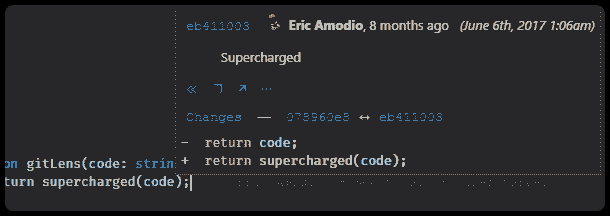
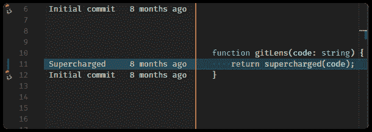

# 这不仅仅是责备的问题

> 原文：<https://dev.to/eamodio/its-not-just-about-theblame-32a2>

好吧，有时候是这样，但是让我们超越指责，来谈谈 [VS 代码](https://code.visualstudio.com)的 [GitLens](https://gitlens.amod.io) 的责备特性的更有价值的方面。为什么？因为我经常听到人们谈论 GitLens，这是关于使用这些功能来指责过去的你或其他人。

[](https://res.cloudinary.com/practicaldev/image/fetch/s--chy6iKBf--/c_limit%2Cf_auto%2Cfl_progressive%2Cq_66%2Cw_880/https://thepracticaldev.s3.amazonaws.com/i/lpo1amlxxmxgcytd4uw7.gif)

如果你还不熟悉 GitLens，请[去看看](https://gitlens.amod.io)——去吧，我等着😁—否则，请随意跳过下一部分。

* * *

### GitLens — <small>Git 增压</small>

[GitLens](https://gitlens.amod.io) 是我为 VS 代码创建的开源扩展。GitLens，加上内置在 VS 代码中的 Git 支持，直接在您的编辑器中提供了一个相当完整的 Git GUI。这里有一个简短的总结:

> GitLens 增强了 Visual Studio 代码中内置的 Git 功能。它可以帮助您**通过 Git 责备注释和代码透镜使代码作者**一目了然，**无缝导航和探索** Git 库，**通过强大的比较命令获得有价值的见解**，等等。
> 
> GitLens 只是帮助你更好地理解代码。快速浏览一行或代码块被更改的人、原因和时间。回顾历史，深入了解代码是如何以及为什么进化的。轻松探索代码库的历史和演变。

* * *

因此，GitLens 经常在指责某人的上下文中被提及——尽管大多是半开玩笑的，而且经常是自嘲。除了明显的喜剧效果，我猜测这很大程度上是因为它的标题功能命名不当——归咎于。虽然 GitLens 采用这个命名是因为它是 Git 和其他 Git 工具的叫法(我有什么资格反对这种趋势？)，该功能远比仅仅责怪自己或别人更有价值。现在你可能会想，“*呜呜！你只是不喜欢被人叫去💩代号*，但听我说完。

* * *

> GitLens 只是帮助你**更好地理解代码**。快速浏览一行或代码块被更改的人、原因和时间。

* * *

GitLens 利用 Git 的责备特性，向当前行添加一个注释，显示作者、日期和最近一次修改该行的提交的消息。

<figure>

[](https://res.cloudinary.com/practicaldev/image/fetch/s--IeTsSDlW--/c_limit%2Cf_auto%2Cfl_progressive%2Cq_auto%2Cw_880/https://raw.githubusercontent.com/eamodio/vscode-gitlens/mastimg/docs/current-line-blame.png)

<figcaption>GitLens adds a blame annotation to the end of the current line</figcaption>

</figure>

<figure>

[](https://res.cloudinary.com/practicaldev/image/fetch/s--s6peSdMN--/c_limit%2Cf_auto%2Cfl_progressive%2Cq_auto%2Cw_880/https://raw.githubusercontent.com/eamodio/vscode-gitlens/mastimg/docs/hovers-current-line.png)

<figcaption>Hovering over the annotation reveals more details and actions</figcaption>

</figure>

我还应该提到，GitLens 也为整个文件提供即时的、按需的责备注释。

<figure>

[](https://res.cloudinary.com/practicaldev/image/fetch/s--gxMb_Puu--/c_limit%2Cf_auto%2Cfl_progressive%2Cq_auto%2Cw_880/https://raw.githubusercontent.com/eamodio/vscode-gitlens/mastimg/docs/gutter-blame.png)

<figcaption>GitLens adds blame annotations to the gutter for the whole file</figcaption>

</figure>

从这些简单的注释中，你现在可以回答理解代码和它是如何进化的 3 个重要问题——代码最后一次变化是在什么时候**、**为什么**发生了变化，最后是**谁**改变了它。通过增加这些信息的可见性和可访问性，GitLens 极大地减少了回答这些重要问题的麻烦，这些信息已经永远成为我们源代码控制系统的一部分。现在，根据您要完成的任务，其中一个可能比其他的更重要，但是它们都有助于您更好地理解代码。**

这里只是几个简单的场景:

*   试图理解为什么代码是这样的？回到过去阅读关于代码为什么会这样发展的指责历史。

*   寻找最近引入的 bug？知道代码何时改变是非常宝贵的。

*   不熟悉代码库或代码段，需要帮助？找出谁最能回答关于它的问题或合作改变它。

这些只是一些可能的使用案例和好处，我相信您还能想到更多。这些答案现在唾手可得，为我们提供了帮助更好地理解代码的强大工具。毕竟，理解代码是软件开发中最困难的问题之一，当然排在其他两个问题之后:命名、缓存失效和 1 位错误。

* * *

一个关于提交消息的小插曲，因为我知道我们总是写精美的和有洞察力的提交消息。阿米利特？是啊。无论如何，既然提交消息是高度可见和可访问的，那么它们有意义和结构良好就更加重要了。Git 长期以来一直推荐提交消息的结构化格式(见下文),使用这种(或类似的)结构对于提高它们的效用非常重要。

<figure>

```
Short (50 chars or less) summary of changes

More detailed explanatory text, if necessary.  Wrap it to
about 72 characters or so.  In some contexts, the first
line is treated as the subject of an email and the rest of
the text as the body.  The blank line separating the
summary from the body is critical (unless you omit the body
entirely); tools like rebase can get confused if you run
the two together.

Further paragraphs come after blank lines.

  - Bullet points are okay, too

  - Typically a hyphen or asterisk is used for the bullet,
    preceded by a single space, with blank lines in
    between, but conventions vary here 
```

<figcaption>Copied from [Distributed Git](https://www.git-scm.com/book/en/v2/Distributed-Git-Contributing-to-a-Project#_commit_guidelines)</figcaption>

</figure>

* * *

希望我现在已经展示了这个不恰当命名的责备功能的价值，而不仅仅是指指点点。现在如果你还没有尝试过 [GitLens](https://gitlens.amod.io) 和/或 [VS Code](https://code.visualstudio.com) ，你还在等什么？😄

* * *

*原载于[blog . amod . io](https://blog.amod.io/gitlens/2019/01/15/its-not-about-the-blame/)2019 . 1 . 15。*