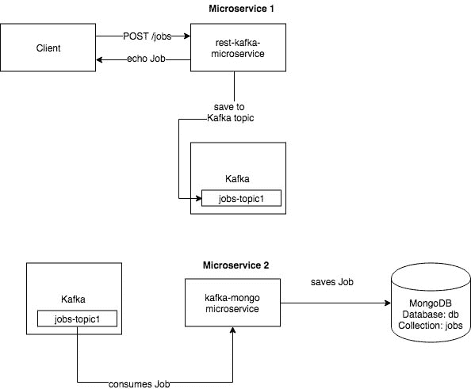
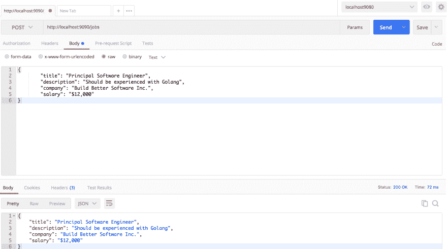
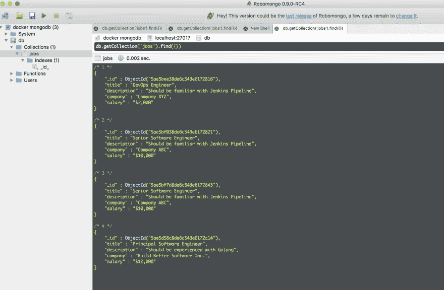

# 使用 Kafka 和 MongoDB 与 Go 进行异步处理

> 原文：<https://dev.to/donvitocodes/asynchronous-processing-with-go-using-kafka-and-mongodb-2pga>

[https://www.youtube.com/embed/xa0Yia1jdu8](https://www.youtube.com/embed/xa0Yia1jdu8)

在我之前的博客文章[“我第一次使用 MongoDB 和 Docker 多阶段构建的 Go 微服务”](https://www.melvinvivas.com/my-first-go-microservice/)中，我创建了一个 Go 微服务示例，它公开了一个 REST http 端点，并将从 HTTP POST 接收的数据保存到 MongoDB 数据库中。

在这个例子中，我将数据保存分离到 MongoDB，并创建了另一个微服务来处理这个问题。我还添加了 Kafka 作为消息传递层，这样微服务就可以异步地处理自己的问题。

> 如果你有时间看的话，我在:)下面的[视频里录了这篇博文的一个预演](#video1)

下面是这个带有 2 个微服务的简单异步处理示例的高级架构。
[T3】](https://res.cloudinary.com/practicaldev/image/fetch/s--teIKaBYl--/c_limit%2Cf_auto%2Cfl_progressive%2Cq_auto%2Cw_880/http://www.melvinvivas.com/conteimg/2018/04/rest-kafka-mongo-microservice-draw-io.jpg)

**微服务 1**——是一个 REST 微服务，它从对它的 http 调用/POST 中接收数据。收到请求后，它从 http 请求中检索数据并保存到 Kafka。保存后，它通过/POST 用相同的数据响应调用者

**微服务 2**——是一个订阅 Kafka 中某个主题的微服务，微服务 1 在其中保存数据。一旦消息被微服务使用，它就会将数据保存到 MongoDB。

在继续之前，我们需要一些东西来运行这些微服务:

1.  [下载 Kafka](https://kafka.apache.org/downloads)——我用的版本 kafka_2.11-1.1.0
2.  安装[librdkafka](https://github.com/confluentinc/confluent-kafka-go)——不幸的是，这个库应该存在于目标系统中
3.  通过合流安装 [Kafka Go 客户端](https://github.com/confluentinc/confluent-kafka-go)
4.  运行 MongoDB。你可以查看我之前的博文,其中我使用了一个 MongoDB docker 图片。

让我们开始吧！

首先启动 Kafka，在运行 Kafka 服务器之前，您需要运行 Zookeeper。下面是如何

```
$ cd /<download path>/kafka_2.11-1.1.0
$ bin/zookeeper-server-start.sh config/zookeeper.properties 
```

Enter fullscreen mode Exit fullscreen mode

然后运行 Kafka——我使用端口 9092 连接到 Kafka。如果需要更改端口，只需在 config/server.properties 中配置即可，如果你和我一样只是初学者，我建议暂时只使用默认端口。

```
$ bin/kafka-server-start.sh config/server.properties 
```

Enter fullscreen mode Exit fullscreen mode

运行 Kafka 之后，我们需要 MongoDB。简单点说，就用这个 docker-compose.yml.

```
version: '3'
services:
  mongodb:
    image: mongo
    ports:
      - "27017:27017"
    volumes:
      - "mongodata:/data/db"
    networks:
      - network1

volumes:
   mongodata:

networks:
   network1: 
```

Enter fullscreen mode Exit fullscreen mode

使用 Docker Compose
运行 MongoDB docker 容器

```
docker-compose up 
```

Enter fullscreen mode Exit fullscreen mode

下面是**微服务 1** 的相关代码。我只是修改了我之前的例子来保存到 Kafka 而不是 MongoDB。

[安息-卡夫卡/安息-卡夫卡-sample . go](https://github.com/donvito/learngo/tree/master/rest-kafka-mongo-microservice/rest-to-kafka)

```
func jobsPostHandler(w http.ResponseWriter, r *http.Request) {

    //Retrieve body from http request
    b, err := ioutil.ReadAll(r.Body)
    defer r.Body.Close()
    if err != nil {
        panic(err)
    }

    //Save data into Job struct
    var _job Job
    err = json.Unmarshal(b, &_job)
    if err != nil {
        http.Error(w, err.Error(), 500)
        return
    }

    saveJobToKafka(_job)

    //Convert job struct into json
    jsonString, err := json.Marshal(_job)
    if err != nil {
        http.Error(w, err.Error(), 500)
        return
    }

    //Set content-type http header
    w.Header().Set("content-type", "application/json")

    //Send back data as response
    w.Write(jsonString)

}

func saveJobToKafka(job Job) {

    fmt.Println("save to kafka")

    jsonString, err := json.Marshal(job)

    jobString := string(jsonString)
    fmt.Print(jobString)

    p, err := kafka.NewProducer(&kafka.ConfigMap{"bootstrap.servers": "localhost:9092"})
    if err != nil {
        panic(err)
    }

    // Produce messages to topic (asynchronously)
    topic := "jobs-topic1"
    for _, word := range []string{string(jobString)} {
        p.Produce(&kafka.Message{
            TopicPartition: kafka.TopicPartition{Topic: &topic, Partition: kafka.PartitionAny},
            Value:          []byte(word),
        }, nil)
    }
} 
```

Enter fullscreen mode Exit fullscreen mode

下面是**微服务 2** 的代码。这段代码中重要的是卡夫卡的消费，我在之前的博客文章中已经讨论过的节约部分。以下是使用 Kafka 数据的代码的重要部分。

[Kafka-to-mongo/Kafka-mongo-sample . go](https://github.com/donvito/learngo/tree/master/rest-kafka-mongo-microservice/kafka-to-mongo)

```
 func main() {

    //Create MongoDB session
    session := initialiseMongo()
    mongoStore.session = session

    receiveFromKafka()

}

func receiveFromKafka() {

    fmt.Println("Start receiving from Kafka")
    c, err := kafka.NewConsumer(&kafka.ConfigMap{
        "bootstrap.servers": "localhost:9092",
        "group.id":          "group-id-1",
        "auto.offset.reset": "earliest",
    })

    if err != nil {
        panic(err)
    }

    c.SubscribeTopics([]string{"jobs-topic1"}, nil)

    for {
        msg, err := c.ReadMessage(-1)

        if err == nil {
            fmt.Printf("Received from Kafka %s: %s\n", msg.TopicPartition, string(msg.Value))
            job := string(msg.Value)
            saveJobToMongo(job)
        } else {
            fmt.Printf("Consumer error: %v (%v)\n", err, msg)
            break
        }
    }

    c.Close()

}

func saveJobToMongo(jobString string) {

    fmt.Println("Save to MongoDB")
    col := mongoStore.session.DB(database).C(collection)

    //Save data into Job struct
    var _job Job
    b := []byte(jobString)
    err := json.Unmarshal(b, &_job)
    if err != nil {
        panic(err)
    }

    //Insert job into MongoDB
    errMongo := col.Insert(_job)
    if errMongo != nil {
        panic(errMongo)
    }

    fmt.Printf("Saved to MongoDB : %s", jobString)

} 
```

Enter fullscreen mode Exit fullscreen mode

让我们开始演示，运行微服务 1。确保卡夫卡在运行。

```
$ go run rest-kafka-sample.go 
```

Enter fullscreen mode Exit fullscreen mode

我用 Postman 给微服务 1
[](https://res.cloudinary.com/practicaldev/image/fetch/s--_eryEez1--/c_limit%2Cf_auto%2Cfl_progressive%2Cq_auto%2Cw_880/http://www.melvinvivas.com/conteimg/2018/04/Screenshot-2018-04-29-22.20.33.png) 发送数据

这是您将在微服务 1 中看到的日志。一旦你看到这个，这意味着数据已经从邮递员那里收到并保存到卡夫卡
[](https://res.cloudinary.com/practicaldev/image/fetch/s--c7NmDZ0l--/c_limit%2Cf_auto%2Cfl_progressive%2Cq_auto%2Cw_880/http://www.melvinvivas.com/conteimg/2018/04/Screenshot-2018-04-29-22.22.00.png)

由于我们还没有运行微服务 2，所以微服务 1 保存的数据只是在 Kafka 中。让我们通过运行微服务 2 来消耗它并保存到 MongoDB。

```
$ go run kafka-mongo-sample.go 
```

Enter fullscreen mode Exit fullscreen mode

现在你会看到微服务 2 消费了数据并保存到 MongoDB
[](https://res.cloudinary.com/practicaldev/image/fetch/s--ZDrqoqjh--/c_limit%2Cf_auto%2Cfl_progressive%2Cq_auto%2Cw_880/http://www.melvinvivas.com/conteimg/2018/04/Screenshot-2018-04-29-22.24.15.png)

检查数据是否保存在 MongoDB 中。如果它在那里，我们就没事了！
[T3】](https://res.cloudinary.com/practicaldev/image/fetch/s--8sIAMMpv--/c_limit%2Cf_auto%2Cfl_progressive%2Cq_auto%2Cw_880/http://www.melvinvivas.com/conteimg/2018/04/Screenshot-2018-04-29-22.26.39.png)

完整源代码可以在这里找到
[https://github . com/don vito/learngo/tree/master/rest-Kafka-mongo-microservice](https://github.com/donvito/learngo/tree/master/rest-kafka-mongo-microservice)

不要脸的塞！如果你喜欢这篇博文，请在 Twitter **[@donvito](https://twitter.com/donvito)** 关注我。我在推特上谈论 Docker、Kubernetes、GoLang、Cloud、DevOps、Agile 和 Startups。愿意连接在 **[GitHub](https://github.com/donvito)** 和 **[LinkedIn](https://www.linkedin.com/in/melvinvivas/)**

尽情享受吧！