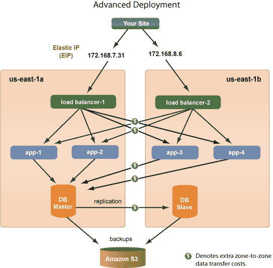

# 弹性源于设计

> 原文：<https://dev.to/joshghent/resiliency-by-design-223a>

产品架构中的弹性设计是一个很难测试的挑战性问题。随着 AWS 等大型服务器提供商开始[展示他们的漏洞](http://nymag.com/intelligencer/2018/03/when-amazon-web-services-goes-down-so-does-a-lot-of-the-web.html)以及传统的人为错误(我们曾让一名工程师用屁股撞服务器)，构建健壮的平台变得越来越重要。[混沌猴](https://github.com/Netflix/chaosmonkey)和其他工具已经涌现，以追求向下的弹性问题，但尽管如此，他们仍然可以坚持。在设计新系统或分析现有系统时，需要注意以下几点。

### 后退

你的应用程序试图联系一个关键的外部服务，可能是你的数据库，也可能是第三方 API——不管是哪种情况，它**都会**失败。处理这种情况的常见方法是设置一个计时器来重试对服务的调用。在 [CloudCall](https://www.cloudcall.com/) ，我们有一个无状态服务来处理发送 SMS 消息，每当它无法将消息保存到数据库或发送到我们的 SMS 提供商时(或者他们返回一个错误)，我们会在未来的一段时间内自动将消息重新排队。如果我们下一次遇到同样的失败，我们会再次排队，这次会多等一会儿，直到我们成功为止。

你可能认为这在无服务器的世界里是不可能的——但它是可能的！在 AWS Lambda 中，如果你抛出一个异常或者使用`context.fail()`，那么 [lambda 将在放弃之前重试](http://nymag.com/intelligencer/2018/03/when-amazon-web-services-goes-down-so-does-a-lot-of-the-web.html)多达 3 次。虽然这种设置不能让你逐渐后退，但你仍然可以享受重试的美妙。但是，如果您使用 [SQS](https://aws.amazon.com/sqs/) 设置 lambda，您也可以将 Lambda 配置为 [DLX](https://www.rabbitmq.com/dlx.html) 消息，该消息可以设置为在您设置的任何时间后重新排队消息。

### 重联逻辑

如果一个服务确实失去了与它需要持久访问的服务的连接，那么我们需要一些逻辑来重新连接它。我们可以重用我们在开始时讨论的后退原则中的相同原则。如果我们无法连接，过一段时间再试一次，过一会儿再试一次，以此类推。简单吧？

但是当你的应用程序第一次启动时，它也需要逻辑来建立它在这些服务中需要的任何东西。例如，如果您有一个队列消费者服务，它维护到 [RabbitMQ](https://www.rabbitmq.com/) 的连接，当它启动时，它需要逻辑来断言它需要的所有队列和交换。通常，因为队列发布者服务以前已经被编写过，**那个**服务包含所有断言逻辑。但是，在部署队列消费者服务时，您会遇到错误，因为之前没有部署发布者服务，因此没有断言消费者需要的交换和队列。这会产生部署依赖性，相信我，这是您不希望的。

<figure> 

<figcaption>具有故障转移的应用程序的示例结构</figcaption>

</figure>

### 基础设施故障转移

当然，如果您的整个服务器宕机，那么无论您编写多少代码来应对服务宕机都不会有任何影响。随着 [AWS](https://aws.amazon.com/) 、 [Azure](https://azure.microsoft.com/en-us/) 和 [GCP](https://cloud.google.com/) 的出现，很多人认为这已经成为过去(99.99%基本上就是 100%对吧？)，尽管如此，这些服务*还是会*下去。因此，配置自动故障转移是非常必要的，除非您喜欢在凌晨 4 点被叫醒，将整个环境重新部署到另一个区域。

也许整个服务器并没有关闭，可能是应用程序崩溃了，你需要重启容器，或者甚至是整个服务器来让它再次启动。在这些情况下，应该建立自动修复机制。这些机制可以重新启动服务，或者在某些情况下，如果服务在主区域中出现故障，可以将其重新部署到其他地方。

### 警惕分布式独石

微服务的世界正在接管。它在灵活性和可重用性方面创造的潜力是不可思议的——这就是它被如此广泛使用的原因。尽管如此，它们也有自己的取舍，也就是在它们的结构上。

你听到的支持微服务的一个主要论点是，这意味着你不再有一个你依赖的整体——就像西斯的死星。但是在设计他们的微服务架构时，这些服务只是菊花链在一起，完全相互依赖。要否定这一点，请确保您的微服务完全是微观的。要警惕共享一个数据存储的微服务集群，或者当对一个服务的更改需要重新部署另一个服务时。最重要的是，确保服务可以彼此独立地扩展。

构建有弹性的服务可能是一项挑战，而且确实需要时间。即使只是在 AWS 中配置自动可用性区域故障转移，也需要一些有才华的工程师花费很长时间和精力来解决。像任何事情一样，在系统中有速赢和可接受的已知错误。如果您没有时间配置自动修复和故障转移，请确保您已经编写了一个流程，以便任何人都可以手动完成。它们都有助于提供最佳的系统和可靠的用户体验，但最重要的是，您可以安然入睡，而不会被叫醒，因为您知道所有的服务器都运行良好。

让我知道你在系统中创造弹性的任何其他技巧！

* * *