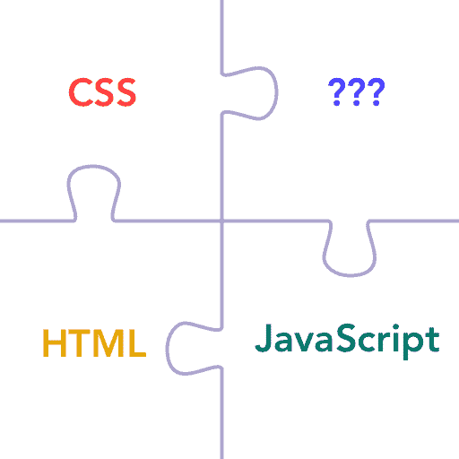
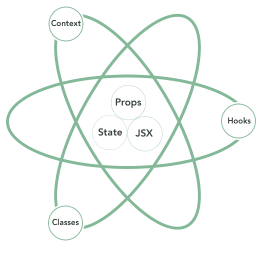

# 2019 年成为前端开发者的途径

> 原文：<https://dev.to/dceddia/the-path-to-becoming-a-front-end-developer-in-2019-1l5d>

随着 2019 年的开始，总是有大量的新年决心。

减肥。健康饮食。找一份前端开发的工作。

你知道的。小而简单的事情。没什么疯狂的。

当然，我是开玩笑的。这些人生大目标从来都不容易。*简单的*，也许——每天去健身房，午餐选择沙拉，每天晚上练习编码——但是我们从经验中知道，实际上*每天做这些工作*并不容易。

而结果从来没有我们想要的来得快。日复一日，有时感觉像是一场苦战。老实说，有时候这是一件苦差事。

然而，如果我们想在我们的目标上取得进展，真正的进展，一些日常的努力会有很大的帮助。每天的努力加快了步伐。

那么，最大的决定就是**关注**什么。你需要掌握的关键技能是什么，你应该以什么样的顺序来处理它们？

我会试着给你一些观点和具体的行动计划。

## 学习是一个难题

[](https://res.cloudinary.com/practicaldev/image/fetch/s--hhchxOeb--/c_limit%2Cf_auto%2Cfl_progressive%2Cq_auto%2Cw_880/https://daveceddia.cimg/learning-puzzle.png)

如果你在组装一个拼图，你可能不会试着组装第一排，然后第二排，然后第三排。拼图块往往不适合“行”除了我画的那张图，因为那样更容易画。

更有可能的是，你会从角落和边缘开始，一步步深入。从一些你有把握的作品开始。

一路上，你可能会发现一些碎片聚集在一起。2 块，3 块，也许 5 块。然后你会想“这个块放在哪里？”，但你可能要到很久以后才能找到答案。

学习 web 开发就是这样。

你正在收集知识的小集群。有些集群你会每天使用，有些你会很少使用(但是有一天它们会非常方便，比如当服务器在凌晨 2 点崩溃，你记得你使用过一次`grep`，然后开始浏览日志找到问题。).它们都是我们称之为“网络开发”的巨大难题的一部分

## 孤立地学习

只要有可能，就把你想学的科目分解成尽可能小的原子——个人技能。

[](https://res.cloudinary.com/practicaldev/image/fetch/s--jmBi7OXS--/c_limit%2Cf_auto%2Cfl_progressive%2Cq_auto%2Cw_880/https://daveceddia.cimg/learning-atoms.png)

然后，独自学习每一项技能，即使这意味着转移注意力，创建一个小沙盒项目来专注于那一项技能。这会让学习进行得更快，你会记住更多。

如果我能给每个学习 web 开发的人一个“诀窍”的话，那就是:不把一个问题或项目看作是一个不可分割的东西的能力，而是把它看作是一组可以被分解、分别学习、然后重新组合的技能。

### 分解:全栈 React App

这里有一个例子。假设您想学习使用 React 构建生产级应用程序的所有部分，这样您就可以构建自己的应用程序(或者被雇佣来构建一个)。

像这样的 app 是由很多部分组成的。

这是前端。大概是用 JavaScript 写的吧。它使用 React。可能是 Redux 或者 MobX。可能有一个 Webpack 配置。绝对有 JSX。可能是 CSS 或 Sass，也可能是 CSS-in-JS。大概有带`fetch`或者`axios`的 HTTP 请求。可能有 GraphQL。

后端可能用 Node + Express，或者 Ruby on Rails，或者 Elixir and Phoenix，或者任何数量的东西来编写。后端可能与数据库对话，数据库可能基于 SQL(PostgreSQL 或 MySQL)或基于文档(MongoDB)。

所有这些都太多了，无法同时学习。如果你把它当作一个大项目，打算边做边学，它会变成你头脑中的一大堆混乱，很难记住哪些部分放在哪里。即使你只是试图隔离前端部分，它仍然是一个压倒性的东西。

所以问问你自己，我能通过技术把它分开，一次学一个吗？

### 独自学习每一项技能

你能自学 JavaScript 吗？当然，还有优秀的[你不知道的 JS](https://github.com/getify/You-Dont-Know-JS) 系列(免费在线)，以及大量其他资源。

你能自己学会反应吗？是的，有一本关于 just React 的书(我写的！).

JSX 看起来很像 HTML，所以在使用 React + JSX 之前弄清楚 HTML 是如何工作的可能更容易。

你可以写一个看起来很滑稽的应用程序，甚至根本不用接触 CSS，所以你肯定可以不用 CSS 就能学会 React。或者 CSS 而没有反应。你可以等到弄清楚 CSS 规则如何工作之后再学习[样式组件](https://www.styled-components.com/)或其他 CSS-in-JS 库。

Redux 是 React 的附加组件，所以你可以[自己学习 Redux](https://daveceddia.com/how-does-redux-work/)。(一旦您对 React 有所了解)

Webpack 配置与在屏幕上获得 React 应用的目标是正交的；你可以现在使用[创建 React 应用](https://github.com/facebook/create-react-app)，以后再解决 Webpack。

外部数据，无论是来自普通的 REST API 还是 GraphQL，都是另一个复杂因素。为了学习 React 如何工作，您可以首先使用静态数据，从 API 复制 JSON 响应数据并将其存储在一个变量中——打开 DevTools，Network 选项卡，选择一个请求，复制粘贴响应！然后学习如何异步获取数据。

后端也可以用同样的方法分解。

总是质疑一个问题或项目必须作为一个整体来学习或构建的假设。看看能不能分解。梳理出单独的部分或层。尽可能自己学习这些部分。有时候你做不到，在这种情况下，还是:尽可能去掉不必要的东西。

## 一份网络开发学习计划

尽管如此，现实生活中的你现在需要一些现实生活的指导。

这是我建议的路线，尽我所能线性化。牢记“及时学习”的理念。

当你学习新东西的时候，练习它。阅读博客&观看教程是很棒的，但是如果不练习，你的大脑不会记住很久。如果没有练习，自己设计练习。例如，这里有一些关于如何[提出你自己的 React 实践项目](https://daveceddia.com/your-own-react-project-ideas/)的想法。

对于这些事情中的每一件，学习*刚好够用*，然后继续前进。

您不需要对每个 HTML 元素、CSS 选择器、JavaScript 特性或命令行工具有广博的知识。这就是 Google 和 StackOverflow 的用途。我们大多数从事编码多年的人都可以告诉你，最近学到了一些相当基础的东西，并对此感到惊讶。(此时此刻: [omg 还有一个`dialog`元素](https://developer.mozilla.org/en-US/docs/Web/HTML/Element/dialog)？)

## 一点命令行

通常，开始一个项目的第一步是从 Github 克隆一个 repo，或者用`create-react-app`创建一个空白项目。然后，您需要运行`npm`或`yarn`来安装包，并且能够在文件系统上导航您的项目。

一点命令行知识有助于让所有这些感觉不像是在一个神奇的盒子里输入神奇的命令。

您不需要在这里发疯，但是理解导航文件系统、显示文件等基本知识是值得的。Michael Hartl(因 Rails 教程而出名)写的《学会足够多的命令行变得危险》是一个很好的介绍，并且可以免费在线阅读。Max Antonucci 的这篇 DEV 文章也不错:[我希望我有](https://dev.to/maxwell_dev/the-shell-introduction-i-wish-i-had-551k)的 Shell 介绍。

## 用 Git 进行版本控制

你知道这样一个问题，你的代码工作得很好，然后你改变了一个很小的东西，然后由于某种原因它崩溃了？

然后*然后*，当你撤销那个改变的时候，**还是破**？wtf！！

这简直是最糟糕的。

版本控制解决了这个问题，我希望我能比我更早地了解这个问题。(我也希望有人把版本控制框定为对我的一个好处，而不是 T2 的琐事。因为好处是巨大的，Git 使它变得相当容易。)

我的介绍是关于 Git 如何以故事形式工作的解释，Git 寓言。读一下吧，很棒。即使你理解 Git 命令，我打赌你会学到新的东西。

Git 只是许多不同版本控制系统中的一个，但它是当前的冠军，由 Github 推广。

还有，有趣的事实:Git 和 Github 不是一回事。Github 是 Git 存储库的托管服务，但是 Git 早在 Github 之前就存在了，可以独立使用。您可以使用 Git 在本地管理您的代码，甚至不需要互联网连接，这是它如此棒的部分原因。

因此，一旦您掌握了一点命令行知识，就安装`git`命令。然后每当你创建一个新的项目目录时，这样做:

```
git init .
git add .
git commit -m "Initial commit" 
```

然后每次你让代码进入工作状态，或者在你做出可能会破坏某些东西的改变之前，提交你的代码:

```
git add .
git commit -m "Saving this before I break it." 
```

每次提交就像一个检查点。您可以及时跳回到任何以前的提交(回到您的代码工作的时候)。这些都存在于你的本地计算机上。如果你的电脑着火了，你的代码就没了。这就是 Github 的用途(我猜还有异地备份)。

如果你想了解更多关于 Git 的知识，比如如何检查之前的提交以返回到你的工作代码，push to Github，等等，请阅读这篇[学习足够多的 Git 以避免危险](https://www.learnenough.com/git-tutorial)教程。它不会太长，最后你甚至会有一个网页部署到 Github 页面。这是一个很好的沙盒...

## 网络的语言

要为网络开发软件，你需要了解 HTML、CSS 和 JavaScript。至少每一种都足够了。

不用任何 CSS 或者 JS 也可以写 HTML。除非你有一个 HTML 文档来样式化，否则你不能用 CSS 做很多事情。所以在你[学习一些 CSS](https://www.codecademy.com/learn/learn-css) 之前，你会想要[学习一些 HTML](https://www.codecademy.com/learn/learn-html) 。

然而，JavaScript 的效用是多方面的。它可以被添加到一个 HTML 文档的顶部，以制作一个交互式的应用程序...或者它可以在浏览器之外使用 [Node.js](https://nodejs.org/) 来做任何数量的有趣的事情——从编写服务器，到命令行应用程序，到控制物联网设备和进行机器学习。

什么似乎更有趣？在浏览器中编写 JS 来做一些事情，还是在 Node 中通过少量编码练习孤立地学习它？这里没有正确答案。这取决于你的目标。

如果你倾向于前端开发，我建议从一开始就在浏览器中学习 JS，[从“香草”JS](https://developer.mozilla.org/en-US/docs/Learn/Getting_started_with_the_web/JavaScript_basics) 开始，没有 React 和 Webpack 构建和所有那些东西。

在所有这些中，请记住，重点不是在继续前进之前*完全掌握每一项技能*。只要学得足够多，直到感觉你可以掌握下一项技能。

我这么说可能会被骂，但是我不相信在你转向 React 之前你需要掌握普通的 JS 和 DOM，如果你真正想做的是使用框架的话。我*是否*认为至少与他们进行一点实践是有好处的，并且知道他们的存在，并且能够在你需要他们的时候查找细节(例如 MDN 上的[)](https://developer.mozilla.org/en-US/docs/Web/JavaScript))。

## 学会调试

调试是一项可以学习的技能。幸运的是，如果你像我或其他大多数刚入门的人一样，你会有很多遇到错误并需要解决它们的练习。

当然，最简单的解决方法是将你的错误复制粘贴到 Google 中。

不过，有时谷歌也帮不上忙。也许这个错误对您的代码来说太具体了，比如语法错误。

然后有时候，谷歌几乎找不到相关的结果。这几乎总是表明这是某个地方的一个简单而愚蠢的错误。比如“我忘记保存文件了”或者“我忘记重启服务器了”

有一次，我偶然发现了 Eclipse 中的一个编辑器错误，其中保存功能*停止工作*。

我会修改文件。标题栏会显示`AbstractFactoryObserverPatternImpl.java *`(带小星星，表示已经更改)。我会点击“保存”并按下 Ctrl+S，但小星星仍然存在。“可能是 UI bug 吧，”我想。所以在保存之后，我打开了`vim`中的文件——果然，它没有被修改过。

这(a)很荒谬，因为文本编辑器基本上只有两个工作，编辑文本和保存文本...和(b)一个很好的提醒，总是检查假设。即使是疯狂的。

所以下次你遇到一个奇怪的问题时，把问题分解成几层，检查堆栈中的每一个假设。集体讨论失败的可能原因。

例如，对于“我更改了代码，但它什么也没做”的问题:

*   那段代码运行了吗？能不能加个`console.log`看打印出来？
*   自动构建工作了吗？(或者，如果是手动的，您运行构建了吗？)
*   如果它是正在运行的服务器的一部分，该服务器是否已经重新启动？
*   你打对服务器了吗？
*   你换对文件了吗？
*   你是不是换对了*项目*？(例如，也许你做了一个副本，`myproject-working-for-real-this-time-7`，但是你的编辑器仍然对`myproject-working-for-real-this-time-6`开放。还有:停止那样做，开始使用 Git)
*   文件真的改变了吗？你的编辑器中的保存功能停止工作了吗？

在你问完所有这些问题之后，你检查所有的东西，所有的东西看起来都是正确的，但是它还是坏了...是时候重新开始了。不要相信任何东西和任何人。

[](https://res.cloudinary.com/practicaldev/image/fetch/s--JI2OJXbY--/c_limit%2Cf_auto%2Cfl_progressive%2Cq_auto%2Cw_880/https://daveceddia.cimg/off-on-again.jpg)

还记得我之前提到的学习 web dev 就像是建立相互关联的技能的小集群吗？调试时间是你利用所有这些技能的时候。你越了解*为什么*事情会这样运作，包括你的应用程序不同部分之间的相互联系，当问题出现时，你就能更好更快地调试问题。

你会开始看到高分辨率的问题和解决方案。您将看到“服务器在准备部分数据时抛出异常”或“JS 代码未能解析 JSON 并停止运行”，而不仅仅是“应用程序损坏”

## 了解网络是如何工作的

这将有助于理解网络是如何工作的。牢记大局不仅在开发过程中会有帮助，在调试时也会有很大帮助。

了解当你访问一个网页时会发生什么。幕后有很多事！大部分有时也会失败。如果你知道所有的步骤，你可以诊断是否，例如，服务器关闭了，或者 DNS 条目是错误的，或者服务器*机器*启动了但是 webserver 进程没有启动，或者广告拦截器阻止了你的图标字体的加载，或者任何其他可能发生的奇怪事情。

开发人员工具对了解这是如何工作的有很大帮助。在浏览器中打开 devtools，查看 Network 选项卡，并刷新页面。看看所有发出的请求。寻找失败。点击它们，查看它们返回的数据。顺便说一句，这是一个很好的方式来发现和使用一个你想围绕它建立一个应用程序的网站上的一个未记录的“API ”!

## 学习一个框架

React 现在非常受欢迎，它受益于大量的在线学习资源。就业市场目前对 React 开发人员来说也很好。

官方 [React 教程](https://reactjs.org/tutorial/tutorial.html)是一个很好的起点。它写得很好，将帮助你从设置到一个工作应用程序。我还整理了一个不错的小的[免费 5 天 React 课程](https://daveceddia.com/pure-react-email-course/)用于学习基础知识，如果你想要更长形式的东西，我写了一本书，[纯 React](https://daveceddia.com/pure-react/) ，它深入到*只是 React* 中，有大量的练习和例子，让所有的都坚持下来。

如果你尝试 React 并且不喜欢它，请查看 [Vue.js](https://vuejs.org/) 。这是一种流行的反应方式，很多人都喜欢。

## 今天开始(或继续)！

如果学习 web 开发是你今年的目标，我鼓励你现在就采取行动。阅读、许愿和希望不会让你更亲近。把手放在键盘上写代码。

尽管不可能面面俱到，并为每个人提供自己独特的起点，但我希望本指南在您的 web 开发学习之旅中为您提供了一些方向。如果有帮助，或者如果你做了一些具体的事情，帮助你前进，请留下评论！

*最初发表在戴夫的博客上，名为[2019 年成为前端开发人员的途径](https://daveceddia.com/path-to-frontend-developer-2019/)。*