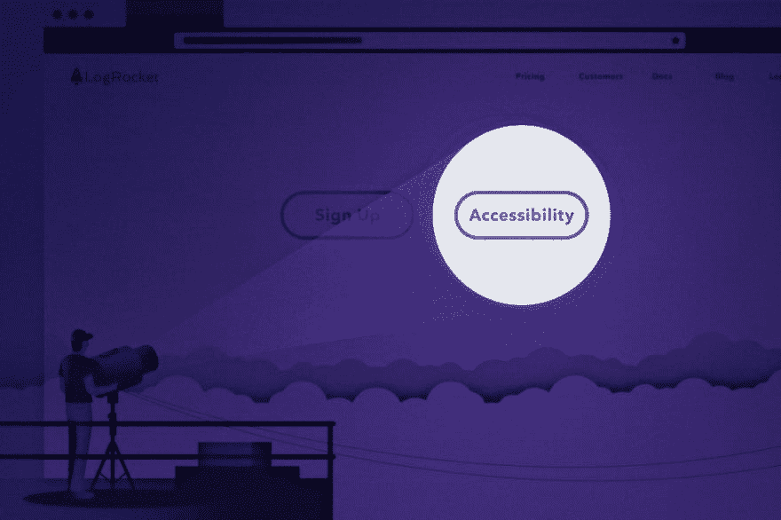
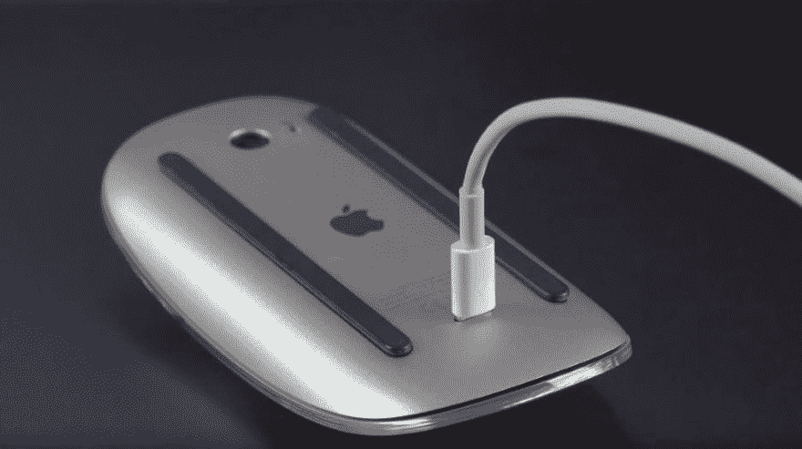

# 每个人打破网站焦点状态的 3 种方式

> 原文：<https://dev.to/bnevilleoneill/3-ways-everyone-breaks-their-website-s-focus-state-3o01>

#### 没有鼠标？你有大麻烦了。

[](https://res.cloudinary.com/practicaldev/image/fetch/s--fHXr4wQ6--/c_limit%2Cf_auto%2Cfl_progressive%2Cq_auto%2Cw_880/https://cdn-images-1.medium.com/max/1024/1%2AGWkJA9B47ABlB1JufQZXgw.jpeg)

像许多极其重要的事情一样，可访问性绝不是一件容易的事情。这并不是因为它是一个谜或者其他什么——有大量关于创建可访问界面的规则的文章。有可访问性短绒和自动审计。你甚至可以通过 Lighthouse 在 Chrome DevTools 中运行可访问性审计！

然而，由于某种原因，当项目截止日期临近时，可访问性似乎是首先要做的事情之一。尽管借口是“我们将在发布版本 1 后添加”，但它从未被添加。

在本文中，我们将致力于使我们的界面对只使用键盘的用户具有包容性的一个方面:**焦点状态**。

许多人不用鼠标(或者拇指，如果他们在打电话的话)就能上网。例如，一个有屏幕阅读器的人不会用鼠标在网站上点击——相反，他们会听到屏幕阅读器宣布他们当前在哪个项目上。有些人可能可以看到他们在哪里，但很难操作鼠标。焦点状态非常重要，因为当用户不使用鼠标时，它可以帮助用户知道他们在你的网站 *中的位置*。**

然而，拥有一个好的焦点状态不仅仅是可访问性的问题。许多人只是觉得不依赖鼠标浏览网站更快，因为他们不必在鼠标和键盘之间来回切换。或者他们可能正在使用 Apple Magic Mouse 鼠标，却忘记了充电:

[](https://res.cloudinary.com/practicaldev/image/fetch/s--KucknnHt--/c_limit%2Cf_auto%2Cfl_progressive%2Cq_auto%2Cw_880/https://cdn-images-1.medium.com/max/938/1%2ARSrIB92qUMKG-VT-H_GnGw.jpeg) 

<figcaption>你要*在这个鼠标充电的时候要用键盘*</figcaption>

我不想一口气列出一大堆要遵守的规则，我想探索一些会让用户在没有鼠标的情况下浏览网站时感到尴尬的情况。我坚信学习可访问性必须根植于对使用你网站的人的同情。如果你不知道你的网站在哪些方面很难导航，那么就很难构建易访问的界面。

但是在我们深入探讨之前，有一个简短的声明:这篇文章的目的不是羞辱任何打破网站焦点状态的人——那是没有价值或建设性的。事实上，在我作为前端开发人员的这段时间里，我对我们将要经历的所有这些例子都感到内疚。相反，让我们试着调查一些我们的网站可能难以使用的方法。这样我们就可以避免在将来产生不可访问的接口。

至此，让我们看看我们的第一个场景。

[](https://logrocket.com/signup/)

### 完全隐藏焦点状态

你可能认为有一个焦点状态是丑陋的。毕竟，当用户点击按钮时，所有按钮周围都会有一个讨厌的圆环。你可能很想这样做:

```
*:focus {
  outline: none;
} 
```

*不要这样做！*这是破坏网站焦点功能的最简单的方法之一——任何使用键盘导航的人都不再得到*任何*他们所关注元素的视觉指示。从设计的角度来看，它可能更“干净”,但是除了你的点击用户之外，它不会对任何人感同身受。

如果你不喜欢浏览器自带的默认焦点状态(在许多浏览器中这是一个模糊的轮廓)，这是公平的。带有边框半径的按钮很常见，实际上这些按钮的轮廓看起来不太好(因为你不能给轮廓一个边框半径)。

然而，完全移除默认值并不是正确的解决方案。不要将 outline: none 添加到您的焦点状态中，而是尝试用适合您的设计的东西替换默认状态。例如，你可以用一个方框阴影代替轮廓来获得类似的效果，同时保留边框半径:

```
*:focus {
  outline: none;
  box-shadow: 0 0 0 2px red;
} 
```

现在，不是由浏览器来决定轮廓的颜色和样式，而是用一个方框阴影来代替轮廓来表示焦点状态。使用框阴影可以控制焦点状态设计的两个重要方面:颜色和边框半径。上面例子中的 2px 控制了扩散半径，如果我们对所有其他值使用 0，最终看起来与边界*相同，并且继承了元素本身的边界半径*。此外，您现在可以控制焦点边框的颜色，以匹配您的设计方案！

### 跳过跳过链接

在设计模拟中，跳转链接并不经常被考虑，但是它们是让键盘用户能够访问任何 web 界面的关键部分。

如果你不熟悉跳转链接，看看这个来自 GitHub 的例子:

[](https://res.cloudinary.com/practicaldev/image/fetch/s--hFLyLHJb--/c_limit%2Cf_auto%2Cfl_progressive%2Cq_auto%2Cw_880/https://cdn-images-1.medium.com/max/1024/1%2Ad8WUperOX7AHyT-N_nhs9g.png)

<figcaption>GitHub 上的跳过链接只在聚焦时显示</figcaption>

那个“跳到内容”按钮*只有在被键盘*聚焦时才会出现。这允许键盘用户完全按照按钮所说的去做——跳过整个菜单，直接进入页面内容。

这可以为用户节省大量的时间，因为他们不必一遍又一遍地按 TAB 键来浏览所有的菜单内容。跳过链接可以让他们直接进入他们所访问页面的独特内容。

习惯上，跳转链接是页面中第一个可跳转的元素，如果用户习惯在页面加载时跳转，他们会立即看到这个选项。

当然，您可能最终会得到一个对于单个跳过链接来说过于复杂的界面。有些界面不仅仅包含内容，例如，您可能有嵌套的子菜单、过滤器或界面的多个部分，它们组合在一起形成“主要内容”。

然而，即使是这些更复杂的接口也可以采用“跳过链接”的思想，并根据自己的需要进行调整。我见过的一个最好的例子是当你在脸书的界面上按 tab 键时出现的“跳过菜单”。

[](https://res.cloudinary.com/practicaldev/image/fetch/s--XobRH3Sb--/c_limit%2Cf_auto%2Cfl_progressive%2Cq_66%2Cw_880/https://cdn-images-1.medium.com/max/1024/1%2AnmiUCvT_4k8PcHaOO63hqQ.gif) 

<figcaption>使用脸书</figcaption>

上的跳过菜单

脸书有一个复杂得令人难以置信的界面，上面有成千上万的移动部件，但它们为键盘用户提供了一个快速浏览页面的简单方法。他们是一个光辉的例子，不管界面有多复杂，仍然有可能做出包含键盘优先用户的东西。

### 包括屏幕外可聚焦元素

另一种为键盘第一用户打破网站的方法是包含大量屏幕外的可聚焦内容。例如，允许用户一路通过隐藏在屏幕外的菜单(也许当用户*点击*一个菜单切换时，菜单被显示)。

但是等等！这难道不是拥有焦点状态的主要原因之一吗？以便屏幕阅读器上的用户可以知道他们当前关注的是什么元素？

问题是，这只是包含焦点状态的原因之一。虽然拥有一个可聚焦的界面对屏幕阅读器来说至关重要，但它对其他类型的用户也很有帮助。

仅使用键盘来导航许多界面可能有点棘手，但最令人沮丧的事情之一是按下 TAB，然后突然看到小焦点边框完全消失。

祝贺你，你刚刚挖到了金子！或者你只是点击了一个对点击用户隐藏的屏幕外菜单。在没有鼠标情况下浏览这个菜单的唯一方法就是盲目地卡住标签，直到你看到焦点边框再次出现。

如果你没有使用屏幕阅读器，你可能不知道菜单有多长，也不知道你正在浏览什么选项。

这种离屏内容很常见——通过 CSS 转换来构建对标准用户隐藏的菜单非常容易:

```
.menu {
  position: fixed;
  top: 0;
  bottom: 0;
  right: 0;
  width: 200px;
  transform: translateX(100%);
} 
```

有趣的是，使用 transform 隐藏屏幕外的菜单允许您稍后使用 transform: translateX(0)将菜单带到屏幕上*,而不会触发浏览器重画。*再加上某种类型的过渡，你就有了一个动画菜单，呈现效果相当不错。

当你试图浏览网站，点击其中一个隐藏菜单时，问题就来了。然后，您将回到在菜单中跳转的场景，直到您看到焦点状态神奇地再次出现。

确保键盘用户不必浏览这些隐藏菜单的最简单的方法就是在它们被触发之前不要将它们呈现给 DOM。在 [W3 网站](https://www.w3.org/WAI/tutorials/menus/flyout/)上有一个很好的指南，可以帮助你构建这些“弹出菜单”。

在大多数情况下，除非一次绘制大量的 DOM 节点，否则不应该出现巨大的性能问题。但是，您可能需要找到一个新的添加动画的解决方案。

如果你正在使用 React 这样的现代 JavaScript 框架，我建议你看看是否有更好的动画元素的解决方案。通常，您可以在元素*被插入 DOM* 时对其进行动画处理，而不是将其留在 DOM 中并通过 CSS 转换来显示。

例如，React 有像 react-transition-group 和 react-pose 这样的库，使动画元素变得非常容易。这些库倾向于为高性能动画进行优化，并为您提供工具，为您的所有用户创造令人敬畏的体验(无论他们使用您的网站的方式如何)。我最熟悉 React 社区，但请在评论中分享你最喜欢的其他框架的动画解决方案！

### 结论

感谢阅读！这绝不是一个制作不可访问接口的详尽列表。事实上，这里可能没有列出很多打破焦点状态的方法。我鼓励每个人试着只用键盘浏览他们的网站，看看你遇到了什么。打通你的主要用户流有多容易？你还遇到过哪些常见的焦点状态问题？一如既往，欢迎在评论中分享它们，或者在 [Twitter](https://twitter.com/benjamminj) 联系我！

* * *

### Plug: [LogRocket](https://logrocket.com/signup/) ，一款适用于网络应用的 DVR

[](https://logrocket.com/signup/)

<figcaption>[https://logrocket.com/signup/](https://logrocket.com/signup/)</figcaption>

LogRocket 是一个前端日志工具，可以让你回放问题，就像它们发生在你自己的浏览器中一样。LogRocket 不需要猜测错误发生的原因，也不需要向用户询问截图和日志转储，而是让您重放会话以快速了解哪里出错了。它可以与任何应用程序完美配合，不管是什么框架，并且有插件可以记录来自 Redux、Vuex 和@ngrx/store 的额外上下文。

除了记录 Redux 操作和状态，LogRocket 还记录控制台日志、JavaScript 错误、堆栈跟踪、带有头+正文的网络请求/响应、浏览器元数据和自定义日志。它还使用 DOM 来记录页面上的 HTML 和 CSS，甚至为最复杂的单页面应用程序重新创建像素级完美视频。

免费试用。

* * *

帖子 [3 种打破网站焦点状态的方法](https://blog.logrocket.com/3-ways-everyone-breaks-their-websites-focus-state-b0d29bdeda11)最先出现在[博客](https://blog.logrocket.com)上。