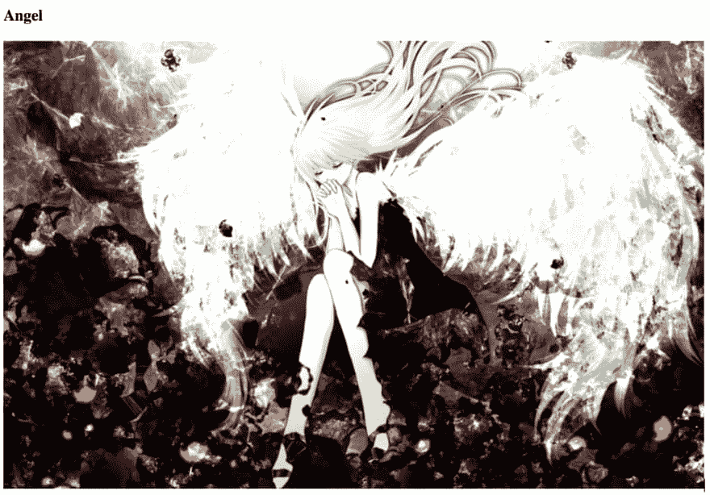

# 剖析我的 Ruby 项目框架

> 原文：<https://dev.to/maxwell_dev/dissecting-my-ruby-project-skeleton-4pd7>

正如我在这个网站上写的，我最近第一次真正体验到了 Ruby 的服务器端能力。由于红宝石修补，我错过了我的就寝时间，没有看漫画或听 NPR 的“等等，等等，不要告诉我”。

我知道，我的生活太刺激了。

作为对 Ruby 不断增长的热爱的一部分，我一直在构建一个 Ruby 项目框架，一个普通 Ruby 项目的现成起点。在制作的过程中，我了解了更多我经常看到但从未理解的 Ruby 文件和文件夹的不同角色。例如，`bin`文件夹不是用来处理没人要的代码的。与一位同事告诉我的相反，`spec`文件夹也不包含幽灵或鬼魂。可悲的是，现在知道这些不会让我回到那些不眠之夜。

总之，这篇文章概述了我的项目框架的关键部分以及它们是如何协同工作的。这篇文章在一定程度上给其他程序员带来了希望，尤其是那些前端程序员，他们也可能会爱上 Ruby。如果你像我一样，想更多地使用 Ruby，但是不知道 Ruby 项目是如何工作的，这篇文章就是为你准备的。

如果你也和我一样，想用 Ruby 创建一个每天早上都给自己发邮件的动漫作品网站，这篇文章对你特别有用。这已经成为我学习更多后端语言的一个辅助项目，为了清楚起见，我将大量引用它并给出一些例子。

就这样，我们开始解剖吧！

## Gemfile 和 Gemfile.lock

有趣的是，我的 Ruby 框架的第一部分是关于组织其他人的代码。像 JavaScript 和每个人最喜欢的`node_modules`文件夹一样，Ruby 使用`Gemfile`来组织第三方 Ruby 依赖项，称为“gems”gem 被用来完成许多有用的任务，比如复杂的逻辑、运行测试、抓取网页、发送邮件等等。我实际上在我的时事通讯应用程序中使用了几个这样的宝石！

向项目中添加宝石非常容易:

1.  设置 gem 文件以使用`https://rubygems.org`作为下载 gem 的源。这确保了我只下载 Ruby 社区的官方宝石。
2.  按名字列出需要的宝石。Gems 可以由您的环境(本地、生产、测试等)指定，但是对于这样一个小框架来说是不需要的。
3.  通过在命令行运行“bundle install”来安装它们。如果没有 bundler，用`gem install bundler`添加。
4.  `Gemfile.lock`是自动生成的，跟踪所有 gem 版本和依赖项。千万不要直接编辑这个文件！

下面是我的时事通讯的 gem 文件的样子，它包含了所有的 gem:

```
source "https://rubygems.org" do
  gem 'rspec'      # For running tests
  gem 'nokogiri'   # For scraping web data
  gem 'dotenv'     # For using environmental variables
  gem 'mail'       # For sending emails
end 
```

Enter fullscreen mode Exit fullscreen mode

我的骨架项目只有`rspec`在开始，这是一个非常流行的 Ruby 测试框架。虽然 Ruby 内置了测试工具，但我发现我更喜欢将`rspec`作为一个健壮的、描述性的测试设置。

每个 gem 都可以很容易地在其他文件中被引用和使用，我将在下一节解释这一点。

## lib/

有了别人写好的代码，我就可以开始我最喜欢的部分了:我自己的 Ruby 代码！

文件夹对我来说是最重要的，因为它保存了实际项目的功能。所有的类、模块、路线、模型以及它需要的任何东西都在这里。

我的时事通讯项目比较小，所以那里的`lib/`文件夹只有四个文件。我不会详细讨论它们是如何工作的，因为那是一篇完全不同的博文。但我将分享他们的基本角色以及他们如何相互需要:

1.  `tags_module.rb`是用于组织图像搜索的标签和参数的模块。
2.  `wallpaper_url_query.rb`是一个获取实际图像的类。它使用标签模块来访问一个动漫艺术网站上的特定搜索页面，并使用`nokogiri`来抓取图像 URL。
3.  `wallpaper_email_presenter.rb`从`wallpaper_url_query.rb`创建多个对象实例，并用基本的 HTML 和 CSS 使它们可显示(获取)。
4.  `email_sender.rb`从`wallpaper_email_presenter.rb`获取标记，并使用`dotenv`和`mail` gems 发送电子邮件。

更复杂的 Ruby 应用程序，比如 Rails 中的应用程序，可以拥有包含几十个类的文件夹，所有这些类都以复杂的非线性方式引用多个类。但这是一个更好的开始项目，因为正如上面所述，它是一个更简单和线性的应用程序。

从其他文件和 gems 中提取代码花了我一段时间才弄明白，所以这里有一个捷径给你。在 Ruby 文件的顶部:

*   如果需要使用宝石，使用`require`和宝石的名称。
*   如果您需要使用项目中的一个文件，如`lib/`文件夹，请使用带有该文件相对路径的`require_relative`。

例如，我的简讯项目的`wallpaper_url_query.rb`文件使用了其他人制作的两个 gem，以及我在同一个项目中编写的 tags 模块。我要求它们都在文件的开头，就像这样:

```
require 'open-uri'
require 'nokogiri'
require_relative 'tags_module.rb'

# To use a file outside lib/, I'd use:
# require_relative '../other_folder/other_file.rb'

class WallpaperUrlQuery

    # ...The actual Ruby goes here

end 
```

Enter fullscreen mode Exit fullscreen mode

正如任何使用过 Ruby on Rails 的人会告诉你的那样，有很多方法可以绕过所有你自己的文件。但像这样的香草红宝石骨架却不是这样。正如我的一个同事所指出的，明确每个文件的依赖关系可能需要额外的几行代码，但是它从一开始就清楚了每个类的需求。

因此，我有宝石，我有我的应用程序代码，使和发送实际的通讯。下一步是什么？确保一切正常！这就是我的骨架中的`spec/`文件夹出现的地方。

## 规格/

作为一个主要来自前端的人，我对“测试”的想法仅限于:

*   CSS 能在我的浏览器上运行吗？如果是，请再试一次。
*   JavaScript 会抛出任何控制台错误吗？如果是，请再试一次。
*   是不是让设计师抱怨了？如果是的话，去喝一杯。
*   它在 IE11 上坏了吗？如果是，哭吧。

但是与 CSS 和 JavaScript 不同，Ruby 在测试方面更加彻底。`test/unit`是 Ruby 附带的测试宝石，所以没有理由不测试。这个默认库在 test 文件夹中有它的测试，但是因为我更喜欢 RSpec，所以我的测试放在`spec`文件夹中。所有好的 app 都会有测试，这就是为什么我的骨架总有一个测试文件夹。

编写测试的本质完全是另一篇文章，但是我将分享我在编写测试的头一两年里学到的一些经验法则。

*   理想情况下，`lib/`中的每个文件在`spec/`中都有自己的文件。末尾与`_spec`同名，用`require_relative`获取相关文件。
*   测试不应该重复应用程序中使用的逻辑或过程。他们应该检查该类的正确结果或效果。
*   如果可能的话，首先编写测试。测试是功能代码的重中之重，它不会在以后莫名其妙地抛弃我。

这是我的一个测试文件中的一个简单例子，它确保我对 artwork 站点的查询返回正确的图像 URL。即使您从未使用过 RSpec，它的可读性和显式语法也能帮助任何人理解我的测试是如何工作的。

```
require_relative '../lib/wallpaper_url_query.rb'

describe WallpaperUrlQuery do
  let(:query) { WallpaperUrlQuery.new() }

  it 'should return an image url' do
    image = query.random_image

    expect(image).to be_a(String)
    expect(image).to include(WallpaperUrlQuery::BASE_URL)
    expect(image).to include('.jpg').or include('.png')
  end

  # ...more tests here
end 
```

Enter fullscreen mode Exit fullscreen mode

正如您所猜测的，我根本没有重新创建查询的功能。不管这个查询如何工作，我只想确定它给我的图片 url:

*   是正确的格式，字符串
*   包含托管它的站点的 url
*   具有图像扩展名

这些似乎是应用框架中最大的部分——宝石、功能和测试。但是最后一个问题是我第一次使用 Ruby 代码时多次遇到的——如何执行它？它不像前端，我只需要在网络浏览器中打开它。

这就是骨骼的下两个部分出现的地方。他们制定并组织执行代码的实际任务。我自己仍在研究这两种执行类型的确切角色，所以到目前为止，我更倾向于脱离我自己对何时包含它们的规则。

## [构造文件](#rakefile)

Rakefile 是一个 Ruby 文件，我在其中保存了我的“非生产”任务，这些任务实际上已经开始使用我的代码了！我坚持使用 Rakefile 做以下事情:

*   更改回购代码的代码，例如将数据更改为不同的形式
*   可以作为较大生产任务一部分的较小任务
*   我只想在本地编码或测试任何其他东西

一个例子是我在时事通讯应用中的一个 Rakefile 任务。包括该任务在内的整个文件如下:

```
require_relative 'lib/wallpaper_email_presenter.rb'

desc "Run a test of the newsletter template"
task :template do
  FileUtils.mkdir_p('demo') unless Dir.exists?('demo')
  File.delete 'demo/index.html' if File.exists?('demo/index.html')
  File.write 'demo/index.html', WallpaperEmailPresenter.new().full_view
end 
```

Enter fullscreen mode Exit fullscreen mode

这将通过将示例新闻稿保存为网页来创建新闻稿外观的“演示”。我可以在浏览器中打开它，看看我的查询类找到了什么图像。现在我可以运行`rake template`并测试我的时事通讯，而不用发送电子邮件。我刚刚运行了它(实际上是在最后一句话之后)，并从我的“天使”查询中获得了这幅作品。

[](https://res.cloudinary.com/practicaldev/image/fetch/s--l1Tm-wjD--/c_limit%2Cf_auto%2Cfl_progressive%2Cq_auto%2Cw_880/https://thepracticaldev.s3.amazonaws.com/i/hfoglihuji6uk1fzj9qi.png)

我不会在生产中使用它，因为这是一种间接的测试方式。这就是为什么我把它放在这里，并且可以在命令行上用`rake <name>`运行它和其他潜在的 Rake 测试。

## 斌/

Bin 是“二进制可执行文件”的简称(我 95%肯定是对的)。这些是我实际用于制作的脚本。他们为 Ruby 应用程序做大事，比如运行 web 服务器、运行测试、发送大量电子邮件，或者其他任何生产级 Ruby 应用程序做的事情。我离那个水平还很远，所以`bin/`文件夹的大部分对我来说还是个谜。

然而，我知道绑定文件不像 Rake 任务那样局限于 Ruby。可以根据需要将它们设置为不同的语言环境。这为他们提供了更多的能力和灵活性，这对于运行任何需要的关键任务都很重要。

例如，我的时事通讯项目在不同的环境中有两个简单的`bin`文件。第一个是`test`，使用 bash 并运行 RSpec 测试。

```
#!/usr/bin/env bash

rspec 
```

Enter fullscreen mode Exit fullscreen mode

第二个是红宝石色的`send`。它使用应用程序的代码来发送实际的电子邮件。

```
#!/usr/bin/env ruby

require_relative '../lib/email_sender.rb'
EmailSender.new().send_email 
```

Enter fullscreen mode Exit fullscreen mode

您可能已经注意到文件名没有保存扩展名。这就是为什么在第一行中指定了环境。这也意味着我需要运行`chmod u+x bin/<file_name>`来使文件可执行。但是一旦完成，我就可以运行`bin/test`进行测试，运行`bin/send`发送电子邮件。

是的，我终于可以将这段代码上传到服务器，并安排它每天早上运行`bin/send`。全部通过使用我的红宝石骨架的这些基本部分！

## 自述

最后是每个人最喜欢的文件，自述文件！我的 skeleton 的 README 是设置和运行任务的基本提示，因此值得注意。

```
bundle install             # Install gems
rake custom                # Run custom tasks
bin/test                   # Run bin tasks, such as tests
chmod u+x bin/<file_name>  # Make a bin file executable 
```

Enter fullscreen mode Exit fullscreen mode

我的框架中还有几个文件夹我没有注意到，比如`doc/`和`data`。但是以我目前的经验和注意力，我不太可能在短时间内接触它们，所以我会把它们留到下一天。

### 结论

剖析现在已经完成，你现在已经知道了我未来所有普通 Ruby 项目的基本设置！你可以在 Github 上找到[整个 Ruby 的框架，并随意摆弄。你也可以看看](https://github.com/maxx1128/ruby-skeleton)[我从](https://github.com/maxx1128/ruby_anime_newsletter)中提取的 Ruby 时事通讯项目的例子，看看这个框架是如何转化成真实的东西的(即使是在初级水平)。

即使您可以使用我的框架来启动自己的 Ruby 项目，我也不建议这样做。正如我从泽德·肖的《艰难地学习红宝石》一书中学到的那样，通过研究、试验、错误和安非他明刺激的夜晚，从零开始制作东西是知识得以坚持的方式。此外，我还在不断学习——可能有些事情我做错了，或者可以大大改进(如果你发现了这样的事情，请在下面评论！).所以不要把我的骨架项目当成福音真理。

尽管我很高兴拥有这个骨架，但它仍然是学习 Ruby 的又一小步。我还有书要记笔记，教程要试用，我需要时间更多地使用可爱的 Ruby on Rails。但是正如我之前所写的，这是我第二次真正感受到 Ruby 的强大和快乐。我从节省更改数据的时间转向构建一个有目的、定制逻辑和测试的实际项目。我计划在以后的类似项目中更多地使用它。

如果我真的幸运的话，我可以帮助激励其他一些程序员也这样做。所以，如果你是一个前端程序员，想玩玩后端，试试你自己的 Ruby 框架吧！