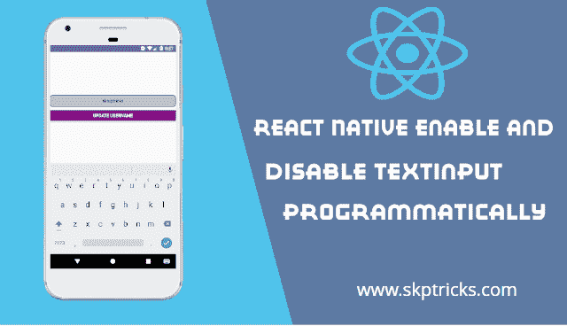
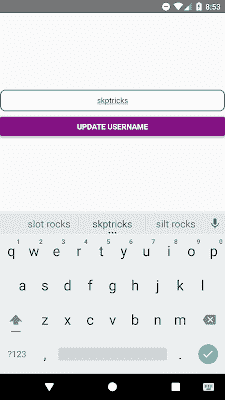
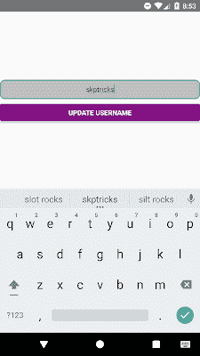

# 以编程方式启用和禁用 TextInput

> 原文：<https://dev.to/skptricks/react-native-enable-and-disable-textinput-programmatically-1b99>

* * *

## 来源: [React Native 以编程方式启用和禁用 TextInput】](https://www.skptricks.com/2019/01/react-native-enable-and-disable-textinput-field.html)

本教程解释了如何在 react 本地应用程序中以编程方式启用和禁用 TextInput 组件。TextInput 自带属性 **editable={Boolean Value}** ，这个属性可以动态启用禁用 TextInput 输入值。如果 **editable={false}** 的值，那么它将禁用完整的 TextInput 组件，并限制应用程序用户在其中输入或键入任何值。如果**的值 editable={true}** 那么它将启用文本输入，用户现在可以在其中输入值。

**在 React Native 中禁用 TextInput 组件的代码片段:**

```
 <TextInput  
placeholder="Enter Your Userame"  
underlineColorAndroid='transparent'  
editable={this.state.TextInputDisableHolder}  
/> 
```

[](https://1.bp.blogspot.com/-wL3HIb4iqaE/XD1T6fkur7I/AAAAAAAACVI/bu0kxTo-6eMcSzaZBVZSB42IbNYTFBubQCLcBGAs/s1600/textinput.png)

## **启用和禁用 React Native 中的 TextInput 组件:**

在这个例子中，我们将创建一个简单的 TextInput 组件，当用户输入任何文本并点击 update 按钮时，它将不允许用户再次输入文本。

* *步骤 1: ** 创建一个新的 react native 项目，如果你不知道[如何在 react native 中创建新项目，就按照这个教程](https://www.skptricks.com/2018/06/how-to-create-your-first-react-native-application.html)做。

**步骤 2:** 在你最喜欢的代码编辑器中打开 index.android.js / index.ios.js，擦除所有代码，按照本教程操作。

* *第三步:** 通过 react，react-native 包导入所有需要的组件。

```
import React, { Component } from "react";  
import { Platform, StyleSheet, View, Button, TextInput, } from "react-native"; 
```

**第四步:**在 App 类内部创建一个构造函数，将 state 对象定义为**TextInputDisableStatus** 。该状态对象有助于启用和禁用 TextInput 字段。

```
constructor() {  
super();  
this.state = { TextInputDisableStatus: true }  
} 
```

**第 5 步:* *App ** 类内创建名为**onPressButton** 的函数。当用户点击“更新用户名”按钮时，此功能将禁用文本输入字段。

```
onPressButton = () => {  
this.setState({ TextInputDisableStatus: false })  
} 
```

* *第 6 步:** 实现 render 方法，并放置在 render 块内的布局设计下方。

```
render() {  
return (  
<View style={styles.container}>  

<TextInput  
          placeholder="Enter Your Userame"  
          underlineColorAndroid='transparent'  
          style={[styles.TextInputStyle, { backgroundColor: this.state.TextInputDisableStatus ? '#FFF' : '#C0C0C0' }]}  
          editable={this.state.TextInputDisableHolder}  
/>  

<Button  
          onPress={this.onPressButton}  
          title="Update Username"  
          color="#841584"  
          accessibilityLabel="Update Username"  
/>  

</View>  
);  
} 
```

* *步骤 7 : ** 应用下面的样式表设计。

```
const styles = StyleSheet.create({  
  container: {  
    flex: 1,  
    justifyContent: 'center',  
},  
  headerText: {  
    fontSize: 20,  
    textAlign: "center",  
    margin: 10,  
    fontWeight: "bold"  
},  
TextInputStyle: {  
    textAlign: 'center',  
    height: 40,  
    borderRadius: 10,  
    borderWidth: 2,  
    borderColor: '#009688',  
    marginBottom: 10  
}  
}); 
```

## app . js 的完整源代码

当用户在 react 本地应用程序中单击“更新用户名”按钮时，让我们来看看帮助启用和禁用 TextInput 组件的完整源代码。

```
/\*\*  
 \* Sample React Native App  
 \* https://github.com/facebook/react-native  
 \* @flow  
 \*/  

import React, { Component } from "react";  
import { Platform, StyleSheet, View, Button, TextInput, } from "react-native";  

export default class App extends Component {  

  constructor() {  
super();  
this.state = { TextInputDisableStatus: true }  
}  

  onPressButton = () => {  
this.setState({ TextInputDisableStatus: false })  
}  

  render() {  
return (  
<View style={styles.container}>  

<TextInput  
          placeholder="Enter Your Userame"  
          underlineColorAndroid='transparent'  
          style={[styles.TextInputStyle, { backgroundColor: this.state.TextInputDisableStatus ? '#FFF' : '#C0C0C0' }]}  
          editable={this.state.TextInputDisableHolder}  
/>  

<Button  
          onPress={this.onPressButton}  
          title="Update Username"  
          color="#841584"  
          accessibilityLabel="Update Username"  
/>  

</View>  
);  
}  
}  

const styles = StyleSheet.create({  
  container: {  
    flex: 1,  
    justifyContent: 'center',  
},  
  headerText: {  
    fontSize: 20,  
    textAlign: "center",  
    margin: 10,  
    fontWeight: "bold"  
},  
TextInputStyle: {  
    textAlign: 'center',  
    height: 40,  
    borderRadius: 10,  
    borderWidth: 2,  
    borderColor: '#009688',  
    marginBottom: 10  
}  
}); 
```

**截图:**

[](https://2.bp.blogspot.com/-MzYCmDOqYyM/XD1SW6nv-9I/AAAAAAAACUw/3jgijR_-xvEX8GYcHePi6E7pVzhUCqqrwCLcBGAs/s1600/Screenshot_1547522588.png)

[](https://1.bp.blogspot.com/-OWRwXqTUsSc/XD1SZIBp4wI/AAAAAAAACU0/sMdcpqmjy3AiJ5yKhVhkxSXqONBVfY3fQCLcBGAs/s1600/Screenshot_1547522624.png)

[](https://3.bp.blogspot.com/-pVgrK43C2t0/XD1SaJJIOkI/AAAAAAAACU4/1An9yI4gNooHFJkHZ-H5UR7AUNVvOO7agCLcBGAs/s1600/Screenshot_1547522629.png)

**下载链接:**

[https://github . com/skp tricks/React-Native/tree/master/React % 20 Native % 20 enable % 20 and % 20 disable % 20 textinput % 20 程序化](https://github.com/skptricks/React-Native/tree/master/React%20Native%20Enable%20and%20Disable%20TextInput%20Programmatically)

这都是关于**在 react 原生应用**中启用和禁用 TextInput 组件。感谢你阅读这篇文章，如果你有任何问题，有关于这篇文章的另一个更好的有用的解决方案，请在评论区写消息。