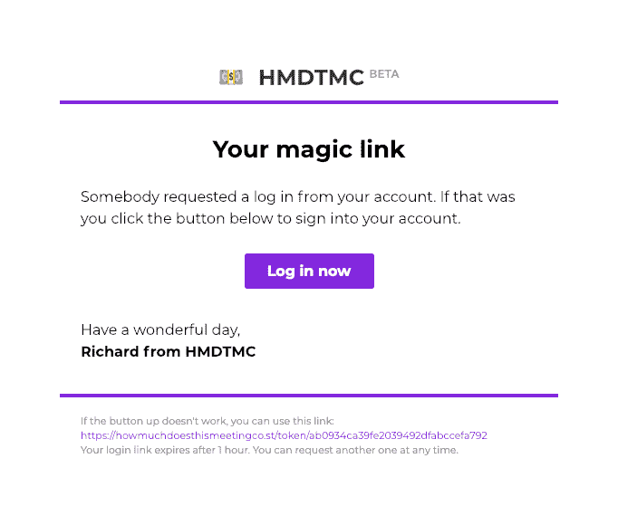

# 使用 MJML 构建响应性电子邮件

> 原文：<https://dev.to/pretzelhands/building-responsive-email-with-mjml-5dhc>

<small>(乔安娜·科辛斯卡在 Unsplash 上的照片)</small>

> 这篇文章最初发表在我的个人博客上。

所以我假设，如果你正在阅读这篇文章，你属于三类人之一:一类人从未创建过 HTML 电子邮件，但希望进入其中；一类人以前创建过 HTML 电子邮件，并希望找到更好的方法来做这件事；另一类人出于某种原因只是阅读我写的所有内容。

如果你认为自己是那些以前从未创建过 HTML 电子邮件的人之一，那么[数一数你的幸运吧](https://www.emailonacid.com/blog/article/email-development/email-development-best-practices-2/)。这些神奇的作品所包含的工作量绝对令人麻木。HTML 电子邮件就像是网络技术的西部荒野。

我希望我是在开玩笑，真的。在我成为自由职业者之前，创建 HTML 电子邮件是我第一份工作的职责之一，我觉得在这三年里，我至少老了十岁。你必须记住的微小的、模糊的东西的数量是令人难以置信的。甚至是对所有人的侮辱。我们谈论的是内联样式、表格布局、透明技巧等等。有趣的是，谷歌，这个开发最先进浏览器的公司，却是罪魁祸首之一。

不是真的，[这里有一个 CSS 支持列表在电子邮件](https://www.campaignmonitor.com/css/)中。阅读之前，请务必坐好。这太可笑了。

当然，现在已经有了像电子邮件基础、emailframe.work 和许多其他解决方案。但是它们要么很难设置，要么仍然需要你记住 HTML 邮件中的一些陷阱。但是不久前，多亏了 [@pugson](https://twitter.com/pugson) ，我了解到一个框架比其他所有框架都要优秀。

它叫 MJML，它让我的袜子很酷。

对于我在电子邮件营销方面的支柱来说，这有点太晚了，但我仍然在交易电子邮件中使用它。这是你用它构建 HTML 的旋风指南！所以让我们开始吧。

## 安装并运行 MJML

如果你已经安装了`npm`或者`yarn`，安装 MJML 是非常简单的。您只需要运行下面的命令，就可以开始了。

```
npm install -g mjml 
```

Enter fullscreen mode Exit fullscreen mode

如果你不是网络人群的一部分，没有 MJML，或者如果你只是想尝试一下并节省一些时间，你也可以使用[他们的在线游乐场](https://mjml.io/try-it-live)。我承认我主要使用那个，只是因为在你的代码旁边看到你的邮件非常方便。

要详细了解如何使用命令行工具，请务必查看优秀的文档。

但是这里的快速总结是你最有可能使用的命令

```
# Compile the MJML file and save it to an HTML file
mjml email.mjml -o email.html

# Watch an MJML file for changes and recompile automatically
mjml --watch email.mjml -o email.html

# Minify the compiled HTML to save space
mjml --config.minify email.mjml -o email.html 
```

Enter fullscreen mode Exit fullscreen mode

## 创建您的第一封电子邮件

作为一个建立电子邮件的例子，我会选择一个由你真正制作的。这是一封神奇的链接邮件，我用它来制作一个会议追踪应用程序。

[](https://res.cloudinary.com/practicaldev/image/fetch/s--FYIedywx--/c_limit%2Cf_auto%2Cfl_progressive%2Cq_auto%2Cw_880/https://pretzelhands.com/assets/posts/mjml-01.png)

它不是特别复杂，所以我认为它非常适合 MJML 的第一次尝试。首先，让我们看看整个模板，然后让我们一点一点地把它拆开。

```
<mjml>
    <mj-head>
        <mj-font name="Montserrat" href="https://fonts.googleapis.com/css?family=Montserrat:400,700" />
        <mj-preview>Click the button inside to log into your account</mj-preview>

        <mj-attributes>
          <mj-text font-size="16px" line-height="24px" padding="0px 48px 16px" />
          <mj-button font-weight="bold" font-size="16px" background-color="#8e2de2" />
          <mj-divider border-color="#8e2de2" />
          <mj-all font-family="Montserrat, Helvetica, Arial, sans-serif" />
        </mj-attributes>

        <mj-style inline="inline">
          .link {
            color: #8e2de2;
            text-decoration: none;
          }
        </mj-style>
    </mj-head>
    <mj-body>
        <mj-section padding-bottom="0">
            <mj-column>
                <mj-image
                        padding-top="20px"
                        padding-bottom="20px"
                        width="200"
                        src="https://howmuchdoesthismeetingco.st/assets/logo-hmdtmc.png"
                />

                <mj-divider />

                <mj-text align="center">
                    <h1>Your magic link</h1>
                </mj-text>

                <mj-text>
                    Somebody requested a log in from your account. If that was you click the button
                    below to sign into your account.
                </mj-text>

                <mj-button href="https://howmuchdoesthismeetingco.st/token/abcdefg123456789">
                    Log in now
                </mj-button>

                <mj-text>
                    <br />
                    Have a wonderful day,<br />
                    <strong>Richard from HMDTMC</strong>
                </mj-text>

                <mj-divider />

                <mj-text
                        padding="8px 48px"
                        font-size="11px"
                        line-height="16px"
                        color="#999999"
                >
                    If the button up doesn't work, you can use this link:
                    <a
                            href="https://howmuchdoesthismeetingco.st/token/abcdefg123456789"
                            class="link"
                    >
                        https://howmuchdoesthismeetingco.st/token/abcdefg123456789
                    </a>
                    <br/>
                    Your login link expires after 1 hour. You can request another one at any time.
                </mj-text>
            </mj-column>
        </mj-section>
    </mj-body>
</mjml> 
```

Enter fullscreen mode Exit fullscreen mode

好吧，这是很多代码，如果你还没有运行，我为你感到骄傲。最复杂的部分可能就在`mj-head`的开头，但是让我们从头开始:根元素。

### 文档结构

MJML 不像 HTML 或 XML。它毕竟是一种试图吐出 HTML 的标记语言。因此，每个 MJML 文档都以一个简单的根标签开始:

```
<mjml></mjml> 
```

Enter fullscreen mode Exit fullscreen mode

在这个根元素中，您拥有与常规 HTML 文档相同的部分。一个`head`和一个`body`。它们只是以`mj`为前缀。所以标准结构看起来是这样的:

```
<mjml>
    <mj-head></mj-head>
    <mj-body></mj-body>
</mjml> 
```

Enter fullscreen mode Exit fullscreen mode

`mj-head`是一个非常令人兴奋的地方，在这里你可以定义所有的样式和元数据！这可能是编写基于 MJML 的电子邮件最有趣的部分。

### 文档头

现在让我们来看看`mj-head`中所有奇怪的东西，并揭开它的神秘面纱。

```
<mj-head>
    <mj-font name="Montserrat" href="https://fonts.googleapis.com/css?family=Montserrat:400,700" />
    <mj-preview>Click the button inside to log into your account</mj-preview>

    <mj-attributes>
      <mj-text font-size="16px" line-height="24px" padding="0px 48px 16px" />
      <mj-button font-weight="bold" font-size="16px" background-color="#8e2de2" />
      <mj-divider border-color="#8e2de2" />
      <mj-all font-family="Montserrat, Helvetica, Arial, sans-serif" />
    </mj-attributes>

    <mj-style inline="inline">
      .link {
        color: #8e2de2;
        text-decoration: none
      }
    </mj-style>
</mj-head> 
```

Enter fullscreen mode Exit fullscreen mode

作为文档头的第一个孩子，我们有一个`mj-font`标签。它接受一个`name`和一个`href`。如果你看看`href`链接到哪里，你会很快发现所有这些都是加载到 Google Fonts 托管的字体中。当然，鉴于目前的状况，并不是所有的电子邮件客户端都支持这一点。但是有些人做到了，他们得到了更漂亮的排版。

```
<mj-font name="Montserrat" href="https://fonts.googleapis.com/css?family=Montserrat:400,700" /> 
```

Enter fullscreen mode Exit fullscreen mode

在这之后，我们找到一个包含一些文本的`mj-preview`标签。这是一种不可见的预览文本，显示在一些电子邮件客户端的收件箱中，就在电子邮件主题的下方。为了给你一些背景，我说的是这里描绘的浅灰色文本(在苹果邮件中)

[](https://res.cloudinary.com/practicaldev/image/fetch/s--G_JTCgTF--/c_limit%2Cf_auto%2Cfl_progressive%2Cq_auto%2Cw_880/https://pretzelhands.com/assets/posts/mjml-02.png)
T4】

你可以用这个来戏弄你的订阅者关于你的时事通讯的内容或者给出内容的摘要。找到足够长的文本来填充整个区域，但又不会太长而被电子邮件客户端截断，这是一种艺术。

```
<mj-preview>Click the button inside to log into your account</mj-preview> 
```

Enter fullscreen mode Exit fullscreen mode

接下来是一个特别的。`mj-attributes`允许您为正在使用的所有 MJML 标签设置默认样式。当然，您可以随时覆盖这些内容。这些只是存在，所以你不必一遍又一遍地重复自己。

`mj-attributes`标签的每个子标签都是另一个 MJML 标签，比如`mjml-text`或`mjml-button`。您想要使用的每个 CSS 属性都被定义为一个属性。这一开始可能不常见，但你会很快习惯的。还有一个特殊的`mj-all`标签，可用于将样式应用于所有元素。(有点像 CSS `*`选择器)

还要注意我是如何为`mj-all`标签定义一些备用字体的。这是因为不支持 CSS 的电子邮件客户端至少还有一种可以忍受的字体。

```
<mj-attributes>
    <mj-all font-family="Montserrat, Helvetica, Arial, sans-serif" />
    <mj-text 
        font-size="16px"
        line-height="24px"
        padding="0px 48px 16px" 
    />
</mj-attributes> 
```

Enter fullscreen mode Exit fullscreen mode

我们用一个`mj-style`标签包装头部组件。您可以使用这些来编写常规的 CSS 和媒体查询。这里需要特别注意的一点是，我在样式标签中添加了`inline="inline"`属性。这使得 MJML 搜索具有类`link`的所有元素，并向其添加样式属性。

```
<!-- So this element -->
<a href="#" class="link">My awesome link!</a>

<!-- Turns into this -->
<a href="#" class="link" style="color: #8e2de2; text-decoration: none;">My awesome link!</a> 
```

Enter fullscreen mode Exit fullscreen mode

你想要这个的原因又是因为电子邮件客户端缺乏 CSS 支持。许多只支持像`a`或`h1`这样的基本选择器，而 Gmail 只是接受你的`style`标签，而**则完全抛弃它。**是的。这实际上是真实发生的事情。感谢谷歌。

### 文档体

这是你的电子邮件的精华所在。MJML 提供了许多定制标记，使构建电子邮件变得尽可能简单。您可以在文档中找到所有可用标签的列表[。](https://mjml.io/documentation/#standard-body-components)

我将在下面突出我使用的那些，从`mj-section`开始。

`mj-section`是用来作为布局中的一行。想象它有点像 Bootstraps 或 Foundations 网格行元素。默认情况下，它提供了一些垂直间距，但是您当然可以删除它。如果你不需要任何特殊的东西，你当然也可以使用`div`或`table`(是的，我对`table`是认真的)。

`mj-column`允许您在布局中定义一列或多列。这样你可以很容易地在你的电子邮件中建立一个网格布局。要让多个列相邻，将它们放入一个`mj-section`中，就可以开始了。

一个 2x2 网格的例子可能是这样的

```
<mj-body>
    <mj-section>
        <mj-column>Row 1, Column 1</mj-column>
        <mj-column>Row 1, Column 2</mj-column>
    </mj-section>

    <mj-section>
        <mj-column>Row 2, Column 1</mj-column>
        <mj-column>Row 2, Column 2</mj-column>
    </mj-section>
</mj-body> 
```

Enter fullscreen mode Exit fullscreen mode

`mj-image`是一个形象。你可能知道。默认情况下，MJML 为它添加了一些样式，使它更加突出，但是同样，您可以很容易地改变这一点。

`mj-text`是一个通用的文本容器。你可以把任何`p`、`h1`或其他任何东西放进去，让它看起来很漂亮。如果它只是一个随机的文本块，你也可以像孩子一样直接把它放进去。

本质上是一个按钮式的链接。将`href`作为属性传入，在不到 30 秒的时间内，您就获得了一个很棒的行动号召。如果这不是快速的电子邮件开发，我不知道什么是。

`mj-divider`有点像`hr`，除了它更容易造型。在我的电子邮件模板中，我用它将页眉和页脚从主要内容中分离出来。

### 样式标签

对于我上面提到的每一个标签，你可以很容易地传入属性，给它们一个你没有在`mj-attributes`中添加的一次性样式。例如，我用这个标签来设计我的页脚文本

```
<mj-text
    padding="8px 48px"
    font-size="11px"
    line-height="16px"
    color="#999999"
>
    Footer text
</mj-text> 
```

Enter fullscreen mode Exit fullscreen mode

如果您最终不止一次地使用了一组样式，但它仍然不是您想要的默认样式，您还可以定义一个`mj-class`，它允许您像 Oprah 传汽车一样传递样式。

您只需在`mj-attributes`
中定义以下内容

```
<mj-attributes>
    <mj-class name="padded" padding="20px" />
</mj-attributes> 
```

Enter fullscreen mode Exit fullscreen mode

给你的类一个名字和一些你想让它使用的 CSS 属性，然后你就可以开始了。**但是请注意，这只适用于 MJML 标签**。对于普通的 HTML 标签，你应该使用`mj-style`。

## 总结

MJML 是一个很棒的工具，它可以帮助你以比其他方式更快的速度构建响应性 HTML 电子邮件。预定义的组件帮助您去掉最烦人的部分，这样您就可以专注于内容和布局，而不是摆弄 CSS 代码。

当然，没有一个工具是完美的，MJML 也是如此。所以最后，一定要用诸如 [Litmus](https://litmus.com/) 或[email nacid](https://www.emailonacid.com/)这样的工具来测试你的电子邮件模板。只是为了确定；-)

尽情享受吧！~