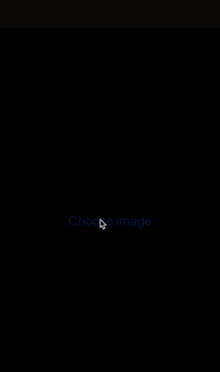
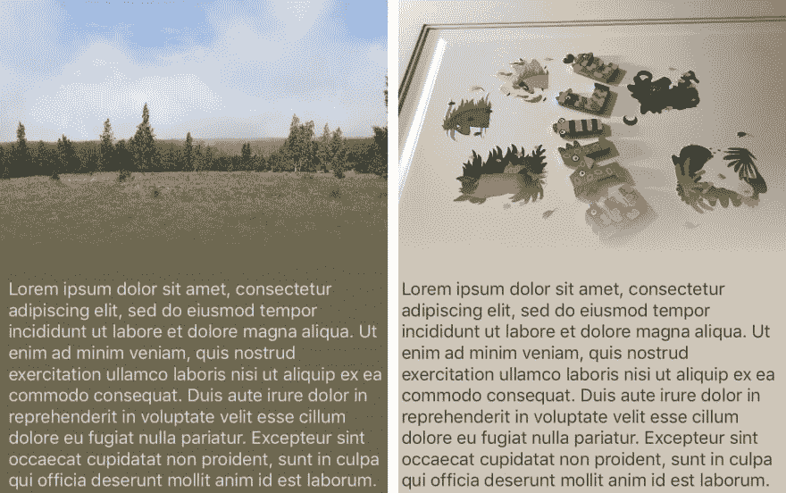

# 在 Swift 中使用图像选择颜色

> 原文：<https://dev.to/neriusv/selecting-colors-using-an-image-in-swift-27l9>

前几天在推特上看到一个有趣的问题。

> iTunes 应用程序如何根据海报图像的颜色选择视图的背景颜色？

答案似乎很简单:

1.  选择图像的主色。
2.  设置为背景色。
3.  选择一种在那种背景下看起来不错的颜色。
4.  将其用作文本颜色。

现实生活通常不是那么简单，而是有趣得多。

下面是我对它的看法:
[](https://res.cloudinary.com/practicaldev/image/fetch/s--d1QHVS3---/c_limit%2Cf_auto%2Cfl_progressive%2Cq_66%2Cw_880/https://thepracticaldev.s3.amazonaws.com/i/6ekaicpv5475uhl67grr.gif)

好，那我们开始吧！我将使用 Swift、UIKit 和 CoreGraphics 类，如 *UIImage* 、 *UIColor* 、 *CGImage* ，但同样的原则适用于任何其他语言或框架。

## 拾取图像的主色

挑选主色最简单的方法是取图像的平均颜色，即所有像素的值相加，然后除以像素的数量。我很惊讶这种方法如此有效🤯。说真的，你可以忽略这篇文章的大部分内容，只使用平均颜色。

当然，在某些边缘情况下，平均值实际上不起作用:想象一张一半黑一半白的图片。即使图像中没有灰色，平均值也是灰色的。另一个选择可能是*以某种方式*订购颜色并挑选[中间值](https://en.wikipedia.org/wiki/Median)。你可以按色调或饱和度来排序。

但是让我们把所有的事情都复杂化，使用一种叫做 [k 均值聚类](https://en.wikipedia.org/wiki/K-means_clustering)的技术。

## K-均值聚类

如果你点击维基百科的链接，你可能会被“信号处理”和“空间范围”这样的词弄得晕头转向，但这比听起来要简单。相信我。

它所做的是将数据分成 *k* 个组(集群)。在我们的例子中，它会将图像的所有颜色分成 *k* 个组，然后你选择其中一个组(通常是最大的一个)，计算它的中心(又名*意思是*)，你就有了该图像的主色。

算法:

1.  从你的图像中随机选择 k 个颜色。这将是你的集群的中心。
2.  计算从每个像素的颜色到每个聚类中心的距离。
3.  将像素的颜色分配给最近的簇。
4.  通过取分配给该分类的所有颜色的平均值来计算每个分类的新中心。
5.  转到 2。重复此操作，直到所有簇的中心不再改变。

你可能想知道究竟如何计算两种颜色或一种颜色到星团中心的距离？幸运的是，我们可以将颜色视为 3D 空间中的点！通常一种颜色由三种(或者四种，如果你考虑透明度的话)成分定义:红色、绿色、蓝色；或者色调、饱和度和亮度。三维空间中的点也是由三个部分定义的:X，Y 和 Z。所以红色变成 X，绿色变成 Y，蓝色变成 Z，突然你就有了一个三维空间中的点！那么计算两种颜色之间的距离就和[计算两点之间的距离](https://en.wikipedia.org/wiki/Euclidean_distance)一样简单。

好了，是时候写些代码了！

## 调整图像大小

首先，我们需要将图像的大小调整到一个可管理的大小(比如 100x100)，否则聚类将永远进行下去。
让我们为 *UIImage* 做一个扩展来调整它的大小:

```
extension UIImage {
    func resized(to size : CGSize) -> UIImage {
        let format = UIGraphicsImageRendererFormat()
        format.scale = 1
        //disable HDR:
        format.preferredRange = .standard
        let renderer = UIGraphicsImageRenderer(size: size, format: format)
        let result = renderer.image { (context) in
            self.draw(in: CGRect(origin: CGPoint.zero, size: size))
        }
        return result
    }
} 
```

## 获取颜色数据

接下来，我们需要获取图像中所有像素的所有颜色数据。
我的解决方案是从 *UIImage* 获取 *CGImage* ，并获取图像数据，这是一个字节数组。将字节复制到一个无符号 32 位整数数组中。这给出了一个数组，其中每个元素代表一个像素的颜色。
遍历这个数组，使用一些逐位魔法提取红色、绿色和蓝色成分，最后创建一个 *UIColor* 的实例。

这似乎比它应该的要复杂得多。如果你知道一个更好的将 UIImage 转换成 T2 ui color 数组的方法，请告诉我！

```
extension UIImage {
    func getPixels() -> [UIColor] {
        guard let cgImage = self.cgImage else {
            return []
        }
        assert(cgImage.bitsPerPixel == 32, "only support 32 bit images")
        assert(cgImage.bitsPerComponent == 8,  "only support 8 bit per channel")
        guard let imageData = cgImage.dataProvider?.data as Data? else {
            return []
        }
        let size = cgImage.width * cgImage.height
        let buffer = UnsafeMutableBufferPointer<UInt32>.allocate(capacity: size)
        _ = imageData.copyBytes(to: buffer)
        var result = [UIColor]()
        result.reserveCapacity(size)
        for pixel in buffer {
            var r : UInt32 = 0
            var g : UInt32 = 0
            var b : UInt32 = 0
            if cgImage.byteOrderInfo == .orderDefault || cgImage.byteOrderInfo == .order32Big {
                r = pixel & 255
                g = (pixel >> 8) & 255
                b = (pixel >> 16) & 255
            } else if cgImage.byteOrderInfo == .order32Little {
                r = (pixel >> 16) & 255
                g = (pixel >> 8) & 255
                b = pixel & 255
            }
            let color = UIColor(red: CGFloat(r) / 255.0, green: CGFloat(g) / 255.0, blue: CGFloat(b) / 255.0, alpha: 1)
            result.append(color)
        }
        return result
    }
} 
```

我知道，😱！但是说真的，这是最困难的部分。

## 定义数据结构

接下来，我们需要一种方便的方法来计算颜色/点。你可以为 *UIColor* 实现几个扩展函数，但是我决定创建一个新的*点*结构:

```
struct Point : Equatable {
    let x : CGFloat
    let y : CGFloat
    let z : CGFloat
    init(_ x: CGFloat, _ y : CGFloat, _ z : CGFloat) {
        self.x = x
        self.y = y
        self.z = z
    }
    init(from color : UIColor) {
        var r : CGFloat = 0
        var g : CGFloat = 0
        var b : CGFloat = 0
        var a : CGFloat = 0
        if color.getRed(&r, green: &g, blue: &b, alpha: &a) {
            x = r
            y = g
            z = b
        } else {
            x = 0
            y = 0
            z = 0
        }
    }
    func toUIColor() -> UIColor {
        return UIColor(red: x, green: y, blue: z, alpha: 1)
    }
    static func == (lhs: Point, rhs: Point) -> Bool {
        return lhs.x == rhs.x && lhs.y == rhs.y && lhs.z == rhs.z
    }
} 
```

我们现在有了一个简单的方法来转换 UIColor 和我们的 T2 点结构。接下来让我们定义几个辅助操作符:

```
static let zero = Point(0, 0, 0)
static func +(lhs : Point, rhs : Point) -> Point {
    return Point(lhs.x + rhs.x, lhs.y + rhs.y, lhs.z + rhs.z)
}
static func /(lhs : Point, rhs : CGFloat) -> Point {
    return Point(lhs.x / rhs, lhs.y / rhs, lhs.z / rhs)
} 
```

...和计算两点间距离的函数。

```
func distanceSquared(to p : Point) -> CGFloat {
    return (self.x - p.x) * (self.x - p.x)
        + (self.y - p.y) * (self.y - p.y)
        + (self.z - p.z) * (self.z - p.z)
} 
```

注意，它返回的是*的平方*的距离。我们可以通过对结果求平方根来得到真实的距离，但是在我们的例子中，这没有实际的区别。把它看做是一次性能优化。

接下来让我们创建*集群*类。它只需要一个中心点和一个数组来保存指定的点:

```
class Cluster {
    var points = [Point]()
    var center : Point
    init(center : Point) {
        self.center = center
    }
} 
```

我们还需要一种方法来计算数组中点的中心:

```
func calculateCurrentCenter() -> Point {
    if points.isEmpty {
        return Point.zero
    }
    return points.reduce(Point.zero, +) / points.count
} 
```

它通过对每个分量求和并除以点数来计算所有点的数学平均值。

我们可以使用这个数学平均值作为新的中心，但是还记得图像只包含黑白像素而平均值是灰色的边缘情况吗？为了解决这个问题，我们不使用平均值，而是找到一个最接近平均值的现有点，并将其作为新的中心:

```
func updateCenter() {
    if points.isEmpty {
        return
    }
    let currentCenter = calculateCurrentCenter()
    center = points.min(by: {$0.distanceSquared(to: currentCenter) < $1.distanceSquared(to: currentCenter)})!
} 
```

这里我使用 Swift 的标准库的 [min(by:)](https://developer.apple.com/documentation/swift/array/2298201-min) 函数来寻找到中心距离最小的点。

我们还需要一个函数来找到最接近一个点的簇:

```
private func findClosest(for p : Point, from clusters: [Cluster]) -> Cluster {
    return clusters.min(by: {$0.center.distanceSquared(to: p) < $1.center.distanceSquared(to: p)})!
} 
```

## 聚类

最后，我们准备好实现集群了！
让我们创建一个函数，它将接受一个点列表，并返回一个由 *k 个*簇组成的数组:

```
func cluster(points : [Point], into k : Int) -> [Cluster] {
} 
```

首先，我们需要从列表中随机选取 k 个点，确保我们不会意外地选取两个相同的点！

```
var clusters = [Cluster]()
for _ in 0 ..< k {
    var p = points.randomElement()
    while p == nil || clusters.contains(where: {$0.center == p}) {
        p = points.randomElement()
    }
    clusters.append(Cluster(center: p!))
} 
```

接下来，我们将每个点分配到最近的簇:

```
for p in points {
    let closest = findClosest(for: p, from: clusters)
    closest.points.append(p)
} 
```

现在让我们计算每个集群的新中心点:

```
clusters.forEach {
    $0.updateCenter()
} 
```

和...就是这样！重复几次，你会将每个点分配到最佳匹配的聚类。通常需要大约 5 次迭代才能使中心收敛，所以你只需循环 5 或 10 次就能得到一个可接受的结果。但是让我们实现一个测试，通过检查一个集群的新旧中心之间的距离来检查中心是否不再移动。下面是最终代码:

```
for i in 0 ..< 10 {
    clusters.forEach {
        $0.points.removeAll()
    }
    for p in points {
        let closest = findClosest(for: p, from: clusters)
        closest.points.append(p)
    }
    var converged = true
    clusters.forEach {
        let oldCenter = $0.center
        $0.updateCenter()
        if oldCenter.distanceSquared(to: $0.center) > 0.001 {
            converged = false
        }
    }
    if converged {
        print("Converged. Took \(i) iterations")
        break;
    }
} 
```

## 选择主色

我们现在有了一个 k 个集群的列表。
我们如何获得主色？好吧，如果你想要主色，只需选择分配了最多点的簇的中心点，并将其转换回一个 *UIColor* 。
你也可以将所有的中心转换成 *UIColor* 并选择饱和度最高(或最小)的一个。
现在，让我们选择最大的集群:

```
let clusters = kMeans.cluster(points: points, into: 3).sorted(by: {$0.points.count > $1.points.count})
let colors = clusters.map(({$0.center.toUIColor()}))
guard let mainColor = colors.first else {
    return
}
setBackgroundColor(mainColor) 
```

...完成了。🤗不完全是。我们仍然需要选择一种在我们的主色上看起来不错的颜色来作为文本颜色。

## 选择文本颜色

先从我们主色的[补色](https://en.wikipedia.org/wiki/Complementary_colors)开始。
我们需要将我们的主色从 RGB 转换到 [HSL](https://en.wikipedia.org/wiki/HSL_and_HSV) (色调、饱和度、亮度)色彩空间。幸运的是，UIColor 可以为我们做到这一点。然后我们将把*色调*组件移动 180 度。这将导致互补色，给我们最高的对比度。想想蓝色背景上的黄色文字。接下来，我们需要降低对比度，这样就可以不用眯着眼睛阅读文本了。这需要一些尝试和错误，但我得到了很好的结果，在不同的方向移动饱和度和亮度。

是时候写更多的代码了！
我们首先需要一个结构来存储我们的 HSL 颜色:

```
struct HSLColor {
    let hue, saturation, brightness, alpha : CGFloat
    init(hue : CGFloat, saturation : CGFloat, brightness : CGFloat, alpha : CGFloat = 1) {
        self.hue = hue
        self.saturation = saturation
        self.brightness = brightness
        self.alpha = alpha
    }
} 
```

我们还需要一种方法来将色调、饱和度和亮度分量移动一定的量。 *UIColors* 将它们存储在[0..1]区间，因此结果需要在此区间内进行两次回绕。
假设当前值为 0.8，我们想将其移动 0.6:
`0.8 + 0.6 = 1.4`
将 1.4 环绕在[0..1]给我们 0.4。
我们可以使用 Swift 的[truncating reminder(divideing by:)](https://developer.apple.com/documentation/swift/double/2885641-truncatingremainder)函数来实现这一点。

起初，我认为这就足够了，但有时这会在黑暗的背景上产生过饱和的明亮文本，难以阅读。经过一些实验，我发现饱和度和亮度应该向不同的方向转移:亮度上升，而饱和度下降。如果亮度已经很高，就会绕回。但是这不应该发生在饱和状态:如果它很低，它应该*而不是*环绕并变高。

这是我想到的解决方案:

```
private func shift(_ value : CGFloat, by amount : CGFloat) -> CGFloat {
    return abs((value + amount).truncatingRemainder(dividingBy: 1))
} 
```

和一些帮助函数来移动每个组件:

```
func shiftHue(by amount : CGFloat) -> HSLColor {
    return HSLColor(hue: shift(hue, by: amount), 
                    saturation: saturation,
                    brightness: brightness, alpha: alpha)
}
func shiftBrightness(by amount : CGFloat) -> HSLColor {
    return HSLColor(hue: hue, saturation: saturation, 
                    brightness: shift(brightness, by: amount), alpha: alpha)
}
func shiftSaturation(by amount : CGFloat) -> HSLColor {
    return HSLColor(hue: hue, saturation: shift(saturation, by: amount), 
                    brightness: brightness, alpha: alpha)
} 
```

唷，差不多就是这样！我们现在已经准备好从我们的主色中计算匹配的文本颜色:

```
func makeTextColor(from color : UIColor) -> UIColor {
        return color.hslColor.shiftHue(by: 0.5)
                            .shiftSaturation(by: -0.5)
                            .shiftBrightness(by: 0.5).uiColor
} 
```

现在我们真的结束了。这里有几个不同图片的结果:
[](https://res.cloudinary.com/practicaldev/image/fetch/s--nW0ORlm8--/c_limit%2Cf_auto%2Cfl_progressive%2Cq_auto%2Cw_880/https://thepracticaldev.s3.amazonaws.com/i/0ryenw3u0u8wlcr91ity.jpg) 
注意，结果取决于初始随机选择的聚类中心，所以每次运行时结果会略有不同。

完整的源代码(作为一个 iOS 应用程序)可以在 [GitHub](https://github.com/neriusv/dominant-color-swift-sample) 上获得。

希望你喜欢这篇文章！