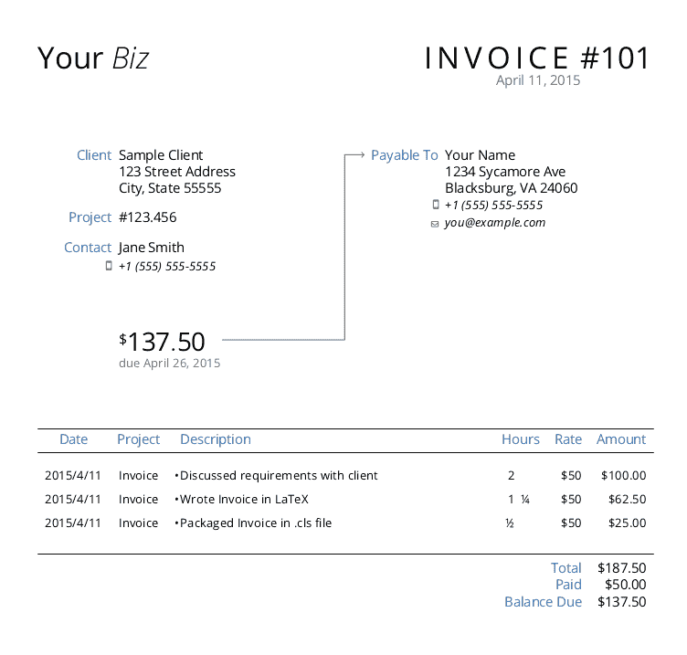

# Elm 中的发票，第 1 部分

> 原文：<https://dev.to/drbearhands/invoices-in-elm-part-1-30kf>

本教程假设你对 html 和 css 有所了解。我会经常参考[功能基础系列](https://dev.to/drbearhands/a-series-on-functional-fundamentals-48mb)中的理论，所以即使你已经写了一些 Elm 程序，你也可能会发现这种数学在实践中对你有益。

*本教程有意快。我总是讨厌复制器后面的长时间会话，所以我决定在这里相当简短。如果你发现它对你来说有点快，你可能也想看看 [Elm 的官方指南](https://guide.elm-lang.org/)。*

如果您有任何问题或批评，或者您发现有什么不清楚的地方，请随时发表评论。

## 简介

在这么多关于函数式编程理论的帖子之后，是时候展示一些实际代码了。由于职业和自由职业的建议似乎在 dev.to 上得到很多关注，我决定建立一个发票生成器。

我们将使用 Elm，你可以[将它安装在本地](https://guide.elm-lang.org/install.html)或者在线关注 [Ellie](https://ellie-app.com/new) 。在撰写本文时，Elm 的版本是 0.19。

## 您好，世界！

我假设您已经设置了 Elm 编程环境，并且可以编译/运行下面的 hello world 示例:

```
module Main exposing (main)

import Html exposing (Html)

main : Html a
main = Html.text "Hello, world!" 
```

Enter fullscreen mode Exit fullscreen mode

对于那些不熟悉 FP 或 Elm 的人，让我们一行一行地看一下。

```
module Main exposing (main) 
```

Enter fullscreen mode Exit fullscreen mode

声明这个文件是一个名为`Main`的模块，并且值`main`在这个模块之外是可见的。

```
import Html exposing (Html) 
```

Enter fullscreen mode Exit fullscreen mode

这是进口申报单。`import Html`部分意味着我们正在导入名为 Html 的模块。`exposing (Html)`使得类型`Html`在我们的代码中直接可见，不需要指定模块名。即它让我们写`Html`而不是`Html.Html`。

```
main : Html a
main = Html.text "Hello, world!" 
```

Enter fullscreen mode Exit fullscreen mode

这两条线表示*项*的*类型*和*值*，称为`main`。第一行叫做*类型声明*，第二行是*术语声明*。在不太面向数学的上下文中，比如日常编程，它们分别被称为*函数签名*和*函数体*。

函数体*必须*专门产生与函数签名匹配的类型。如果不是这样，编译将会失败。这是[库里-霍华德同构](https://dev.to/drbearhands/functional-fundamentals-types-as-propositions-programs-as-proofs-56gh)在起作用，确保我们的程序*将*给出正确的类型。

问题中的类型是`Html a`。还记得[函子](https://dev.to/drbearhands/functors-monads-and-better-functions-26f3#functors)吗？`Html`就是其中之一，它取了一个`a`型，造了一个`Html a`。在这种情况下，`a`仍然没有绑定到任何类型。这意味着我们可以将`Html a`视为`Html String`、`Html Int`等等。我们现在将忽略这一点，因为我们不打算使用`Html a`的`a`部分。

main 的值是`Html.text "Hello, world!"`。这意味着它是函数`Html.text`应用于值`"Hello, world!"`的结果。

让我们检查一下`Html.text` 的[文档，看看我们是否真的会得到正确的类型。你通常不会这样做，编译器会为你做，但我们现在这样做是出于教学目的。
`Html.text`的类型为`String -> Html msg`。即，它是一个函数，当给定类型为`String`的值时，将产生类型为`Html msg`的值。反过来，这将使`main`具有类型`Html msg`。这可能看起来像是类型不匹配，但是在 Elm 中，小写的类型名称意味着“任何类型”](https://package.elm-lang.org/packages/elm/html/latest/Html#text)[1](#sup1) 。所以`msg`和`a`的意思都一样(任何类型)。换句话说，术语`main`有正确的类型。

`main`是 Elm 中的一个特殊值:它是你的程序的主入口点。
`main`只能有一组有限的类型，其中包括`Htm a`。如果我们使用一个`Html`值，main 将简单地构建一个静态网站。

记住[函数式编程没有变量，只有值](https://dev.to/drbearhands/functional-fundamentals-what-is-functional-l66)。事实上，我们并没有给`main`赋值，而是定义了什么主*是*。

## 发票基数设计

我们将基于 Michael Kropat 的 Latex 模板 [dapper invoice](https://github.com/mkropat/dapper-invoice) 创建一个发票模板。

[](https://camo.githubusercontent.com/9ede2f444a5e0bce5e134f3051b85bbce30e66c2/687474703a2f2f692e696d6775722e636f6d2f7137386a7447752e706e67) 
我们忽略箭头是因为，虽然很酷，但它有点太复杂了。

其结构如下:

*   一行带标题，*两列*:
    *   公司名称
    *   发票号码和日期
*   一行有*两列*:
    *   发送者信息，一个*列表或行*,包含
        *   *键和值对*
    *   接收者信息，一个包含行的*列表*
        *   *键和值对*
*   具有左对齐列的行
*   有桌子的一排
*   具有右对齐列的行

## 第一个表头

回想一下[最好编写最可组合的函数](https://dev.to/drbearhands/functors-monads-and-better-functions-26f3#function-signatures)。因此，我们要做一些简单的小函数，然后再组合它们。

Latex 模板并没有真正做到这一点，这不是 Latex 的目的，并且深受其害。例如，我的国家有不同于美国的法律要求和税法，我假设这就是这个模板的基础。因为模板需要固定的参数，而不是一系列的键值对，所以我必须创建一个全新的模板。

但废话已经够多了。

让我们先做一个最简单的函数:这个函数接受一个数字，并将其转换为“INVOICE # <number>”形式的字符串。</number> 

```
invoiceNrText : Int -> String
invoiceNrText n = "INVOICE #" ++ String.fromInt n 
```

Enter fullscreen mode Exit fullscreen mode

`++`是一个*操作符*，它和一个有两个参数的函数非常相似，但是你把它写在参数之间，而不是在参数之前。事实上，您可以用括号将它括起来，使它像一个常规函数一样工作。即`a ++ b`与`(++) a b`相同。
使用关于 [String.fromInt](https://package.elm-lang.org/packages/elm/core/latest/String#fromInt) 和 [(++)操作符](https://package.elm-lang.org/packages/elm/core/latest/Basics#++)的文档，此时您应该能够理解这些行的含义。注意，函数的绑定比操作符更强，所以这一行相当于`"INVOICE #" ++ ( String.fromInt n )`

让我们将`invoiceNrText`函数添加到我们的模块中，并更改`main`的术语声明:

```
main = Html.text ( invoiceNrText 7 ) 
```

Enter fullscreen mode Exit fullscreen mode

注意，括号是*而不是*用来表示函数求值，这在命令式范例中很常见。相反，他们宣称我们将`7`应用于`invoiceNrText`，并将结果应用于`Html.text`。如果我们写了`Html.text invoiceNrText 7`，我们会将`invoiceNrText`应用于`Html.text`，然后将 7 应用于结果。

到目前为止还不错，但是我们希望使用 html 标签，而不仅仅是纯文本。让我们创建一个函数，将字符串从`invoiceNrText`转换成 h1 html 元素，我们使用 [Html.h1](https://package.elm-lang.org/packages/elm/html/latest/Html#h1) :

```
invoiceNrHeader : String -> Html a
invoiceNrHeader str =
  Html.h1 [] [ Html.text str ] 
```

Enter fullscreen mode Exit fullscreen mode

`Html.h1`的函数签名是`List (Attribute msg) -> List (Html msg) -> Html msg`，这意味着它接受一列属性`List (Attribute msg)`，并产生一个类型为`List (Html msg) -> Html msg` <sup>[2](#sup2)</sup> 的函数。因此，当我们将空列表`[]`应用到`Html.h1`时，我们留下了一个新函数，对其应用`[ Html.text str ]`，一个 html 元素列表`List (Html msg)`，我们留下了一个`Html msg` <sup>[3](#sup3)</sup> 。

Elm 中的函数被*化*。我们不是一次应用所有的参数，而是一个接一个地应用它们，并返回新的函数作为中间结果。

我们现在可以用`invoiceNrHeader`代替主函数中的`Html.text`。

现在是回归功能构图的最佳时机。我们已经在范畴理论中看到了 [`∘`运算符，用于箭头合成。在榆树那就是`<<`。我们可以用这个把主函数的体写成`main = ( invoiceNrHeader << invoiceNrText ) 7`。通过这样做，我们首先创建一个新函数，在`invoiceNrText`之后的`invoiceNrHeader`的组合，然后对其应用 7。](https://dev.to/drbearhands/functors-monads-and-better-functions-26f3#composition)

我们可以只做`invoiceNrHeader ( invoiceNrText 7 )`，所以在这种情况下函数组合没有什么意义，但是有些情况下它会派上用场，所以提前知道是有好处的。

好的，但是我们想给这个添加一些风格。我们可以用`Attribute.style`函数来实现。
为此，我们需要导入一个新模块:

```
import Html.Attributes as Att 
```

Enter fullscreen mode Exit fullscreen mode

`as Att`部分让我们写`Att`而不是`Html.Attributes`。我很懒，不喜欢写完整的模块名。当然，我们也可以只公开我们需要的所有功能。

让我们将`invoiceNrHeader`中的空列表替换为:

```
 [ Att.style "font-weight" "400"
    , Att.style "font-size" "2.5rem"
    , Att.style "letter-spacing" "7px"
    ] 
```

Enter fullscreen mode Exit fullscreen mode

(参见 [`style`](https://package.elm-lang.org/packages/elm/html/latest/Html-Attributes#style) 功能文档)。
瞧，你的属性列表。

虽然您可以使用外部 css，但我个人认为这对 Elm 没有意义，因为内联 css 可以在可重用的函数中统一结构和布局，就像 webcomponents 一样。一会儿我还会为了演示的目的滥用它。

完整的代码现在应该是这样的:

```
module Main exposing (main)

import Html exposing (Html)
import Html.Attributes as Att

main : Html a
main = invoiceNrHeader ( invoiceNrText 7 )

invoiceNrText : Int -> String
invoiceNrText n = "INVOICE #" ++ String.fromInt n

invoiceNrHeader : String -> Html a
invoiceNrHeader str =
  Html.h1
    [ Att.style "font-weight" "400"
    , Att.style "font-size" "2.5rem"
    , Att.style "letter-spacing" "7px"
    ]
    [ Html.text str ] 
```

Enter fullscreen mode Exit fullscreen mode

## 添加副标题

如果到目前为止你已经设法跟上了，那么你已经很好地掌握了基础知识。我想是时候把你扔进一个充满鳄鱼的湖里了。

我将把我们的进口改为:

```
import Html exposing (..)
import Html.Attributes exposing (..) 
```

Enter fullscreen mode Exit fullscreen mode

这暴露了*所有*模块`Html`和`Html.Attributes`的功能。这通常是一种不好的做法，因为这使得看名字的来源变得更加困难。在这种情况下，这是可以接受的，因为大多数程序员会识别暴露的名称，所以重复的模块名称只是用无意义的符号填充屏幕。

我想从布局中分离出颜色和字体类型等样式。特别是，父元素应该决定其子元素的布局/位置，但子元素应该对自己的样式负责。以正确的方式做这件事需要建立一个全新的布局规范，而 T2 已经做到了。但是我们没有用正确的方式做事，我们要用~~错误的~~教育方式。

所以，我想要一个函数，允许我在一个地方定义我的元素，并在其他地方(它的父元素)添加样式。不幸的是，一旦你有了一个`Html a`值，你就没什么可做的了。相反，我们将定义一个函数`makeStylabe`来构造一个`List (Attribute a) -> Html a`，这样我们可以在以后对它应用样式。

花点时间来解析这个类型签名，因为这是一个很好的练习，但是在继续阅读之前，不要觉得有必要完全理解它。

```
makeStylable : 
  ( List (Attribute a) -> List (Html a) -> Html a ) --tag
  -> List (Attribute a) --attributes
  -> List (Html a) --children
  -> List (Attribute a) --later attributes
  -> Html a 
```

Enter fullscreen mode Exit fullscreen mode

makeStylable 的正文:

```
makeStylable tag attributes childElements laterAttributes =
    tag (laterAttributes ++ attributes) childElements 
```

Enter fullscreen mode Exit fullscreen mode

该功能允许我们编写例如:

```
makeStylable h1 [style "color" "red"] [text "foo"] 
```

Enter fullscreen mode Exit fullscreen mode

这将导致`List (Attribute a) -> Html a`(记住部分应用/涂抹)。正是我们想要的。

让我们完成右边的标题。我将把日期表示为一个字符串，因为日期是一个复杂的问题，它的打开与本教程的目的无关。

```
dateHeader : String -> List (Attribute a) -> Html a
dateHeader str =
  makeStylable h5
    [ style "color" "DarkGrey"
    , style "font-weight" "400"
    , style "font-size" "1.25rem"
    ]
    [ text str ]

rightHeaderLayout : 
    ( List (Attribute a) -> Html a ) 
    -> ( List (Attribute a) -> Html a )
    -> List (Attribute a)
    -> Html a
rightHeaderLayout topHtml bottomHtml =
  makeStylable div
    [ style "area" "number-header"
    , style "text-align" "center"
    ]
    [ topHtml
        [ style "margin" "0"
        , style "padding" "0"
        ]
    , bottomHtml
        [ style "margin-top" "-10px"
        ]
    ] 
```

Enter fullscreen mode Exit fullscreen mode

在更改主函数以使用我们的新 html 之后，完整的代码应该是这样的:

```
module Main exposing (main)

import Html exposing (..)
import Html.Attributes exposing (..)

main : Html a
main = 
  rightHeaderLayout 
    ( invoiceNrHeader ( invoiceNrText 17 ) )
    ( dateHeader "1 April 2012" )
    []

invoiceNrText : Int -> String
invoiceNrText n = "INVOICE #" ++ String.fromInt n

makeStylable : 
  ( List (Attribute a) -> List (Html a) -> Html a ) --tag
  -> List (Attribute a) --attributes
  -> List (Html a) --children
  -> List (Attribute a) --later attributes
  -> Html a
makeStylable tag attributes childElements laterAttributes =
    tag (laterAttributes ++ attributes) childElements

invoiceNrHeader : String -> List (Attribute a) -> Html a
invoiceNrHeader str =
  makeStylable h1
    [ style "font-weight" "400"
    , style "font-size" "2.5rem"
    , style "letter-spacing" "7px"
    ]
    [ text str ]

dateHeader : String -> List (Attribute a) -> Html a
dateHeader str =
  makeStylable h5
    [ style "color" "DarkGrey"
    , style "font-weight" "400"
    , style "font-size" "1.25rem"
    ]
    [ text str ]

rightHeaderLayout : 
    ( List (Attribute a) -> Html a ) 
    -> ( List (Attribute a) -> Html a )
    -> List (Attribute a)
    -> Html a
rightHeaderLayout topHtml bottomHtml =
  makeStylable div
    [ style "area" "number-header"
    , style "text-align" "center"
    ]
    [ topHtml
        [ style "margin" "0"
        , style "padding" "0"
        ]
    , bottomHtml
        [ style "margin-top" "-10px"
        ]
    ] 
```

Enter fullscreen mode Exit fullscreen mode

因为这个教程已经很长了，我现在就在这里停下来。虽然我们只涉及了发票的很小一部分，但我们已经涉及了大部分基本原则，我们将在未来的部分中重复使用这些原则。

## 脚注

1.  也有一些例外，比如`number`，它们有特定的含义——`Int`或者`number`的情况下的`Float`——但是它们很少，通常不言自明。
2.  `->`是右联想。
3.  这并不一定意味着为每个自变量分配一个新的函数。我正在描述一个概念性的情况，编译器可以自由地以各种方式实现和优化。