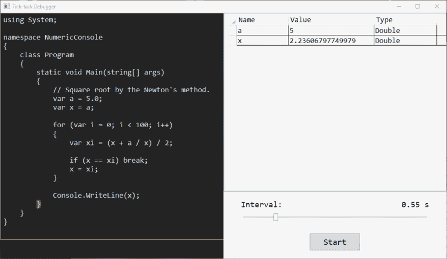

# 使用 Roslyn 的语法分析构建您自己的调试器

> 原文：<https://dev.to/saka_pon/build-your-own-debugger-using-roslyns-syntax-analysis-1p44>

//这是日本 [C#降临历 2018](https://qiita.com/advent-calendar/2018/c-sharp)的第 23 篇。
//原文是[罗斯林·の構文解析を使ってデバッガーを自作する](https://sakapon.wordpress.com/2018/12/23/syntax-tree-debugger/) 。

我试着做一个类似调试器的东西。

### 动机

*   我通常使用 Visual Studio，但是在调试时手动单步调试代码很麻烦
    *   当循环等中的步数很大时
    *   当我想检查分支或变量的状态时

### 解

*   仅指定步骤的时间间隔，让调试器自动运行
    *   将显示变量列表
    *   时间间隔可以实时调整
*   使用的语法分析。NET 编译器平台(Roslyn)，如果我们在每一步之间插入调试代码，这似乎是可以实现的

### 结果

因此，作为尝试用 WPF 制作原型“Tick-tack 调试器”的结果，它看起来像这样。例如，我们正在用牛顿法计算平方根。

### 解说

以下是概要技术说明。
在创建 WPF 应用程序之前，首先在。NET 框架。
要使用 C#语法分析，安装[微软。code analysis . cs harp](https://www.nuget.org/packages/Microsoft.CodeAnalysis.CSharp)via NuGet。

将调试代码插入到要调试的源代码中，动态编译并执行，这是一种策略。
控制台应用的源代码如下所示(整个解决方案在 [SyntaxTreeSample](https://github.com/sakapon/Samples-2018/tree/master/SyntaxTreeSample) 中)。