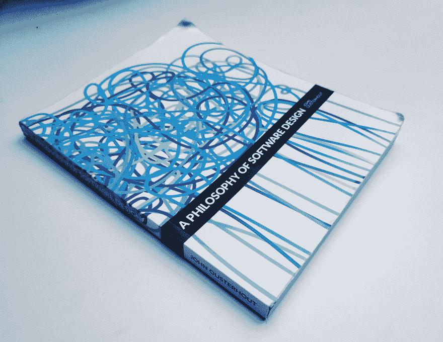

# 书评:软件设计的哲学

> 原文：<https://dev.to/remojansen/book-review-a-philosophy-of-software-design-by-john-ousterhout-408g>

我最近读完了约翰·奥斯特豪特的《软件设计哲学》，我认为与社区分享我的观点会很有用。

我拿起这本书的动机是，我看到它是亚马逊最畅销的书之一，有很多好评。

## 关于作者

这本书的作者是约翰·奥斯特胡特。他是斯坦福大学的计算机科学教授。他是加州大学伯克利分校的计算机科学教授，在那里他创建了 Tcl 脚本语言和 Tk 平台无关的小部件工具包，并提出了协同调度的思想。John Ousterhout 在计算机科学领域做出了重大贡献，并获得了 Grace Murray Hopper 奖和 ACM 软件系统奖。

## 关于内容

这本书是由约翰·奥特写的，将作为斯坦福大学计算机科学项目的主要阅读材料。尽管作者的学术背景很高，并且是斯坦福大学计算机科学项目的一部分，但这本书是以非常口语化的风格写成的，非学者和初学计算机科学的学生都可以很容易地理解。

我是一名经验丰富的开发人员，我以前听说过书中的许多想法。然而，我仍然喜欢这本书，因为我认为作者在提取一些概念的精髓并将其用文字表达出来方面做得非常好。我特别喜欢关于复杂性、接口和抽象的部分。

我也很欣赏作者敢于挑战一些常见的最佳实践，比如“功能应该小”或者“类应该只做一件事”，因为它鼓励实验和思想开放。

本书分为以下 21 章:

1.  介绍
2.  复杂性的本质
3.  工作代码是不够的
4.  模块应该是深的
5.  信息隐藏(和泄露)
6.  通用模块更深入
7.  不同的层次，不同的抽象
8.  降低复杂性
9.  在一起更好还是分开更好？10 定义不存在的错误
10.  设计两次
11.  为什么要写评论？四个借口
12.  注释应该描述代码中不明显的东西
13.  选择名字
14.  先写评论
15.  修改现有代码
16.  一致性
17.  代码应该显而易见
18.  软件趋势
19.  为性能而设计
20.  结论

## 判决结果

我非常喜欢这本书的前半部分。第一章讨论了软件复杂性的本质和主要原因。接下来的章节探讨了模块、接口、抽象、耦合和错误处理中的一些常见设计问题。这本书强调了主要问题，列出了我们应该避免的危险信号。我不喜欢有些想法有点固执己见，不太客观。然而，我并没有太大的问题，因为我实际上同意作者的大部分观点。此外，如果不坚持己见，他将无法挑战一些常见的最佳实践。

在第 11 章之后，内容对我来说不那么有吸引力了，因为我觉得我没有学到这本书前半部分学到的那么多。然而，这可能是我的情况，因为我读过类似主题的其他书籍(例如 [Clean Code](https://amzn.to/2VPWavF) )。

我会向高级和初级开发人员推荐这本书，因为我真的很喜欢这本书的前半部分，而且我认为一些经验不足的开发人员会比我更感兴趣这本书的后半部分。

我还想提一下，这本书相当便宜。许多科技书籍的标价为 40 到 60 美元，这本书的平装版售价为 17.27 美元。不幸的是，这本书没有电子版。

如果你认为你会喜欢这本书，你可以在亚马逊英国[或亚马逊美国](https://amzn.to/2RNAdhA)或[在线购买。](https://amzn.to/2AGZnVq)

我希望这篇评论对您有所帮助。我计划试着复习我读过的所有科技书籍。所以以后想多看书评请跟我来。还有，如果你对函数式编程或者打字稿感兴趣，请查阅我即将出版的书籍 [***带打字稿的动手函数式编程***](http://www.functionaltypescript.com/) 。

