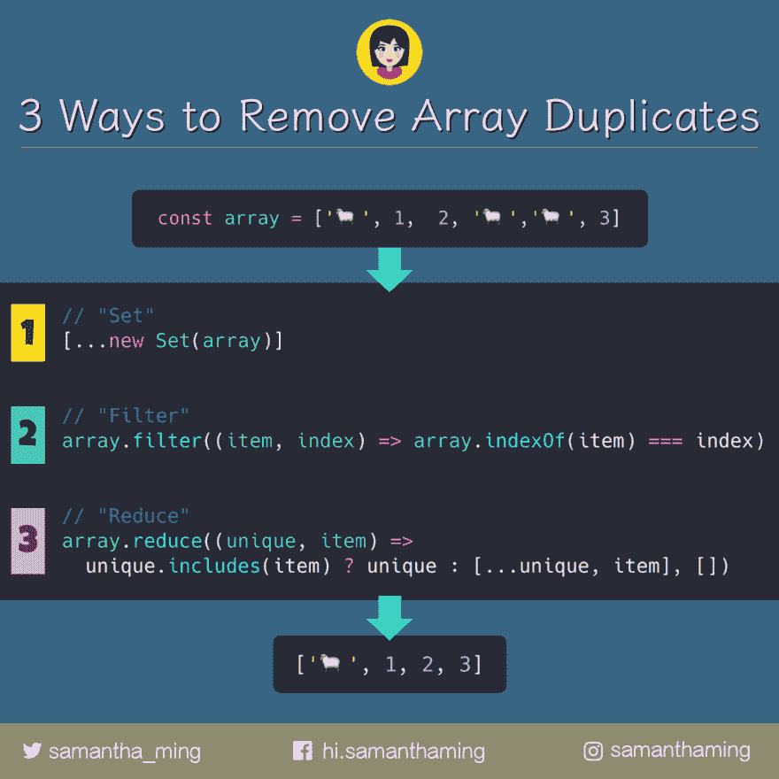

# 如何在 ES6 中删除阵列重复项

> 原文：<https://dev.to/samanthaming/how-to-remove-array-duplicates-in-es6-50f6>

# 如何删除 ES6 中的数组重复项

这里有 3 种方法可以过滤掉数组中的重复值，只返回唯一的值。我最喜欢使用 Set，因为它最短最简单😁

[](https://res.cloudinary.com/practicaldev/image/fetch/s--qxV5GtgG--/c_limit%2Cf_auto%2Cfl_progressive%2Cq_auto%2Cw_880/https://thepracticaldev.s3.amazonaws.com/i/j7jmevnw2j4olg69htrh.png)

## 1。使用`set`

首先让我解释一下`Set`是什么:

`Set`是 ES6 中引入的新数据对象。因为`Set`只让你存储唯一值。当您传入一个数组时，它将删除任何重复的值。

好的，让我们回到我们的代码，分解发生了什么。有两件事正在发生:

1.  首先，我们通过传递一个数组来创建一个新的`Set`。因为`Set`只允许唯一值，所以所有重复值都将被删除。
2.  现在重复的已经没有了，我们将通过使用扩展操作符`...`把它转换回一个数组

```
const array = ['🐑', 1,  2, '🐑','🐑', 3];

// Step 1
const uniqueSet = new Set(array);
// Set { '🐑', 1, 2, 3 }

// Step 2
const backToArray = [...uniqueSet];
// ['🐑', 1, 2, 3] 
```

### 使用`Array.from`将`Set`转换成一个数组

或者，您也可以使用`Array.from`将一个`Set`转换成一个数组:

```
const array = ['🐑', 1,  2, '🐑','🐑', 3];

Array.from(new Set(array));

// ['🐑', 1, 2, 3] 
```

## 2:使用`filter`

为了理解这个选项，我们先来看看这两个方法在做什么:`indexOf`和`filter`

### indexOf

`indexOf`方法返回它从数组中找到的所提供元素的第一个索引。

```
const array = ['🐑', 1,  2, '🐑','🐑', 3];

array.indexOf('🐑'); // 0
array.indexOf(1); // 1
array.indexOf(2); // 2
array.indexOf(3); // 5 
```

### 滤镜

`filter()`方法创建一个新的元素数组，通过我们提供的条件。换句话说，如果元素传递并返回`true`，它将被包含在过滤后的数组中。并且任何失败或返回`false`的元素，都不会在过滤后的数组中。

让我们来看看在数组中循环时会发生什么。

```
const array = ['🐑', 1,  2, '🐑','🐑', 3]

array.filter((item, index) => {

  console.log(
    // a. Item
    item,
    // b. Index
    index,
    // c. indexOf
    array.indexOf(item),
    // d. Condition
    array.indexOf(item) === index,
  );

  return array.indexOf(item) === index
}); 
```

下面是上面显示的 console.log 的输出。重复是指索引与的索引不匹配的地方。因此，在这些情况下，条件将是假的，不会包括在我们的过滤数组。

| 项目 | 索引 | indexOf | 情况 |
| --- | --- | --- | --- |
| 🐑 | Zero | Zero | **真** |
| one | one | one | **真** |
| Two | Two | Two | **真** |
| 🐑 | three | Zero | 错误的 |
| 🐑 | four | Zero | 错误的 |
| three | five | five | **真** |

### 检索重复值

我们还可以使用 filter 方法从数组中检索重复值。我们可以这样简单地调整我们的状态:

```
const array = ['🐑', 1,  2, '🐑','🐑', 3];

array.filter((item, index) => array.indexOf(item) !== index);

// ['🐑','🐑'] 
```

同样，让我们一步一步来看输出:

| 项目 | 索引 | indexOf | 情况 |
| --- | --- | --- | --- |
| 🐑 | Zero | Zero | 错误的 |
| one | one | one | 错误的 |
| Two | Two | Two | 错误的 |
| 🐑 | three | Zero | **真** |
| 🐑 | four | Zero | **真** |
| three | five | five | 错误的 |

## 3:使用`reduce`

`reduce`方法用于减少数组的元素，并根据您传递的一些 reducer 函数将它们组合成一个最终的数组。

在这种情况下，我们的 reducer 函数检查我们的最终数组是否包含该项。如果是这样，就把这个项目放入我们的最终数组。否则，跳过该元素，只返回最终的数组(实际上跳过了该元素)。

Reduce 总是有点难以理解，所以让我们也来看看每种情况的输出:

```
const array = ['🐑', 1,  2, '🐑','🐑', 3];

array.reduce((unique, item) => {
  console.log(
    // a. Item
    item,
    // b. Final Array (Accumulator)
    unique,
    // c. Condition (Remember it only get pushed if this returns `false`)
    unique.includes(item),
    // d. Reducer Function Result
    unique.includes(item) ? unique : [...unique, item],
  );

  return unique.includes(item) ? unique : [...unique, item]
}, []); // 👈 The initial value of our Accumulator is an empty array 

// RESULT:
// ['🐑', 1, 2, 3]; 
```

下面是 console.log 的输出:

| 项目 | 蓄能器(减压器功能前) | 推到累加器？ | 蓄能器(减速器功能后) |
| --- | --- | --- | --- |
| 🐑 | `[]` | **是** | `[ '🐑' ]` |
| one | `['🐑']` | **是** | `[ '🐑', 1 ]` |
| Two | `[ '🐑', 1 ]` | **是** | `[ '🐑', 1, 2 ]` |
| 🐑 | `[ '🐑', 1, 2 ]` | 不 | `[ '🐑', 1, 2 ]` |
| 🐑 | `[ '🐑', 1, 2 ]` | 不 | `[ '🐑', 1, 2 ]` |
| three | `[ '🐑', 1, 2 ]` | **是** | `[ '🐑', 1, 2, 3 ]` |

## 资源

*   [MDN 网络文档集](https://developer.mozilla.org/en-US/docs/Web/JavaScript/Reference/Global_Objects/Set)
*   [MDN 网络文档-过滤器](https://developer.mozilla.org/en-US/docs/Web/JavaScript/Reference/Global_Objects/Array/filter)
*   [MDN Web Docs - Reduce](https://developer.mozilla.org/en-US/docs/Web/JavaScript/Reference/Global_Objects/Array/reduce)
*   [GitHubGist:从 JS 数组中删除重复项](https://gist.github.com/telekosmos/3b62a31a5c43f40849bb)
*   [CodeHandbook:如何从 JavaScript 数组中删除重复项](https://codehandbook.org/how-to-remove-duplicates-from-javascript-array/)

### 感谢阅读❤

打个招呼！ [Instagram](https://www.instagram.com/samanthaming/) | [推特](https://twitter.com/samantha_ming) | [脸书](https://www.facebook.com/hisamanthaming) | [媒体](https://medium.com/@samanthaming) | [博客](https://www.samanthaming.com/blog)