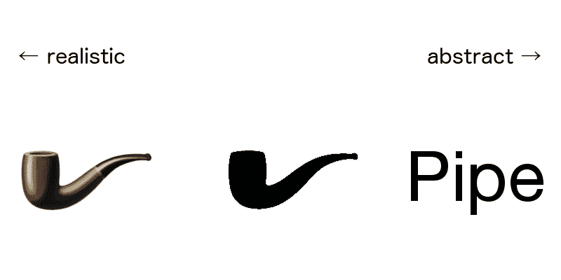
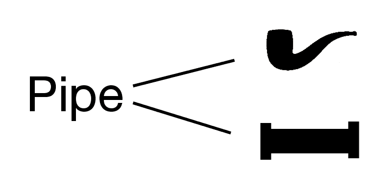

# 象征性思维

> 原文：<https://dev.to/stereobooster/symbolic-thinking-12co>

我讲了分类思维和抽象思维，我们来讲符号思维。

## 什么是符号思维？

> 思考不在直接环境中的物体和事件的能力。它包括符号、象征、概念和抽象关系的使用，如语言、算术和艺术或仪式表达。
> 
> - [APA 心理学词典](https://dictionary.apa.org/symbolic-thinking)

符号思维的关键概念是，我们用一个事物(符号)来代表一个不同的事物，往往是某种意义。这个符号可以是一张图片，一个声音，一个手势，一个单词或者一个不同的物理对象，基本上是任何东西。

这个想法非常简单，可以被认为是不重要的，但它的力量来自广泛的适用性。你可以在任何地方找到它

### 通信中的符号

符号是(有意)交流的基础。当你需要传递某种信息时，你会使用双方都能理解的符号。

例如，黑长尾猴容易受到各种食肉动物的攻击，包括豹、鹰和大型蛇，20 世纪 70 年代和 80 年代的研究发现，猴子对每种动物产生不同的报警声音。它们有不同的符号，代表不同的危险。参见“切尼 DL，塞法思 RM。猴子如何看世界:另一个物种的内心世界。芝加哥:芝加哥大学出版社；1990".

### 计算中的符号

> 这台机器配有一条“胶带”(类似于纸)，它被分成几个部分(称为“方块”)，每个部分都可以承载一个“符号”。任何时候都只有一个方块，比如说第 r 个，带有符号<2> (r)，意思是“在机器里”。
> 
> - [关于可计算的数字，以及应用于
> ENTSCHEIDUNGSPROBLEM，作者 A. M. TURING1936.](https://www.cs.virginia.edu/~robins/Turing_Paper_1936.pdf)

计算可以被看作是对符号的操作。

### 儿童发展中的符号思维

根据[皮亚杰理论](http://psych.colorado.edu/~colunga/p4684/piaget.pdf)，儿童的发展有四个阶段:

*   感觉运动阶段(出生到 2 岁)
*   手术前阶段(2 至 7 年)
*   具体操作阶段(7 至 12 年)
*   正式运行阶段(12 岁及以上)

象征性思维是手术前阶段的关键部分。孩子们玩模仿成人的娃娃，但同时那些娃娃也是象征(它们代表某人或某物)。

### 象征主义 vs 抽象

符号可以代表真实的对象，但大多数情况下它们代表抽象概念。“数字”这个词是一个抽象的数字符号。

符号和抽象经常一起使用，有时会混淆。一些研究区分了“符号”和“标志”，但他们对符号的定义更接近于抽象或概念的定义。

更有甚者，一些视觉符号，如图标或象形图，是通过使用抽象来进行视觉表现而形成的。

### 符号和神经网络

**免责声明**:这部分是我外行的理论，我没有足够的这方面的知识。

当前机器学习实现的问题是，即使它给你提供了答案，也没有办法理解这个答案是如何形成的，你需要采取额外的行动来证明它是正确的。比如[可解释的人工智能(DARPA 项目)](https://www.darpa.mil/program/explainable-artificial-intelligence)就在研究这个问题。解决这个问题的一个方法是通过引入符号系统，一旦 ML 能够在神经元的一些区域和一些符号之间建立对应关系，也许就有可能理解机器的推理。

[思想矢量](http://gabgoh.github.io/ThoughtVectors/)可以解释为符号。

对 AlphaGo 的批评之一是，学习玩游戏需要太长时间。一方面，孩子可以更快地学习规则，另一方面，AlphaGo Zero 从完全随机的行为和自我训练开始。
它训练了大约 40 天(2900 万场自玩)。从这个意义上说，深度学习更接近于[阿米巴原虫，它可以近似解决 np 难问题](https://phys.org/news/2018-12-amoeba-approximate-solutions-np-hard-problem.html)——它没有用符号“结晶”的理解，而是只针对输入进行优化。

我相信符号和抽象在人类智力中起着重要的作用，它们增强理解(增强神经网络的区域？).再一次，正如我之前说的，这是门外汉的理论——我需要读更多的书来证明它，甚至理解它是否有意义。

## 一期符号思维

### 一个物体可以用许多符号来表示

这造成了混乱。为什么有两个(或更多)符号？他们指的是不同但非常相似的概念吗？而有时候，人们发现这种差异，即使它并不存在。

### 一个符号可以代表许多物体

在歧义的情况下，人类使用上下文来理解符号的确切含义。上下文通常是隐含的，可以省略，这就给交流带来了问题。

