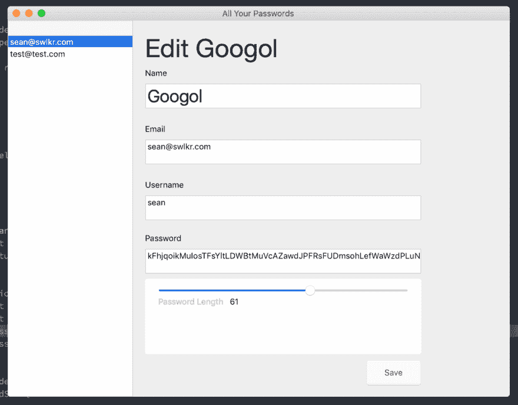
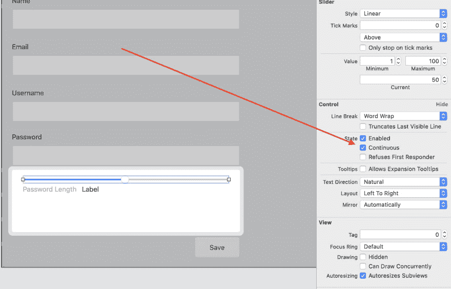

# 第 13 天:Swift macOS 密码管理器，适用于讨厌云的人

> 原文：<https://dev.to/swlkr/day-13-swift-macos-password-manager-for-people-who-hate-the-cloud-pdf>

[<——第 12 天去这里](https://dev.to/swlkr/day-12-swift-macos-password-manager-for-people-who-hate-the-cloud-1pmn)

📅2019 年 1 月 13 日
🚀离发射还有 17 天
🔥十二日连胜
💰4.99 美元的价格(这个价格一直在变)
🤑0 美元收入
📈0 客户
⌚️花费了 8.5 小时
💻19 个文件被更改，1068 个插入(+)，170 个删除(-)
🏁今天的目标:**生成强密码**

**上午 10:57**
终于停止在 twitter/youtube/hacker news 上消费东西，开始着手做这件事。

**上午 11:39**
我花了比预期更长的时间，但我想出了如何让 NSSlider 与随机字符串函数和密码字段一起工作。这是一个很酷的效果，不需要太多的工作:大约 50 分钟。看看

[](https://res.cloudinary.com/practicaldev/image/fetch/s---I8m-DqA--/c_limit%2Cf_auto%2Cfl_progressive%2Cq_66%2Cw_880/https://thepracticaldev.s3.amazonaws.com/i/svar0sni8kwncasijneb.gif)

下面是我为了让它工作而复制和粘贴的代码:

```
 @IBOutlet weak var passwordLengthSlider: NSSlider!
    @IBOutlet weak var passwordLengthLabel: NSTextField!

    func randomString(_ length: Int) -> String {
        let values = "abcdefghijklmnopqrstuvwxyzABCDEFGHIJKLMNOPQRSTUVWXYZ"
        return String((0...length-1).map{ _ in values.randomElement()! })
    }

    @IBAction func passwordLengthChanged(_ sender: NSSlider) {
        let passwordLength = passwordLengthSlider.integerValue
        let password = randomString(passwordLength)
        passwordLengthLabel.stringValue = "\(passwordLength)"
        passwordTextField.stringValue = password
    } 
```

一个应用程序开发人员的工作有点像一个 DJ，或者如果你想变得优雅，一个*作曲家*。你确实需要自己做一些事情，在这里或那里想出一些创意，但是大部分都是重新组合和大量的尝试和错误。同样花费我最长时间的是在 xib(或者故事板或者苹果今年称之为什么)中，你必须检查“连续模式”

[](https://res.cloudinary.com/practicaldev/image/fetch/s--16lsVizs--/c_limit%2Cf_auto%2Cfl_progressive%2Cq_auto%2Cw_880/https://thepracticaldev.s3.amazonaws.com/i/8nuwh2qtm3a9yloyjatp.png)

我四处寻找了一段我不愿意承认的时间，然后最终决定开始尝试随机的东西，这就是我想要的。我应该继续走，但是我今天有其他事情要做。我可能会晚一点回来，但我肯定会在明天早上回来，山地时间早上 6 点…希望如此。