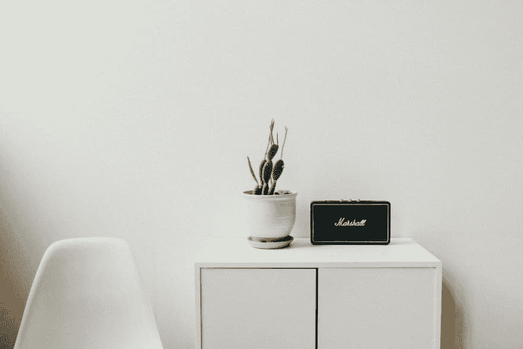

# 让我们在 React 中制作一个小的音频播放器

> 原文：<https://dev.to/ma5ly/lets-make-a-little-audio-player-in-react-p4p>

[](https://res.cloudinary.com/practicaldev/image/fetch/s--3-n2W3LT--/c_limit%2Cf_auto%2Cfl_progressive%2Cq_auto%2Cw_880/https://thepracticaldev.s3.amazonaws.com/i/hzxe4sxj5le0nc7opu9c.jpg)

没有音乐播放器的个人网站有什么用？我这样问自己，其实真的不需要。没有比精心挑选的 MP3 更好的方式来展示你和你的主页。这就是为什么我们要建立自己的小音乐播放器。

我们不打算使用任何嵌入。相反，我们将使用 HTML5 和 React (Javascript)。当然，我们可以走普通的 JS 路线，但是在盖茨比网站和创建 React 应用程序的时代，在 React 上下文中做事情是有趣和有用的。

好了，我们走吧。我们将建立一个小的音频播放器，启动，暂停，停止，并有一个时间指示器。这里有一个[工作示例](https://bentrokmusic.com)关于我们将做什么功能。在我们继续之前，你需要一个 React 应用程序和一些 MP3。

要获得 React app，要么使用[盖茨比](https://gatsbyjs.org)、[创建 React App](https://reactjs.org/docs/create-a-new-react-app.html) 、[本地文件](https://reactjs.org/docs/getting-started.html#try-react)或 [CodeSandBox](https://codesandbox.io/) 。如果你需要 MP3，你可以免费下载这首歌。自己做的:)

[https://w.soundcloud.com/player/?url=https://soundcloud.com/bentrok/nascar-heat-one&auto_play=false&color=%23000000&hide_related=false&show_comments=true&show_user=true&show_reposts=false&show_teaser=true](https://w.soundcloud.com/player/?url=https://soundcloud.com/bentrok/nascar-heat-one&auto_play=false&color=%23000000&hide_related=false&show_comments=true&show_user=true&show_reposts=false&show_teaser=true)

现在是代码...

为了在网页上播放音频，我们需要“音频”元素。这是一个简单的 HTML 标签，你可以把它放在 JSX 的任何地方。它不是视觉渲染的，所以不会弄乱你的布局。因为它是一个真实的元素，所以您*将*需要确保它被封装在另一个元素中。

```
<>
<h1>My Little Player</h1> <audio />
</> 
```

Enter fullscreen mode Exit fullscreen mode

接下来我们需要 MP3。根据您的设置，您可能会使用硬编码链接或导入。如果是导入，则引用该文件并将其用作变量。就像你使用图像一样。如果你已经有一个指向 MP3 的 URL，那也没问题。

最初我们没有任何音频播放。但是一旦我们让访问者点击一首歌的标题，我们就想播放这首歌。因此，我们需要一种方法来记录点击，识别哪首歌曲被选中，然后让它播放。

如果你熟悉 React，前两件事会很简单。向封装轨道的元素添加一个“onClick”处理程序，并将轨道标题作为参数添加到函数中。一种常见的模式是在“map 方法”中完成所有这些工作，并在列表中呈现结果。我是这样做的。

```
class App extends React.Component {
  state = {
    selectedTrack: null
  };

  render() {
    const list = [{ id: 1, title: "Campfire Story" }, {id: 2, title: "Booting Up"}].map(item => {
      return (
        <li
          key={item.id}
          onClick={() => this.setState({ selectedTrack: item.title })}
        >
        {item.title}
        </li>
      );
    });

    return (
      <>
        <h1>My Little Player</h1>
        <ul>{list}</ul>
        <audio />
      </>
    );
  }
} 
```

Enter fullscreen mode Exit fullscreen mode

现在我们有了一个可以点击的曲目列表。在我们提供给“onClick”处理程序的函数中，我们从数组中获取曲目标题，并将其设置为应用程序的状态。我们在状态中设置的原因是因为我们希望这段数据能够起作用。通过这种方式，我们可以在我们的应用程序中显示当前正在播放的曲目。

如果您现在点按，歌曲将不会播放。我们首先需要告诉音频元素播放我们刚刚在状态中设置的轨道。但为此我们需要一个参考。React 对此有不同的选项，但是在我们的例子中，我们使用回调 ref。

```
<audio ref={ref => this.player = ref} /> 
```

Enter fullscreen mode Exit fullscreen mode

现在可以通过我们的 ref 访问音频元素。但是我们将如何以及何时访问它呢？React 有一个组件生命周期，每次在状态或属性改变后运行。这意味着如果选择了一个音轨，这个函数就会运行。它被称为“componentDidUpdate”。

不过，我们需要一些逻辑来让它正常工作。首先我们检查我们感兴趣的状态是否已经改变。因为“componentDidUpdate”在组件中属性和状态的每次改变时运行，所以我们需要小心这一点。我们不想在不必要的时候运行我们的代码。其次，我们将标题链接到导入的文件或 URL。然后我们通过我们的 ref 访问我们的播放器，我们设置轨道，最后调用 play 方法。

```
 componentDidUpdate(prevProps, prevState) {
    if(this.state.selectedTrack !== prevState.selectedTrack) {
      let track;
      switch(this.state.selectedTrack) {
        case "Campfire Story":
          track = campfireStory
        break;
        case "Booting Up":
          track = bootingUp
        break;
        default:
        break;
      }
      if(track) {
        this.player.src = track;
        this.player.play()
      }
    }
  } 
```

Enter fullscreen mode Exit fullscreen mode

我们的曲目现在应该点击播放！但是我们还没有完成。我们需要暂停和停止轨道的方法，最后是持续时间和时间指示器。

在我们构建之前，让我们花点时间思考一下。在我们的州，我们目前记录正在播放的曲目。太好了！但是，如果我们试图在应用程序中添加播放、暂停和停止按钮呢？没有歌曲播放时，有暂停或停止按钮是没有意义的。同样，如果没有歌曲暂停，播放按钮也没有意义。

即使我们不关心这些事情，我们仍然希望我们的应用程序知道我们的音乐播放器在做什么。因此，我提议增加另一个州。

```
 state = {
    selectedTrack: null,
    player: "stopped"
  }; 
```

Enter fullscreen mode Exit fullscreen mode

接下来，我们回到开始播放曲目的时刻。它在' componentDidUpdate '里，记得吗？当我们告诉音频元素播放时，我们现在也将我们的“播放器”状态设置为“播放”。

```
 if(track) {
        this.player.src = track;
        this.player.play()
        this.setState({player: "playing"})
      } 
```

Enter fullscreen mode Exit fullscreen mode

我们的应用程序现在知道正在播放一首歌曲。因此，我们可以使用这些知识有条件地呈现播放、暂停和停止按钮。也许你会想，音频元素本身已经知道它在正确地播放一些东西，为什么还要做这些呢？这是正确的。但是有点像我们习惯性地喜欢让 React“控制”我们的输入字段，这也是一个好主意。它使生活变得更加容易，我们可以使用广泛使用的反应模式。

```
 <>
        <h1>My Little Player</h1>
        <ul>{list}</ul>
        <div>
          {this.state.player === "paused" && (
            <button onClick={() => this.setState({ player: "playing" })}>
              Play
            </button>
          )}
          {this.state.player === "playing" && (
            <button onClick={() => this.setState({ player: "paused" })}>
              Pause
            </button>
          )}
          {this.state.player === "playing" || this.state.player === "paused" ? (
            <button onClick={() => this.setState({ player: "stopped" })}>
              Stop
            </button>
          ) : (
              ""
            )}
        </div>
        <audio ref={ref => (this.player = ref)} />
      </> 
```

Enter fullscreen mode Exit fullscreen mode

为了让我们的歌暂停或停止。如你所见，我们使用一个“onClick”处理程序来修改“player”状态。这不会停止音频本身，但更像是一个信号，我们需要处理这种变化。我们在哪里做？“componentDidUpdate”生命周期！

```
 if (this.state.player !== prevState.player) {
      if (this.state.player === "paused") {
        this.player.pause();
      } else if (this.state.player === "stopped") {
        this.player.pause();
        this.player.currentTime = 0;
        this.setState({ selectedTrack: null });
      } else if (
        this.state.player === "playing" &&
        prevState.player === "paused"
      ) {
        this.player.play();
      }
    } 
```

Enter fullscreen mode Exit fullscreen mode

您可能会注意到，没有官方的“停止”方法。相反，我们暂停歌曲，并将 playertime 设置回 0。一样的区别。

我们差不多完成了。我们唯一需要做的就是添加一个持续时间和一个时间指示器。持续时间和当前时间都是可以从音频元素中提取的数据片段。为了得到它们，我们需要使用不同的方法。

不幸的是(或者也许是幸运的是)我们不能在我们的 render 方法中引用 audio 元素，访问“currentTime”属性并期望它保持每秒更新。因此，我们需要一种方法来保持自己的反应管理，所以它可以显示实际时间的基础上。我们可以用“事件监听器”来解决这个问题。您可能从普通的 Javascript 代码中知道这些。

由于我们在 React 中工作，我们需要考虑我们的生命周期。我们想听的元素不会总是出现在页面上。他们有始有终的人生(循环！).因此，当元素出现时，我们添加侦听器，当元素即将被删除时，我们删除侦听器。

幸运的是，Javascript 有一个特定的监听器用于播放时的更新。它被称为“时间更新”。我们使用它，然后把我们需要的东西保存到组件的状态中。也许你已经对窗口的高度或宽度做了类似的事情。这是一种常见的模式。

```
 componentDidMount() {
    this.player.addEventListener("timeupdate", e => {
      this.setState({
        currentTime: e.target.currentTime,
        duration: e.target.duration
      });
    });
  }

  componentWillUnmount() {
    this.player.removeEventListener("timeupdate", () => {});
  } 
```

Enter fullscreen mode Exit fullscreen mode

现在，每当歌曲播放时，状态都会更新。这意味着 React 现在知道当前时间和持续时间。我们可以用它来显示我们的应用程序。但在此之前，我们需要对数据进行格式化。这里有一个你可以使用的小助手功能。

```
function getTime(time) {
  if(!isNaN(time)) {
    return Math.floor(time / 60) + ':' + ('0' + Math.floor(time % 60)).slice(-2)
  }
} 
```

Enter fullscreen mode Exit fullscreen mode

这就让我们把它呈现在屏幕上。

```
 const currentTime = getTime(this.state.currentTime)
  const duration = getTime(this.state.duration) 
```

Enter fullscreen mode Exit fullscreen mode

```
 {this.state.player === "playing" || this.state.player === "paused" ? (
          <div>
            {currentTime} / {duration}
          </div>
        ) : (
          ""
        )} 
```

Enter fullscreen mode Exit fullscreen mode

有了状态中的最后一条信息，我们就可以为我们的玩家渲染我们需要的一切。按钮、时间长度、曲目标题和时间指示器。用你的创造力做一些美好的东西！

完整的代码如下:[https://codesandbox.io/s/5y4vjn877x](https://codesandbox.io/s/5y4vjn877x)