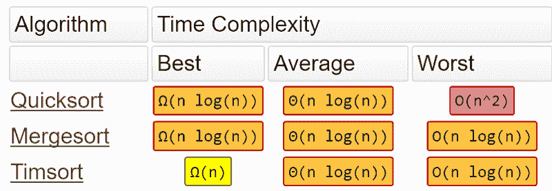
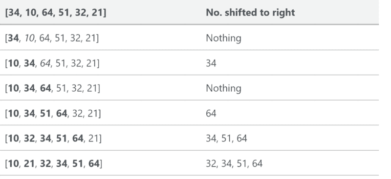
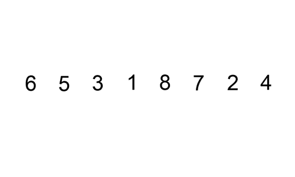
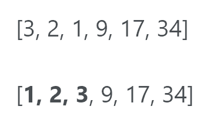
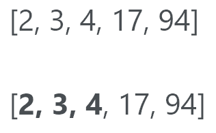
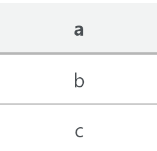
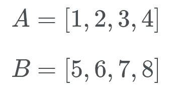

# timsort——你从未听说过的最快的排序算法

> 原文：<https://dev.to/brandonskerritt/timsort-the-fastest-sorting-algorithm-you-ve-never-heard-of-2ake>

<figure>[](https://res.cloudinary.com/practicaldev/image/fetch/s--Sb8ovmBk--/c_limit%2Cf_auto%2Cfl_progressive%2Cq_auto%2Cw_880/https://cdn-images-1.medium.com/max/600/0%2AkZKyCrzT9YvXBtT9.jpg) 

<figcaption>从[到](https://www.youtube.com/watch?v=1wAOy88WxmY)</figcaption>

</figure>

蒂姆·皮特的形象

Timsort 是一种排序算法，对于真实世界的数据非常有效，而不是在学术实验室中创建的。Tim Peters 在 2001 年为 Python 编程语言创建了 Timsort。Timsort 首先分析它试图排序的列表，然后根据对列表的分析选择一种方法。

自从该算法被发明以来，它已经被用作 Python、 [Java](https://bugs.java.com/bugdatabase/view_bug.do?bug_id=6804124) 、 [Android](http://www.kiwidoc.com/java/l/x/android/android/5/p/java.util/c/TimSort) 平台和 GNU Octave 中的默认排序算法。

Timsort 的大 O 记法是 O(n log n)。要了解大 O 符号，请阅读[这个](https://skerritt.blog/you-need-to-understand-big-o-notation-now/)。

<figure>[](https://res.cloudinary.com/practicaldev/image/fetch/s--moUT9Idy--/c_limit%2Cf_auto%2Cfl_progressive%2Cq_auto%2Cw_880/https://cdn-images-1.medium.com/max/800/1%2A1CkG3c4mZGswDShAV9eHbQ.png) 

<figcaption>从[到这里](http://bigocheatsheet.com/)</figcaption>

</figure>

Timsort 的排序时间和 Mergesort 一样，比你可能知道的大多数其他排序都要快。Timsort 实际上利用了插入排序和合并排序，您很快就会看到这一点。

Peters 设计 Timsort 是为了使用大多数真实数据集中已经存在的有序元素。它称这些已经有序的元素为“自然运行”。它遍历数据，将元素收集到运行中，同时将这些运行合并成一个运行。

### **数组中的元素少于 64 个**

如果我们试图排序的数组中的元素少于 64 个，Timsort 将执行插入排序。

插入排序是一种简单的排序，对小列表最有效。对于较大的列表来说很慢，但是对于较小的列表来说非常快。插入排序的思想如下:

*   一个一个看元素
*   通过在正确的位置插入元素来构建排序列表

<figure>[](https://res.cloudinary.com/practicaldev/image/fetch/s--7nt3qaAq--/c_limit%2Cf_auto%2Cfl_progressive%2Cq_auto%2Cw_880/https://cdn-images-1.medium.com/max/800/1%2A3bMtqGONwfRvPMvVf8zfJQ.png) 

<figcaption>图片由我拍摄，来自我的网站 [skerritt.tech](https://skerritt.tech)</figcaption>

</figure>

在这个例子中，我们将新排序的元素插入到一个新的子数组中，这个子数组从数组的开头开始。

这里有一个显示插入排序的 gif:

<figure>[](https://res.cloudinary.com/practicaldev/image/fetch/s--pqhdybaY--/c_limit%2Cf_auto%2Cfl_progressive%2Cq_66%2Cw_880/https://cdn-images-1.medium.com/max/800/0%2AI8VlK7-Zh-2btQP4.gif) 

<figcaption>取自[此处](https://upload.wikimedia.org/wikipedia/commons/9/9c/Insertion-sort-example.gif)</figcaption>

</figure>

### **更多关于跑步**

如果列表大于 64 个元素，则算法将首先遍历列表，寻找严格增加或减少的部分。如果该部分正在减少，它将反转该部分。

因此，如果游程在减少，它将看起来像这样(其中游程以粗体显示):

<figure>[](https://res.cloudinary.com/practicaldev/image/fetch/s--kU5w0QFZ--/c_limit%2Cf_auto%2Cfl_progressive%2Cq_auto%2Cw_880/https://cdn-images-1.medium.com/max/800/1%2ALWJSZ8DHZ2DNF8aeVyGpig.png) 

<figcaption>图片来自我的网站， [skerritt.tech](https://skerritt.tech/)</figcaption>

</figure>

如果不减少，它会像这样:

<figure>[](https://res.cloudinary.com/practicaldev/image/fetch/s--PMQExCA9--/c_limit%2Cf_auto%2Cfl_progressive%2Cq_auto%2Cw_880/https://cdn-images-1.medium.com/max/800/1%2Ar96puBtKKiF6-Rj3DKjOUA.png) 

<figcaption>图片来自我的网站， [skerritt.tech](https://skerritt.tech/)</figcaption>

</figure>

最小游程的大小是根据数组的大小确定的。该算法选择它，使得随机数组中的大多数游程在长度上等于或变成最小游程。当运行次数等于或略小于 2 的幂时，合并 2 个数组更有效。Timsort 选择 minrun 来确保这种效率，方法是确保 minrun 等于或小于 2 的幂。

该算法从 32 到 64(包括 32 和 64)的范围内选择 minrun。它选择 minrun，使得原始数组的长度除以 minrun，等于或略小于 2 的幂。

如果游程的长度小于 minrun，则计算该游程远离 minrun 的长度。使用这个新的数字，您可以在运行之前获取这么多的项目，并执行插入排序来创建一个新的运行。

因此，如果最小游程是 63，游程长度是 33，则 63–33 = 30。然后，从运行结束前获取 30 个元素，因此这是运行[33]中的 30 个项目，然后执行插入排序以创建新的运行。

在这部分完成后，我们现在应该在一个列表中有一堆排序的运行。

* * *

### **合并**

[](https://res.cloudinary.com/practicaldev/image/fetch/s--jNvwwgO4--/c_limit%2Cf_auto%2Cfl_progressive%2Cq_66%2Cw_880/https://media1.tenor.cimg/4a8bba4f59cda65616d27078e7599b87/tenor.gif%3Fitemid%3D4929472)

Timsort 现在执行 mergesort 将运行合并在一起。然而，Timsort 确保在合并排序时保持稳定性和合并平衡。

为了保持稳定，我们不应该交换两个等值的数字。这不仅保持了它们在列表中的原始位置，而且使得算法更快。我们将很快讨论合并平衡。

当 Timsort 找到游程时，它将它们添加到堆栈中。一个简单的堆栈如下所示:

<figure>[](https://res.cloudinary.com/practicaldev/image/fetch/s--srQlFjSx--/c_limit%2Cf_auto%2Cfl_progressive%2Cq_auto%2Cw_880/https://cdn-images-1.medium.com/max/800/1%2AsJ4GSPsTvUdIYQIR2pbKig.png) 

<figcaption>图片来自我的网站， [skerritt.tech](https://skerritt.tech/)</figcaption>

</figure>

想象一堆盘子。你不能从底部拿盘子，所以你必须从顶部拿。堆栈也是如此。

当 mergesort 运行时，Timsort 试图平衡两个相互竞争的需求。一方面，我们希望尽可能延迟合并，以便利用以后可能出现的模式。但是我们更希望尽快进行合并，以利用运行刚刚发现的仍然在内存层次结构中处于高位的运行。我们也不能将合并延迟“太久”，因为它会消耗内存来记住仍未合并的游程，并且堆栈有固定的大小。

为了确保这种折衷，Timsort 跟踪堆栈中最近的三个项目，并创建了两个必须适用于这些项目的定律:

1.  A > B + C

2.  B > C

其中 A、B 和 C 是堆栈上最近的三个项目。

用蒂姆·彼得斯自己的话说:

> *一个好的折衷方案是在堆栈条目上保持两个不变量，其中 A、B 和 C 是最前面三个尚未合并的片的长度*

通常，合并不同长度的相邻线路是很困难的。更困难的是，我们必须保持稳定。为了解决这个问题，Timsort 留出了临时内存。它将两次运行中较小的一次(同时调用运行 A 和 B)放入临时内存。

### **飞奔**

[](https://res.cloudinary.com/practicaldev/image/fetch/s--B04HcF1c--/c_limit%2Cf_auto%2Cfl_progressive%2Cq_66%2Cw_880/http://66.media.tumblr.com/3c0aa162521da6790fb45acc6b6bb5f8/tumblr_mf91h56D7l1s00tolo1_500.gif)

当 Timsort 正在合并 A 和 B 时，它注意到一个 run 已经连续“赢”了很多次。如果结果是运行 A 包含的数字完全小于运行 B，那么运行 A 将会回到原来的位置。合并这两个项目需要做大量的工作，但却一无所获。

通常情况下，数据会有一些预先存在的内部结构。Timsort 假设，如果很多 run A 的值低于 run B 的值，那么很可能 A 将继续具有比 B 小的值。

[](https://res.cloudinary.com/practicaldev/image/fetch/s--LpZDAXSl--/c_limit%2Cf_auto%2Cfl_progressive%2Cq_auto%2Cw_880/https://skerritt.blog/conteimg/2019/01/image-505.png)

两个示例运行的图像，A 和 b。运行必须严格增加或减少，因此选择这些数字。

Timsort 随后将进入飞奔模式。Timsort 对 a[0]中 b[0]的适当位置执行二分搜索法，而不是对 A[0]和 B[0]进行核对。这样，Timsort 可以将 A 的整个部分移动到位。然后，Timsort 在 B 中搜索 A[0]的适当位置。然后，Timsort 将一次移动 B 罐的整个部分，并放置到位。

让我们来看看实际情况。Timsort 检查 B [0](https://dev.towhich%20is%205) 并使用二分搜索法在 a 中寻找正确的位置

嗯，B[0]属于 A 列表的末尾。现在 Timsort 在 B 的正确位置检查 A [0](https://dev.towhich%20is%201) 。所以我们要看看数字 1 去了哪里。这个数在 B 的开头，我们现在知道 B 属于 A 的结尾，A 属于 B 的开头。

事实证明，如果 B[0]的合适位置非常靠近 A 的开头(反之亦然)，那么这个操作是不值得的。因此，如果没有回报，疾驰模式很快就会退出。此外，Timsort 注意到了这一点，并通过增加连续 A-only 或 B-only 获胜的次数来增加以后进入疾驰模式的难度。如果 gallop 模式有回报，Timsort 会让重新进入变得更容易。

简而言之，Timsort 做了两件非常好的事情:

*   在具有预先存在的内部结构的阵列上实现出色的性能
*   能够保持稳定的排序

以前，为了实现稳定的排序，您必须用整数压缩列表中的项目，并将其作为元组数组进行排序。

* * *

### **代码**

如果您对代码不感兴趣，可以跳过这一部分。这一部分下面还有更多信息。

下面的源代码是基于我和 Nanda Javarma 的工作。源代码并不完整，也不像 Python 官方的 sorted()源代码。这只是一个简化的 Timsort，我实现它是为了对 Timsort 有一个总体的感觉。如果你想看到 Timsort 的原始源代码，请点击这里查看。Timsort 是用 C 实现的，而不是 Python。

```
# based off of this code https://gist.github.com/nandajavarma/a3a6b62f34e74ec4c31674934327bbd3
# Brandon Skerritt
# https://skerritt.tech 
def binary_search(the_array, item, start, end):
    if start == end:
        if the_array[start] > item:
            return start
        else:
            return start + 1
    if start > end:
        return start

    mid = round((start + end)/ 2)

    if the_array[mid] < item:
        return binary_search(the_array, item, mid + 1, end)

    elif the_array[mid] > item:
        return binary_search(the_array, item, start, mid - 1)

    else:
        return mid

"""
Insertion sort that timsort uses if the array size is small or if
the size of the "run" is small
"""
def insertion_sort(the_array):
    l = len(the_array)
    for index in range(1, l):
        value = the_array[index]
        pos = binary_search(the_array, value, 0, index - 1)
        the_array = the_array[:pos] + [value] + the_array[pos:index] + the_array[index+1:]
    return the_array

def merge(left, right):
    """Takes two sorted lists and returns a single sorted list by comparing the
    elements one at a time.
    [1, 2, 3, 4, 5, 6]
    """
    if not left:
        return right
    if not right:
        return left
    if left[0] < right[0]:
        return [left[0]] + merge(left[1:], right)
    return [right[0]] + merge(left, right[1:])

def timsort(the_array):
    runs, sorted_runs = [], []
    length = len(the_array)
    new_run = [the_array[0]]

    # for every i in the range of 1 to length of array
    for i in range(1, length):
        # if i is at the end of the list
        if i == length - 1:
            new_run.append(the_array[i])
            runs.append(new_run)
            break
        # if the i'th element of the array is less than the one before it
        if the_array[i] < the_array[i-1]:
            # if new_run is set to None (NULL)
            if not new_run:
                runs.append([the_array[i]])
                new_run.append(the_array[i])
            else:
                runs.append(new_run)
                new_run = []
        # else if its equal to or more than
        else:
            new_run.append(the_array[i])

    # for every item in runs, append it using insertion sort
    for item in runs:
        sorted_runs.append(insertion_sort(item))

    # for every run in sorted_runs, merge them
    sorted_array = []
    for run in sorted_runs:
        sorted_array = merge(sorted_array, run)

    print(sorted_array)

timsort([2, 3, 1, 5, 6, 7]) 
```

Timsort 实际上内置在 Python 中，所以这段代码只是作为一个解释器。要使用 Timsort，只需编写:

```
list.sort() 
```

或者

```
sorted(list) 
```

如果你想掌握 Timsort 的工作原理并有所体会，我强烈建议你尝试自己实现它！

本文基于 Tim Peters 对 Timsort 的原始介绍，在这里找到。

* * *

👋你喜欢这篇文章吗？订阅我的电子邮件列表，每当我发布新的东西时(大约每 3 - 6 周一次)就会收到一封电子邮件。✨😁[https://pages.convertkit.com/2ffbe6834c/8444e0640e](https://pages.convertkit.com/2ffbe6834c/8444e0640e)