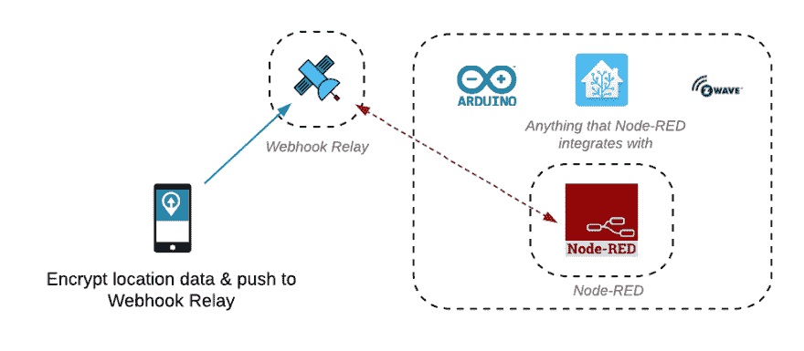
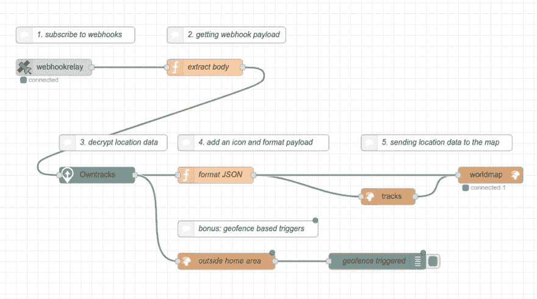
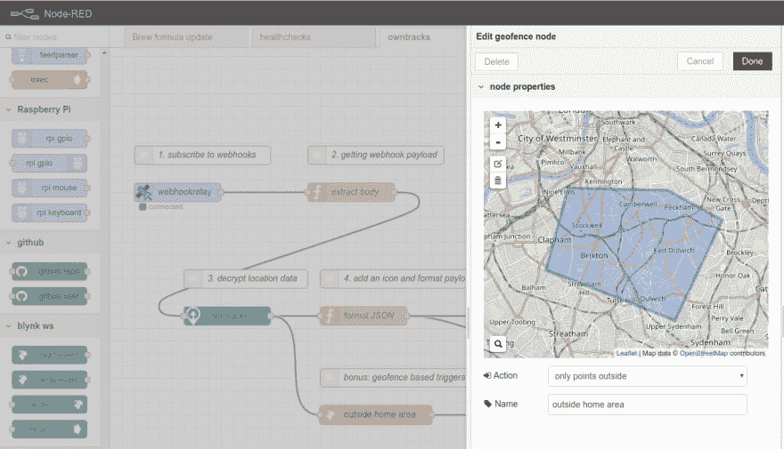

# 使用 Node-RED 和 OwnTracks 进行快速简单的位置跟踪

> 原文：<https://dev.to/webhookrelay/fast--simple-location-tracking-with-node-red-and-owntracks-195o>

如果你想追踪你的位置，但不想让太多不应该知道它的公司分享，看看这个神奇的开源移动应用程序[own tracks](https://owntracks.org/)(【https://github.com/owntracks】T2)可以将手机的位置数据发送到你选择的服务器。不需要任何外部服务来聚合您的数据，允许您对收集到的位置数据做任何您想做的事情。OwnTracks 可以向 MQTT 服务器或标准 HTTP 端点发送有效负载。

在这个简短的教程中，我们将使用 [Node-RED](https://nodered.org) 来接收、处理和可视化我们的位置数据。位置数据将在传输过程中使用 TLS 和 lib 钠([密钥认证加密](https://download.libsodium.org/doc/secret-key_cryptography))进行加密，直到到达地图:

[](https://res.cloudinary.com/practicaldev/image/fetch/s--8NCnulrF--/c_limit%2Cf_auto%2Cfl_progressive%2Cq_auto%2Cw_880/https://thepracticaldev.s3.amazonaws.com/i/yh7afe4mfq69hqggxs0t.png)

不需要路由器、防火墙配置或公共 IP，因为 Webhook Relay 将提供一个公共端点来接收 Webhook，然后通过 WebSocket 将它们发送到我们的 Node-RED 实例。

> 如果你的 Node-RED 可以从互联网访问，你可以跳过 Webhook 中继部分，只需添加一个 HTTP 处理程序来处理 OwnTracks webhooks。检查 [Node-RED 安全文档](https://nodered.org/docs/security)并确保您的实例启用了身份验证。

## 先决条件

*   Webhook 中继帐户——我们将使用 HTTP webhooks，而不是 MQTT，这样我们就不必运行单独的服务。此外，Webhook 中继使您能够在没有公共 IP 或配置 NAT 的情况下接收 web hook。
*   [节点-红色实例](https://nodered.org) -我假设你已经运行了它，如果没有，[安装说明可以在这里找到](https://nodered.org/docs/getting-started/installation)。
*   [node-red-contrib-webhook relay](https://flows.nodered.org/node/node-red-contrib-webhookrelay)节点，这样我们就可以订阅 webhooks 了。
*   [node-red-contrib-own tracks](https://flows.nodered.org/node/node-red-contrib-owntracks)节点解密位置数据。
*   [node-red-contrib-we b-world map](https://flows.nodered.org/node/node-red-contrib-web-worldmap)显示地图并在其上放置位置标记的节点。

你可以通过`npm`安装节点，或者点击红色节点设置中的“管理面板”。

## 为 webhooks 创建公共端点&安装应用程序

我们的位置数据将通过公共 Webhook 中继地址中继到 Node-RED。因此，首先要做的是设置您的端点:

1.  到[https://my.webhookrelay.com/buckets](https://dev.tobuckets%20page)点击*创建桶*。将其命名为“owntracks”。Buckets 是一种分组机制，用于聚合 webhooks 并将它们分散到多个目的地。因为我们将使用 WebSockets，所以不需要创建输出(如果您希望从 web 界面重新发送功能，您可以创建一个输出)。
2.  一旦创建了 bucket，请注意公共端点 URL，其格式为`https://my.webhookrelay.com/v1/webhooks/[your-unique-uuid]`。您需要将它提供给自己的 Tracks 应用程序。

安装和配置应用程序:

1.  前往[https://owntracks.org/](https://owntracks.org/)，根据您手机操作系统的指示进行操作。
2.  一旦你有了应用程序，进入设置，将模式设置为 HTTP，端点应该设置为你之前得到的 Webhook 中继输入 URL。如果你想看看数据结构，先不要设置`Secret encryption key`选项。

设置完这些设置后，您可以从应用程序中手动发布您的位置。Webhook 日志应该开始出现在你的 bucket details 页面或者[https://my.webhookrelay.com/logs](https://dev.tologs)中。

## 数据结构

如果你没有在 OwnTracks 应用程序中设置“秘密加密密钥”，你可以在你的网页钩子中继[https://my.webhookrelay/logs](https://dev.tologs%20page)上查看网页钩子。有效载荷的一个例子:

```
{  "batt":  69,  "lon":  0.008261475503538551,  "acc":  2000,  "p":  102.94917297363281,  "vac":  44,  "topic":  "owntracks/kr-1/EEIR6BC7-17AB-57AD-803E-651363E02256",  "lat":  52.416367098924324,  "conn":  "w",  "tst":  1546786399,  "alt":  10,  "_type":  "location",  "tid":  "kr"  } 
```

Enter fullscreen mode Exit fullscreen mode

因为它是一个 JSON 有效负载，所以使用它要容易得多。根据 [Socket 服务器文档](https://webhookrelay.com/v1/guide/socket-server.html#Schema)，当它从 WebSocket 出来时，我们实际的有效负载将在`payload.body`变量中。虽然解密的数据都很好，但我们可以对其进行加密，以便在现有 TLS 的基础上获得额外的安全层。进入应用程序，将`Secret encryption key`设置为您的秘密。现在有效载荷数据应该看起来像:

```
{  "_type":  "encrypted",  "data":  "edxJuWXnAOWvWdIHx1wfu6/IQsRQf5Gs3XFqRY4gQU1p3NLV2Upr8u4u8Lu4p9x+nEPnONKy0Gio1qumdjJV6n+U6YUqkj9mZIUVuyHznNuLM2zzaGKuTFFQeJjo+AjRYtnlK4rSsQou6LnaDcT9lqKYZinWESNWsg6qIKcfx8jsl2f//dSDzH02VBvO0Dg5iqupf9ZWBMuQbO9/EPvBtkaaOt0c41dfQUR3+4YY8cQx+FXB9yWHPyuyKlxAU+vAgSo6QAyJE4h4z9ZuD4y5SYkZ35Rp+QS8tsI0CNTUzA551Jo4EsWl7dwcTfbYyQB+7sDU3yFhD3oLAuwPOCRdvHLlpGS0G3D6T/ujU8pKkJj5ldT8Sw=="  } 
```

Enter fullscreen mode Exit fullscreen mode

## 创建流

[](https://res.cloudinary.com/practicaldev/image/fetch/s--p02Q0M9P--/c_limit%2Cf_auto%2Cfl_progressive%2Cq_auto%2Cw_880/https://thepracticaldev.s3.amazonaws.com/i/n6xl0epi4rp7lqsnqg37.png)

一旦我们知道我们正在接收什么样的数据以及世界地图期望什么样的数据，实际的流程就很简单了。我们来看看根据 node-red-contrib-we b-world map:
需要什么样的配置

```
msg.payload = { name:"Jason", lat:51.05, lon:-1.35 } 
```

Enter fullscreen mode Exit fullscreen mode

我们还可以包括`icon`字段来区分多个跟踪器。

### 第一步:获取数据

我们将使用[节点-red-contrib-webhookrelay](https://flows.nodered.org/node/node-red-contrib-webhookrelay) 节点从正在接收 OwnTracks webhooks 的 Webhook 中继桶接收 webhooks。转到[令牌页面](https://my.webhookrelay.com/tokens)，生成密钥&秘密令牌对并将它们添加到节点。将 bucket 设置为`owntracks`(它必须与接收 Webhook 的 web hook 中继中的 bucket 名称相匹配)。一旦到达那里，尝试部署流并查看节点是否进入 **connected** 状态。

### 第二步:提取有效载荷

Webhook 中继节点消息包含桶元数据、头、请求查询、方法和主体。然而，在这种情况下，我们只关心身体，所以让我们提取它。用下面的代码创建一个功能节点:

```
return {
    payload: msg.payload.body
}; 
```

Enter fullscreen mode Exit fullscreen mode

### 第三步:解密 OwnTracks 位置数据

一旦我们有了有效载荷，我们需要解密它。添加[node-red-contrib-own tracks](https://flows.nodered.org/node/node-red-contrib-owntracks)节点，并将步骤 2 的输出连接到其中。打开节点设置，设置和你在手机的 app 里设置的一样的秘密(`Secret encryption key`)。这里不需要额外的配置，它将返回原始的、解密的有效载荷。

### 第四步:格式化 JSON

在这一步中，我们可以在将解密的位置数据传递到世界地图节点之前对其进行定制。下面的例子只是添加了一个图标，但是你可以根据文档随意修改它:

```
return {
    payload: {
        name: msg.payload.tid,
        lat: msg.payload.lat,
        lon: msg.payload.lon,
        icon: 'user-circle-o'
    }
}; 
```

Enter fullscreen mode Exit fullscreen mode

### 第五步:向地图发送位置数据

这一步相当简单。将步骤 4 的输出连接到`worldmap`和`tracks`节点。这将总是更新地图上的指针，同时发送数据到`tracks`节点，该节点随着对象的移动在地图上画线。用增加的最大年龄配置`worldmap`节点，并且将`tracks`节点上的跟踪点配置为您喜欢的任何数量。

### 状态管理

默认情况下，世界地图组件将只显示新创建的位置跟踪点的实时信息。当连接新会话时，您可以使用**状态**节点从世界地图获取状态，并重放数据。您可以根据自己的需要将积分存储在 [postgres](https://flows.nodered.org/node/node-red-contrib-postgres) 或 [sqlite](https://flows.nodered.org/node/node-red-node-sqlite) 中。如果您只关心地理围栏操作，则可能不需要州。

## 奖励:地理围栏触发器

您还可以将 OwnTracks 解密节点的摄取数据与[节点-红色节点-地理围栏](https://flows.nodered.org/node/node-red-node-geofence)节点连接，以创建基于地理围栏的触发器:

[](https://res.cloudinary.com/practicaldev/image/fetch/s--LyA6PadX--/c_limit%2Cf_auto%2Cfl_progressive%2Cq_auto%2Cw_880/https://thepracticaldev.s3.amazonaws.com/i/xcpmqp5kvqlyy7qmfeov.png)

使用它来创建当追踪器离开或进入某个区域时触发的自动操作(例如，凌晨 3 点你的汽车离开城镇，而你的手机在家)。

## 奖励:家庭助手

如果您正在使用 Home Assistant，并发现自己受到 ISP 的双重 NAT 的影响，或者只是无法拥有公共 IP，请查看我们的[插件](https://webhookrelay.com/blog/2018/10/12/hassio-tls-tunnels-duckdns/)，为远程访问创建安全的 TLS 直通隧道。详细文件可以在[这里](https://webhookrelay.com/v1/guide/home-automation.html)找到。

### 参考文献

*   一篇关于解密 OwnTracks 位置数据的优秀文章:[https://www . hardill . me . uk/WordPress/2016/04/26/own tracks-encrypted-location-node-red-node/](https://www.hardill.me.uk/wordpress/2016/04/26/owntracks-encrypted-location-node-red-node/)
*   [Webhook 中继节点-红色指南](https://discourse.nodered.org/t/announce-node-red-contrib-webhookrelay/5989)

最初发布于此: [Node-RED OwnTracks 无公共 IP/MQTT 的位置跟踪](https://webhookrelay.com/blog/2019/01/09/nodered-owntracks-direct/)